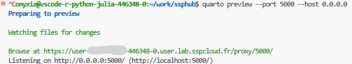

# Guide pour contribuer au site web du réseau

## :one: Introduction

Il est possible de contribuer au site web du réseau
de différentes manières, détaillées dans ce document.
Grâce à quelques outils qui simplifient les contributions
et qui sont détaillés par la suite,
il n'est pas nécessaire d'être un expert des fonctionnalités de `Git` ou `Github` pour pouvoir
proposer des modifications du site web.

Les contributions peuvent prendre différentes formes, qu'il s'agisse d'une discussion autour de contenu à ajouter,
d'une proposition d'ajout à l'une des rubriques du site ou l'écriture d'un post de blog.

<br>

> [!NOTE]
> Il n'est pas nécessaire d'être un data scientist expert pour contribuer au site web. En
> revanche, il est nécessaire de s'inscrire dans le fonctionnement
> classique des projets _open source_,
> fonctionnement qui est orchestré autour de `Github` et de ses différents outils.
> Il est possible d'en acquérir très rapidement les bases à partir de ce document présentant le [Travail collaboratif avec `R`](https://inseefrlab.github.io/> formation-bonnes-pratiques-git/), ou à partir d'échanges avec les contributeurs actuels
> depuis le salon [`Tchap`]() du réseau.


Un environnement prêt à l'emploi pour l'exécution des scripts est disponible sur le `SSPCloud`, à
travers l'interface du logiciel `VSCode` [](https://datalab.sspcloud.fr/launcher/ide/vscode-python?autoLaunch=false&security.allowlist.enabled=false&onyxia.friendlyName=%C2%ABSSPHub%C2%BB&networking.user.enabled=true).
Son utilisation est détaillée dans la partie plus avancée sur la création de contenu pour le blog.


## :two: Comment proposer des modifications légères sur une page déjà existante ?

[:arrow_up: Retour à l'introduction](#one-introduction)

Pré-requis: avoir un compte `Github`.

Pour ce type de modifications, il est demandé d'utiliser directement
l'outil de suggestions de changements de `Github`.
Les pages déployées sur https://ssphub.netlify.app comprennent un bouton page qui
permet de proposer, automatiquement, des modifications via l'interface de
`Github`.
Ce bouton se trouve à la fin de la table des matières ou à droite de chaque page et a cette apparence:

<br>


<br>

Après avoir cliqué sur le bouton "Modifier cette page", le fichier source à l'origine de la page
web est ouvert sur `Github`. Celui-ci est au format `Markdown`.

Cette fonctionnalité est utilisable même
lorsque vous n'avez pas les droits en écriture sur le dépôt (droits attachés
au statut de *mainteneur* sur le projet), grâce à la notion de *fork*.

A l'ouverture du lien, s'il n'existe pas de fork du projet sur son compte, un pop-up s'ouvre pour indiquer qu'il faut en créer un pour pouvoir proposer des modifications : en acceptant, un fork est créé automatiquement.

On se retrouve alors sur une interface permettant d'éditer,
de visualiser et de proposer des modifications du fichier source.

La documentation officielle de `Github` sur cette manière de procéder est
disponible
[ici](https://docs.github.com/en/free-pro-team@latest/github/managing-files-in-a-repository/editing-files-in-another-users-repository).

Dans ce menu, vous avez accès au code source, un fichier au format `Markdown`.
C'est directement dans cette fenêtre que les modifications sont à écrire.
Il est recommandé de prévisualiser la modification en cliquant sur l'onglet `Preview`.
En cliquant sur `Preview` vous ne verrez pas la fiche mise en forme mais
les modifications seront identifiées (rouge pour suppression, vert pour
insertion) par le système de contrôle de version `Git`

<br>


<br>

Enfin, une fois la modification écrite, il convient de la valider.
Cette opération, nommée `commit` dans la terminologie `Git`,
peut être effectuée en:

* écrivant un message signifiant dans la fenêtre `Commit message`.
Les messages cryptiques du type `modification` sont proscrits.
Github Copilot proposera un message en fonction des modifications faites, qui est souvent de bonne qualité.
* sélectionnant la branche dans laquelle la modification s'applique.

> [!NOTE]
> Les modifications directement dans la branche `main` ne sont pas possibles.
> Si la modification est à appliquer aux supports déployés, elles ne seront intégrées qu'après validation des mainteneurs du projets, seuls utilisateurs à avoir les droits en écriture sur la version maître.


<br>


<br>

> [!WARNING]
> **Pour faciliter le suivi et l'intégration des modifications,
> choisir l'option ` Create a new branch for this commit and start a pull request`.
> Si la modification ne concerne que des corrections de coquilles,
> le nom de la branche doit commencer par `typo-`**. Si les propositions sont plus
> substantielles que des coquilles, le nom de la branche est libre.


Cliquer sur `Propose changes`. Automatiquement, une page pour soumettre cette
modification au dépôt `ssphub` s'ouvre:


Après avoir
éventuellement révisé le titre de la `Pull Request` et la description associée,
cliquer sur `Create pull request`. Cela permettra aux mainteneurs du projet
`ssphub` d'éventuellement intégrer les modifications ou de démarrer une
discussion sur les propositions de modifications. Celles-ci sont visibles
en cliquant sur l'onglet `Files changed`:

<br>


<br>

## :three: Comment participer aux discussions collectives?

[:arrow_up: Retour à l'introduction](#one-introduction)

L'équipe du site web du réseau dispose d'un espace de discussion collective
sur les problèmes techniques et les développements futurs du site.
Cet espace de discussion est stocké sur le dépôt `Github` du projet et est
structuré sous forme d'_issues_.

Une *issue* est un fil de discussion permettant aux contributeurs du site
web (mais aussi aux personnes extérieures) d'échanger sur un sujet précis (défini par le titre de l'*issue*). Vous
pouvez consulter la liste des *issues* ouvertes
en suivant [ce lien](https://github.com/InseeFrLab/ssphub/issues).

Il est possible de contribuer aux discussions de deux façons:

- en participant à la discussion dans une *issue* existante. Pour participer à la discussion dans un _issue_, il suffit de cliquer sur le titre de l'_issue_, de lire les discussions, et de réagit dans le champ en bas de la page.
- en ouvrant une *issue* sur un nouveau sujet. Pour ouvrir une *issue*, il
suffit de [cliquer ici](https://github.com/InseeFrLab/ssphub/issues/new)
ou sur le lien en bas ou à droite de chaque page "faire part d'un problème".

Pour des sujets plus transversaux, ou pour discuter avec les autres
membres du réseau, il est possible de rejoindre le salon de discussion dédié
sur le service de messagerie [`Tchap`]().

## :four: Comment ajouter une référence dans l'une des rubriques ressources ?

Pour proposer l'ajout d'une référence dans l'une de ses sections, la première étape
est d'ouvrir une _issue_ pour en discuter avec les mainteneurs du site web.

Ces éléments étant assez légers, après une _issue_, les mainteneurs pourront proposer
l'ajout de contenu à travers une _pull request_ à valider ensemble.


## :five: Comment ajouter un nouveau _post_ au blog ou un projet innovant ?

[:arrow_up: Retour à l'introduction](#one-introduction)

> [!WARNING]
> Ajouter une nouvelle fiche thématique à la documentation représente un
> travail conséquent. Avant de se lancer dans la rédaction, il est recommandé
> d'en discuter avec l'animateur du réseau en amont via une _issue_.


La compréhension de la tuyauterie permettant de transformer les fichiers
sources (format `Markdown`) n'est pas obligatoire pour pouvoir proposer
une nouvelle page sur le site.

La lecture de la partie technique de ce
guide des contributeurs est néanmoins recommandée car
la compréhension des briques techniques mises en oeuvre
peut aider à comprendre
la mise en forme d'une page sur le site.

### Comment proposer et élaborer un nouveau post de blog?

La première étape consiste à __ouvrir une *issue*__ dans le
dépôt `Github`. L'_issue_ doit avoir:

- un titre explicite indiquant sur quel sujet vous voulez proposer un _post_ (toutes suggestions bienvenues);
- un contenu détaillant l'objet du _post_ et les grandes lignes de son contenu.

Une fois que les membres du réseau participants à l'_issue_ sont d'accords
sur l'objet du _post_ et les grandes lignes de son contenu, le _post_ peut être rédigé en suivant la procédure
décrite ci-dessous et les contraintes formelles indiquées dans la partie suivante.


> [!WARNING]
> Ne pas travailler sur la branche `main` de son fork. Celle-ci
> servira à mettre à jour le fork pour intégrer les dernières mises à jour
> du site web.


### Utiliser un environnement de travail entièrement configuré pour disposer de l'ensemble des librairies nécessaires à la génération de la documentation

Plutôt que d'utiliser un environnement en local dont la configuration peut différer
de manière parfois significative avec l'environnement canonique qui sert à générer le site web sous `Github`,
il est recommandé d'utiliser le service préconfiguré `VSCode` du `SSP Cloud`.


[](https://datalab.sspcloud.fr/launcher/ide/vscode-python?autoLaunch=false&security.allowlist.enabled=false&onyxia.friendlyName=%C2%ABSSPHub%C2%BB&networking.user.enabled=true)

### Configurer l'accès au dépôt distant `Github` : la méthode simple et sécurisée

Pour accéder au dépôt distant `Github` (très généralement un _fork_ du dépôt officiel d'`ssphub`, comme expliqué plus bas),
il faut que l'identifiant du compte corresponde à celui configuré dans l'image (dont on peut voir la valeur prise par défaut dans l'onglet Git de la configuration du service, à l'item `user.email`).

Il est possible de le configurer avant le lancement du service VS Code dans le [SSPCloud]() ou de le reconfigurer une fois le service lancé en soumettant dans un terminal la commande suivante :

```shell
git config --global user.name "Prénom Nom"
git config --global user.email "mon.adresse@mail.com"
```

> [!WARNING]
> Le nom d'utilisateur et l'adresse e-mail doivent être les mêmes que sous Github
> sinon cela ne marchera pas au moment d'effectuer un `git push`.
> Notamment,l'adresse e-mail doit être anonymisée si l'on a choisi cette option.


Il est également possible, pour les utilisateurs avancés, d'incorporer cette commande dans un script d'initialisation qui se lance au démarrage du service, en utilisant également la commande `runuser` de manière à lancer la commande `Git` pour le _user_ `rstudio` et non en _root_ comme cela se fait par défaut.


### Créer un _post_ de blog

Le contenu qui génère la partie blog est présent dans le dossier `/blog`.

Il est nécessaire ensuite de créer un sous dossier contenant deux fichiers: un fichier
`index.qmd` pour le contenu, un `featured.png` stockant une image à mettre en une pour
illustrer le _post_.
Si vous manquez d'idée d'image illustrative, n'hésitez pas à créer
une image grâce à une IA génératrice de contenu comme `Dall-E` ou `Stable Diffusion`.

Autrement dit, pour créer un nouveau contenu dans la partie blog, il sera nécessaire
d'adopter l'arborescence suivante :

```
├── blog
|    ├── nom-du-post
|    |   ├── index.qmd
|    |   ├── image1.png
|    |   ├── image2.png
|    |   └── featured.png
```

> [!WARNING]
> Tous les fichiers Qmd autres que `index.qmd` ne seront pas inclus dans la liste des _posts_
> de blog lors de la compilation du site.

`image1.png` et `image2.png` sont des fichiers optionnels, pour illustrer qu'il est possible
d'ajouter des fichiers au dossier source.

Plutôt que de créer _ex-nihilo_ ce dossier,
le plus simple est de prendre un post de blog existant, copier l'ensemble du dossier de celui-ci
dans un nouveau dossier, le renommer puis éditer le contenu directement dans `index.qmd`.

### Créer un projet

Le contenu qui génère la partie blog est présent dans le dossier `/project`.

Attention, les projets sont écrits en **français et en anglais**.

La création d'un projet est simplifié par l'usage de scripts.
Si vous êtes placés dans le dossier "ssphub" de votre fork, faites ensuite :

```shell
cd scripts
uv sync
uv run template.py name_of_the_folder (optional: name_of_the_template.qmd)
```

Par exemple, si je veux créer un projet dans le dossier "2025_nom_nouveau_projet"
il faut indiquer :
```shell
cd scripts
uv sync
uv run template.py 2025_nom_nouveau_projet
```

Cette commande va créer dans le dossier `project` le sous dossier demandé.
Il va y copier le modèle (par défaut le fichier `scripts/project_template.qmd`),
et y indiquer la liste de toutes les catégories déjà utilisées dans l'en-tête
YAML du fichier.

Vous pouvez ensuite compléter le modèle en supprimant les catégories inutiles,
ajouter vos propres catégories etc.

<details open>
<summary> <em> Description des champs du modèle de projet </em> </summary>


```markdown
---
title: A COMPLETER          # Champ à compléter
description: A COMPLETER    # Champ à compléter
format: html
date: '2023-01-01'          # Champ à compléter au format YYYY-MM-DD
image: monimage.png         # Champ à mettre à jour. Le lien est en référence au dossier actuel.
listing:                    # Spécification pour lister les autres projets similaires
- id: similar-project
  contents: ../*/index.qmd  # dans tous les fichiers de projets qui s'appellent index.qmd
  type: grid
  include:
    categories:
    - machine learning      # categories à mettre à jour pour chercher les thèmes que l'on veut afficher
    - SSMSI                 # liste sous le format 'machine learning' OU 'SSMSI'
  sort:
  - date desc
  page-size: 6
  categories: true
categories:                # Catégories du projet à définir par vous-même.
- SSMSI                    # La création d'un modèle vous indique toutes les catégories présentes
- données administratives  # à vous de choisir ou d'en créer une sans faire de doublon (projet vs projets par exemple)
---
<!-- Tableau de présentation du projet. Les lignes sont formatées entre tous les projets:
vous pouvez en enlever mais pas en ajouter. -->
# Synthèse du projet
|           |        Description à mettre à jour        |
|-----------|------------------------------------------------------------------|
| **Détail du projet**         |       |
| **Acteurs**                  |       |
| **Résultats du projet**      |       |
| **Produits et documentation du projet**      |  |
| **Code du projet**           | - Le code est disponible sur GitHub  [user/repo](git.com/user/repo)       |

<!-- Pour ajouter des choses vous pouvez insérer ce que vous souhaitez sous le tableau. -->

<!-- Liste des projets similaires comprenant les catégories listés dans l'en-tête YAML. Pas
besoin de modifier ce champ.  -->
# Projets similaires
::: {#similar-project}
:::

```

</details>

Il faut ensuite traduire la présentation du projet en anglais, comme indiqué ci-dessous.

Une fois le projet traduit, vous devriez avoir l'architecture finale suivante :
```
├── project
|    ├── 2025_nom_nouveau_projet
|    |   ├── index.qmd  # Fichier en français
|    |   ├── index.en.qmd  # Fichier en anglais
|    |   ├── monimage.png
|    |   ├── image1.png  # images communes aux deux fichiers (optionnels)
|    |   └── image2.png
```

> [!WARNING]
> Tous les fichiers Qmd autres que `index.qmd` ne seront pas inclus dans la liste des _projets_
> lors de la compilation du site.

Vous pouvez alors commiter et pusher vos modifications.
Si vous n'avez pas ouvert de pull request, vous pouvez en ouvrir une.

### Traduire une page en anglais

Les projets doivent être traduits en anglais.
Un script automatique va effectuer la première traduction.

**Configuration nécessaire pour le script** :
1. Créez vous un compte gratuit sur <https://www.deepl.com/fr/pro>
2. Enregistrez la clé API comme variable d'environnement ou comme secret
avec le nom `DEEPL_API_KEY`.
Si la clé est mal enregistrée, vous verrez le message suivant : `DEEPL API KEY not set`.

```shell
cd ssphub/scripts

# it will take the "index.qmd" file of the project/2025_nom_nouveau_projet dir and translate it into "index.en.qmd
Rscript translate.R 2025_nom_nouveau_projet
```

**Exemple**
```shell
Rscript scripts/translate.R 2023_doremifasol
```

Ayez un regard attentif sur la traduction automatique, qui reconnaît la syntaxe
Qmd mais pas tout le temps.
Le script corrige certaines erreurs mais il peut en rester.

#### Vérifiez les retours à la ligne intempestifs
Le script ajoute notamment des retours à la ligne dans les tableaux markdown
alors que dans un tableau markdown **chaque ligne du tableau doit correspondre
à une ligne de code**.
Par exemple,

```markdown
| Colonne 1  | Colonne 2|
| --         |    --    |
| Description| Ceci est la description de mon projet |
```
rend cela

| Colonne 1  | Colonne 2|
| --         |    --    |
| Description| Ceci est la description de mon projet |

alors que

```markdown
| Colonne 1  | Colonne 2|
| --         |    --    |
| Description| Ceci est une ligne très longue de mon tableau que j'ai envie
de couper sinon cela devient illisible.  |
```

ne fonctionne pas et rend le tableau suivant :

| Colonne 1  | Colonne 2|
| --         |    --    |
| Description| Ceci est une ligne très longue de mon tableau que j'ai envie
de couper sinon cela devient illisible.  |

Pour ajouter un retour à la ligne dans une cellule d'un tableau, il faut ajouter une balise html
`<br>` et tout écrire sur une ligne de code.

```markdown
| Colonne 1  | Colonne 2|
| --         |    --    |
| Description| Ceci est une ligne très longue de mon tableau que j'ai envie <br> de couper sinon cela devient illisible.  |
```

<details>
<summary> <em> Ce que le script translate corrige </em> </summary>

Le script corrige automatiquement les erreurs suivantes :
- supprime les espaces multiples (par exemple : "       ")
- corrige la structure du tableau markdown renvoyée
- supprime les "\" ajoutés (par exemple `` devient `{{\< fa brands github >}}` sinon)
- supprime le "-" ajouté dans `description: |`

</details>

#### Traduisez les catégories
Le script ne traduit pas les catégories des listings similaires dans l'entête YAML
(`machine learning` et `SSMSI` dans l'exemple ci-dessus).
Vous devez reprendre vous-même les catégories du projet de l'en-tête qui elles
sont traduites.


### Prévisualiser en local vos modifications

Le site étant bilingue, la fonction usuelle de `quarto` (`quarto preview`) permet de prévisualiser
**uniquement les pages en français**.

```shell
quarto preview --port 5000 --host 0.0.0.0
```

Cliquez ensuite sur "Browse at" pour ouvrir le site de prévisualisation.



Si les modifications touchent aussi à des **pages en anglais**, il faut utiliser
les scripts mis en place pour prévisualiser le site complet.
Tapez les commandes suivantes dans le terminal :

- pour compiler seulement le site : `Rscript scripts/render.R`
- pour prévisualiser seulement le site : `Rscript scripts/preview.R`
- pour compiler et prévisualiser le site  : `Rscript scripts/render.R && Rscript scripts/preview.R`

Notez enfin qu'un des moyens le plus simple est d'ouvrir une `pull request` (demande de tirage).
Quand une telle demande est ouverte, un site de prévisualisation est généré
automatiquement.
Le lien vers le site est indiqué par Github dans les messages de la demande.
Chaque `push` sur la branche enclenchera une mise à jour du site de prévisualisation.

## :six: Ouvrir une pull request

Il est fortement recommandé d'ouvrir une pull request au début du travail.
Cela permet de visualiser automatiquement une version préliminaire du site.
Pour ouvrir une pull request, assurez-vous :
- d'avoir lu ce fichier
- d'avoir effectué la traduction
- la pull request doit être cohérente avec le main en production du site.
Si le site a eu des mises à jour, vous devez ainsi les réintégrer dans votre branch
(par un merge ou un rebase). 
