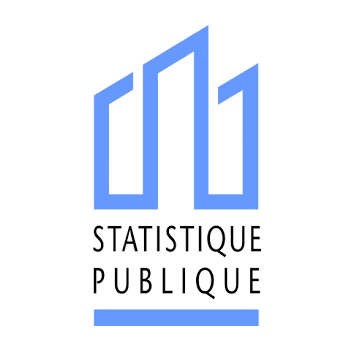

# Le SSPHub, le réseau des data scientists

Le réseau des data scientists du [Service Statistique Publique (SSP)](https://www.insee.fr/fr/information/1302192) est constitué principalement, mais non exclusivement, par **les administrations en charge de la production de statistiques officielles**
(Insee et Services Statistiques Ministériels principalement). 

Le réseau répond à plusieurs objectifs, dont les principaux sont:

- Le **partage et la diffusion de connaissances** au sein de la communauté des _data scientists_ de l'administration autour des pratiques et des innovations de la _data-science_ ;
- La **valorisation de travaux novateurs** dans le champ de la production statistique ;
- Faciliter les **échanges entre pairs**, qu'ils appartiennent au service statistique public ou non. 

Afin de mieux cerner les objectifs, le public cible, les thèmes abordés par le réseau, et les moyens associés, un [manifeste 📜](/additional/manifeste.html) a été rédigé de manière collective.  

Le réseau peut être rejoint de diverses manières ! Pour intégrer notre canal de discussion `Tchap`, recevoir l'infolettre mensuelle ou connaître les évènements _data_ à venir, vous pouvez écrire à [ssphub-contact@insee.fr](mailto:ssphub-contact@insee.fr) 📧. Pour participer à la création de contenu sur ce site, cela se passe sur [`Github` ](https://github.com/InseeFrLab/ssphub).  

# Le SSP Lab, le laboratoire d'innovation en data science de l'Insee et qui, notamment, anime le SSPHub 

{fig-align="center"}

Le SSPLab quant à lui pilote le réseau du SSPHub. Le SSPLab est une unité de l'Insee (équivalent à une division ou un bureau) qui a été crée suite aux réflexions de stratégie de moyen terme d’Insee-2025[^1]. Inséré au sein la Direction de Méthodologie, Coordination Statistique et Internationale (la fameuse DMCSI), le SSP Lab **promeut l’innovation et la nouveauté en matière de sources de données, de technologies et de méthodes de data science**. A ce titre, il mène des projets expérimentaux en appui aux services sponsors en charge des productions de la statistique publique (que ce soit les SSM en dehors de l'Insee, les directions métiers de l'Insee ou les directions régionales). Il assure aussi un **rôle de veille** et de **diffusion de méthodes statistiques innovantes**, co-anime le SSPHub et fait le lien avec des **partenaires extérieurs** sur les champs relevant de ses compétences (laboratoires de recherche, pairs européens).

[^1]: Plus de détails sont disponibles sur le site de l'Insee [ici](https://www.insee.fr/fr/information/3559883)
