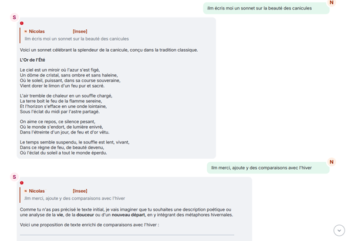
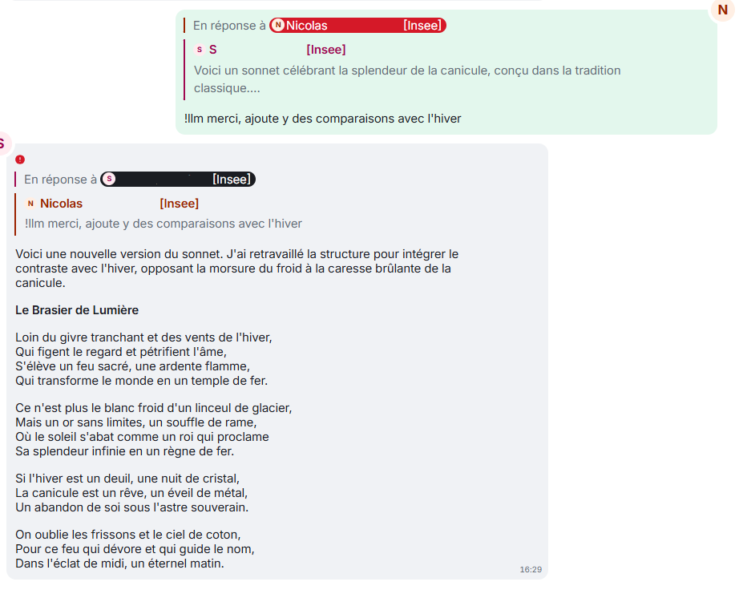
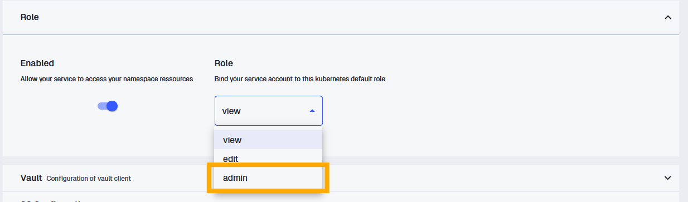

# Quel est le besoin ?

Dans l'équipe, on a un salon Tchap pour se dépanner sans déranger personne. C'est là qu'on
pose les questions qu'on n'ose pas poser ailleurs. Et un jour, l'idée est venue 
d'y **brancher un bot capable de répondre à nos questions**, directement depuis
Tchap, plutôt que d'attendre qu'un(e) gentil(le) collègue y réponde ou pose la question à un(e) autre collègue qui connaît la réponse. 
De quoi se dépanner sans déranger personne - et, accessoirement, briller en
réunion d'équipe - si tant est qu'on capte dans la salle de réunion.

Et enfin, soyons honnêtes, c'était aussi en partie parce que c'était drôle d'essayer de mettre un bot sur Tchap.

Finalement, ce n'était pas si compliqué. On m'avait vendu que les bots Tchap étaient compliqués à mettre en place, et en fait je n'ai pas trouvé. 
Par ailleurs, se connecter à [llm.lab](https://llm.lab.sspcloud.fr) est plutôt très simple. 
Le plus délicat a été de découvrir Tchap, d'orchestrer les deux et enfin la mise en production. 

Après *une petite semaine de travail* (cf. détail plus bas pour ceux que cela intéresse), le bot est en place (cf. [sa maison sur Github](https://github.com/SSPHub/tchap_bot_llm)) et fait aujourd'hui trois choses :

- il **répond quand on dit coucou**, histoire de vérifier qu'il est bien réveillé ;
- il **répond à vos questions** en interrogeant un grand modèle de langage ;
- et, pour le plaisir, il a une **fonctionnalité mystère** : il réagit à un
  mot-clé glissé dans la conversation. 🤫

# Comment faire ?

Le truc sympa avec Tchap, c'est sa **philosophie ouverte** - aux agents de l'État, en tout
cas. Du coup, il y a pas mal de ressources en ligne ou directement sur la
plateforme. Trois m'ont aidé à me lancer :

- le salon [Tchap - Bots et Intégrations](https://matrix.to/#/#BotsetIntgrationsTchapU2tHdMEN80D:agent.dinum.tchap.gouv.fr), où la communauté partage des questions et ses astuces ;
- la [doc technique officielle sur les bots et intégrations](https://aide.tchap.beta.gouv.fr/fr/article/documentation-technique-bot-et-integrations-tchap-1z3dfx/) ;
- les **webinaires en ligne**, en particulier celui du MTES qui raconte comment ils ont
  automatisé leur bascule de Mattermost vers Tchap. 

La première découverte fut que **dans Tchap, quasiment tout est automatisable**. 
Le bot récupère exactement le nom et prénom du compte que vous lui donnez et
puis il peut envoyer des messages, réagir, suivre un fil de discussion, inviter des gens ...

Tout cela passe par des **appels API**, un peu comme sur Grist. A partir du moment où vous êtes un 
peu familier avec une API, c'est pas beaucoup plus compliqué de programmer un bot sur Tchap. 

Matrix (la technologie derrière Tchap) repose sur un écosystème avec des bibliothèques et explications aussi accessibles,
sans compter les outils internes à l'État listés dans les ressources ci-dessus. Après avoir regardé, mes besoins étaient au fond assez
simples, je m'en suis tenu à un petit package public :
[`simplematrixbotlib`](https://pypi.org/project/simplematrixbotlib/), qui n'est lui-même
qu'une surcouche bien pratique de [`matrix-nio`](https://matrix-nio.readthedocs.io/en/latest/#api-documentation).

Je vais vous **refaire le parcours pour créer facilement votre bot sur Tchap**. 

# Première étape : mettre en place le bot

Petit avantage au démarrage : j'avais une **boîte aux lettres fonctionnelle (BALF)**
sous la main, ce qui m'a permis de créer un compte Tchap tout neuf. Le bot n'emprunte
donc pas mon identité. Si vous n'en avez pas, la bonne pratique indiqué dans les ressources de Tchap,
c'est de créer une BALF et un compte Tchap rien que pour lui.
Parce que sinon, **rien ne différencie, vu de Tchap, un bot d'un utilisateur humain.**

Le plus dur au début, ça a été de me repérer dans l'univers Matrix / Tchap. Pour l'apprivoiser,
on va **retourner à la base des API** avec quelques lignes de `bash` et `curl` et l'aide de la [documentation 
de Matrix](https://spec.matrix.org/latest/client-server-api/) pour taper directement sur leurs API. 

## Authentification 
Première mission : **récupérer un jeton d'accès**. 
Vous envoyez **votre identifiant et mot de passe Tchap** et l'API vous donne un token. 

Le script ci-dessous tourne tel quel sur un Terminal, à condition d'avoir renseigné vos deux
variables d'environnement `TCHAP_BOT_MATRIX_ID`, qui est votre `id` utilisateur de Tchap (quelque chose comme 
"@votre-bot:agent.finances.tchap.gouv.fr"), et `TCHAP_BOT_PWD`
qui est le mot de passe que vous utilisez pour vous connecter au compte. 

```bash
#!/usr/bin/env bash
# Pré-requis : export TCHAP_BOT_MATRIX_ID="..." et export TCHAP_BOT_PWD="..."
HOMESERVER="https://matrix.agent.finances.tchap.gouv.fr"

curl -X POST "$HOMESERVER/_matrix/client/v3/login" \
  -H "Content-Type: application/json" \
  -d '{
    "type": "m.login.password",
    "password": "'"$TCHAP_BOT_PWD"'",
    "identifier": { "type": "m.id.user", "user": "'"$TCHAP_BOT_MATRIX_ID"'" },
    "device_id": "API"
  }'
```

La requête vous renverra un joli token d'identification si cela marche.

```bash
{"access_token":"mct_montokenanepasleaker","device_id":"API","user_id":"@votre-bot:agent.finances.tchap.gouv.fr"}
```

Ce n'était qu'une 
première étape pour vérifier que tout marche, **ouvrons Python maintenant**. 


## Envoyer un message
La première étape a été facile. La deuxième, envoyer un message, un poil plus longue (mais cela reste tout à fait raisonnable). 

Je suis reparti des **très bons examples de la documentation** de [`simplematrixbotlib`](https://simple-matrix-bot-lib.readthedocs.io/en/latest/examples.html)
et de [`matrix-nio`](https://matrix-nio.readthedocs.io/en/latest/#api-documentation). 

Pour **comprendre la manière dont marche Matrix**, le déclic a été de comprendre que **tout est un événement dans Matrix.** Un message, une réaction, une connexion : 
tout cela, ce sont des événements (*event*) avec un identifiant unique. Concrètement, ne cherchez donc pas la 
fonction `send_message` : vous envoyez un evénement qui est de type message (`m.room.message`). De la même manière que quand vous entrez dans
un salon, vous envoyez un événement de type `je rentre dans ce salon Tchap`.

Cela *n'a pas été beaucoup plus simple* par contre quand je me suis rendu compte que 
**le chiffrement, c'est très bien, mais ca complique tout.** Indispensable pour la sécurité,
mais ça vous complique la vie. De ce que j'ai compris sur la manière dont Matrix marche quand les messages sont chiffrés :
dès que vous envoyez un message, la clé de chiffrement change. Vous avez l'ancienne
clé et le message, avec cela vous trouvez la nouvelle clé. Par contre, à partir de la clé actuelle, 
vous ne pouvez pas déduire l'ancienne clé et donc déchiffrer les anciens messages. 
Mais vous pourrez voir les prochains. Et ceux d'après, etc etc. 

Concrètement, cela veut dire que **le bot n'a pas accès au passé**. Il ne peut voir que les messages
depuis qu'il a été créé. 

Une fois ces idées en tête, je suis reparti de la
[doc de `simplematrixbotlib`](https://simple-matrix-bot-lib.readthedocs.io/en/latest/examples.html)
pour bâtir **un cas tout simple** : un bot qui répond à un mot. Vous lui dites `coucou`,
il vous donne l'heure. 

Voici donc un bot complet, prêt à lancer - il suffit d'avoir installé
les packages nécessaires avec `uv add` et d'avoir défini vos identifiants dans un fichier `.env`:

```{.python filename=".env"}
# =============================================================================
# .env - variables d'environnement du bot Tchap
# Copiez ce fichier, renseignez les valeurs, et NE LE COMMITEZ PAS
# (ajoutez `.env` à votre .gitignore).
# =============================================================================

# --- Compte Tchap du bot (idéalement une BALF dédiée) ---------------------
# Identifiant Matrix complet, ex. @votre-bot:agent.finances.tchap.gouv.fr
TCHAP_BOT_MATRIX_ID="@votre-bot:agent.finances.tchap.gouv.fr"
TCHAP_BOT_PWD="votre_mot_de_passe_tchap"

```

```{python}
#| code-fold: true
#| filename: "main.py"

# uv add "matrix-nio[e2e]" simplematrixbotlib dotenv
import os
from datetime import datetime
from zoneinfo import ZoneInfo
import simplematrixbotlib as botlib
from dotenv import load_dotenv

load_dotenv() 

# --- Identifiants (à passer en variables d'environnement) ---
creds = botlib.Creds(
    homeserver="https://matrix.agent.finances.tchap.gouv.fr",
    username=os.environ["TCHAP_BOT_MATRIX_ID"],
    password=os.environ["TCHAP_BOT_PWD"],
)

# --- Config : on laisse le chiffrement activé ---
config = botlib.Config()
config.encryption_enabled = True
config.ignore_unverified_devices = True

bot = botlib.Bot(creds, config)

@bot.listener.on_message_event
async def echo(room, message):
    match = botlib.MessageMatch(room, message, bot)
    if match.is_not_from_this_bot() and match.command("coucou"):
        await bot.api.send_text_message(
            room.room_id,
            "Coucou, il est "
            + datetime.now(ZoneInfo("Europe/Paris")).strftime("%H:%M:%S")
            + " à Paris.",
        )


if __name__ == "__main__":
    bot.run()
```

Lancez-le avec un `uv run main.py`. 

**Bravo ! Vous avez maintenant un bot qui vous répond l'heure quand vous lui dites "coucou"** : et ça, c'est magique
et parfaitement inutile. 


::: {.callout-caution}

Je n'ai pas réussi à régler proprement la **vérification du bot** (le
fameux échange d'emojis qui certifie l'appareil). Le bot tourne, mais il reste
« non vérifié ». Cela ne pose pas de problème particulier. 

:::


# Deuxième étape : brancher un LLM

Bonne nouvelle : **utiliser** [`llm.lab.sspcloud.fr`](https://llm.lab.sspcloud.fr/), **c'est en fait super simple**. 

Comme llm.lab expose une API compatible OpenAI, il suffit de réutiliser le package `openai`
en pointant vers la bonne URL avec sa clé API de [llm.lab](https://llm.lab.sspcloud.fr). 
Pour récupérer votre clé API, vous pouvez suivre [cette procédure](https://aiml4os.github.io/funathon-project2/2-rag-intro.html#getting-your-llm.lab-api-key). 
On stocke le tout dans le `.env` sous `LLM_LAB_API_KEY`. 

Pour échanger avec le LLM, vous utilisez le client LLM `openai` avec les méthodes
`chat.completions.create` en précisant le modèle utilisé et le tchat (sous la forme 
d'un dictionnaire). Vous aurez la réponse du LLM stockée dans le contenu 
de ce qu'il renverra et que `openai` stocke dans `choices[0].message.content`.

On peut créer un petit bout de code qui génère l'historique des échanges et 
permet d'échanger avec le LLM en entrant les questions directement via Python. 
Tout est dans le code ci-dessous, qui s'exécute avec `uv run main.py`:

```{.python filename=".env"}
# =============================================================================
# .env - variables d'environnement
# Copiez ce fichier, renseignez les valeurs, et NE LE COMMITEZ PAS
# (ajoutez `.env` à votre .gitignore).
# =============================================================================

# --- Accès au LLM (llm.lab.sspcloud.fr) -----------------------------------
LLM_LAB_API_KEY="votre_cle_api_llm_lab"

```

```{python}
#| code-fold: true
#| filename: "main.py"

# uv add openai
import os
from openai import OpenAI
from dotenv import load_dotenv

load_dotenv()
model_name = "gemma4-26b-moe"
client = OpenAI(
    base_url="https://llm.lab.sspcloud.fr/api",
    api_key=os.environ.get("LLM_LAB_API_KEY", ""),
)


def h_append(role, content):
    history.append({"role": role, "content": content})
    return history


def ask(question: str):
    h_append("user", question)

    response = client.chat.completions.create(
        model=model_name,
        messages=history,
    )

    answer = response.choices[0].message.content
    h_append("assistant", answer)
    return answer


# --- Exemple d'utilisation ---
if __name__ == "__main__":
    while True:
        history = []
        question = input("You : ")
        if question.lower() == "quit":
            break

        print(f"LLM : {ask(question)}")
```

Le truc à retenir avec le format `openai`, c'est qu'**un échange avec un LLM n'est qu'une simple liste Python** :
chaque message est un dictionnaire avec un rôle stocké dans la clé `role` 
et le contenu stocké, étonnament, dans la clé `content`.

```{.python filename="Ceci est un chat"}
[
    {"role": "user", "content": "Bonjour, tu peux m'aider ?"},
    {"role": "assistant", "content": "Bien sûr !"},
]
```

*Fun fact (pour moi)* : chez OpenAI, l'IA n'est ni un « bot » ni un « modèle », mais un
*assistant*. Sans doute pour ne pas faire peur 🙂.

**Vous avez maintenant de quoi envoyer des requêtes à un LLM.**

```bash
onyxia@vscode-python-118218-0:~/work$ uv run main.py 
You : Bonjour
LLM : Bonjour ! Comment puis-je vous aider aujourd'hui ?
You : Je voudrais parler avec une IA
LLM : Bonjour ! Vous y êtes. Je suis une intelligence artificielle, prête à discuter avec vous.

De quoi aimeriez-vous parler ? Je peux vous aider dans de nombreux domaines, par exemple :

1.  **Discuter tout simplement** (échanger des idées, philosopher, ou parler de votre journée).
2.  **Apprendre quelque chose** (histoire, science, langue étrangère, etc.).
3.  **Aide créative** (écrire un poème, une histoire, des paroles de chanson ou un email).
4.  **Résoudre des problèmes** (mathématiques, code informatique, conseils pratiques).
5.  **Organisation** (planifier un voyage, créer un menu de la semaine, rédiger un CV).

Dites-moi ce qui vous passe par la tête ! Je vous écoute.
You : quit
```

# Troisième étape : préparer la quatrième étape

Là je triche, je n'ai pas suivi cet ordre là mais j'aurai dû le suivre.
Un peu comme dans Pulp Fiction où les chapitres sont pas vraiment dans l'ordre.

Donc, maintenant, avant de combiner les deux, j'aurai dû construire le code petit à petit pour 
que tout marche depuis Python, en rangeant au passage le tout en package avec des sous-modules 
(`config`, `core`, `listeners`).


<details>
<summary>Voici la structure après cette étape : </summary>

```bash
tchap_bot_llm/
│
├── main.py                  # Point d'entrée : appelle src.run("!")
├── pyproject.toml           # Dépendances (matrix-nio[e2e], openai, simplematrixbotlib)
├── uv.lock                  # Verrouillage des versions (uv)
├── .python-version          # Version Python du projet (3.13)
├── LICENSE
│
├── src/                     # Le code du bot, organisé en package
│   ├── __init__.py          # run() : charge la config, crée le bot, branche les listeners
│   │
│   ├── config/              # ── Couche configuration ──
│   │   ├── __init__.py
│   │   └── settings.py      # Creds, BotConfig, Settings + lecture des variables d'env
│   │
│   ├── core/                # ── Couche cœur ──
│   │   ├── __init__.py
│   │   └── bot.py           # create_bot() : instancie le bot simplematrixbotlib
│   │
│   └── listeners/           # ── Couche fonctionnalités (une par fichier) ──
│       ├── __init__.py      # load_all() : charge auto. tous les modules avec register()
│       └── echo.py          # coucou → renvoie l'heure (la fonctionnalité de test)
│
└── bash/                    # Scripts d'exploration de l'API Matrix (phase de découverte)
   └── get_token.sh         # Récupère un jeton d'accès

```

</details>

Les `listeners` stockent toutes les fonctionnalités de notre bot Tchap. L'architecture du dossier
est volontairement modulaire : chaque fonctionnalité a son
propre fichier avec une fonction `register`, et toutes sont chargées automatiquement au
démarrage. Pour désactiver un module, pas besoin de toucher au reste : on renomme juste
sa fonction `register` en `no_register`, et hop.

Un petit coup d'IA permet de rédiger le code d'initialisation qui charge tous les 
`listeners` à partir des scripts dans le dossier `listeners`.

À ce stade, l'organisation en package avec [`uv`](https://docs.astral.sh/uv/) rend le
tout reproductible. Les dépendances vivent dans le `pyproject.toml`,
et lancer le bot tient en une ligne :

```bash
uv run main.py
```

**Pour la simplicité de la suite, tout reste dans un seul fichier `main.py`. Si vous voulez adopter cette organisation,** 
**forkez le repo du bot !** 

# Quatrième étape : combiner 1 et 2

Comme le dit l'adage, on a de la pâte à crêpe, on a du sucre, on va **créer une crêpe au sucre**. 

## Un bot simple sans mémoire

On crée une commande `llm` maintenant et on la branche sur `llm.lab` avec une 
fonctionnalité simple : si on pose une question, il répond. Pas de chat (encore). 

Cela se fait avec un peu de douleur mais rien que l'on aime pas : on
repère si on reçoit un message avec `@bot.listener.on_message_event` et 
on le récupère avec `match = botlib.MessageMatch(room, message, bot)`. 
Si le message correspond au prefix et à la commande, on envoie son contenu au LLM. 
Et puis on renvoie la réponse du LLM sur Tchap.

## Ajouter la mémoire des échanges

La vraie prise de tête - relative, ça n'a duré que quelques heures - c'était de
**reconstituer le fil de la conversation pour faire un vrai tchat** et que le bot ait la mémoire
des échanges passés. 
Concrètement, je voulais que si je réponde au message du bot dans Tchap, le bot récupère les 
messages liés à la conversation et les envoie en contexte au LLM. Pour mimer un chat 
avec un LLM et éviter à chaque fois de recommencer à 0. 



Dans Matrix, chaque message a bien son identifiant unique, mais le lien « ce message répond
à celui-là » est caché dans des balises bien imbriquées
(`content` → `m.relates_to` → `m.in_reply_to` → `event_id`).

### La plomberie derrière un message

L'astuce pour ne pas rester perdu trop longtemps : **exporter une conversation Tchap au format JSON**. En voyant
la vraie tête des événements, je me suis moins perdu dans les étages de balises.

Voici l'échange ci-dessus au format JSON Matrix : 

<details>
<summary>Voir un échange Tchap au format JSON </summary>

```{.json}
{
    "content": {
        "msgtype": "m.text",
        "body": "llm écris moi un sonnet sur la beauté des canicules",
        "m.mentions": {}
    },
    "origin_server_ts": 1780409269941,
    "sender": "@n-insee.fr:agent.finances.tchap.gouv.fr",
    "type": "m.room.message",
    "unsigned": {
        "membership": "join",
        "age": 854394,
        "transaction_id": "m1780409269135.40"
    },
    "event_id": "$DGvRZB3GL8brmKFqBZEOASDLxL8d8",
    "room_id": "!UDagJdADqqUSKBW:agent.finances.tchap.gouv.fr"
},
{
    "content": {
        "body": "Voici un sonnet célébrant la splendeur de la canicule, conçu dans la tradition classique.\n\nJE VOUS PASSE LA FIN DE CE SONNET",
        "format": "org.matrix.custom.html",
        "formatted_body": "<p>Voici un sonnet célébrant la splendeur de la canicule, conçu dans la tradition classique.</p>\n<p>JE VOUS PASSE LA FIN DE CE SONNET",
        "m.relates_to": {
            "m.in_reply_to": {
                "event_id": "$DGvRZB3GL8brmKFqBZEOASDLxL8d8"
            }
        },
        "msgtype": "m.text"
    },
    "origin_server_ts": 1780409279931,
    "sender": "@bot-insee.fr:agent.finances.tchap.gouv.fr",
    "type": "m.room.message",
    "unsigned": {},
    "event_id": "$EGOl-wWZbY5GsjjoYzMpIdcn75xadQnClmSSYd1mZjw",
    "room_id": "!UDagJdADqqUSKBW:agent.finances.tchap.gouv.fr"
},
{
    "content": {
        "msgtype": "m.text",
        "body": "llm merci, ajoute y des comparaisons avec l'hiver",
        "m.mentions": {}
    },
    "origin_server_ts": 1780409290426,
    "sender": "@n-insee.fr:agent.finances.tchap.gouv.fr",
    "type": "m.room.message",
    "unsigned": {
        "membership": "join",
        "age": 833909,
        "transaction_id": "m1780409289583.41"
    },
    "event_id": "$Zkuyln4UY3x29vHRIKZ0",
    "room_id": "!UDagJdADqqUSKBW:agent.finances.tchap.gouv.fr"
},
{
    "content": {
        "body": "Comme tu n'as pas précisé le texte initial, je vais imaginer que tu souhaites une description poétique ou une analyse de la **vie**, de la **douceur** ou d'un **nouveau départ**, en y intégrant des métaphores hivernales.\n\nVoici une proposition de texte enrichi de comparaisons avec l'hiver JE VOUS PASSE LA FIN DE CE MESSAGE",
        "m.relates_to": {
            "m.in_reply_to": {
                "event_id": "$Zkuyln4UY3x29vHRIKZ0"
            }
        },
        "msgtype": "m.text"
    },
    "origin_server_ts": 1780409294370,
    "sender": "@bot-insee.fr:agent.finances.tchap.gouv.fr",
    "type": "m.room.message",
    "unsigned": {},
    "event_id": "$iHbLWft9X2h_0MkMG7jr_GE4IE87Q3M",
    "room_id": "!UDagJdADqqUSKBW:agent.finances.tchap.gouv.fr"
}

```

</details>


### Architecture de remonter la mémoire des échanges

Ensuite, il "suffit" de remonter le fil réponse après réponse, de façon récursive.
Concrètement, **à partir de l'ID d'un événement**, il faut : 

- récupérer l'événement (aka : le message) - une fonction `get_event` permet de le faire;
- avec l'événement, déterminer qui de l'humain ou de l'"assistant" a envoyé le message - c'est le rôle de `get_role_event`;
- extraire le contenu - `extract_info` extrait les informations sender, body et replied_to d'un `event` Tchap ;
- stocker tout cela dans l'historique - `history_append`;
- savoir si lui même est en réponse à un événement - la fonction `get_in_reply_to_event_id` fait cela;
- et puis on boucle et on boucle et on boucle. 

Par ailleurs, **Tchap permet de formatter son message** : soit vous êtes une/un boss et vous
l'écrivez directement en html, soit vous l'écrivez en markdown et Tchap le transformera 
en html pour vous. 

Pour que la réponse de notre assistant préféré passe bien dans Tchap, 
**il faut lui ajouter un prompt système qui demande de répondre en markdown** 
sans échapper les caractères spéciaux. `add_system_prompt` fait cela pour nous. 

### Les fonctions asynchrones 

Après, il faut gérer **les problèmes de fonction `async` dans Python**. 
J'ai compris que je n'avais pas tout compris mais en gros, pour les requêtes "compliquées", 
c'est à dire celles dont la réponse peut prendre un peu de temps, **on met un `await` devant**. 
Concrètement, les réponses de Tchap peuvent être longues à récupérer (cf. le blabla sur le chiffrement), 
donc quand on récupère un message de l'API de `nio` on doit indiquer `await bot.async_client.room_get_event`.

Et `await`, ce petit coquin, se propage. C'est à dire qu'une fonction qui comprend un `await` sera
une fonction `async` qu'on définit en `async def get_event`.
Et ainsi toute fonction qui appelerait `get_event` devrait le faire avec un `await get_event` 
et serait elle-même `async`.

### Grand final

Une fois tout cela compris, avec l'aide d'un assistant bien-tombé, on arrive à ce bloc ci-dessous.
Il est autonome (les fonctions utilitaires sont incluses) et prend en
entrée un `bot`, l'`id` du salon et l'`id` du message auquel on répond :

```{python}
#| code-fold: true
#| filename: "main.py"

import os
from openai import OpenAI
from dotenv import load_dotenv
import nio
import simplematrixbotlib as botlib

load_dotenv()

# Partie bot 
# --- Identifiants (à passer en variables d'environnement) ---
creds = botlib.Creds(
    homeserver="https://matrix.agent.finances.tchap.gouv.fr",
    username=os.environ["TCHAP_BOT_MATRIX_ID"],
    password=os.environ["TCHAP_BOT_PWD"],
)

# --- Config : on laisse le chiffrement activé ---
config = botlib.Config()
config.encryption_enabled = True
config.ignore_unverified_devices = True

bot = botlib.Bot(creds, config)

# Partie LLM
end_point = "https://llm.lab.sspcloud.fr/api"

openai_client = OpenAI(
    base_url=end_point,
    api_key=os.environ.get("LLM_LAB_API_KEY", ""),
)


def history_append(
    history: list | None = None,
    role: str = "user",
    content: str = "",
    at_first_pos: bool = True,
):
    """
    Function to add a message to history with role and content
    Args:
        - history: list : the history to append the message to
        - role: str : the role to give to the message
        - content: str : the content of the message
        - at_first_pos: boolean : append at first position (top) or at the end
    """
    if history is None:
        history = []

    if at_first_pos:
        return [{"role": role, "content": content}] + history
    else:
        return history + [{"role": role, "content": content}]


def get_in_reply_to_event_id(event):
    return (
        event.source.get("content", {})
        .get("m.relates_to", {})
        .get("m.in_reply_to", {})
        .get("event_id", "")
    )


def get_role_event(event, bot):
    if event.sender == bot.async_client.user_id:
        return "assistant"
    else:
        return "user"


def extract_info(event) -> tuple | None:
    """
    Extract info from event.  Returns sender, body, and replied-to event ID
    """

    content = event.source.get("content", {})

    sender = event.sender
    body = content.get("body")
    replied_to_id = get_in_reply_to_event_id(event=event)

    return (sender, body, replied_to_id)


def get_model_name():
    model_name = "gemma4-26b-moe"
    return model_name


def add_system_prompt(history: list):
    history_with_system_prompt = history_append(
        history=history,
        role="system",
        content="Respond with  markdown formatting. Do not use escape characters.",
        at_first_pos=True,
    )

    return history_with_system_prompt


def ask(prompt: list):
    response = openai_client.chat.completions.create(
        model=get_model_name(),
        messages=prompt,
    )

    answer = response.choices[0].message.content
    return answer


@bot.listener.on_message_event
async def tchat_with_llm(room, message):
    match = botlib.MessageMatch(room, message, bot)
    command = "llm"
    if match.is_not_from_this_bot() and match.command(command):
        prompt = await generate_prompt(bot, room.room_id, match=match)
        first = command
        prompt = clean_prompt(prompt, first)
        # Prod mode
        response_llm = ask(prompt=prompt)
        await bot.api.send_markdown_message(
            room_id=room.room_id,
            message=response_llm,
            reply_to=match.event.event_id,
        )

        # Debug mode
        # response_llm = "\n\n".join(str(d) for d in prompt)
        # await bot.api.send_text_message(
        #     room_id=room.room_id,
        #     message=response_llm,
        #     reply_to=match.event.event_id,
        # )


async def generate_prompt(bot: botlib.Bot, room_id: str, match):
    """
    Function to generate the full prompt from an event id
    Arg:
        - bot: botlib.Bot
        - room_id: str : the Matrix room id where the message is
        - match: a simplebot match
    Returns:
        - a list with history, from oldest to newest
    """
    history = history_append(
        history=[], role="user", content=match.event.body, at_first_pos=True
    )

    reply_id = get_in_reply_to_event_id(match.event)

    if reply_id != "":
        history = (
            await retrieve_history(bot, room_id, reply_event_id=reply_id) + history
        )

    prompt = add_system_prompt(history)

    return prompt


def clean_prompt(prompt: list, pattern_start: str):
    """
    Removes characters at the beginning of a prompt that match the pattern
    """
    n_pattern = len(pattern_start)
    return [
        {**chat, "content": chat["content"][n_pattern + 1 :]}
        if chat["content"].startswith(pattern_start)
        else chat
        for chat in prompt
    ]


async def retrieve_history(bot: botlib.Bot, room_id: str, reply_event_id: str) -> list:
    """
    Retrieves full history of chat in this discussion between the LLM and the user.
    History is defined by message being sent in reply to a message
    Args :
    - bot : the botlib bot. Used to fetch back other message
    - room_id : the room to search for past message
    - reply_event_id: the id of the message replied to
    """

    event = await get_event(bot, room_id, reply_event_id)
    if event is None:
        return []

    sender, body, reply_id_level2 = extract_info(event)
    role = get_role_event(event=event, bot=bot)

    if reply_id_level2 != "":
        history = await retrieve_history(bot, room_id, reply_id_level2)
        return history_append(
            history=history, role=role, content=body, at_first_pos=False
        )
    else:
        return history_append(history=[], role=role, content=body, at_first_pos=True)


async def get_event(bot: botlib.Bot, room_id: str, event_id: str):
    """
    Fetches an event by ID and returns it.
    Returns None if the event could not be fetched.
    """
    response = await bot.async_client.room_get_event(room_id, event_id)

    if isinstance(response, nio.RoomGetEventError):
        print(f"  ✘ Could not fetch event {event_id}: {response.message}")
        return None

    return response.event


# --- Exemple d'utilisation ---
if __name__ == "__main__":
    bot.run()

```


::: {.callout-tip title="Pour passer en debug mode"}

Fun fact - pour débugger le code, vous avez un mode "debug" dans la fonction `tchat_with_llm` qui vous renvoie sur Tchap la requête que le bot aurait envoyé au LLM. 
Pour cela, décommenter les lignes après "debug" et commentez celles après "prod mode".

:::

Côté utilisateur, le résultat est tout bête : il suffit de **répondre** à un message du
bot (toujours en commençant par `llm`) pour qu'il se souvienne de tout ce qui précède.


::: {.callout-note}

Pour la simplicité de ce post, j'ai un petit peu simplifié le contenu du repo.
Il n'y a pas d'organisation en package Python ici, tout est *peu proprement* placé dans un seul script `main.py`.
Par ailleurs, il n'y a pas de préfixe à la commande : il faut commencer un message Tchap avec le bot par `llm` et non par `!llm`. 
Allez voir le repo pour une cible plus propre et utilisant le préfixe `!`. 

:::


On lance à nouveau le bot avec un `uv run main.py`. 

```bash 
onyxia@vscode-python-118218-0:~/work$ uv run main.py 
Connected to https://matrix.agent.finances.tchap.gouv.fr as @bot-insee.fr:agent.finances.tchap.gouv.fr (XXXXXX)
This bot's public fingerprint ("Session key") for one-sided verification is: MXte gC/K MXte gC/K MXte gC/K MXte gC/K MXte gC/K 1A1
```




# Cinquième étape : mise en production sur le SSP Cloud

Dernière marche, et pas la plus petite : **faire tourner le bot en continu, sans dépendre
de ma machine**. L'équipe du SSP Cloud m'a bien guidé (mille mercis à elle ! et à mon assistant IA préféré aussi).

Les étapes sont : 

- de conteneuriser son application avec Docker;
- de la déployer à proprement parler sur l'infrastructure Kubernetes du SSPCloud.  

## Docker mon amour

Cela demande de découvrir **Docker** et ses ressources de débutant bien faites 
([ici](https://docs.docker.com/get-started/introduction/get-docker-desktop/) par exemple).

Il faut aller **se créer un compte sur** [**Docker**](https://www.docker.com/). L'installation de Docker
est pas évidente sur des PC contraints (et hic : impossible de le tester directement
sur le SSP Cloud - pas de Docker dans Docker). Il faut donc l'avoir en local ou tester via des 
GitHub Action ou bien le VS Code de GitHub (dans `<> Code` / `Codespaces` dans GitHub, cela vous ouvre un espace
similaire à Onyxia) permet de faire des Docker dans Docker. 

### Le dockerfile : la recette pour construire l'image Docker

Après, le `Dockerfile` est assez basique et un assitant IA aide à le rédiger. 

Le morceau le plus pénible, ça a été **les bibliothèques de chiffrement**
(`python-olm`, qui compile `libolm` depuis les sources) : il a fallu glisser les bons
outils de compilation dans l'image. Mais là encore, cela a été tout à fait respectable
et mon assistant préféré m'a aidé. 

Voici le `Dockerfile` final, utilisable tel quel :

```{.python filename="dockerfile"}
FROM python:3.13-slim

# Installation de uv
COPY --from=ghcr.io/astral-sh/uv:latest /uv /usr/local/bin/uv
WORKDIR /app

# Dépendances de compilation pour python-olm (chiffrement)
RUN apt-get update && apt-get install -y --no-install-recommends \
    build-essential cmake \
    && rm -rf /var/lib/apt/lists/*

# Installation des dépendances du projet
COPY pyproject.toml .
RUN uv sync

COPY . .
CMD ["uv", "run", "main.py"]
```

### Le workflow github action pour exécuter la tambouille du dockerfile

L'image **Docker se construit toute seule à chaque `push` sur GitHub**, grâce à une *GitHub
Action* qui la pousse ensuite sur Docker Hub. N'oubliez pas d'ajouter en secret GitHub 
vos identifiants Docker :

<details>
<summary>Voir le YAML</summary>


```{.yaml filename=".github/workflows/deploy.yaml"}
name: Build and push Docker image

on:
  push:
    branches: [main]

jobs:
  build-and-push:
    runs-on: ubuntu-latest
    steps:
      - name: Checkout code
        uses: actions/checkout@v6

      - name: Log in to Docker Hub
        uses: docker/login-action@v4
        with:
          username: ${{ secrets.DOCKERHUB_USERNAME }}
          password: ${{ secrets.DOCKERHUB_TOKEN }}

      - name: Build and push
        uses: docker/build-push-action@v7
        with:
          context: .
          push: true
          tags: ${{ secrets.DOCKERHUB_USERNAME }}/tchap-bot:latest
```

</details>

## SSPCloud mon amour

Reste le **manifeste Kubernetes** pour déployer le conteneur sur le SSP Cloud. 

### Ciel, mes secrets 
Une petite angoisse une fois l'image poussée sur Docker : *mais où sont tous mes secrets  (identifiants Tchap, clé d'API du
LLM) ?*. Bon, après vérification, **ils ne sont pas poussées dans l'image Docker s'ils ne sont pas dans le code**. 
Les secrets sont injectés en variables d'environnement via des `secretKeyRef`. 

Donc **si vous respectez les bonnes pratiques jusque là, cela devrait bien aller**. 
Sinon, changez vos tokens :)


<details>
<summary>Voir le fichier .env récapitulant tous les secrets à avoir</summary>

```{.python filename=".env"}
# =============================================================================
# .env - variables d'environnement du bot Tchap
# Copiez ce fichier, renseignez les valeurs, et NE LE COMMITEZ PAS
# (ajoutez `.env` à votre .gitignore).
# =============================================================================

# --- Compte Tchap du bot (idéalement une BALF dédiée) ---------------------
# Identifiant Matrix complet, ex. @votre-bot:agent.finances.tchap.gouv.fr
TCHAP_BOT_MATRIX_ID="@votre-bot:agent.finances.tchap.gouv.fr"
TCHAP_BOT_PWD="votre_mot_de_passe_tchap"

# --- Accès au LLM (llm.lab.sspcloud.fr) -----------------------------------
LLM_LAB_API_KEY="votre_cle_api_llm_lab"

# --- Salon(s) Tchap surveillé(s) ------------------------------------------
# Toute variable commençant par TCHAP_ROOM_ID est prise en compte.
# Pour plusieurs salons : TCHAP_ROOM_ID_1, TCHAP_ROOM_ID_2, etc.
TCHAP_ROOM_ID="!identifiantDuSalon:agent.finances.tchap.gouv.fr"

# --- Déploiement (CI/CD + Kubernetes) -------------------------------------
# Utilisés par la GitHub Action et la substitution du manifeste k8s.
DOCKERHUB_USERNAME="votre_compte_dockerhub"
DOCKERHUB_TOKEN="votre_token_dockerhub"
SSP_USERNAME="votre_identifiant_sspcloud"

``` 
</details>


### La recette de déploiement Kubernetes

En Kubernetes, il faut donc passer un manifeste ou un "contrat" (j'aime l'idée de passer un contrat avec une machine). 
Le "contrat" définit comment on déploit l'image qu'on a construite avant. 

C'est un peu comme si le gateau était sorti du four, maintenant le contrat c'est avec le serveur pour lui dire
comment il doit nous amener le gateau à table et comment nous le servir. 

Tout cela se passe dans un fichier YAML à stocker dans un répertoire idoine nommé `k8s` (je ne sais pas pourquoi). 
Le contrat spécifie : 

- l'espace SSPCloud lié au déployement et le nom du pod;
- ce qu'il se passe si le pod est tué (ici on le recrée, `recreate`, pour qu'il y en ait toujours un `replica`);
- on injecte le lien vers l'image docker à tirer; 
    - on spécifie tous les secrets dont il a besoin pour travailler; 
    - on lui donne de la ressource pour qu'il travaille;
    - on lui alloue aussi un petit espace de stockage (`PersistentVolumeClaim`) 
    pour qu'il puisse stocker ses token Tchap;

Et voilà, le serveur est censé pouvoir nous amener notre gateau tout sorti du four. 

<details>
<summary>Voir le contrat Kubernetes</summary>


```{.yaml filename="k8s/deployment.yaml"}
apiVersion: apps/v1
kind: Deployment
metadata:
  name: tchap-bot
  namespace: user-${SSP_USERNAME}
spec:
  replicas: 1
  strategy:
    type: Recreate
  selector:
    matchLabels:
      app: tchap-bot
  template:
    metadata:
      labels:
        app: tchap-bot
    spec:
      containers:
        - name: tchap-bot
          image: ${DOCKERHUB_USERNAME}/tchap-bot:latest
          imagePullPolicy: Always
          env:
            - name: TCHAP_BOT_MATRIX_ID
              valueFrom:
                secretKeyRef:
                  name: tchap-bot-secrets
                  key: TCHAP_BOT_MATRIX_ID
            - name: TCHAP_BOT_PWD
              valueFrom:
                secretKeyRef:
                  name: tchap-bot-secrets
                  key: TCHAP_BOT_PWD
            - name: LLM_LAB_API_KEY
              valueFrom:
                secretKeyRef:
                  name: tchap-bot-secrets
                  key: LLM_LAB_API_KEY
          resources:
            requests:
              memory: "128Mi"
              cpu: "100m"
            limits:
              memory: "256Mi"
              cpu: "500m"
          volumeMounts:
            - name: bot-data
              mountPath: /app/session
      volumes:
        - name: bot-data
          persistentVolumeClaim:
            claimName: tchap-bot-pvc
---
apiVersion: v1
kind: PersistentVolumeClaim
metadata:
  name: tchap-bot-pvc
  namespace: user-${SSP_USERNAME}
spec:
  accessModes:
    - ReadWriteOnce
  resources:
    requests:
      storage: 1Gi
```

</details>

## Décollage de la fusée 

Et maintenant pour le lancer, vous ouvrez un VSCode avec droits d'admin Kubernetes dans le SSPCloud. 


::: {.callout-tip title="Lancer un service avec un rôle admin Kubernetes" collapse="true"}

Dans les détails de création de votre service, vous avez l'onglet "Role": 



:::

J'ai enlevé mes identifiants mais vous pouvez les committer si vous voulez. 
En tout cas pour les remplacer avant de lancer le code, il suffit de lancer avec `DOCKERHUB_USERNAME` et `SSP_USERNAME`
enregistrés en variable d'environnement dans bash : 

```{.bash}
sed "s/\${DOCKERHUB_USERNAME}/$DOCKERHUB_USERNAME/g; s/\${SSP_USERNAME}/$SSP_USERNAME/g" k8s/deployment.yaml | kubectl apply -f -
```

Si vous n'êtes pas un freak comme moi, vous pouvez remplacer les deux variables `${SSP_USERNAME}` et
`${DOCKERHUB_USERNAME}` dans le contrat yaml ci-dessus et ne pas les avoir en variable d'environnement. 
Vous pouvez alors lancer le déployement avec un plus simple `kubectl apply -f`.


::: {.callout-tip title="Kubernetes en 2min"}


Les commandes essentielles de Kubernetes sont : 

- `kubectl get pods` : va lister tous les pods liés à votre compte SSPCloud. 

```.bash
onyxia@vscode-python-118218-0:~/work/tchap_bot_llm$ kubectl get pods
NAME                            READY   STATUS    RESTARTS       AGE
tchap-bot-118218-6vmfk          1/1     Running   43 (12m ago)   36h
vscode-python-118218-0          1/1     Running   0              18h
vscode-python-118218-0          1/1     Running   0              101m
vscode-r-python-julia-118218-0  1/1     Running   0              20h
```

- `kubectl delete pod <pod-name> ` : pour arrêter un pod : mais un pod n'est pas un déploiement, donc vous
pouvez tester sur votre déploiement cela ne va pas marcher. *Cf.* partie suivante. 

:::


Et voilà **tatam** : **un bot qui tourne en continu sur le SSP Cloud, qui répond à nos**
**questions dans le salon de l'équipe, et qui garde même le fil de la discussion en**
**mémoire.** 

## Exploser la fusée

Tout marche, on est content. Mais au fait, **on fait comment pour arrêter ce déploiement** ? 

Comme on a spécifié qu'on **voulait toujours un pod actif dans notre contrat**, un simple `kubectl delete pod <pod-name>` va le tuer mais le 
processus de déploiement va en recréer un pour arriver au nombre spécifié de replicas (ici : 1 - fun fact, mettez deux pods et 
vous aurez des messages en double à chaque fois). 

Comment on fait pour tuer cette bougie qui se rallume à chaque fois qu'on lui souffle dessus alors ?

- soit on arrête complètement le déploiement avec `kubectl delete deployment <name>` (en l'occurence avec le nom du contrat ci-avant : `kubectl delete deployment tchap-bot`)
- soit on lui de deployer 0 pod avec `kubectl scale deployment <name> --replicas=0` (en l'occurence avec le nom du contrat ci-avant : `kubectl scale deployment tchap-bot --replicas=0`)

```bash
onyxia@vscode-python-118218-0:~/work/tchap_bot_llm$ kubectl scale deployment tchap-bot --replicas=0
deployment.apps/tchap-bot scaled
onyxia@vscode-python-118218-0:~/work/tchap_bot_llm$ kubectl get pods
NAME                            READY   STATUS    RESTARTS   AGE
vscode-python-118218-0          1/1     Running   0          19h
vscode-python-118219-0          1/1     Running   0          113m
vscode-r-python-julia-118218-0  1/1     Running   0          20h
onyxia@vscode-python-118218-0:~/work/tchap_bot_llm$ kubectl scale deployment tchap-bot --replicas=1
deployment.apps/tchap-bot scaled
onyxia@vscode-python-118218-0:~/work/tchap_bot_llm$ kubectl get pods
NAME                            READY   STATUS              RESTARTS   AGE
tchap-bot-118218118218-lb6      0/1     ContainerCreating   0          2s
vscode-python-118218-0          1/1     Running             0          19h
vscode-python-118218-0          1/1     Running             0          114m
vscode-r-python-julia-118218-0  1/1     Running             0          20h
```

::: {.callout-caution title="Et t'es mignon mais combien de temps cela t'a pris tout ça ?"}

Je trouve intéressant de savoir combien de temps prend un exercice. 
Tout dépend des compétences de bases, que je vous auto-spécifie ici : 

**Expérience :**

- connaissance inexistante du sujet bot/Tchap;
- connaissance inexistante de la manière dont marche llm.lab;
- 0 déploiement réussi sur Kubernetes;
- compétence intermédiaire en Python. 

**Outils :**

- avec un assistant IA (essentiel);
- avec accès au SSPCloud (essentiel).

E**t à grosses mailles :**

- Découverte de Matrix, la manière dont marchent les bots, test à droite à gauche : 2 jours
- Premier bot simple : 3h
- Découverte de LLM lab : 2h
- Bot et LLM Lab : 3h
- déploiement du bot: 3h
- Docker : 6h 
- post de blog : 5h 

Soit au total **environ une semaine de travail** emballé c'est pesé. 

:::

# Ressources

Pour aller plus loin ou refaire l'expérience chez vous :

- le code source complet du bot : <https://github.com/SSPHub/tchap_bot_llm> ;
- la [doc technique des bots Tchap](https://aide.tchap.beta.gouv.fr/fr/article/documentation-technique-bot-et-integrations-tchap-1z3dfx/) ;
- la [doc de `simplematrixbotlib`](https://simple-matrix-bot-lib.readthedocs.io/en/latest/) ;
- la [documentation des API Matrix](https://spec.matrix.org/latest/client-server-api/) ;
- le service de modèles de langage du SSP Cloud : <https://llm.lab.sspcloud.fr/> ; 
- la [documentation de Docker](https://docs.docker.com/) ;
- le [chapitre déploiement du cours de mise en production de l'ENSAE](https://ensae-reproductibilite.github.io/slides/#/d%C3%A9ploiement).

