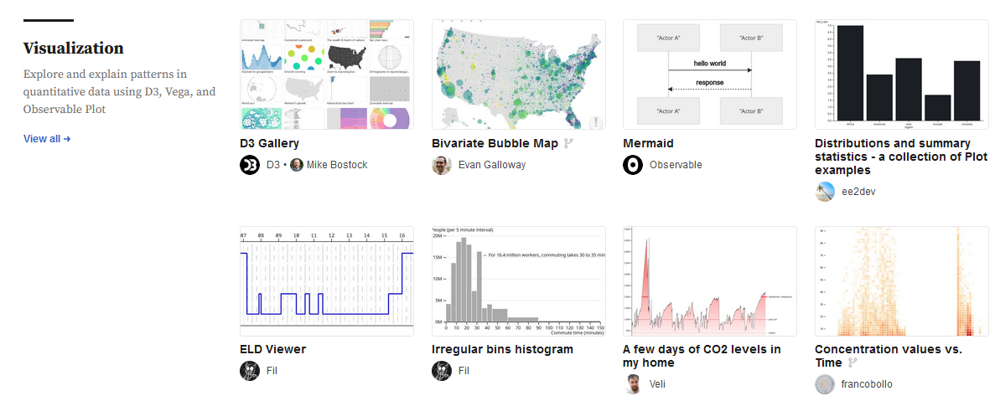
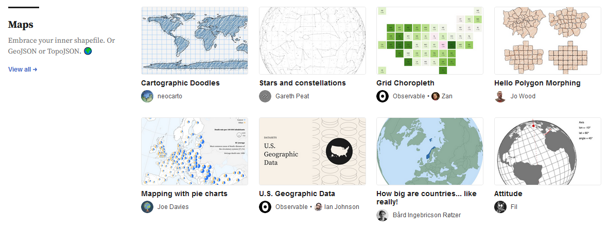

Présentation d'[`observable`](https://observablehq.com/explore)
par [Nicolas Lambert](https://observablehq.com/@neocartocnrs)
sous la forme d'un _notebook_ interactif : https://observablehq.com/@neocartocnrs/observable-et-donnees-spatiales 

Le replay est [disponible plus bas 👇](#replay)

[`observable`](https://observablehq.com/) est
une plateforme
de dataviz réactive qui propose des notebooks
communautaires de visualisations de données:

Quelques ressources supplémentaires utiles:

- Les habitués de `ggplot2` trouveront sans doute ce _notebook_ utile: https://observablehq.com/@observablehq/plot-from-ggplot2
- Présentation de l'utilisation de `duckdb` pour l'utilisation dans `Observable` de données volumineuses: https://observablehq.com/@observablehq/duckdb
- Documentation sur l'usage d'`Observable` avec `quarto`: https://quarto.org/docs/interactive/ojs/

## Replay {#replay}



