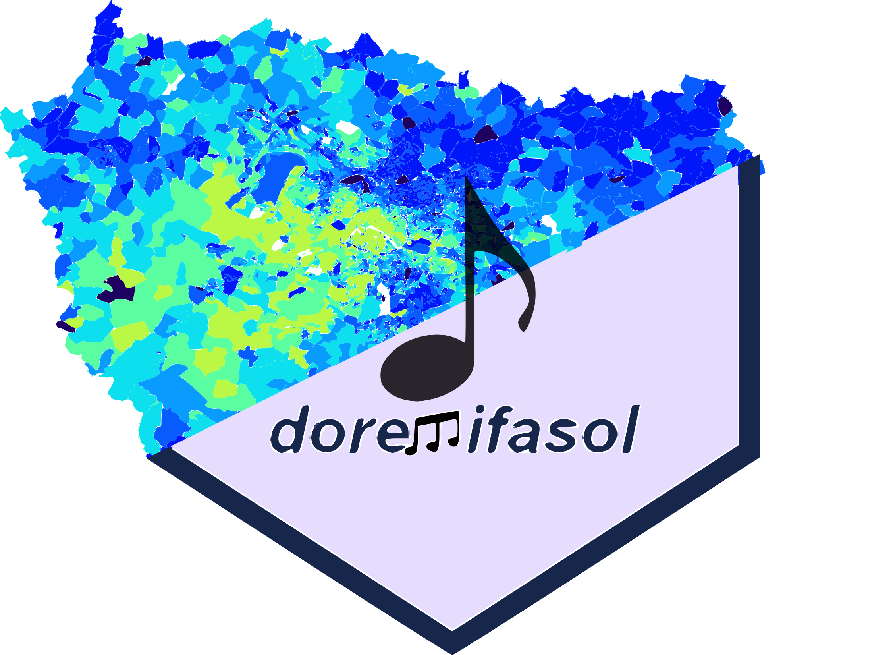
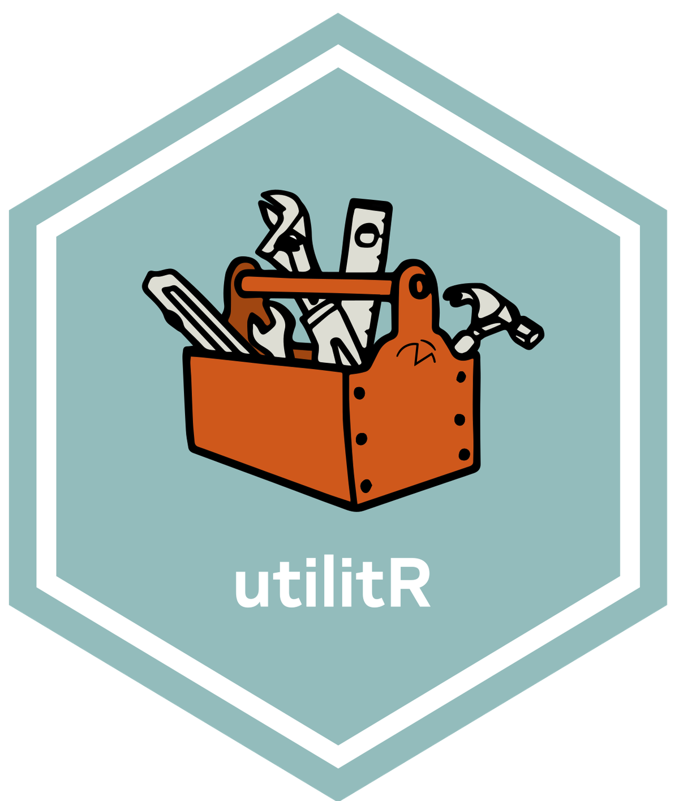

*Vous désirez intégrer la liste de diffusion ? Un mail à <ssphub-contact@insee.fr> suffit*

## Un événement autour des packages facilitant l'accès à l'open data de l'Insee

 

Après les présentations [d'`observable`](/talk/presentation-dobservable-par-nicolas-lambert/)
et de [`gridviz`](/talk/presentation-de-gridviz-par-julien-gaffuri/)
nous vous proposons un
nouvel événement. Celui-ci sera autour de l'_open data_ à travers la présentation des 
__packages facilitant la récupération de données de l'Insee__ disponibles
depuis le site web ou les API.

Deux présentations sont prévues :
- Pierre Lamarche présentera le package <i class="fa-brands fa-r-project"></i> [`doremifasol`](https://github.com/InseeFrLab/DoReMIFaSol). C'est notamment grâce à ce package que la documentation `utilitR` peut s'appuyer sur des données bien connues des utilisateurs d'_open data_ (Filosofi, recensement...)
- Hadrien Leclerc nous présentera le package <i class="fa-brands fa-python"></i> [`Pynsee`](https://github.com/InseeFrLab/pynsee) qui est utilisé depuis deux ans à l'ENSAE pour apprendre aux futurs data scientists à récupérer des données de cadrage. 
 
Ces deux présentations seront suivies d'un temps d'échange.

Cet événement aura lieu le __13 février de 15h à 16h30__ ([📅 invitation `Outlook`](https://minio.lab.sspcloud.fr/lgaliana/ssphub/files/newsletter_10/Pr%C3%A9sentation%20au%20r%C3%A9seau%20des%20data%20scientists%20des%20packages%20open%20data%20Insee%20.ics)). Si vous êtes utilisateurs de données, que vous veniez de l'Insee ou non, ces packages peuvent vous intéresser !

## Masterclass datascientest

 

Les masterclass organisées avec
l'organisme de formation spécialisé `datascientest`
reprennent ! Après une première masterclass au mois de décembre consacrée
au MLOps, notre réseau va proposer de nouvelles séances.

Les premières séances vont s'organiser autour de __deux cursus parallèles__, qui 
commenceront par des introductions pour monter graduellement en niveau 
et se rapprocher des cas d'usages que rencontrent nos data scientists. 

Le premier parcours sera orienté autour des problématiques de NLP. 
La première séance aura lieu le __10 février, de 10h à 12h__ et constituera
une introduction au NLP avec un retour sur certains concepts
centraux (_preprocessing_, _tokenisation_, _lemmatisation_...) et des
exemples d'applications avec le package [`SpaCy`](https://spacy.io/). 
Une deuxième séance dans ce parcours est déjà programmée, le __24 mars de 10h à 12h__, sur 
le thème de la similarité textuelle et de la classification de textes grâce
aux méthodes d'_embeddings_. 

Le deuxième parcours cible la problématique de l'analyse d'images. Une première séance,
qui aura lieu le __10 mars de 10h à 12h__ reviendra sur certains concepts 
centraux du _deep learning_ (perceptron, convolution, _transfer learning_...).
Les séances suivantes, dont les dates n'ont pas encore été arrêtées, s'intéresseront à 
des cas d'usages comme l'OCRisation ou la détection d'objets dans des images. 

{}

__Pour vous inscrire, il suffit de remplir [ce formulaire](https://framaforms.org/participation-aux-masterclass-datascientest-1675096179) !__

{}

## Questionnaire sur vos besoins en formation data science

 

En cette période de recensement, le réseau propose également le sien !
Pour déterminer au mieux la répartition des besoins en formation sur les
sujets data science et ainsi pouvoir proposer des
événements pertinents, 
__nous vous proposons un [questionnaire](https://framaforms.org/besoin-de-formations-en-data-science-1674150129)__
sur vos besoins en formation.

## `utilitR` recherche des rédacteurs d'exercices !

 

Dans le but de continuer à développer [`utilitR`](https://www.book.utilitr.org/), 
documentation collaborative et ouverte,
l'équipe du projet souhaite encourager
des contributions volontaires pour __ajouter des exercices à chaque fiche thématique__.
L'objectif est de produire pour chaque chapitre un ensemble d'exercices, de difficulté graduelle,
permettant de mettre en application les concepts présentés dans la fiche. 

<!-----
Pour les débutants en <i class="fa-brands fa-r-project"></i>, associer des exercices aux fiches
présente l'intérêt d'apprendre à lire une documentation pour résoudre des problèmes concrets, compétence que 
des utilisateurs plus expérimentés savent mettre en oeuvre quoditiennement. 
------->

Ces exercices seraient accessibles depuis le [site web](https://www.book.utilitr.org/)
mais aussi à travers
le [portail de formation du `SSP Cloud`](https://www.sspcloud.fr/formation),
sous la forme de _notebooks_ d'autoformation. 

L'équipe du projet `utilitR` est donc à la
__recherche des personnes motivées pour rédiger des exercices ou mettre à disposition des bouts de code ou des exercices déjà préparés__.
Si vous désirez apporter votre pierre à l'édifice, toute contribution, même modeste, 
sur cette [page](https://github.com/InseeFrLab/utilitR/issues/462),
sera appréciée par l'équipe `utilitr`.

Cette évolution de la documentation vise à prolonger l'effort continu pour 
construire une documentation vivante, interactive et originale. 
L'esthétique du [site web book.utilitr.org](https://www.book.utilitr.org/)
a ainsi été revue récemment afin de rendre la documentation plus ergonomique
tout en ajoutant des fonctionnalités utiles aux lecteurs, comme la
possibilité de surligner ou de prendre des notes. 

## Proposez un billet de blog !

 

Le site web du réseau (https://ssphub.netlify.app/) propose depuis septembre une section blog. 
__Vos idées et contributions sont les bienvenues pour l'enrichir !__

Pour souligner l'aspect collectif de cette section,
un [guide des contributeurs](https://github.com/InseeFrLab/ssphub/blob/main/CONTRIBUTING.md) 
vient de voir le jour. Celui-ci expose la démarche à suivre, de la phase de 
discussion pour définir le sujet du billet aux outils proposés pour faciliter la rédaction 
et la soumission de celui-ci depuis [`Github` <i class="fa-brands fa-github"></i>](https://github.com/InseeFrLab/ssphub).

## La saison 2 du programme 10% arrive 

 

L'attente était insoutenable mais la nouvelle saison de 10% est enfin là !
__Rejoignez ce programme__, issu des
recommandations du [rapport de l'Inspection Générale de l'Insee et de la DINUM](https://www.numerique.gouv.fr/uploads/RAPPORT-besoins-competences-donnee.pdf),
où des data scientists proposent de consacrer jusqu'à 10% de leur temps de travail à
des projets transversaux !

Au-delà de la participation à ces projets, le programme 10% est également l'opportunité 
d'échanger des idées avec des data scientists d'autres administrations et de bénéficier de formations.

Après un __webinaire d'information sur le programme le 31 janvier__ (inscription via [eventbrite](https://www.eventbrite.fr/e/billets-saison-2023-du-programme-10-webinaire-dinformation-520302437597)),
la __journée de lancement__ de la saison 2 se tiendra le __14 février au Bercy Lab__ (plus d'infos à venir).

Cette saison, plus longue que la première, permettra de pérenniser certains des projets de la saison 1
mais aussi de lancer de
nouveaux projets. 

__Inscrivez-vous dès maintenant pour ne pas manquer la saison 2 de 10%!__

{}

Pour plus d'information sur le programme : <lab-ia@data.gouv.fr>

{}

<!------
# L'ENSAE adopte le dragon Onyxia

Le dragon [Onyxia](https://www.onyxia.sh/), le logiciel open source derrière le [SSP Cloud](https://www.sspcloud.fr/)
vient de pondre un nouvel oeuf, à l'ENSAE. 

Les élèves de l'ENSAE, déjà familiarisés à la plateforme par le
cours de ["Python pour la data science"](https://pythonds.linogaliana.fr/) ou par celui
de [mise en production de projets data science](https://ensae-reproductibilite.netlify.app/),
devraient prochainement rencontrer celle-ci dans plus d'enseignements d'informatique. 

L'ENSAE avance bien sur le projet de développer sa propre
implémentation de la plateforme, afin de la proposer pour les enseignements et 
les projets de l'école, et ainsi former les élèves aux technologies modernes de
l'écosystème de la data science. 
--------------->

## Report de la journée de la donnée

La __journée de la donnée__ organisée par l'Administrateur Ministériel
des Données, Algorithmes et Codes sources (AMDAC) du Ministère de la Santé, __initialement prévue
le 31 janvier, est reportée à une date ultérieure__.

