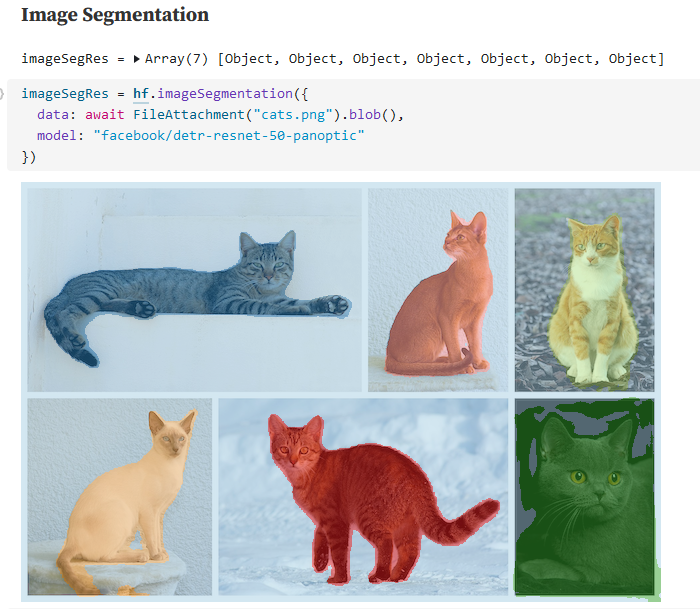
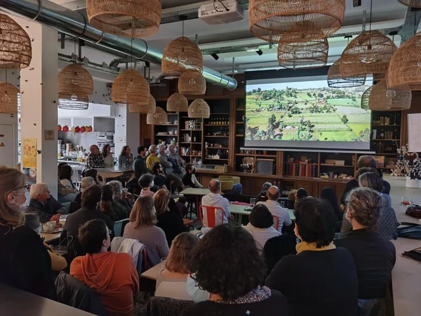

{}

__*Vous désirez intégrer la liste de diffusion ? L'inscription se fait [ici](https://framaforms.org/integration-reseau-des-data-scientists-1676407156).*__

{}

Ce numéro reprend le format expérimenté à la fin de l'année 2022:
un résumé des dernières actualités
du monde de la _data science_ précède la présentation plus classique des
nouvelles du réseau.  

# Actualités de la data science

## ChatGPT continue de faire parler

 

L'actualité est encore largement dominée par les
discussions autour de `ChatGPT`.
Les débats continuent sur la pertinence de
ce type d'outil dans l'enseignement ([cf. Télérama](https://www.telerama.fr/enfants/chatgpt-a-l-ecole-et-si-c-etait-bien-7014474.php)).
L'article du [_New Yorker_ "ChatGPT is a blurry JPEG of the web"](https://www.newyorker.com/tech/annals-of-technology/chatgpt-is-a-blurry-jpeg-of-the-web?utm_campaign=Data_Elixir&utm_source=Data_Elixir_424)
propose une analyse en profondeur de la manière dont les modèles
de langage reconstruisent des réponses originales en mélangeant
des corpus rencontrés lors de la phase d'entraînement. 

Alors qu'il est difficile d'avoir des informations sur le corpus
de `ChatGPT` ou les méthodes d'apprentissage mises en oeuvre, 
des développeurs ont mis en place de
nombreux chatbots thématiques sur https://beta.character.ai/
s'appuyant sur des modèles de langage ouverts. 

Ce mois-ci, Facebook-Meta est également rentré dans la danse avec son 
[modèle `LLaMa`](https://ai.facebook.com/blog/large-language-model-llama-meta-ai/),
ouvert aux chercheurs et ayant vocation à fonctionner sur des installations
moins gourmandes en ressources que les modèles `GPT` ou [`PaLM`](https://ai.googleblog.com/2022/04/pathways-language-model-palm-scaling-to.html).

A peine deux mois après le lancement tonitruant de `ChatGPT`,
et la création d'un _["code rouge"](https://www.nytimes.com/2022/12/21/technology/ai-chatgpt-google-search.html)_
du côté de `Google`, le [lancement difficile](https://www.lemonde.fr/economie/article/2023/02/22/les-rates-du-robot-conversationnel-de-microsoft-sur-bing_6162869_3234.html) par Microsoft 
d'une version de test de son robot conversationnel dans son navigateur `Bing`
montre que l'intégration à un moteur de recherche 
traditionnel n'est pas évidente, notamment pour éviter la diffusion de fausses informations. 
Alors que `ChatGPT` avait bénéficié d'un gros travail humain pour [cadrer son comportement](https://time.com/6247678/openai-chatgpt-kenya-workers/), il semblerait que l'IA de Bing
soit moins consensuelle dans ses propos.

Pendant ce temps, la recherche sur les modèles de diffusion continue à avancer à grande
vitesse. La dernière innovation est la capacité
à [reconstruire des images à partir d'IRM de l'activité du cerveau](https://sites.google.com/view/stablediffusion-with-brain/)
grâce au modèle `Stable Diffusion`. 

## Traitement de données tabulaires: `Arrow` et `Polars` au centre du jeu

 

Du côté des données tabulaires plus traditionnelles, 
Apache `Arrow` continue de s'affirmer comme un incontournable. 

La version 2.0 de `Pandas` qui vient de sortir permet de plus facilement
s'appuyer, en arrière-plan, sur `Arrow` plutôt que `Numpy`
qui offre des performances et des fonctionnalités
limitées sur données non numériques (cf. [https://datapythonista.me](https://datapythonista.me/blog/pandas-20-and-the-arrow-revolution-part-i)). 
Il s'agissait d'une des limites majeures de `Pandas`, identifiées dès 2017 par son
créateur Wes McKinney ([voir ici](https://wesmckinney.com/blog/apache-arrow-pandas-internals/))
qui est également très impliqué dans le développement d'Apache `Arrow`.

La librairie [`Polars`](https://www.pola.rs/) connait
une certaine [_hype_](https://airbyte.com/blog/pandas-2-0-ecosystem-arrow-polars-duckdb#the-alternatives) et va sans doute
devenir dans les mois à venir une librairie incontournable, en alternative à `Pandas`.
La [dernière version de `DuckDB`](https://duckdb.org/2023/02/13/announcing-duckdb-070.html) (sortie mi-février)
renforce l'interconnexion entre ces deux écosystèmes ([exemples](https://duckdb.org/docs/guides/python/polars.html)). 
Si vous voulez en savoir plus sur `Polars`, il est recommandé de suivre l'évolution de 
la liste _["Awesome Polars"](https://github.com/ddotta/awesome-polars)_ faite par Damien Dotta
(relayée par la très bonne _newsletter_ du site [Data Elixir](https://dataelixir.com/)) et 
de lire le _post_ à venir prochainement sur le blog de notre réseau.

Par ailleurs, l'article de Jordan Tigani ["Big data is dead"](https://motherduck.com/blog/big-data-is-dead/?utm_campaign=Data_Elixir&utm_source=Data_Elixir_424) vaut le détour. 

## `Huggingface.js`: l'API d'`HuggingFace` directement accessible depuis un navigateur web

 

`Huggingface` et `Observable` sont chacun devenus des incontournables dans leur domaine
(voir notre [_newsletter_ de décembre](https://ssphub.netlify.app/post/retrospective2022/)).
Alors un rapprochement entre ces deux univers, permettant d'utiliser
de nombreux modèles d'apprentissage via l'API d'`HuggingFace` directement dans le navigateur,
ça donne envie de s'amuser.

Le _notebook_, disponible
sur [`Observable`](https://observablehq.com/@huggingface/hello-huggingface-js-inference),
illustre la richesse des fonctionnalités disponibles. 

# Actualités du réseau: événements à venir

Place aux actualités de notre réseau avec les prochains événements
que nous organisons. 

## Première journée du réseau en avril

 

Notre réseau organise des événements
virtuels depuis un an.
Pour renforcer l'esprit communautaire, nous proposons
une __journée du réseau le 17 avril, en présentiel__ 📅. 

Cet événement aura lieu dans le
tiers-lieu [la Tréso](https://www.latreso.fr/) à Malakoff. 
Pendant la journée se succèderont
plusieurs séquences pour
construire ensemble le réseau, partager autour du sujet
de la _data science_ et échanger ensemble.

Le programme et les
modalités pratiques d'inscription seront communiqués prochainement ! 
Vous pouvez néanmoins déjà marquer la date dans votre calendrier. 

## Présentation de la documentation collaborative _Carpentries_

Pour favoriser l'adoption des langages `R`, `Python` et `Git`
dans les administrations, le
programme `ModernStat` piloté par l'OCDE et Statistics Canada,
a lancé un projet nommé `Meta Academy` et
s'est rapproché de l'organisation américaine `Carpentries`
dont l'objectif est de proposer
des parcours progressifs de cours
dans les langages _open source_, associés à des documentations
disponibles de manière ouverte. 

L'absence de contenu en Français et l'orientation principalement
académique des [contenus](https://datacarpentry.org/lessons/)
a amené le programme `ModernStat` 
à proposer aux _Carpentries_ de créer de nouveaux parcours
de formations, en Français. Ces programmes seraient créés
par des membres de la communauté francophone des utilisateurs
des langages `R`, `Python` et `Git`.

Kate Burnett-Isaacs, de Statistics Canada, nous présentera 
l'initiative le __mardi 28 mars à 15h__ 📅
([invitation `Outlook` ](https://minio.lab.sspcloud.fr/lgaliana/ssphub/files/newsletter_11/carpentries.ics)).
La présentation aura lieu
en Anglais et sera suivie d'un
échange (Français et Anglais possibles).
Si vous êtes intéressés
par la manière dont les nombreux contenus créés par
les membres du réseau pourraient prendre place
dans ce cadre, n'hésitez pas à venir pour en savoir plus !
Informations pratiques [ici](https://ssphub.netlify.app/talk/presentation-du-projet-meta-academy-carpentries/) !

## Masterclass datascientest

 

Les inscriptions à nos cycles de _masterclass_ `datascientest` sont toujours
ouvertes ! Pendant le mois de mars, nous continuerons d'avancer dans
les __deux cursus parallèles__.

En premier lieu, 
la masterclass d'introduction au deep learning (__10 mars de 10h à 12h__ 📅)
permettra d'initier notre
parcours de _computer vision_ avec la présentation de 
certains concepts 
centraux du _deep learning_ (perceptron, convolution, _transfer learning_...).

La deuxième session mensuelle, ayant lieu le __24 mars de 10h à 12h__ 📅
sera elle l'occasion
d'avancer dans notre parcours NLP 
grâce au sujet de la similarité textuelle et de la classification de textes avec
des méthodes d'_embeddings_.

{}

__Pour vous inscrire, il suffit de remplir [ce formulaire](https://framaforms.org/participation-aux-masterclass-datascientest-1675096179) !__

{}

# Actualités du réseau: derniers événements et contenus produits

## Onyxia

 

Le [dernier post](https://ssphub.netlify.app/post/onyxia/) sur le site
web du réseau revient sur le projet `Onyxia`, 
le logiciel initié par l'équipe innovation de l'Insee et mis à disposition
sur [`Github`](https://github.com/InseeFrLab/onyxia-web) pour 
permettre à d'autres organisations de développer une infrastructure
de _data science_ à l'état de l'art.

Pour en savoir plus
sur le contexte de naissance d'Onyxia,
les choix techniques mis en oeuvre ou la communauté des 
réutilisateurs, c'est [par ici](https://ssphub.netlify.app/post/onyxia/).

## Replay de l'événement autour des packages facilitant l'accès à l'open data de l'Insee

 

Le _replay_ des présentations des
packages [`Doremifasol`](https://inseefrlab.github.io/DoReMIFaSol/) (`R`)
et [`Pynsee`](https://github.com/InseeFrLab/pynsee) (`Python`) lors de notre
événement du __13 février__ autour des packages facilitant l'accès
à l'open data de l'Insee est en ligne ! 

La vidéo et les supports présentés sont mis à disposition
sur le [site web du réseau](https://ssphub.netlify.app/talk/presentation-des-packages-r-et-python-pour-acceder-a-lopen-data-de-linsee/)

## Programme 10%

La journée de lancement du programme 10% annonce une saison prometteuse !
Plus de 50 personnes, issues d'un large panel d'administrations, se 
sont rencontrées et ont échangées autour de projets mutualisables. 
Au final, une demi-douzaine de projets ont déjà été identifiés. 

Si vous n'étiez pas disponible lors de cette première journée, il 
est possible à tout moment de rejoindre cette communauté.
Le prochain atelier a lieu le __14 mars au Lieu de la Transformation Publique__ 📅 !