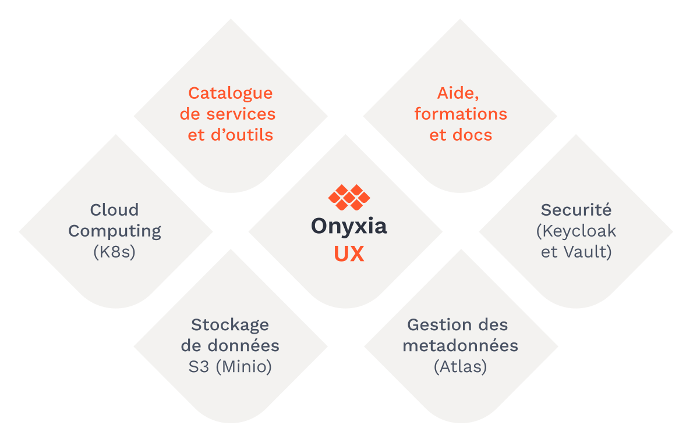
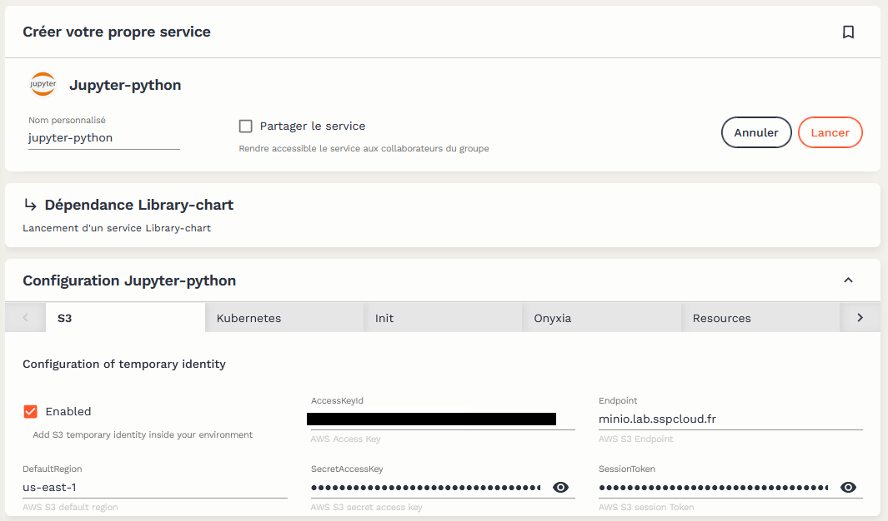
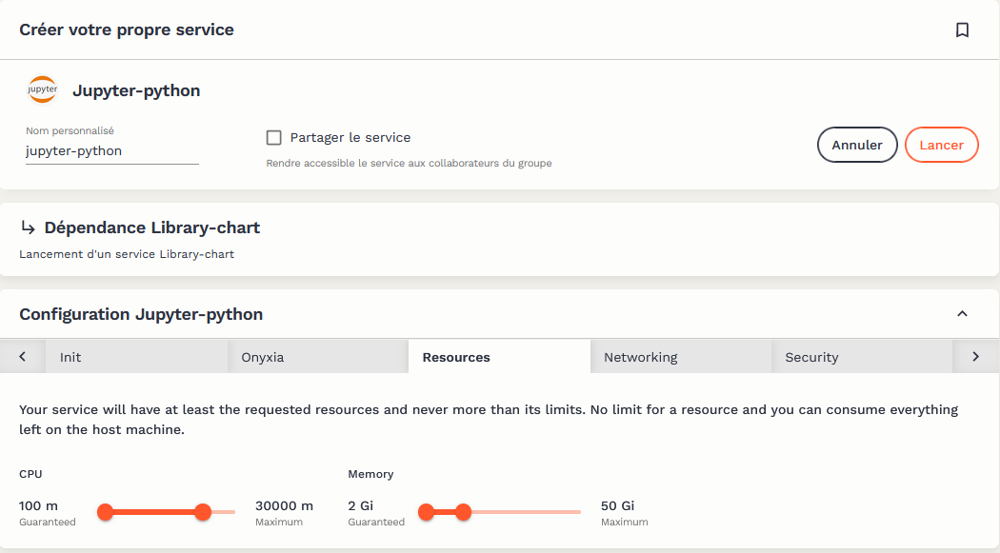

-   <a href="#contexte" id="toc-contexte">Contexte</a>
-   <a href="#de-hdfs-à-la-conteneurisation" id="toc-de-hdfs-à-la-conteneurisation">De HDFS à la conteneurisation</a>
-   <a href="#la-solution-onyxia" id="toc-la-solution-onyxia">La solution Onyxia</a>
    -   <a href="#dun-cloud-de-ladministration-à-un-logiciel-ouvert" id="toc-dun-cloud-de-ladministration-à-un-logiciel-ouvert">D’un <em>cloud</em> de l’administration à un logiciel ouvert</a>
-   <a href="#onyxia-en-bref" id="toc-onyxia-en-bref">Onyxia en bref</a>
-   <a href="#linterface-et-les-services-proposés-par-onyxia" id="toc-linterface-et-les-services-proposés-par-onyxia">L’interface et les services proposés par <code>Onyxia</code></a>
-   <a href="#la-communauté-onyxia" id="toc-la-communauté-onyxia">La communauté <code>Onyxia</code></a>
-   <a href="#les-plateformes-basées-sur-onyxia" id="toc-les-plateformes-basées-sur-onyxia">Les plateformes basées sur Onyxia</a>
-   <a href="#références" id="toc-références">Références</a>

`Onyxia` est un logiciel *open source* développé par l'Insee
([disponible sur `Github` <i class="fa-brands fa-github"></i>](https://github.com/InseeFrLab/onyxia-web))
permettant de fournir un environnement de traitement de données à l'état de l'art.
Principalement conçu pour permettre le travail interactif des data scientists,
l'expérience fournie avec `Onyxia`
favorise également la reproductibilité des travaux et leur mise en production.

Le logiciel `Onyxia` est installé par des organisations souhaitant créer un *datalab*,
c'est-à-dire une plateforme interactive de traitement de données.
Ces organisations ont toutes le point commun de vouloir construire une plateforme qui embrasse
les technologies *cloud* que sont la conteneurisation et le stockage objet tout en mettant à
disposition celles-ci dans un environnement *user-friendly* où l'interconnexion entre ces
différentes briques est gérée de manière cohérente.
Les technologies *cloud native* sont devenues indispensables dans l'écosystème de la donnée,
du fait d'une meilleure gestion des ressources de traitement ou de la capacité à créer un
environnement parfaitement reproductible pour une mise en production accélérée.

Ce *post* de blog a pour objectif de présenter la raison d'être d'`Onyxia`,
sa génèse et les solutions qu'apporte cette infrastructure à des irritants
classiques des projets novateurs de data science.

## Contexte

L'écosystème de la data science est en mouvement accéléré depuis 10 ans
et le rôle du *data scientist* dans les organisations valorisant de la donnée
évolue continuellement (Davenport and Patil 2022).
Les data scientists modernes sont amenés à utiliser de plus en plus
de langages et doivent être capables de maîtriser plusieurs
architectures informatiques. La frontière est ainsi moins nette
que par le passé entre
statisticiens et informaticiens.
De plus, les innovations récentes dans le monde du
développement logiciel, notamment
l'adoption massive de l'approche `DevOps` -
approche qui consiste à automatiser la production de livrables dès la conception
du prototype -
a également fait évoluer les pratiques des data scientists.

Ce besoin de ressources informatiques croissantes,
de flexibilité dans le prototypage de solutions informatiques et l'évolution des
pratiques
consistant à mettre à disposition en continu des livrables ont eu des implications
importantes sur les architectures informatiques dominantes dans l'écosystème de la
donnée.
Pour répondre au besoin croissant de puissance de traitement, les serveurs
partagés, organisés sous forme de *clusters*, se sont développés dans de
nombreuses organisations.
Après avoir connue son heure de gloire au début des années 2010, l'infrastructure
[`HDFS` (*Hadoop Distributed File System*)](https://openclassrooms.com/fr/courses/4467481-creez-votre-data-lake/4509426-decouvrez-le-systeme-de-fichiers-distribue-hdfs),
qui reposait sur des *clusters* où les données et la puissance de traitement étaient
distribués et collocalisés, a laissé place à des infrastructures
plus scalables, basées sur l'approche de la conteneurisation.

## De HDFS à la conteneurisation

{}
Cette partie plus technique développe des éléments pour comprendre
le succès récent des infrastructures conteuneurisées.

Elle pourra intéresser le lecteur curieux sur les fondements
des infrastructures *cloud* modernes mais n'est pas nécessaire
à la compréhension générale de l'article.
{}

La conteuneurisation, qui repose
sur l'idée que les serveurs de stockage de la donnée peuvent être dissociés de ceux
effectuant les traitements, sert de fondement aux principales plateformes *cloud* actuelles
fournissant
des services à la demande.

Ce nouveau paradigme part de deux constats. Le premier
est que les
échanges de données entre les noeuds d'un serveur sont aujourd'hui peu coûteux.
Avec des flux réseaux suffisants et une technologie
performante,
il est donc possible d'échanger à un coût modéré
de gros volumes de données au sein d'une infrastructure.
Le deuxième constat est que la maintenance d'une infrastructure conteuneurisée est
plus légère que celle d'une infrastructure basée sur des machines virtuelles ou sur
la collocalisation des données et des traitements comme `HDFS`.

Les données étant stockées sur des serveurs différents de ceux exécutant les traitements,
l'accès à celles-ci se fait à travers des API qui
permettent de traiter le système de stockage distant comme un système de fichiers
classiques. `Onyxia` a adopté une implémentation *open source* du système de stockage
`S3` appelée [`MinIO`](https://min.io/).

En ce qui concerne le traitement des données, le fait
d'utiliser un système de conteneurs, c'est-à-dire une configuration logicielle portable minimaliste
prête à l'emploi (par opposition aux machines virtuelles qui impliquent un système d'exploitation complet),
offre une grande liberté sur le choix des logiciels de traitement. De nombreuses technologies
*open source* devenues standards dans le monde de la *data science* (`Jupyter`, `RStudio`, `ElasticSearch`...)
existent déjà sous cette forme et peuvent ainsi être adoptées dans une telle infrastructure pour fournir
des services prêts-à-l'emploi pour les data scientists.
La mise en
musique de toutes ces petites boites auto-suffisantes, notamment l'optimisation des ressources concurrentes
sur un serveur, est permise par la technologie d'orchestration [`Kubernetes`](https://kubernetes.io/fr/).

 

<svg width="100%" height="100%" viewBox="0 0 1479 741" fill="none" xmlns="http://www.w3.org/2000/svg">
<path d="M695 118V292.5" stroke="#FF562C" stroke-width="5"/>
<path d="M695 408.5V622" stroke="#FF562C" stroke-width="5"/>
<path d="M424.5 460.5L505 407" stroke="#FF562C" stroke-width="5"/>
<path d="M153 349.5H500.5" stroke="#FF562C" stroke-width="5"/>
<path d="M435 229L501.5 294" stroke="#FF562C" stroke-width="5"/>
<path d="M887.5 296.5L960.5 232.5" stroke="#FF562C" stroke-width="5"/>
<path d="M886 404L969 460" stroke="#FF562C" stroke-width="5"/>
<path d="M890 350.5H1324.5" stroke="#FF562C" stroke-width="5"/>
<path d="M295.8 471C288.041 471 281.629 477.412 281.629 485.171V563.115H276.314C273.414 563.115 271.001 565.78 271 568.429V575.515C271 584.255 278.202 591.458 286.943 591.458H425.115C433.856 591.458 441.058 584.255 441.058 575.515V568.429C441.058 565.646 438.526 563.115 435.744 563.115H430.43V485.171C430.43 477.412 424.017 471 416.258 471H295.8ZM295.8 481.629H416.258C418.313 481.629 419.801 483.117 419.801 485.171V563.115H292.257V485.171C292.257 483.117 293.745 481.629 295.8 481.629ZM281.629 573.743H430.43V575.515C430.43 578.551 428.151 580.829 425.115 580.829H286.943C283.907 580.829 281.474 578.547 281.629 575.515V573.743Z" fill="currentColor"/>
<path fill-rule="evenodd" clip-rule="evenodd" d="M339.712 510.372C339.712 501.345 347.067 494 356.09 494C365.112 494 372.467 501.332 372.467 510.372C372.467 519.41 365.113 526.755 356.09 526.755C347.066 526.755 339.712 519.398 339.712 510.372ZM356.09 500.883C350.861 500.883 346.605 505.14 346.605 510.372C346.605 515.604 350.861 519.861 356.09 519.861C361.318 519.861 365.574 515.604 365.574 510.372C365.574 505.14 361.318 500.883 356.09 500.883ZM335.301 522.004C336.429 520.564 338.541 520.278 340.014 521.382C341.49 522.488 341.795 524.574 340.653 526.047C338.094 529.34 336.742 533.255 336.742 537.374C336.742 540.079 337.329 541.698 338.088 542.727C338.847 543.756 339.868 544.319 340.997 544.743C342.642 545.36 344.781 545.685 347.281 545.847C349.737 546.007 352.464 546.007 355.311 546.007H355.311H355.312H357.51C360.4 546.013 363.171 546.015 365.662 545.852C368.161 545.688 370.3 545.361 371.946 544.743C373.07 544.319 374.091 543.756 374.852 542.726C375.612 541.697 376.201 540.078 376.201 537.374C376.201 533.425 374.958 529.649 372.598 526.443L372.594 526.438C371.503 524.936 371.858 522.867 373.364 521.795L373.374 521.788C374.882 520.741 376.964 521.068 378.061 522.541L378.064 522.545C381.263 526.891 382.953 532.025 382.989 537.367L382.989 537.374C382.989 540.875 382.27 543.762 380.717 546.108L380.716 546.109C379.26 548.3 377.11 549.917 374.377 550.948C370.019 552.588 364.586 552.655 358.578 552.655H355.307H355.307C348.939 552.655 343.182 552.655 338.616 550.949C335.88 549.929 333.717 548.3 332.271 546.106C330.72 543.751 330 540.877 330 537.374C330 531.781 331.837 526.468 335.297 522.008L335.301 522.004Z" fill="#FF562C"/>
<path d="M295.8 149C288.041 149 281.629 155.412 281.629 163.171V241.115H276.314C273.414 241.115 271.001 243.78 271 246.429V253.515C271 262.255 278.202 269.458 286.943 269.458H425.115C433.856 269.458 441.058 262.255 441.058 253.515V246.429C441.058 243.646 438.526 241.115 435.744 241.115H430.43V163.171C430.43 155.412 424.017 149 416.258 149H295.8ZM295.8 159.629H416.258C418.313 159.629 419.801 161.117 419.801 163.171V241.115H292.257V163.171C292.257 161.117 293.745 159.629 295.8 159.629ZM281.629 251.743H430.43V253.515C430.43 256.551 428.151 258.829 425.115 258.829H286.943C283.907 258.829 281.474 256.547 281.629 253.515V251.743Z" fill="currentColor"/>
<path fill-rule="evenodd" clip-rule="evenodd" d="M339.712 188.372C339.712 179.345 347.067 172 356.09 172C365.112 172 372.467 179.332 372.467 188.372C372.467 197.41 365.113 204.755 356.09 204.755C347.066 204.755 339.712 197.398 339.712 188.372ZM356.09 178.883C350.861 178.883 346.605 183.14 346.605 188.372C346.605 193.604 350.861 197.861 356.09 197.861C361.318 197.861 365.574 193.604 365.574 188.372C365.574 183.14 361.318 178.883 356.09 178.883ZM335.301 200.004C336.429 198.564 338.541 198.278 340.014 199.382C341.49 200.488 341.795 202.574 340.653 204.047C338.094 207.34 336.742 211.255 336.742 215.374C336.742 218.079 337.329 219.698 338.088 220.727C338.847 221.756 339.868 222.319 340.997 222.743C342.642 223.36 344.781 223.685 347.281 223.847C349.737 224.007 352.464 224.007 355.311 224.007H355.311H355.312H357.51C360.4 224.013 363.171 224.015 365.662 223.852C368.161 223.688 370.3 223.361 371.946 222.743C373.07 222.319 374.091 221.756 374.852 220.726C375.612 219.697 376.201 218.078 376.201 215.374C376.201 211.425 374.958 207.649 372.598 204.443L372.594 204.438C371.503 202.936 371.858 200.867 373.364 199.795L373.374 199.788C374.882 198.741 376.964 199.068 378.061 200.541L378.064 200.545C381.263 204.891 382.953 210.025 382.989 215.367L382.989 215.374C382.989 218.875 382.27 221.762 380.717 224.108L380.716 224.109C379.26 226.3 377.11 227.917 374.377 228.948C370.019 230.588 364.586 230.655 358.578 230.655H355.307H355.307C348.939 230.655 343.182 230.655 338.616 228.949C335.88 227.929 333.717 226.3 332.271 224.106C330.72 221.751 330 218.877 330 215.374C330 209.781 331.837 204.468 335.297 200.008L335.301 200.004Z" fill="#FF562C"/>
<path d="M636.8 620C629.041 620 622.629 626.412 622.629 634.171V712.115H617.314C614.414 712.115 612.001 714.78 612 717.429V724.515C612 733.255 619.202 740.458 627.943 740.458H766.115C774.856 740.458 782.058 733.255 782.058 724.515V717.429C782.058 714.646 779.526 712.115 776.744 712.115H771.43V634.171C771.43 626.412 765.017 620 757.258 620H636.8ZM636.8 630.629H757.258C759.313 630.629 760.801 632.117 760.801 634.171V712.115H633.257V634.171C633.257 632.117 634.745 630.629 636.8 630.629ZM622.629 722.743H771.43V724.515C771.43 727.551 769.151 729.829 766.115 729.829H627.943C624.907 729.829 622.474 727.547 622.629 724.515V722.743Z" fill="currentColor"/>
<path fill-rule="evenodd" clip-rule="evenodd" d="M680.712 659.372C680.712 650.345 688.067 643 697.09 643C706.112 643 713.467 650.332 713.467 659.372C713.467 668.41 706.113 675.755 697.09 675.755C688.066 675.755 680.712 668.398 680.712 659.372ZM697.09 649.883C691.861 649.883 687.605 654.14 687.605 659.372C687.605 664.604 691.861 668.861 697.09 668.861C702.318 668.861 706.574 664.604 706.574 659.372C706.574 654.14 702.318 649.883 697.09 649.883ZM676.301 671.004C677.429 669.564 679.541 669.278 681.014 670.382C682.49 671.488 682.795 673.574 681.653 675.047C679.094 678.34 677.742 682.255 677.742 686.374C677.742 689.079 678.329 690.698 679.088 691.727C679.847 692.756 680.868 693.319 681.997 693.743C683.642 694.36 685.781 694.685 688.281 694.847C690.737 695.007 693.464 695.007 696.311 695.007H696.311H696.312H698.51C701.4 695.013 704.171 695.015 706.662 694.852C709.161 694.688 711.3 694.361 712.946 693.743C714.07 693.319 715.091 692.756 715.852 691.726C716.612 690.697 717.201 689.078 717.201 686.374C717.201 682.425 715.958 678.649 713.598 675.443L713.594 675.438C712.503 673.936 712.858 671.867 714.364 670.795L714.374 670.788C715.882 669.741 717.964 670.068 719.061 671.541L719.064 671.545C722.263 675.891 723.953 681.025 723.989 686.367L723.989 686.374C723.989 689.875 723.27 692.762 721.717 695.108L721.716 695.109C720.26 697.3 718.11 698.917 715.377 699.948C711.019 701.588 705.586 701.655 699.578 701.655H696.307H696.307C689.939 701.655 684.182 701.655 679.616 699.949C676.88 698.929 674.717 697.3 673.271 695.106C671.72 692.751 671 689.877 671 686.374C671 680.781 672.837 675.468 676.297 671.008L676.301 671.004Z" fill="#FF562C"/>
<path d="M636.8 0C629.041 0 622.629 6.41239 622.629 14.1715V92.1147H617.314C614.414 92.1147 612.001 94.7795 612 97.4291V104.515C612 113.255 619.202 120.458 627.943 120.458H766.115C774.856 120.458 782.058 113.255 782.058 104.515V97.4291C782.058 94.6465 779.526 92.1149 776.744 92.1147H771.43V14.1715C771.43 6.41239 765.017 0 757.258 0H636.8ZM636.8 10.6286H757.258C759.313 10.6286 760.801 12.1168 760.801 14.1715V92.1147H633.257V14.1715C633.257 12.1168 634.745 10.6286 636.8 10.6286ZM622.629 102.743H771.43V104.515C771.43 107.551 769.151 109.829 766.115 109.829H627.943C624.907 109.829 622.474 107.547 622.629 104.515V102.743Z" fill="currentColor"/>
<path fill-rule="evenodd" clip-rule="evenodd" d="M680.712 39.3718C680.712 30.3448 688.067 23 697.09 23C706.112 23 713.467 30.3325 713.467 39.3718C713.467 48.4101 706.113 55.7555 697.09 55.7555C688.066 55.7555 680.712 48.3978 680.712 39.3718ZM697.09 29.883C691.861 29.883 687.605 34.14 687.605 39.3718C687.605 44.6036 691.861 48.8607 697.09 48.8607C702.318 48.8607 706.574 44.6036 706.574 39.3718C706.574 34.14 702.318 29.883 697.09 29.883ZM676.301 51.0036C677.429 49.5642 679.541 49.2779 681.014 50.3816C682.49 51.4879 682.795 53.5744 681.653 55.0469C679.094 58.3399 677.742 62.2554 677.742 66.3741C677.742 69.079 678.329 70.6977 679.088 71.7267C679.847 72.7557 680.868 73.3192 681.997 73.743C683.642 74.3604 685.781 74.6849 688.281 74.8475C690.737 75.0072 693.464 75.0072 696.311 75.0072H696.311H696.312H698.51C701.4 75.0128 704.171 75.0151 706.662 74.8518C709.161 74.6878 711.3 74.3607 712.946 73.7433C714.07 73.3193 715.091 72.7556 715.852 71.7261C716.612 70.6968 717.201 69.078 717.201 66.3741C717.201 62.425 715.958 58.6487 713.598 55.4434L713.594 55.4378C712.503 53.936 712.858 51.8673 714.364 50.7948L714.374 50.7877C715.882 49.7413 717.964 50.068 719.061 51.5409L719.064 51.5455C722.263 55.8911 723.953 61.0254 723.989 66.3674L723.989 66.3741C723.989 69.8753 723.27 72.7619 721.717 75.1075L721.716 75.1089C720.26 77.3003 718.11 78.9171 715.377 79.9476C711.019 81.5881 705.586 81.6549 699.578 81.6549H696.307H696.307C689.939 81.655 684.182 81.6551 679.616 79.9489C676.88 78.9294 674.717 77.2997 673.271 75.1056C671.72 72.7506 671 69.8768 671 66.3741C671 60.781 672.837 55.4681 676.297 51.0077L676.301 51.0036Z" fill="#FF562C"/>
<path d="M977.8 150C970.041 150 963.629 156.412 963.629 164.171V242.115H958.314C955.414 242.115 953.001 244.78 953 247.429V254.515C953 263.255 960.202 270.458 968.943 270.458H1107.12C1115.86 270.458 1123.06 263.255 1123.06 254.515V247.429C1123.06 244.646 1120.53 242.115 1117.74 242.115H1112.43V164.171C1112.43 156.412 1106.02 150 1098.26 150H977.8ZM977.8 160.629H1098.26C1100.31 160.629 1101.8 162.117 1101.8 164.171V242.115H974.257V164.171C974.257 162.117 975.745 160.629 977.8 160.629ZM963.629 252.743H1112.43V254.515C1112.43 257.551 1110.15 259.829 1107.12 259.829H968.943C965.907 259.829 963.474 257.547 963.629 254.515V252.743Z" fill="currentColor"/>
<path fill-rule="evenodd" clip-rule="evenodd" d="M1021.71 189.372C1021.71 180.345 1029.07 173 1038.09 173C1047.11 173 1054.47 180.332 1054.47 189.372C1054.47 198.41 1047.11 205.755 1038.09 205.755C1029.07 205.755 1021.71 198.398 1021.71 189.372ZM1038.09 179.883C1032.86 179.883 1028.6 184.14 1028.6 189.372C1028.6 194.604 1032.86 198.861 1038.09 198.861C1043.32 198.861 1047.57 194.604 1047.57 189.372C1047.57 184.14 1043.32 179.883 1038.09 179.883ZM1017.3 201.004C1018.43 199.564 1020.54 199.278 1022.01 200.382C1023.49 201.488 1023.79 203.574 1022.65 205.047C1020.09 208.34 1018.74 212.255 1018.74 216.374C1018.74 219.079 1019.33 220.698 1020.09 221.727C1020.85 222.756 1021.87 223.319 1023 223.743C1024.64 224.36 1026.78 224.685 1029.28 224.847C1031.74 225.007 1034.46 225.007 1037.31 225.007H1037.31H1037.31H1039.51C1042.4 225.013 1045.17 225.015 1047.66 224.852C1050.16 224.688 1052.3 224.361 1053.95 223.743C1055.07 223.319 1056.09 222.756 1056.85 221.726C1057.61 220.697 1058.2 219.078 1058.2 216.374C1058.2 212.425 1056.96 208.649 1054.6 205.443L1054.59 205.438C1053.5 203.936 1053.86 201.867 1055.36 200.795L1055.37 200.788C1056.88 199.741 1058.96 200.068 1060.06 201.541L1060.06 201.545C1063.26 205.891 1064.95 211.025 1064.99 216.367L1064.99 216.374C1064.99 219.875 1064.27 222.762 1062.72 225.108L1062.72 225.109C1061.26 227.3 1059.11 228.917 1056.38 229.948C1052.02 231.588 1046.59 231.655 1040.58 231.655H1037.31H1037.31C1030.94 231.655 1025.18 231.655 1020.62 229.949C1017.88 228.929 1015.72 227.3 1014.27 225.106C1012.72 222.751 1012 219.877 1012 216.374C1012 210.781 1013.84 205.468 1017.3 201.008L1017.3 201.004Z" fill="#FF562C"/>
<path d="M977.8 471C970.041 471 963.629 477.412 963.629 485.171V563.115H958.314C955.414 563.115 953.001 565.78 953 568.429V575.515C953 584.255 960.202 591.458 968.943 591.458H1107.12C1115.86 591.458 1123.06 584.255 1123.06 575.515V568.429C1123.06 565.646 1120.53 563.115 1117.74 563.115H1112.43V485.171C1112.43 477.412 1106.02 471 1098.26 471H977.8ZM977.8 481.629H1098.26C1100.31 481.629 1101.8 483.117 1101.8 485.171V563.115H974.257V485.171C974.257 483.117 975.745 481.629 977.8 481.629ZM963.629 573.743H1112.43V575.515C1112.43 578.551 1110.15 580.829 1107.12 580.829H968.943C965.907 580.829 963.474 578.547 963.629 575.515V573.743Z" fill="currentColor"/>
<path fill-rule="evenodd" clip-rule="evenodd" d="M1021.71 510.372C1021.71 501.345 1029.07 494 1038.09 494C1047.11 494 1054.47 501.332 1054.47 510.372C1054.47 519.41 1047.11 526.755 1038.09 526.755C1029.07 526.755 1021.71 519.398 1021.71 510.372ZM1038.09 500.883C1032.86 500.883 1028.6 505.14 1028.6 510.372C1028.6 515.604 1032.86 519.861 1038.09 519.861C1043.32 519.861 1047.57 515.604 1047.57 510.372C1047.57 505.14 1043.32 500.883 1038.09 500.883ZM1017.3 522.004C1018.43 520.564 1020.54 520.278 1022.01 521.382C1023.49 522.488 1023.79 524.574 1022.65 526.047C1020.09 529.34 1018.74 533.255 1018.74 537.374C1018.74 540.079 1019.33 541.698 1020.09 542.727C1020.85 543.756 1021.87 544.319 1023 544.743C1024.64 545.36 1026.78 545.685 1029.28 545.847C1031.74 546.007 1034.46 546.007 1037.31 546.007H1037.31H1037.31H1039.51C1042.4 546.013 1045.17 546.015 1047.66 545.852C1050.16 545.688 1052.3 545.361 1053.95 544.743C1055.07 544.319 1056.09 543.756 1056.85 542.726C1057.61 541.697 1058.2 540.078 1058.2 537.374C1058.2 533.425 1056.96 529.649 1054.6 526.443L1054.59 526.438C1053.5 524.936 1053.86 522.867 1055.36 521.795L1055.37 521.788C1056.88 520.741 1058.96 521.068 1060.06 522.541L1060.06 522.545C1063.26 526.891 1064.95 532.025 1064.99 537.367L1064.99 537.374C1064.99 540.875 1064.27 543.762 1062.72 546.108L1062.72 546.109C1061.26 548.3 1059.11 549.917 1056.38 550.948C1052.02 552.588 1046.59 552.655 1040.58 552.655H1037.31H1037.31C1030.94 552.655 1025.18 552.655 1020.62 550.949C1017.88 549.929 1015.72 548.3 1014.27 546.106C1012.72 543.751 1012 540.877 1012 537.374C1012 531.781 1013.84 526.468 1017.3 522.008L1017.3 522.004Z" fill="#FF562C"/>
<path d="M1332.8 293C1325.04 293 1318.63 299.412 1318.63 307.171V385.115H1313.31C1310.41 385.115 1308 387.78 1308 390.429V397.515C1308 406.255 1315.2 413.458 1323.94 413.458H1462.12C1470.86 413.458 1478.06 406.255 1478.06 397.515V390.429C1478.06 387.646 1475.53 385.115 1472.74 385.115H1467.43V307.171C1467.43 299.412 1461.02 293 1453.26 293H1332.8ZM1332.8 303.629H1453.26C1455.31 303.629 1456.8 305.117 1456.8 307.171V385.115H1329.26V307.171C1329.26 305.117 1330.75 303.629 1332.8 303.629ZM1318.63 395.743H1467.43V397.515C1467.43 400.551 1465.15 402.829 1462.12 402.829H1323.94C1320.91 402.829 1318.47 400.547 1318.63 397.515V395.743Z" fill="currentColor"/>
<path fill-rule="evenodd" clip-rule="evenodd" d="M1376.71 332.372C1376.71 323.345 1384.07 316 1393.09 316C1402.11 316 1409.47 323.332 1409.47 332.372C1409.47 341.41 1402.11 348.755 1393.09 348.755C1384.07 348.755 1376.71 341.398 1376.71 332.372ZM1393.09 322.883C1387.86 322.883 1383.6 327.14 1383.6 332.372C1383.6 337.604 1387.86 341.861 1393.09 341.861C1398.32 341.861 1402.57 337.604 1402.57 332.372C1402.57 327.14 1398.32 322.883 1393.09 322.883ZM1372.3 344.004C1373.43 342.564 1375.54 342.278 1377.01 343.382C1378.49 344.488 1378.79 346.574 1377.65 348.047C1375.09 351.34 1373.74 355.255 1373.74 359.374C1373.74 362.079 1374.33 363.698 1375.09 364.727C1375.85 365.756 1376.87 366.319 1378 366.743C1379.64 367.36 1381.78 367.685 1384.28 367.847C1386.74 368.007 1389.46 368.007 1392.31 368.007H1392.31H1392.31H1394.51C1397.4 368.013 1400.17 368.015 1402.66 367.852C1405.16 367.688 1407.3 367.361 1408.95 366.743C1410.07 366.319 1411.09 365.756 1411.85 364.726C1412.61 363.697 1413.2 362.078 1413.2 359.374C1413.2 355.425 1411.96 351.649 1409.6 348.443L1409.59 348.438C1408.5 346.936 1408.86 344.867 1410.36 343.795L1410.37 343.788C1411.88 342.741 1413.96 343.068 1415.06 344.541L1415.06 344.545C1418.26 348.891 1419.95 354.025 1419.99 359.367L1419.99 359.374C1419.99 362.875 1419.27 365.762 1417.72 368.108L1417.72 368.109C1416.26 370.3 1414.11 371.917 1411.38 372.948C1407.02 374.588 1401.59 374.655 1395.58 374.655H1392.31H1392.31C1385.94 374.655 1380.18 374.655 1375.62 372.949C1372.88 371.929 1370.72 370.3 1369.27 368.106C1367.72 365.751 1367 362.877 1367 359.374C1367 353.781 1368.84 348.468 1372.3 344.008L1372.3 344.004Z" fill="#FF562C"/>
<path d="M24.8001 293C17.0409 293 10.6286 299.412 10.6286 307.171V385.115H5.31431C2.41429 385.115 0.00124001 387.78 0 390.429V397.515C0 406.255 7.20249 413.458 15.9429 413.458H154.115C162.856 413.458 170.058 406.255 170.058 397.515V390.429C170.058 387.646 167.526 385.115 164.744 385.115H159.43V307.171C159.43 299.412 153.017 293 145.258 293H24.8001ZM24.8001 303.629H145.258C147.313 303.629 148.801 305.117 148.801 307.171V385.115H21.2572V307.171C21.2572 305.117 22.7454 303.629 24.8001 303.629ZM10.6286 395.743H159.43V397.515C159.43 400.551 157.151 402.829 154.115 402.829H15.9429C12.9069 402.829 10.4738 400.547 10.6286 397.515V395.743Z" fill="currentColor"/>
<path fill-rule="evenodd" clip-rule="evenodd" d="M68.7119 332.372C68.7119 323.345 76.0672 316 85.0897 316C94.1116 316 101.467 323.332 101.467 332.372C101.467 341.41 94.1126 348.755 85.0897 348.755C76.0662 348.755 68.7119 341.398 68.7119 332.372ZM85.0897 322.883C79.8608 322.883 75.6048 327.14 75.6048 332.372C75.6048 337.604 79.8608 341.861 85.0897 341.861C90.3185 341.861 94.5745 337.604 94.5745 332.372C94.5745 327.14 90.3185 322.883 85.0897 322.883ZM64.3005 344.004C65.4292 342.564 67.5412 342.278 69.0136 343.382C70.4895 344.488 70.7949 346.574 69.6529 348.047C67.0941 351.34 65.7421 355.255 65.7421 359.374C65.7421 362.079 66.329 363.698 67.0878 364.727C67.8467 365.756 68.8676 366.319 69.9968 366.743C71.6417 367.36 73.7806 367.685 76.2811 367.847C78.7371 368.007 81.464 368.007 84.3114 368.007H84.3115H84.3115H86.5095C89.4002 368.013 92.1708 368.015 94.6617 367.852C97.1612 367.688 99.3003 367.361 100.946 366.743C102.07 366.319 103.091 365.756 103.852 364.726C104.612 363.697 105.201 362.078 105.201 359.374C105.201 355.425 103.958 351.649 101.598 348.443L101.594 348.438C100.503 346.936 100.858 344.867 102.364 343.795L102.374 343.788C103.882 342.741 105.964 343.068 107.061 344.541L107.064 344.545C110.263 348.891 111.953 354.025 111.989 359.367L111.989 359.374C111.989 362.875 111.27 365.762 109.717 368.108L109.716 368.109C108.26 370.3 106.11 371.917 103.377 372.948C99.0194 374.588 93.5864 374.655 87.578 374.655H84.307H84.307C77.9389 374.655 72.1822 374.655 67.6157 372.949C64.88 371.929 62.7166 370.3 61.2712 368.106C59.7201 365.751 59 362.877 59 359.374C59 353.781 60.8369 348.468 64.2973 344.008L64.3005 344.004Z" fill="#FF562C"/>
<path fill-rule="evenodd" clip-rule="evenodd" d="M672.925 354.867L664.043 345.935L678.043 331.857L692.043 345.935L683.16 354.867C680.336 357.711 675.753 357.711 672.925 354.867ZM696.615 345.935L705.316 354.867C708.087 357.711 712.576 357.711 715.342 354.867L724.044 345.935L710.329 331.857L696.615 345.935ZM726.897 348.428L713.183 362.186L721.885 370.915C724.655 373.694 729.144 373.694 731.91 370.915L740.612 362.186L726.897 348.428ZM680.615 362.186L689.316 370.915C692.086 373.694 696.576 373.694 699.342 370.915L708.043 362.186L694.329 348.428L680.615 362.186ZM705.316 387.439L696.615 378.506L710.329 364.428L724.044 378.506L715.342 387.439C712.576 390.282 708.087 390.282 705.316 387.439ZM648.042 362.186L656.744 370.915C659.514 373.694 664.003 373.694 666.77 370.915L675.471 362.186L661.757 348.428L648.042 362.186ZM672.925 387.439L664.043 378.506L678.043 364.428L692.043 378.506L683.16 387.439C680.336 390.282 675.753 390.282 672.925 387.439Z" fill="#FF562C"/>
<path fill-rule="evenodd" clip-rule="evenodd" d="M614.742 299.292H777.91C778.776 299.292 779.479 299.996 779.479 300.864V314.714H613.173V300.864C613.173 299.996 613.876 299.292 614.742 299.292ZM613.173 320.999V401.135C613.173 402.004 613.876 402.708 614.742 402.708H777.91C778.776 402.708 779.479 402.004 779.479 401.135V320.999H613.173ZM606.897 300.864C606.897 296.521 610.41 293 614.742 293H777.91C782.242 293 785.754 296.521 785.754 300.864V401.135C785.754 405.479 782.242 409 777.91 409H614.742C610.41 409 606.897 405.479 606.897 401.135V300.864ZM626.326 307C626.326 309.367 624.407 311.286 622.04 311.286C619.673 311.286 617.754 309.367 617.754 307C617.754 304.633 619.673 302.714 622.04 302.714C624.407 302.714 626.326 304.633 626.326 307ZM634.041 311.286C636.408 311.286 638.327 309.367 638.327 307C638.327 304.633 636.408 302.714 634.041 302.714C631.674 302.714 629.755 304.633 629.755 307C629.755 309.367 631.674 311.286 634.041 311.286ZM650.325 307C650.325 309.367 648.278 311.286 645.754 311.286C643.229 311.286 641.182 309.367 641.182 307C641.182 304.633 643.229 302.714 645.754 302.714C648.278 302.714 650.325 304.633 650.325 307Z" fill="currentColor"/>
<path d="M791.55 353.762V370.333C791.55 375.028 795.14 378.619 799.836 378.619H882.693C887.388 378.619 890.978 375.028 890.978 370.333V353.762H791.55ZM885.454 370.333C885.454 371.99 884.35 373.095 882.693 373.095H799.836C798.178 373.095 797.074 371.99 797.074 370.333V359.286H885.454V370.333Z" fill="currentColor"/>
<path d="M821.931 363.428H805.36V368.952H821.931V363.428Z" fill="currentColor"/>
<path d="M873.027 370.333C875.315 370.333 877.17 368.478 877.17 366.19C877.17 363.902 875.315 362.047 873.027 362.047C870.739 362.047 868.884 363.902 868.884 366.19C868.884 368.478 870.739 370.333 873.027 370.333Z" fill="currentColor"/>
<path d="M791.55 384.143V400.714C791.55 405.409 795.14 409 799.836 409H882.693C887.388 409 890.978 405.409 890.978 400.714V384.143H791.55ZM885.454 400.714C885.454 402.371 884.35 403.476 882.693 403.476H799.836C798.178 403.476 797.074 402.371 797.074 400.714V389.666H885.454V400.714Z" fill="currentColor"/>
<path d="M821.931 393.81H805.36V399.333H821.931V393.81Z" fill="currentColor"/>
<path d="M873.027 400.714C875.315 400.714 877.17 398.859 877.17 396.571C877.17 394.283 875.315 392.428 873.027 392.428C870.739 392.428 868.884 394.283 868.884 396.571C868.884 398.859 870.739 400.714 873.027 400.714Z" fill="currentColor"/>
<path d="M498 353.762V370.333C498 375.028 501.59 378.619 506.286 378.619H589.143C593.838 378.619 597.428 375.028 597.428 370.333V353.762H498ZM591.905 370.333C591.905 371.99 590.8 373.095 589.143 373.095H506.286C504.629 373.095 503.524 371.99 503.524 370.333V359.286H591.905V370.333Z" fill="currentColor"/>
<path d="M528.38 363.428H511.809V368.952H528.38V363.428Z" fill="currentColor"/>
<path d="M579.477 370.333C581.765 370.333 583.62 368.478 583.62 366.19C583.62 363.902 581.765 362.047 579.477 362.047C577.189 362.047 575.334 363.902 575.334 366.19C575.334 368.478 577.189 370.333 579.477 370.333Z" fill="currentColor"/>
<path d="M498 384.143V400.714C498 405.409 501.59 409 506.286 409H589.143C593.838 409 597.428 405.409 597.428 400.714V384.143H498ZM591.905 400.714C591.905 402.371 590.8 403.476 589.143 403.476H506.286C504.629 403.476 503.524 402.371 503.524 400.714V389.666H591.905V400.714Z" fill="currentColor"/>
<path d="M528.38 393.81H511.809V399.333H528.38V393.81Z" fill="currentColor"/>
<path d="M579.477 400.714C581.765 400.714 583.62 398.859 583.62 396.571C583.62 394.283 581.765 392.428 579.477 392.428C577.189 392.428 575.334 394.283 575.334 396.571C575.334 398.859 577.189 400.714 579.477 400.714Z" fill="currentColor"/>
<path d="M791.55 293V309.571C791.55 314.267 795.14 317.857 799.836 317.857H882.693C887.388 317.857 890.978 314.267 890.978 309.571V293H791.55ZM885.454 309.571C885.454 311.229 884.35 312.333 882.693 312.333H799.836C798.178 312.333 797.074 311.229 797.074 309.571V298.524H885.454V309.571Z" fill="currentColor"/>
<path d="M821.931 302.667H805.36V308.191H821.931V302.667Z" fill="currentColor"/>
<path d="M873.027 309.571C875.315 309.571 877.17 307.717 877.17 305.428C877.17 303.14 875.315 301.286 873.027 301.286C870.739 301.286 868.884 303.14 868.884 305.428C868.884 307.717 870.739 309.571 873.027 309.571Z" fill="currentColor"/>
<path d="M791.55 323.381V339.952C791.55 344.647 795.14 348.238 799.836 348.238H882.693C887.388 348.238 890.978 344.647 890.978 339.952V323.381H791.55ZM885.454 339.952C885.454 341.609 884.35 342.714 882.693 342.714H799.836C798.178 342.714 797.074 341.609 797.074 339.952V328.905H885.454V339.952Z" fill="currentColor"/>
<path d="M821.931 333.047H805.36V338.571H821.931V333.047Z" fill="currentColor"/>
<path d="M873.027 339.953C875.315 339.953 877.17 338.098 877.17 335.81C877.17 333.522 875.315 331.667 873.027 331.667C870.739 331.667 868.884 333.522 868.884 335.81C868.884 338.098 870.739 339.953 873.027 339.953Z" fill="currentColor"/>
<path d="M498 293V309.571C498 314.267 501.59 317.857 506.286 317.857H589.143C593.838 317.857 597.428 314.267 597.428 309.571V293H498ZM591.905 309.571C591.905 311.229 590.8 312.333 589.143 312.333H506.286C504.629 312.333 503.524 311.229 503.524 309.571V298.524H591.905V309.571Z" fill="currentColor"/>
<path d="M528.38 302.667H511.809V308.191H528.38V302.667Z" fill="currentColor"/>
<path d="M579.477 309.571C581.765 309.571 583.62 307.717 583.62 305.428C583.62 303.14 581.765 301.286 579.477 301.286C577.189 301.286 575.334 303.14 575.334 305.428C575.334 307.717 577.189 309.571 579.477 309.571Z" fill="currentColor"/>
<path d="M498 323.381V339.952C498 344.647 501.59 348.238 506.286 348.238H589.143C593.838 348.238 597.428 344.647 597.428 339.952V323.381H498ZM591.905 339.952C591.905 341.609 590.8 342.714 589.143 342.714H506.286C504.629 342.714 503.524 341.609 503.524 339.952V328.905H591.905V339.952Z" fill="currentColor"/>
<path d="M528.38 333.047H511.809V338.571H528.38V333.047Z" fill="currentColor"/>
<path d="M579.477 339.953C581.765 339.953 583.62 338.098 583.62 335.81C583.62 333.522 581.765 331.667 579.477 331.667C577.189 331.667 575.334 333.522 575.334 335.81C575.334 338.098 577.189 339.953 579.477 339.953Z" fill="currentColor"/>
</svg>

*Centralisation des ressources par `Onyxia`*

 



Les infrastructures _big data_ reposent sur le principe du _cluster_ (grappe) informatique.
Des serveurs sont connectés entre eux, ce qui forme de manière imagée une grappe. 
Cette interconnexion de plusieurs serveurs entre eux peut se faire au niveau :

- du stockage: les données volumineuses ne sont pas stockées sur un seul serveur mais au contraire réparties ;
- du traitement: les calculs sont effectués par blocs sur plusieurs serveurs et le résultat
de ceux-ci est ensuite transmis à un serveur maître. 

Le système _Hadoop Distributed File System_ a été pensé pour tirer parti
de l'algorithme de traitement
parallélisé [`MapReduce`](https://fr.wikipedia.org/wiki/MapReduce) proposé en 2004
par `Google`. Les fichiers
volumineux sont fractionnés et répartis sur plusieurs serveurs.

_Fonctionnement d'une architecture `MapReduce` (source: [Datascientest](https://datascientest.com/mapreduce))_

La spécificité de l'architecture `HDFS` est que non seulement le stockage est
distribué mais également aussi la puissance de traitement associée.  On parle à
ce propos de __collocalisation__: les traitements ont lieu sur les mêmes serveurs
que ceux où sont stockés les données. Cela permet
de réduire les mouvements de données (_shuffle_ dans l'image ci-dessus) qui 
sont coûteux du point de vue de la performance.
Cette collocalisation a permis au 
système `HDFS` de devenir, au début de la décennie 2010,
le paradigme dominant. En
tirant parti de la parallélisation
permise par des langages très efficaces comme `Spark` tout en limitant les
échanges réseaux pouvant faire perdre en performance, cette 
architecture a attiré au-delà de l'écosystème du _big data_. 

Le système HDFS présente néanmoins certaines limites qui expliquent sa
perte de succès avec l'émergence d'un nouveau paradigme plus flexible.

En premier lieu,
ce système nécessite beaucoup de ressources du fait de son _design_. Comme
les traitements sont lourds et partagés pour des usages concurrents, 
les noeuds constituant le _cluster_ peuvent subir des arrêts à cause
de surcharge des ressources. 
Pour tenir
compte de la nature instable de cette infrastructure _big data_,
les fichiers 
sont dupliqués afin qu'une erreur sur le
serveur (par exemple à cause de traitements trop gourmands)
générant un arrêt du noeud
permette tout de même de sécuriser les traitements sur l'ensemble
des données et éviter la perte de données ou des traitements
sur un ensemble partiel des données.

L'implication est que les données, 
déjà volumineuses, sont dupliquées plusieurs fois ce qui 
implique des architectures assez monumentales. Si la duplication
de la donnée n'est
pas en soi choquante afin d'éviter la perte de données,
cela a un effet 
pervers dans un système de collocalisation. A chaque ajout de noeuds
pour le stockage de données, il est également nécessaire d'ajouter 
des ressources pour les traiter. Il est donc compliqué de décorréler 
l'ajout de ressources de stockage et de traitement. Cette absence
de flexibilité est pénalisante dans un monde où les données sont mises
à jour fréquemment et où les technologies de traitement, 
donc les besoins associés, évoluent rapidement. Les infrastructures `HDFS`
sont donc lourdes à faire évoluer, que ce soit pour ajouter des ressources
ou faire évoluer les distributions logicielles présentes dessus.

Le deuxième facteur qui a favorisé un changement de paradigme est l'amélioration
des échanges réseaux. Il n'est plus aussi coûteux que par le passé de transférer
des volumes importants de données au sein d'une infrastructure. Cela facilite
la décorrélation entre environnement de stockage et de traitement.

Cette séparation
des environnements de stockage et de traitement 
permet alors d'adopter pour chacun les technologies
les plus performantes. Dans le domaine du stockage, celle qui 
a rencontré le plus de succès est
le système de stockage [`S3`](https://aws.amazon.com/fr/s3/) développé
par Amazon. L'implémentation _open source_ du système S3
est [`MinIO`](https://min.io/), utilisée
par `Onyxia`.

Dans le domaine du traitement, la technologie la plus performante
dépend de la nature de la tâche réalisée.
Selon qu'on désire effectuer de la recherche
textuelle, des visualisations de données
ou de l'analyse d'image, on ne va pas vouloir utiliser
la même technologie. Pour mettre à disposition des logiciels
sur un serveur, il existe principalement deux approches concurrentes.

La première repose sur le principe des machines virtuelles. 
Cette approche n'est pas nouvelle et de nombreuses organisations ont
proposé ou proposent encore ce type d'infrastructures pour des serveurs
collectifs de traitement. Cette approche est néanmoins lourde: elle nécessite
un système d'exploitation complet dont il faudra ensuite adapter la configuration à
chaque logiciel à installer. Plusieurs logiciels coexistent
donc dans ce système
d'exploitation même si un seul, par exemple, `Python`, est utilisé. 
Les machines virtuelles sont des infrastructures assez polluantes puisque pour
faire fonctionner un système d'exploitation dans son ensemble, il
est nécessaire de mobiliser des ressources plus importantes que celles seulement
nécessaires aux traitements. 
De plus, la configuration d'un système d'exploitation, et notamment, la gestion
de la dépendance de multiples logiciels à des configurations systèmes qui
peuvent ne pas correspondre, n'est pas triviale. Il est donc lourd de faire
évoluer une infrastructure reposant sur des machines virtuelles. 
L'absence de flexibilité d'une infrastructure reposant
sur le principe des machines virtuelles est pénalisante
dans un
écosystème mouvant comme celui de la _data science_, où une partie importante
du travail de prototypage consiste à tester plusieurs technologies 
pour déterminer celle s'intégrant le mieux dans un processus de traitement
de données. 

Le système de la conteneurisation a justement été pensé
pour cela: plutôt qu'installer de nombreuses librairies au niveau du système, pour une fraction 
d'utilisateurs limitée à chacune,
il est plus intéressant de créer des environnements complets
qui vont exister de manière conjointe. Chaque _framework_ va être construit comme
un conteneur autosuffisant avec un système d'exploitation minime et un nombre
minimal de couches de configurations supplémentaires. Un _framework_ est livré
sous la forme d'une
image [`Docker`](https://fr.wikipedia.org/wiki/Docker_(logiciel)), une technologie
qui permet d'empâqueter un logiciel et ses dépendances sous la forme de boites
minimalistes et les mettre à disposition facilement pour une réutilisation. 
Il existe par exemple des images `Docker` pour pouvoir utiliser `RStudio`, `Jupyter`,
`VSCode`
avec des configurations minimales pour pouvoir utiliser `Python` ou `R`. A partir de
celles-ci, l'utilisateur qui désire des configurations supplémentaires
peut ajouter les couches qui lui sont utiles. 

Mais les images `Docker` ne se réduisent pas à la mise à disposition
d'environnements de développement.
Une partie des technologies les plus appréciées de l'écosystème de la
data science sont également livrées sous forme d'images `Docker`. Par
exemple, le moteur de recherche `ElasticSearch`, très utilisé pour
la recherche textuelle, peut être empâqueté dans une
image `Docker`. Le logiciel `Onyxia` propose dès lors dans un catalogue vivant
un certain nombre
de logiciels très utiles pour les _data scientists_ ayant fait l'objet d'un 
tel empâquetage. 
Les nombreuses images `Docker` servant à créer des services 
pour les _data scientists_ sont disponibles en _open source_ 
sur [`Github`](https://github.com/InseeFrLab/images-datascience).

Pour organiser sur un serveur la coexistence 
de multiples utilisateurs de services gourmands en ressource, 
la solution [`Kubernetes`](https://kubernetes.io/fr/) fait
aujourd'hui office de 
référence.
Entre sa création en 2014 et aujourd'hui, cette solution
d'orchestration, c'est-à-dire de gestion d'une infrastructure,
est devenue incontournable. Outre son allocation dynamique
des ressources, elle permet de transformer facilement
le livrable d'une chaine de traitement
en application disponible en continu. Ceci est
particulièrement adapté dans un contexte de
diversification
des livrables fournis par les _data scientists_ (API, application web, modèle...)
et d'adoption d'une démarche `DevOps` voire `MLOps`.



## La solution Onyxia

### D'un *cloud* de l'administration à un logiciel ouvert

Pour permettre aux data scientists des administrations françaises
de bénéficier de technologies *cloud* sans être dépendant d'un
fournisseur de service privé,
l'équipe innovation de l'Insee a eu l'idée de créer un
*datalab* basé sur la philosophie de la conteunerisation en
mobilisant exclusivement des composants open-source.

Ce *datalab*, né à l'Insee en 2018, a été ouvert à l'administration
publique sous la forme d'une instance https://www.sspcloud.fr/
sous la condition d'utiliser des données ouvertes.
En plus des agents déjà en poste dans l'administration,
cette infrastructure sert depuis deux ans à former les élèves de l'ENSAE et
de l'ENSAI
dans le cadre de leur formation en *data science*.

Début 2023, ce sont plus de 3000 agents et étudiants qui sont inscrits
sur cette infrastructure avec, en moyenne, 300 utilisateurs
hebdomadaires. L'infrastructure de traitement propose 10 TB de RAM,
1100 CPU disponibles et 34 GPU. La capacité de stockage associée
est de 150 TB.

Pour les utilisations internes de données plus sensibles,
l'équipe innovation
de l'Insee a rendu disponible
le code source derrière le `SSP Cloud`
dans le cadre d'un logiciel
nommé `Onyxia` (https://www.onyxia.sh/).
Ce logiciel est pensé comme un kit qui peut être installé
sur un *cluster* `Kubernetes`, technologie détaillée
précédemment.

## Onyxia en bref

`Onyxia` propose principalement deux composants de valeur :

-   une **interface web** qui agit comme la porte d'entrée du data scientist sur son datalab, lui facilitant l'accès aux technologies cloud et lui permettant de démarrer ses environnements de traitement de la donnée. L'interface ergonomique permet aux utilisateurs de données ayant peu de connaissance de démarrer des services standardisés sans se préoccuper de la configuration mais aussi aux data scientists plus aguerris de bénéficier de vastes possibilités de personnalisation du service.
-   des **catalogues de logiciels** : une petite vingtaine de services interactifs dont les plus utilisés sont `RStudio`, `Jupyter`, `VScode`, une quinzaine de services spécialisés dans les bases de données (`Postgres`, `ElasticSearch`...), 5 services d'automatisation (`MLflow`, `Label Studio`) et 2 services de *dataviz* (`Redash` et `Superset`)

*Le catalogue des services disponibles dans `Onyxia`.*

 

Ces deux composants peuvent être adaptés en fonction des besoins internes de chaque organisation.
Tous les services interactifs sont automatiquement connectés à l'espace de stockage `S3`,
et au coffre de secret `Vault`. La gestion des droits d'accès aux données stockées dans l'espace
de stockage `S3` ou dans des services de bases de données (`ElasticSearch`, `PostGreSQL`...)
est automatisée afin que chaque service
puisse accéder aux données sur lesquelles l'utilisateur
détient des droits.

`Onyxia` étant un ensemble malléable de logiciels conteuneurisés,
il est possible de ne pas adopter l'ensemble des services proposés par l'équipe de l'Insee qui maintient
`Onyxia`. Il est également possible de changer certaines des briques
de base pour l'adapter à des éléments d'infrastructure interne. Par exemple, il est possible d'adapter
la destination du service de stockage ou les configurations des environnements data science pour adapter
à des ressources.

## L'interface et les services proposés par `Onyxia`

*Onyxia offre des marges de manoeuvre sur l'interface*

L'une des principales forces d'`Onyxia` est d'offrir une multiplicité de services différents
avec une interconnexion entre eux gérée de manière cohérente.

Les conteneurs sont démarrés comme des services à la demande et la configuration automatique
de ceux-ci permet d'assurer aux data scientists l'accès aux données disponibles dans
des espaces de stockage ou des bases de données créées par l'utilisateur.

Les data scientists
et statisticiens n'ont donc pas besoin de connaître les détails du fonctionnement des briques
techniques d'`Onyxia` pour utiliser la plateforme. Les
éléments techniques comme la connexion au système de stockage sont
par défaut déja configurés:

L'interface ergonomique
permet de paramétrer certaines configurations si besoin, notamment
les ressources à disposition du conteneur. Néanmoins l'allocation
dynamique des ressources offre déjà de la flexibilité :

L'utilisateur a accès à l'ensemble des services qu'il a ouvert
depuis une page dédiée:

Les services interactifs comme `Jupyter`, `VSCode` ou `RStudio` permettent
alors à l'utilisateur d'accéder à une interface pour exécuter des
traitements `Python` ou `R`.

L'accès aux données peut se faire depuis la ligne de
commande (via un utilitaire [Minio Client](https://min.io/docs/minio/linux/reference/minio-mc.html))
ou par un package `Python` ou `R` dédié qui permet de traiter
le système de stockage distant comme un système local. Les
traitements sont exécutés sur les serveurs de la plateforme qui
héberge les notebooks, indépendamment de la machine par laquelle
l'utilisateur accède au service. Par exemple, dans le cas du `SSPCloud`,
les traitements sont exécutés depuis des serveurs hébergés à l'Insee.

## La communauté `Onyxia`

Tous les composants sont proposés en *open source* par l'Insee ce qui permet de fédérer une communauté
d'utilisateurs et de développeurs de ce produit.
Il s'agit d'un bel exemple de mutualisation au sein de l'État et au delà.
Les dépôts peuvent être retrouvés sur
le `Github` de l'équipe innovation (celui de [l'interface web](https://github.com/InseeFrLab/onyxia-web),
celui des [images pour la data-science](https://github.com/InseeFrLab/images-datascience)...).
La communauté peut proposer de nouveaux services dans le catalogue.

Cette approche *bottom up* a déjà permis
d'adapter des services aux besoins des utilisateurs ou d'améliorer la solution grâce à des retours
des ré-utilisateurs d'`Onyxia`.

<!-----
<iframe width="100%" height="500px" marginheight="0" marginwidth="0" src="./template/index.html">
Fallback text here for unsupporting browsers, of which there are scant few.
</iframe>
----->

## Les plateformes basées sur Onyxia

La plateforme d'origine, le `SSPCloud`,
est ouverte à tous les agents de l'État et à plusieurs écoles.
Celle-ci est exclusivement limitée à l'exploitation de données *open data*.
Cette stratégie d'offreur de services de traitement sur l'open data permet de montrer
l'expertise de l'Insee sur les sujets *data science*.

Les principaux usages de cette plateforme sont les suivants :

-   la formation ;
-   l'organisation de hackathons ;
-   la mise à disposition de services innovants et visualisations utilisant de l'open data ;

Grâce à la mise à disposition de la solution `Onyxia` sur `Github`,
il est néanmoins possible d'adapter cette plateforme pour des *datalab* internes, sur données plus sensibles.

L'Insee n'est donc désormais plus seul et fédère autour de son projet d'autres organisations.
Fin 2021, `Eurostat` a été la première organisation en dehors de l'Insee à choisir `Onyxia`
Expertise France pour le projet `DATAFID` a fait le choix d'Onyxia tout comme le CASD,
le GENES, Orange ou encore le *BercyHub* avec le projet `Nubonyxia`.

D'autres organisations sont plus dans une phase de POC ou d'études : l'INS norvégien, Pole Emploi, BPCE, Data4Good,
l'Ineris, le ministère de l'Intérieur, le ministère de la Justice, l'Inria, EDF...

## Références

Davenport, Thomas H, and DJ Patil. 2022. "Is Data Scientist Still the Sexiest Job of the 21st Century?" *Harvard Business Review*. <https://hbr.org/2022/07/is-data-scientist-still-the-sexiest-job-of-the-21st-century>.
