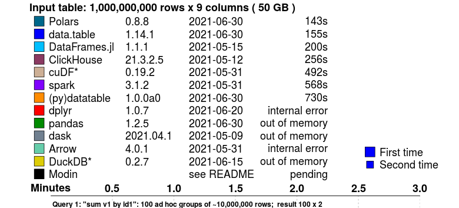

> Credit Par File:ZL-Ursus-maritimus.pngFile:Polar bear range map.png, CC BY-SA 3.0, https://commons.wikimedia.org/w/index.php?curid=17286219

Le concept de [_dataframe_](https://www.databricks.com/glossary/what-are-dataframes) est central pour le _data scientist_ qui manipule des données tabulaires.
En `Python`, [`Pandas`](https://pandas.pydata.org/) est la solution de loin la plus populaire. En moyenne, le _package_ est téléchargé
4 millions de fois par semaine, depuis des années. 

Un petit nouveau apporte un vent de fraîcheur dans le domaine : [`Polars`](https://www.pola.rs/).

Ses atouts ? D'excellentes performances et une expressibilité qui le rapproche d'un [`dplyr`](https://dplyr.tidyverse.org/).

# Performances

Les _benchmarks_ disponibles [sont clairs](https://h2oai.github.io/db-benchmark/) : `Polars` est
un ours qui cours vite !
Ce benchmark, [proposé par H2O](https://h2oai.github.io/db-benchmark/), propose
un comparatif de la vitesse des principaux frameworks de manipulation de données
pour effectuer une agrégation par groupe avec un jeu de données de 50GB:



`Polars` devance des solutions connues pour leur efficacité sur ce type d'opérations, 
comme le package `R` `data.table`. L'utilisateur habituel de `Pandas`
ne pourrait même pas traiter ses données, qui excèdent les capacités computationnelles
de sa machine.

## L'évaluation _lazy_

Plusieurs éléments expliquent cette rapidité.

En premier lieu, `Polars` est conçu pour optimiser les requêtes :
grâce au mode _lazy_ ("paresseux"), on laisse la possibilité au moteur d'analyser ce qu'on souhaite faire pour proposer une exécution optimale (pour la lecture comme pour la transformation des jeux de données).
La _lazy evaluation_ est une méthode assez commune pour améliorer la vitesse
des traitements et est utilisée, entre autres, par `Spark` ou par `Arrow`.

La _lazy evaluation_ permet, par exemple, si un filtre sur les lignes arrive 
tardivement, de le remonter dans l'ordre des opérations effectuées par `Python`
pour que
les opérations ultérieures ne soient effectuées que sur
l'ensemble de données optimal.
Ces optimisations sont détaillées dans la [documentation officielle](https://pola-rs.github.io/polars-book/user-guide/optimizations/intro.html). 

L'utilisateur `Pandas` est habitué à lire du CSV avec `pd.read_csv`. 
Avec `Polars`, il existe deux manières, très ressemblantes. 

```python
import polars as pl

# Création d'une requête
q = (
    pl.scan_csv("iris.csv") # Lecture lazy
    .filter(pl.col("sepal_length") > 5)
    .groupby("species")
    .agg(pl.all().sum())
)

# Exécution de la requête
df = q.collect()
```

Avec cette syntaxe, les connaisseurs de `Pyspark` retrouveront facilement leurs petits (ours). 

On peut toujours lire de manière plus directe (en mode _eager_, "impatient") en utilisant la fonction `read_csv`, et ensuite appliquer des transformations optimisables en glissant habilement `lazy` :

```python
df = pl.read_csv("iris.csv")

df_res = df.lazy() # ←  ici :)
  .filter(pl.col("sepal_length") > 5)
  .groupby("species")
  .agg(pl.all().sum())
  .collect()
```

## Parallélisation

`Polars` parallélise les traitements dès que cela est possible, notamment dans le cas d'aggrégation.
Chaque coeur se charge d'une partie de l'agrégation et envoie des données plus légères à `Python`
qui va finaliser l'agrégation


Sur les systèmes proposant de nombreux coeurs, cela peut faire gagner beaucoup de temps.

## Des couches basses à la pointe

Enfin, le choix d'utiliser à la fois le format de représentation en mémoire [Arrow](https://arrow.apache.org/) et le langage [Rust](https://www.rust-lang.org/fr) pour le coeur de la bibliothèque n'est pas étranger à cette performance.

## Calculs _out of memory_

`Polars` travaille vite mais présente aussi l'avantage
de lire naturellement des jeux de données hors des limites de la mémoire de l'ordinateur grâce à [sa capacité de lire en flux](https://www.youtube.com/watch?v=3-C0Afs5TXQ) (a.k.a _streaming_)


```python
# La même requête que tout à l'heure va lire le fichier "en flux"
df = q.collect(streaming=True)
```

De plus, `Polars` lit nativement les fichiers `Parquet` qui par ses propriétés
permet d'aller beaucoup plus vite que le CSV !

# API fluide

C'est un reproche régulièrement fait à Pandas : la syntaxe de manipulations des données est parfois complexe ou peu lisible, et les choix d'écriture ne sont pas transparents du point de vue des performances.

L'API proposée par Polars est à la fois expressive et transparente. Un exemple d'exploitation de la BPE :

```python
df.lazy()
  .filter(
    pl.col("TYPEQU") == "B316"
  )
  .groupby("DEP")
  .agg(
    pl.count().alias("NB_STATION_SERVICE")
  )
  .collect()
```

On retrouve une sémantique d'opérations de haut niveau qui s'enchaînent à la manière de [ce que l'on peut faire en `dplyr`](https://www.book.utilitr.org/03_fiches_thematiques/fiche_tidyverse#comment-utiliser-lop%C3%A9rateur-pipe-avec-le-tidyverse). ;)

# D'autres concurrents

`Pandas` et `Polars` ne sont pas seuls dans le grand zoo de la manipulation de données en Python : des solution comme [Vaex](https://github.com/vaexio/vaex) ou [Dask](https://github.com/dask/dask) ont des arguments à
faire valoir. 
`DuckDB`, un autre _framework_ de manipulation de données, s'intègre quand à lui très bien
avec  `Polars` dans la ménagerie.


_Le duo DuckDB-Polars illustré par Dall-E-2_

# Ressources

- notebook sur le datalab
- https://www.rhosignal.com/tags/polars/
- https://kevinheavey.github.io/modern-polars/