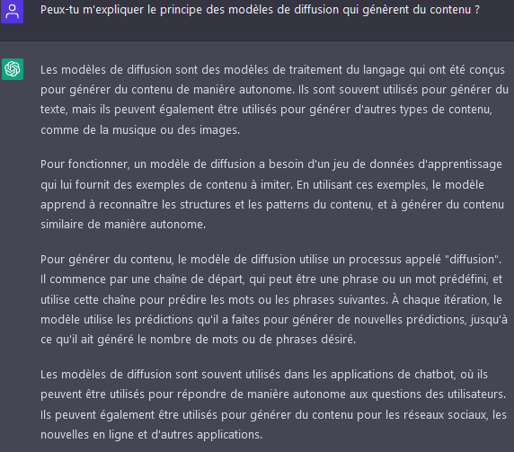

La fin de l'année est généralement synonyme de
bétisiers, _best of_ ou
rétrospectives personnalisées qui nous permettent
de nous rappeler les événements marquants de l'année.
Pour célébrer la fin de l'année 2022, cette _newsletter_
adopte un format un peu spécial pour
proposer deux rétrospectives: une rétrospective
des principaux événements de l'année 2022 dans le monde de
la _data science_ et une rétrospective chiffrée sur le
réseau des data scientists de la statistique publique.

# Retour sur l'année de la data science 

## Les IA créatrices de contenu à l'honneur

Si l'année 2022 a été particulièrement riche dans le domaine
de la _data science_, c'est principalement grâce à deux coups
médiatiques d'[OpenAI](https://openai.com/),
à savoir [`Dall-E`](https://openai.com/dall-e-2/)
et [`chatGPT`](https://openai.com/blog/chatgpt/). 

Ces deux outils ont
beaucoup fait parlé d'eux, au-delà
de la sphère traditionnelle de la _data science_.
Le _buzz_ a été intense sur `Twitter`, racheté en fin d'année par Elon Musk,
ou sur `Mastodon`, 
le réseau social qui a connu, en réaction,
une croissance importante de son nombre d'utilisateurs.

Cependant, ces innovations, parce qu'elles pourraient
avoir des effets à long terme sur la manière dont le grand public
appréhende l'intelligence artificielle, 
ont beaucoup intéressé les médias traditionnels, notamment [_The Economist_ et sa _"Nouvelle Frontière"_](https://www.economist.com/news/2022/06/11/how-a-computer-designed-this-weeks-cover) ou [le _Guardian_ qui s'interroge](https://www.theguardian.com/commentisfree/2022/dec/10/i-wrote-this-column-myself-but-how-long-before-a-chatbot-could-do-it-for-me)).

Pour une fois, il ne s'agit pas de souligner 
exclusivement les limites de ces modèles voire leurs
dérives ([_deep fake_](https://fr.wikipedia.org/wiki/Deepfake),
[biais racistes](https://www.washingtonpost.com/technology/2022/07/16/racist-robots-ai/)...) mais aussi
de s'enthousiasmer sur
leur [potentiel créatif](https://www.platformer.news/p/how-dall-e-could-power-a-creative).
Il est difficile de rester insensible à certaines des créations
artistiques des modèles [`Dall-E`](https://dalle2.gallery/#search-random), [`Stable Diffusion`](https://stablediffusion.fr/gallery), [Midjourney](https://www.midjourney.com/showcase/recent/) et consorts
ou de résister à la tentation de piéger
`chatGPT` en lui posant des questions auquel il ne parviendrait
pas à répondre.
Les chercheurs, et pas des moindres (notamment [Andrew Ng](https://twitter.com/andrewyng/status/1600284752258686976?lang=fr) ou [Gaël Varoquaux](https://theconversation.com/beau-parleur-comme-une-ia-196084)) se sont également saisis de cette question et ont
souligné
les biais de raisonnement et excès de confiance de ces IA. 

## Le succès des modèles de diffusion

Ces [IA génératrices de contenu](https://pub.towardsai.net/generative-ai-and-future-c3b1695876f2) reposent toutes, à plusieurs niveaux, sur
des réseaux de neurone.

Le premier étage de la fusée est
un [modèle de langage (_large language model_)](https://en.wikipedia.org/wiki/Language_model)
qui synthétise un langage en un ensemble complexe de paramètres. 
Les plus connus sont [BERT](https://en.wikipedia.org/wiki/BERT_(language_model))
et [GPT-3](https://fr.wikipedia.org/wiki/GPT-3). 
L'inflation dans le nombre de paramètres n'est pas prête de s'arrêter.
Si les ressources nécessaires à entraîner en 2018 le modèle BERT (110 millions de paramètres)
avaient déjà [été critiquées](https://arxiv.org/abs/1906.02243), cette complexité
apparaît déjà dépassée. Le modèle GPT-3, sorti en 2020, et qui sert de base à
`Dall-E` et `chatGPT` intègre 175 millions de paramètres. Un chiffre qui apparaît minime
par rapport aux 17O trillions de paramètres attendus pour le modèle GPT4 en 2023.

Le deuxième étage de la fusée est un modèle d'analyse d'image qui apprend à associer
des images à une description textuelle afin de détecter des structures communes entre
des mots ou des séquences de mots et des formes sur des images. 
Ensuite, pour générer une image à partir d'une description inédite intervient
le [modèle de diffusion](https://en.wikipedia.org/wiki/Diffusion_model).
L'une des explications les plus pédagogiques
pour comprendre le fonctionnement de ces modèles 
vient du [_Washington Post_](https://www.washingtonpost.com/technology/interactive/2022/ai-image-generator/). Sinon, on peut demander directement à `chatGPT` de nous expliquer:

## L'actualité dans le monde du _deep learning_

Si le succès d'estime de ces IA génératrices consacre les modèles de 
diffusion, l'année du _deep learning_ ne se réduit pas à cette actualité.

L'année a notamment été marquée par la compétition
entre les librairies et
écosystèmes [`TensorFlow`](https://www.tensorflow.org/?hl=fr), développé par
`Google`, et [`PyTorch`](https://pytorch.org/) projet initié par `Facebook/Meta`. 
`PyTorch`, plus récent, bénéficie d'une dynamique plus ascendante que `TensorFlow`.
Le [succès d'`HuggingFace`](https://twitter.com/huggingface/status/1609162974626779136?s=20&t=XUCGBC_PL60IdHjia8wXNA),
où les [implémentations `PyTorch` sont systématiques alors que celles en `TensorFlow` sont rares](https://www.assemblyai.com/blog/pytorch-vs-tensorflow-in-2022/#pytorch-vs-tensorflowmodel-availability) a participé à la diffusion de `PyTorch`. 

Preuve du succès de `PyTorch`, cet écosystème [est géré depuis septembre par la `Linux Foundation`](https://www.linuxfoundation.org/blog/blog/welcoming-pytorch-to-the-linux-foundation) et
non plus par `Meta`. A l'inverse,
[`Google` semble se détacher graduellement de `TensorFlow` pour privilégier son nouvel écosystème `JAX`](https://twitter.com/ylecun/status/1538419932475555840). 

<!-----
- pytorch dans linux foundation
- tensorflow abandonné par google

- quarto
- rstudio -> posit
- observable + duckdb
- IA: rapport conseil d'Etat: https://www.conseil-etat.fr/content/download/175739/file/Etude%20%C3%A0%20la%20demande%20du%20PM%20-%20IA%20et%20action%20publique.pdf + UNECE Adasmm
- plate-forme dataviz de l'ONS sur les résultats du census qui est hyper bien faite
- onyxia
- Ryanair v lastminute.com, j’ai grossièrement résumé le cas page 85 dans le support
- Twitter Elon
- Data scientist 10 ans après
------->
