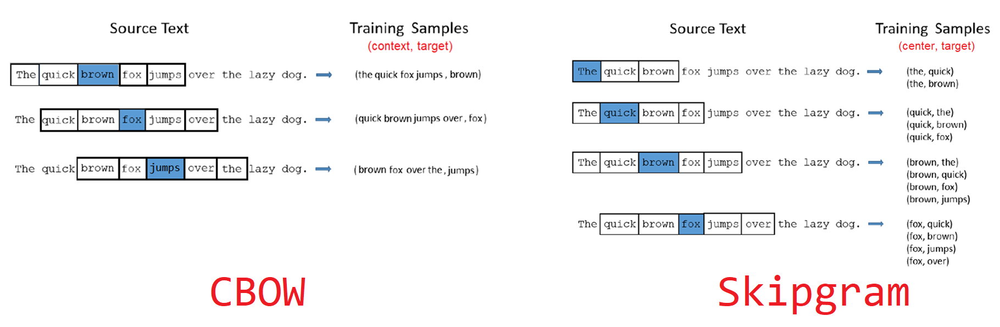
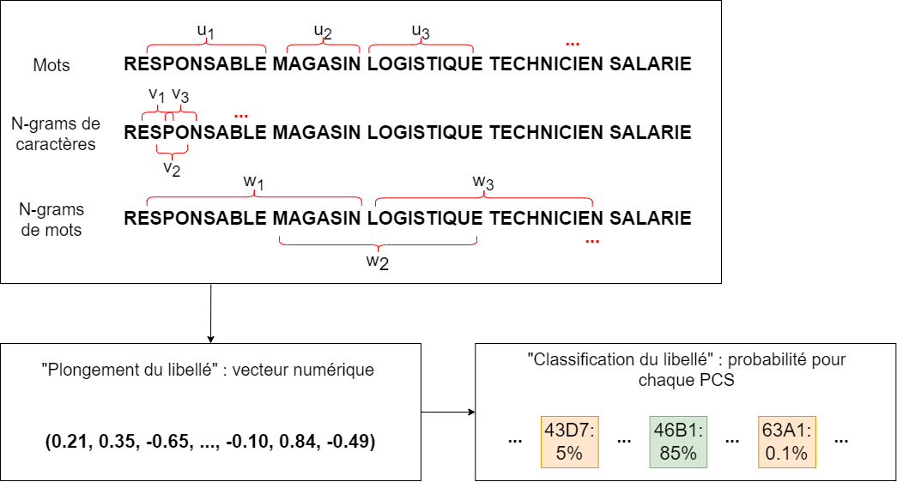
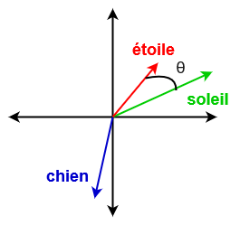

Les données textuelles constituent une source extraordinaire d’informations,
que ce soit sous la forme d’e-mails, de réponses à des enquêtes ou encore de commentaires sur les réseaux sociaux.
Dans la statistique publique, et à l’`Insee` notamment,
une problématique récurrente est de classer des libellés (professions, noms de produits, etc.) dans des nomenclatures
standardisées (PCS[^1], NAF[^2]...). 

[^1]: La nomenclature `PCS` (professions et catégories socioprofessionnelles)
sert à la codification des professions dans le recensement et les enquêtes auprès des ménages. 
Elle permet ainsi de classer un ensemble de professions dans une même catégorie. Par exemple,
dans sa dernière version ([PCS 2020](https://www.insee.fr/fr/information/6205305)),
la catégorie des _"Professions libérales de santé"_ (31A) regroupe diverses professions médicales: médecins libéraux, dentistes, psychologues, véterinaires, pharmaciens libéraux... Une description plus
complète de cette nomenclature et de son historique est disponible sur [le site de l'Insee](https://www.insee.fr/fr/information/6208292)

[^2]: La `NAF` (nomenclature d'activités française), est une nomenclature des activités économiques productives,
principalement élaborée pour faciliter l'organisation de l'information économique et sociale. Il s'agit d'une
typologie facilitant la représentation de l'économie sous forme de secteurs. Par exemple, au sein de l'industrie
manufacturière (section C), la NAF distingue les industries alimentaires de l'industrie de l'habillement
ou de l'industrie automobile.
Une description plus
complète de cette nomenclature et de son historique est disponible sur [le site de l'Insee](https://www.insee.fr/fr/information/2406147)

Avec la collecte automatisée d'information numérique, les données textuelles sont devenues 
de plus en plus communes. Les méthodes de traitement automatisé du langage, plus connues sous l'acronyme
`NLP` (acronyme de _natural langage processing_), sont devenues un champ de recherche très actif
pour proposer des solutions génériques
permettant de traiter ces corpus très peu structurés et très 
hétérogènes de données. 

Il existe une difficulté avec ce type de données : __le langage naturel n'a pas de sens pour un ordinateur !__
Un algorithme ne travaille qu'avec des nombres. Il faut donc d'abord transformer l'information pour la rendre compréhensible par une machine.
Il existe principalement deux approches pour cela :

*   le [sac de mots (_bag of words_)](#bag-of-words),
*   le [plongement lexical(_word embedding_)](#embedding).

# Traiter un texte comme une information numérique: les approches possibles

## L'approche _bag of words_ {#bag-of-words}

Le principe du _bag of words_ est qu'on peut décrire un document comme
un dictionnaire de mots dans lequel on pioche plus ou moins fréquemment
un terme en fonction de son nombre d'occurrence. 

La manière la plus simple de transformer des phrases ou des
libellés textuels en une information numérique est de passer
par un objet que l’on appelle la __matrice document-terme__.
L’idée est de compter le nombre de fois où les
mots (les termes) sont présents dans chaque phrase ou libellé (le document).

Considérons un corpus constitué des trois phrases suivantes :

*   _"La pratique du tricot et du crochet_"
*   _"Transmettre la passion du timbre"_
*   _"Vivre de sa passion"_

La matrice document-terme associée à ce corpus est la suivante :

|                                     | crochet | de | du | et | la | passion | pratique | sa | timbre | transmettre | tricot | vivre |
| ----------------------------------- | :-------: | :--: | :--: | :--: | :--: | :-------: | :--------: | :--: | :------: | :-----------: | :------: | :-----: |
| La pratique du tricot et du crochet | 1       | 0  | 2  | 1  | 1  | 0       | 1        | 0  | 0      | 0           | 1      | 0     |
| Transmettre sa passion du timbre    | 0       | 0  | 1  | 0  | 0  | 1       | 0        | 1  | 1      | 1           | 0      | 0     |
| Vivre de sa passion                 | 0       | 1  | 0  | 0  | 0  | 1       | 0        | 1  | 0      | 0           | 0      | 1     |

__Mission accomplie !__ :tada:
Chaque phrase du corpus est associée à un vecteur numérique.

Il est maintenant possible de manipuler cette matrice comme des données tabulaires classiques. Par exemple, pour classer ces phrases dans des catégories, on pourrait appliquer l’un des algorithmes usuels de _machine learning_ pour les tâches de classification (régression logistique, forêt aléatoire, _gradient boosting_, etc.).

Cependant, même si cette représentation via la matrice document-terme répond au besoin initial de transformer les données, un autre type de représentation se place souvent comme une meilleure option : le plongement lexical. L'approche _bag-of-words_ ne permet en effet pas
de distinguer des différences de nature entre des termes: on peut compter les occurrences de certains, mais on ne peut distinguer
la similarité entre _'tricot"_ et _"crochet"_.

## Le plongement lexical {#embedding}

Le plongement lexical (_word embedding_ en anglais)
consiste à représenter chaque mot par un vecteur de taille fixe,
de façon à ce que deux mots dont le sens est proche possèdent des représentations numériques proches. Ainsi les mots « chat » et « chaton » devraient avoir des vecteurs de plongement assez similaires, eux-mêmes également assez proches de celui du mot « chien » et plus éloignés de la représentation du mot « maison ».

 Illustration du plongement lexical. Source : Post de blog <a href="https://medium.com/@hari4om/word-embedding-d816f643140" target="_blank">Word Embedding : Basics</a>
  &nbsp;

Chaque composante va encoder des informations différentes, comme le fait d’être un être vivant, le genre, l’âge, le niveau d’abstraction, etc.. En pratique, les vecteurs de plongements ont quelques dizaines voire quelques centaines de composantes et il est impossible d’associer à chacune un concept clair : toutes les notions s’entremêlent, mais chaque composante à un rôle à jouer. 

Le plongement lexical possède deux avantages par rapport à l’approche _bag of words_ :

*   Il fournit une représentation dense, plus adaptée aux algorithmes d’apprentissage statistique que la matrice creuse (contenant beaucoup de zéros) de l’approche _bag of words_ ;
*   Les opérations mathématiques ont un sens sur les vecteurs du plongement.

Il devient en effet possible de faire des mathématiques avec les mots. Ainsi par exemple, les vecteurs résultant de la différence entre les représentations des mots « femme » et « homme » d’une part, et des mots « reine » et « roi » d’autre part, devraient être proches, car conceptuellement ces couples de mots sont régis par la même relation : un changement de genre.

Cette formule, souvent résumée sous la forme, 

$$\text{king} - \text{man} + \text{woman} ≈ \text{queen}$$

a assuré le succès des _embedding_. 

Jusqu’ici, nous avons parlé du plongement de mots, mais comment obtenir le plongement d’un libellé textuel ? Une possibilité est de considérer tous les mots qui composent le libellé et de calculer la moyenne de leurs vecteurs de plongement.

# Construction d’un plongement lexical

Un plongement lexical se construit en parcourant un grand corpus de textes et en repérant les mots qui apparaissent souvent dans le même contexte. L'ensemble des articles `Wikipedia` est un des corpus de prédilection des personnes ayant construit des plongements
lexicaux. Il comporte en effet des phrases complètes, contrairement à des informations issues de commentaires de réseaux sociaux, 
et propose des rapprochements intéressants entre des personnes, des lieux, etc.

Le contexte d’un mot est défini par une fenêtre de taille fixe autour de ce mot. La taille de la fenêtre est un paramètre de la construction de l’_embedding_. Le corpus fournit un grand ensemble d’exemples mots-contexte, qui peuvent servir à entraîner un réseau de neurones.

Plus précisément, il existe deux approches :

*   _Continuous bag of words_ (CBOW), où le modèle est entraîné à prédire un mot à partir de son contexte ;
*   _Skip-gram_, où le modèle tente de prédire le contexte à partir d’un seul mot.

 Illustration de la différence entre les approches CBOW et Skip-gram. Source : Anwarvic sur  <a href="https://stackoverflow.com/questions/57507056/difference-between-max-length-of-word-ngrams-and-size-of-context-window" target="_blank">StackOverflow</a>
  &nbsp;

## Algorithmes célèbres

La méthode de construction d’un plongement lexical présentée ci-dessus est celle de l’algorithme [`Word2Vec`](https://fr.wikipedia.org/wiki/Word2vec).
Il s’agit d’un modèle _open-source_ développé par une équipe de `Google` en 2013.
`Word2Vec` a été le pionnier en termes de modèles de plongement lexical.

Le modèle [`GloVe`](https://nlp.stanford.edu/projects/glove/) constitue un autre exemple[^3]. Développé en 2014 à Stanford,
ce modèle ne repose pas sur des réseaux de neurones mais sur la construction d’une grande matrice de co-occurrences de mots. Pour chaque mot, il s’agit de calculer les fréquences d’apparitions des autres mots dans une fenêtre de taille fixe autour de lui. La matrice de co-occurrences obtenue est ensuite factorisée par une décomposition en valeurs singulières. Un autre plongement celèbre est le 
modèle `BERT` développé par `Google` en 2019 dont il existe des déclinaisons dans différentes langues, notamment en Français (les
modèles [`CamemBERT`](https://camembert-model.fr/) ou [`FlauBERT`](https://github.com/getalp/Flaubert))

[^3]: Jeffrey Pennington, Richard Socher, and Christopher D. Manning. 2014. GloVe: Global Vectors for Word Representation

Enfin, le modèle [`FastText`](https://fasttext.cc/), développé en 2016 par une équipe de `Facebook`, fonctionne de façon similaire à `Word2Vec` mais se distingue particulièrement sur deux points :

*   En plus des mots eux-mêmes, le modèle apprend des représentations pour les n-grammes de mots (sous-séquences de caractères de taille \\(n\\), par exemple _« tar »_, _« art »_ et _« rte »_ sont les trigrammes du mot _« tarte »_), ce qui le rend notamment robuste aux variations d’orthographe ;
*   Le modèle a été optimisé pour que son entraînement soit particulièrement rapide.

A `l’Insee`, plusieurs modèles de classification de libellés textuels dans des nomenclatures reposent sur l’algorithme de plongement lexical [`FastText`](https://fasttext.cc/). 

 
 Illustration du fonctionnement du modèle fastText sur un libellé de profession
  &nbsp;

## Comment utiliser ces modèles en pratique ? 

Collecter à nouveau les données ayant servi à entrainer un modèle puis le
ré-entraîner implique énormément de ressources, ce qui est coûteux
en temps et peu écologique[^4]

[^4]: Strubell, Ganesh, and McCallum (2019)
estiment que l’entraînement d’un modèle à l’état de l’art dans le domaine du NLP
nécessite autant d’énergie que ce que consommeraient cinq voitures, en moyenne,
au cours de l’ensemble de leur cycle de vie.

En `Python`, plusieurs librairies proposent les modèles `Word2Vec`, `GloVe`, `BERT` ou `FastText`. 
Le [package `gensim`](https://radimrehurek.com/gensim/)
les met toutes en œuvre à l'exception de `BERT`. Ce dernier est disponible
sur [`HuggingFace`](https://huggingface.co/docs/transformers/model_doc/bert), la principale plateforme
de mise à 
disposition de modèles pré-entraînés. Il est ainsi possible d'utiliser `BERT` avec
les librairies [`PyTorch`](https://pytorch.org/hub/huggingface_pytorch-transformers/) ou [`Keras`](https://keras.io/examples/nlp/text_extraction_with_bert/). 
Chacun des modèles présentés possède également son package dédié, généralement développé par l'équipe de recherche
ayant entraîné le modèle.

En `R`, il faut utiliser les packages `word2vec`, `text2vec` (pour le modèle GloVe) et `fastTextR`.

# Bonus : le plongement lexical en version ludique

Le résultat d’un plongement lexical peut avoir de nombreux usages.
Il rend notamment possible le calcul de la proximité entre deux mots quelconques.

Une manière de procéder est de calculer la similarité cosinus entre les vecteurs de plongement des deux mots. Plus précisément, la similarité entre deux mots de représentations vectorielles \\(u\\) et \\(v\\) est définie comme le cosinus de leur angle \\( \theta \\) : $$cos(\theta) = \frac{u \cdot v}{\lVert u\rVert \lVert v\rVert}$$

 
 Illustration du fonctionnement du modèle fastText sur un libellé de profession
  &nbsp;

Le calcul de la proximité entre les mots est à la base du jeu [cemantix](https://cemantix.herokuapp.com/).
Le principe est proche du `Wordle` mais s'en distingue sur un point : il y a certes un mot à trouver chaque jour et il s’agit de faire des propositions de mots mais le jeu répond en donnant la proximité entre les mots proposés et le mot du jour. Ainsi, au fil des propositions, on a une vision de plus en plus précise du champ lexical associé au mot mystère, jusqu’à finalement le trouver.
