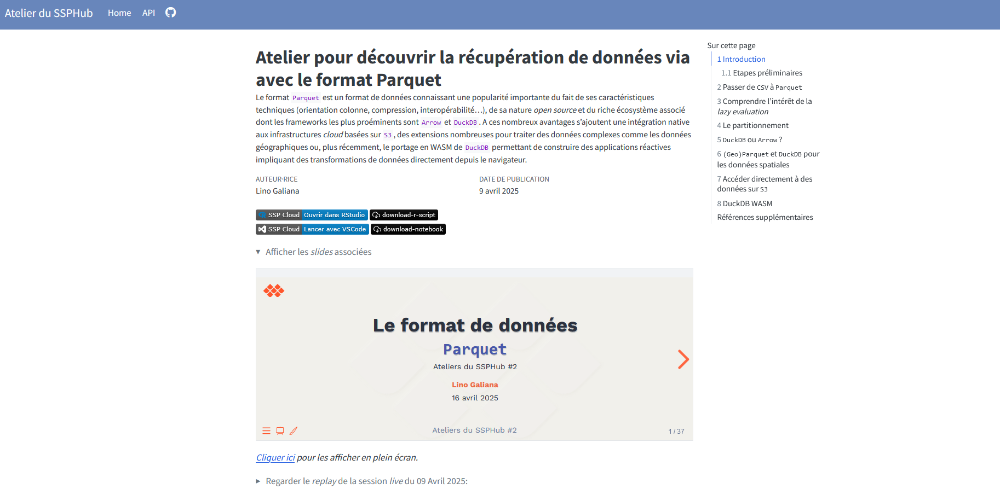

L'atelier a eu lieu le __16 avril 2025 (15h - 16h30)__, en présentiel à l'Insee et en distanciel pour les membres du réseau du SSP Hub. Environ 35 personnes ont participé de l'Insee (DG ou directions régionales), de différents services statistiques ministériels ou d'autres horizons. Merci à tous pour les échanges ! 

# Slides de la présentation
```{=html}
<div>
<iframe class="slide-deck" style="width: 100%; height: 500px" src="https://inseefrlab.github.io/ssphub-ateliers-slides/slides-data/parquet#/title-slide"></iframe>
</div>
```

```{ojs}
html`${slides_button}`
```


```{ojs}
slides_button = html`<p class="text-center">
  <a class="btn btn-primary btn-lg cv-download" href="https://inseefrlab.github.io/ssphub-ateliers-slides/slides-data/parquet#/title-slide" target="_blank">
    <i class="fa-solid fa-file-arrow-down"></i>&ensp;Voir les slides
  </a>
</p>`
```

# Documentation de l'atelier & _replay_
Le matériel lié à l'atelier, y compris le replay, est disponible [ici](https://ssphub.github.io/ssphub-ateliers-parquet/){target="_blank"}.


# Questions / contact
Si vous avez la moindre question 🤨, n'hésitez pas à contacter 📧 __.