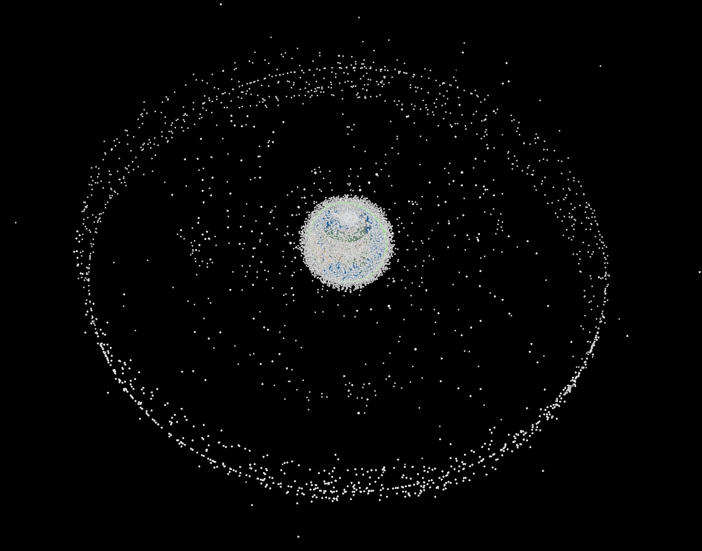

# Bienvenue à la **vingt quatrième infolettre** !

C'est le printemps ! Le temps est bon, il fait [41,6°C en Californie avant même la fin de l'hiver](https://www.rtl.be/actu/monde/international/jusqua-416degc-avant-meme-la-fin-de-lhiver-une-vague-de-chaleur-extreme-frappe/2026-03-19/article/783199).

Bienvenue à cette infolettre, coécrite avec **Mélina** ❤️.

# L'infographie

Qu'il est difficile de choisir une seule infographie.
Pour ce mois-ci, c'est finalement une vidéo de tous les lancements de fusée dans l'espace depuis 1957 (ne pas avoir peur de tout ce qu'il y a là haut).
Attention, grand final pour l'année 2025 !


*Source : données recueillies par Jonathan McDowell et disponibles sur [https://planet4589.org](https://planet4589.org), infographie faite par [Peter Atwood](https://peteratwoodprojects.wordpress.com/) et explications aussi [ici](https://www.linkedin.com/posts/peter-atwood-60b9ba18a_cartography-gis-blender3d-ugcPost-7422329412764770305-jgGI/).*

Le site [satellitetracker](https://satellitetracker3d.com/) permet par ailleurs de suivre l'ensemble des quelques 12 000 satellites qui gravitent autour de la Terre.
Et cela en fait un petit nombre autour de la planète bleue grise ...

# Les prochains évènements du réseau

Une foison d'événements et d'informations ce mois-ci. Pour résumer :

- Un nouvel **Open Science Meet-up** à propos des *replication packages* en économie le **2 avril 2026** - [lien](https://insee-fr.zoom.us/j/96879320424?pwd=JwbRv0BRGHtpzijofpph6UHStnV5gO.1) ;
- un atelier du réseau sur la **génération de commentaires de graphique par LLM** le **mardi 14 avril 2026 à 10h** - [lien](https://visio.numerique.gouv.fr/wvv-cwou-ugn) ;
- un appel à contribution pour la conférence uRos du **18 au 20 novembre 2026** à Paris.

## Génération de commentaire de graphiques : retour d'expérience sur les statistiques agricoles et pistes d'amélioration - 📅 mardi 14 avril 14h, Paris (DG Insee) et visio

Le SSM Agriculture essaye de générer par LLM des commentaires sur l'évolution d'indicateurs agricoles à partir de graphiques. Si l'approche semblait prometteuse pour produire un premier jet que les analystes pourraient ensuite affiner, un point d'étape a mis en évidence des limites importantes (erreurs fréquentes sur les valeurs numériques, inversions de tendances, comparaisons incorrectes entre territoires ...).

Dans le cadre d'un travail de recherche, un étudiant de l'Ecole polytechnique a travaillé à rendre plus robuste cette expérimentation sous la supervision d'une chercheuse de l'INRIA. Il a ainsi mis en place un **cadre d'analyse pour quantifier les erreurs et proposé des améliorations pour répondre aux défauts identifiés**.

**Ils nous présenteront ainsi leurs travaux le mardi 14 avril à 14h**, en [visio](https://visio.numerique.gouv.fr/wvv-cwou-ugn) et en présentiel à l'Insee (en salle 4C-458). La présentation devrait durer 30 minutes. Tout le monde est le bienvenu !

Si vous voulez l'ajouter dans votre agenda, voici une [invitation agenda](https://minio.lab.sspcloud.fr/ssphub/diffusion/website/2026-04-ssmagri/202604_generationtxtgraphique.ics).

Les mises à jour seront faites sur la [page de l'événement](../../talk/2026-04-ssm-agri/index.qmd).

## *Replication packages* en économie - Open science Meet-up - 📅 jeudi 2 avril 2026 13h30, visio

Le prochain Open Science Meet-up de l'Insee portera sur le thème : **Replication packages en économie : préparation, bonnes pratiques et attentes des revues, surtout lorsque les données sont confidentielles.**

Pour s'assurer de la reproducibilité d'une analyse publiée, de nombreuses revues demandent désormais aux auteurs de fournir un *replication package*, c'est-à-dire l'ensemble des données, du code et de la documentation.

Lors de ce Meet-Up, [Lars Vilhuber](https://www.ilr.cornell.edu/people/lars-vilhuber) (Cornell University), *data editor* à l'*American Economic Association*, présentera les principes et les bonnes pratiques associés à la préparation et à la diffusion des *replication packages*. Il reviendra notamment sur les exigences croissantes des revues scientifiques, les standards qui se développent dans la communauté économique et les enjeux de la reproductibilité des travaux empiriques.

Cette rencontre sera l'occasion d'échanger sur la manière dont ces pratiques contribuent au **développement d'une recherche plus transparente et plus ouverte**, en particulier dans les domaines de l'analyse économique et statistique.

Elle s'adresse à toutes celles et ceux qui souhaitent mieux comprendre les enjeux de la reproductibilité des analyses économiques et de la diffusion ouverte des travaux de recherche.

**Rendez-vous le jeudi 2 avril de 13h30 à 14h15 en distanciel à ce [lien](https://insee-fr.zoom.us/j/96879320424?pwd=JwbRv0BRGHtpzijofpph6UHStnV5gO.1)**.

## Contribuez à la conférence sur l'utilisation de R dans la statistique publique (uROS) - 📅 18-20 novembre 2026, Paris

L'Insee accueille l'édition 2026 de la **conférence uRos (use of R in official statistics)** les **18, 19 et 20 novembre 2026** au centre Pierre-Mendès France, à Bercy.

Cette rencontre annuelle des **utilisateurs de R en Europe et dans le monde** sera l'occasion de valoriser les nombreux investissements en R faits à l'Insee et au sein du SSP. La liste des thèmes ainsi que toutes les informations pratiques sont en ligne  sur le [site de la conférence](https://r-project.ro/conference2026_FR.html).

Si vous souhaitez y **assister**, vous pouvez d'ores et déjà vous inscrire [en ligne](https://uros2026.sciencesconf.org/registration?lang=fr).

Si vous souhaitez **contribuer**, l'appel à contribution va bientôt ouvrir jusqu'au **15 juin** sur le site de la conférence. Vous pourrez soumettre :

(i) une présentation classique de 15 minutes ;
(ii) une présentation flash de 5 minutes ;
(iii) un tutoriel d'environ 2 heures.

N'hésitez pas à contacter directement l'organisation de l'événement sur [uros2026@insee.fr](mailto:uros2026@insee.fr).

# Actualités

## Données tabulaires: le deep learning est-il devenu une alternative crédible aux méthodes de boosting ?

[Ce billet](https://m-clark.github.io/posts/2026-03-01-dl-for-tabular-foundational/) de blog explique que, si le boosting reste une valeur sûre, plusieurs modèles récents - qu'il s'agisse de deep learning "classique" ou de modèles de [fondation](https://arxiv.org/abs/2108.07258) - deviennent désormais **réellement compétitifs**. L'émergence de benchmarks plus rigoureux et de nouveaux outils facilite par ailleurs la comparaison et la prise en main de ces nouveaux modèles. **Le principal frein reste toutefois le passage à l'échelle sur les très grands jeux de données**, qui limite encore leur adoption.

Et pour les séries temporelles ? Le constat est [proche](https://berts-workshop.github.io/): les modèles de fondation progressent, mais les approches plus classiques restent très compétitives, et le principal enjeu est encore celui de l'évaluation, les résultats étant contrastés selon les benchmarks.

## Des pistes intéressantes pour la recherche documentaire

Le projet [PageIndex](https://github.com/VectifyAI/PageIndex) explore une approche de recherche documentaire sans base vectorielle, fondée sur une indexation hiérarchique des documents et une navigation par grand modèle de langage (LLM). Au lieu de découper le texte en _chunks_ (des segments de texte issus du découpage d'un document) puis de faire une recherche par similarité dans une base vectorielle (c'est la méthode du [RAG](https://arxiv.org/abs/2005.11401) classique), l'outil transforme un **document long en un arbre hiérarchique** - une sorte de table des matières enrichie pour les LLM - puis s'appuie sur cette structure pour guider la recherche des passages pertinents. L'objectif est de mieux traiter les **documents longs et structurés**, pour lesquels une simple recherche par similarité sur des _chunks_ peut manquer de précision ou de contexte. L'approche est prometteuse et a l'intérêt de rendre le parcours de recherche plus lisible et plus traçable.

Ce [billet](https://www.anthropic.com/engineering/contextual-retrieval) d'Anthropic sur le Contextual Retrieval propose une approche pour **améliorer la recherche documentaire par RAG classique**. L'idée est de conserver le schéma habituel (_chunks_, _embeddings_, [BM25](https://en.wikipedia.org/wiki/Okapi_BM25)) mais d'ajouter à chaque _chunk_ un court contexte explicatif généré à partir du document complet, afin d'éviter qu'un passage isolé perde les informations qui lui donnent son sens. Le billet indique que cette contextualisation réduit de 49 % les échecs de _retrieval_, et jusqu'à 67 % lorsqu'on y ajoute une étape de _reranking_. Le billet rappelle aussi un point utile : pour des bases documentaires "modestes" (moins de 200 000 _tokens_, soit environ 500 pages), il peut être plus simple de mettre directement tout le corpus dans le prompt, sans passer par l'étape RAG.

## dbt + DuckDB: structurer ses pipelines SQL avec une infrastructure légère

Les outils [dbt + DuckDB](https://rmoff.net/2026/02/19/ten-years-late-to-the-dbt-party-duckdb-edition) permettent de **professionnaliser des traitements analytiques locaux**. [DuckDB](https://duckdb.org/) fournit un moteur SQL très rapide pour interroger et transformer des données, y compris directement depuis des fichiers Parquet. [dbt](https://www.getdbt.com/) permet quant à lui d'ajouter une couche d'organisation : il aide à découper les traitements en étapes claires (sources, _staging_, tables finales), à gérer les dépendances entre modèles, à documenter les transformations, à tester la qualité des données etc. En d'autres termes, **dbt fournit une méthode pour transformer une collection de scripts SQL en pipeline** plus lisible, plus reproductible et plus maintenable.

# Pour aller plus loin / se former

## Apprendre avec l'IA

Utiliser l'IA pour apprendre, et pas seulement pour accélérer la production de code ? Le **dépôt [Learning Opportunities](https://github.com/DrCatHicks/learning-opportunities)** propose un plugin pour Claude Code qui déclenche de courts exercices de 10 à 15 minutes afin d'éviter l'illusion de compréhension que peuvent créer les assistants de code. Une approche intéressantes pour ceux qui souhaitent (continuer à) **se former à l'heure du coding assisté par IA**.

## MicroGPT Visualized: une ressource pour comprendre ce qu'il y a dans un GPT

Pour mieux comprendre ce qui se passe réellement derrière les mots "_attention_", "_transformer_", "résidus" ou "_KV cache_", [MicroGPT Visualized](https://microgpt.jtauber.com) est une excellente découverte. Le site reprend le micro-GPT en Python d'Andrej Karpathy et le décompose en six étapes, du simple modèle bigramme jusqu'au _transformer_ complet optimisé avec _Adam_, le tout avec **schémas, animations et explications progressives**.

## Master Machine Learning with scikit-learn

Le livre en ligne [Master Machine Learning with scikit-learn](https://mlbook.dataschool.io/) de Kevin Markham est une ressource très intéressante pour **développer ou consolider ses bonnes pratiques en machine learning**.

# Fun

## Mapinou: un jeu mobile pour alimenter la recherche et mieux comprendre la navigation cartographique

Petite respiration carto ce mois-ci avec [**Mapinou**](https://cartonumerique.blogspot.com/2026/03/mapinou.html), un jeu mobile gratuit développé par une équipe de recherche du LASTIG (IGN) dans le cadre du projet européen LostInZoom. En guidant un lapin à travers une carte de France multi-échelles, les joueurs produisent des données anonymes par leurs interactions avec la carte - zooms, déplacements, clics - que les chercheurs utilisent pour **mieux comprendre les phénomènes de désorientation après zoom et concevoir des interfaces cartographiques plus fluides.**
