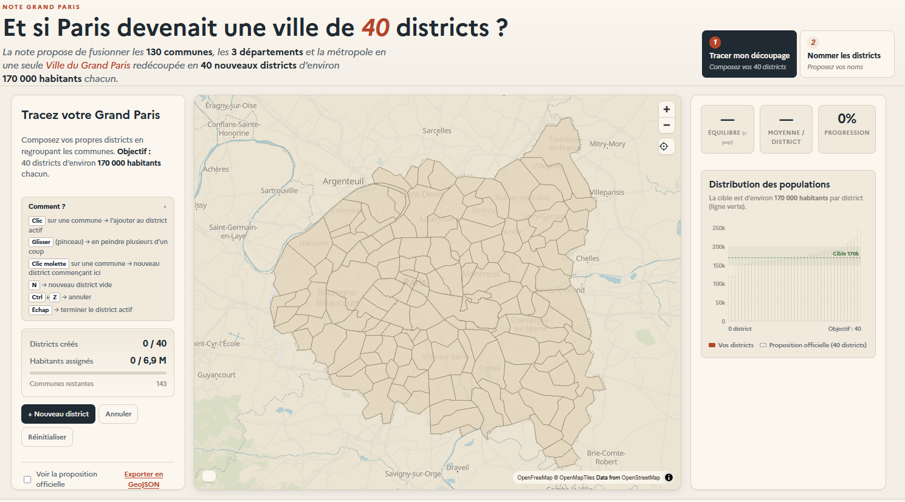
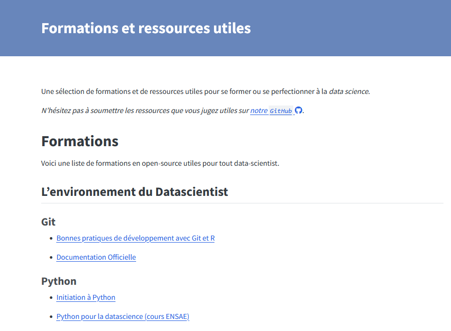

# Bienvenue à la **vingt sixième infolettre** !

C'est le printemps ! Le temps est bon, il fait [41,6°C en Californie avant la fin de l'hiver](https://www.rtl.be/actu/monde/international/jusqua-416degc-avant-meme-la-fin-de-lhiver-une-vague-de-chaleur-extreme-frappe/2026-03-19/article/783199). 

# L'infographie
Si vous avez joué à Sim's city, voici la version parisienne. Le Haut-commissariat à la Stratégie et au Plan a accompagné [sa note](https://www.strategie-plan.gouv.fr/publications/du-periph-la-metropole-construire-la-ville-du-grand-paris) proposant de fusionner toute la petite couronne et Paris au sein d'une ville du Grand Paris d'un outil de visualisation pour créer cette nouvelle commune. 

{width=450}

Si vous cherchez à créer 40 districts en région parisienne, le jeu est par [ici](https://strategie-plan.eu/datavisualisation-grandparis/#trace).

# Les évènements du réseau
Plusieurs événements ont eu lieu ces dernières semaines auquel le réseau était invité. 

## Retour sur le funathon sur le *machine learning* et l'IA - 📅 27 et 28 mai 
L'Insee a organisé un **funathon européen** sur l'utilisation du *machine learning* et de l'IA dans le cadre du projet européen [ESS-Net AIML4OS](https://cros.ec.europa.eu/dashboard/aiml4os).
**67 équipes de 25 pays différents représentant 215 personnes** ont ainsi participé à l'un des trois sujets proposés.
Les retours des participants furent très positifs et ont particulièrement apprécié **apprendre de nouvelles compétences sur des cas d'usage concrets**.  

Les ressources sont toujours disponibles en ligne, soit sur le [site du funathon](https://aiml4os.github.io/funathon-general-website/about.html) ou sur les sites dédiés des sujets : 

  - Segmentation d'images satellites par *deep learning* ([sujet 1](https://aiml4os.github.io/funathon-project1/));
  - Codification automatique pour la classification NACE ([sujet 2](https://aiml4os.github.io/funathon-project2/));
  - Prévision des prix de l'immobilier sur données tabulaires par méthodes ensemblistes ([sujet 3](https://aiml4os.github.io/funathon-project3/)).

**N'hésitez pas à aller voir les sujets par vous-même !**

Un retour d'expérience plus détaillé a par ailleurs été présenté à la conférence qualité [lors de la session 21](https://www.q2026.hr/programme/conference-programme/session-21/) et dont la présentation est disponible [ici](https://www.q2026.hr/media/kmuchjs4/presentation-a-new-way-to-learn-machine-learning-and-ai.pptx), si jamais vous voulez vous lancer dans une telle expérience 😜.

## Retour sur les journées data-science et open source - 📅 16 et 17 juin 
L'Insee a organisé deux journées pour **démystifier la contribution à l'open source** et explorer des projets liés à la data science les 16 et 17 juin.
Rassemblant une vingtaine de participants de différentes administrations, cela aura été l'occasion de découvrir ensemble le monde de l'open source et d'apporter environ 80 contributions à des projets communs (Active Tigger, SNDSTools, CanaR, UtilitR et des contributions libres). 

Au-delà des chiffres, ces deux jours auront surtout montré que **la contribution open source est à la portée de tous et que les data scientists du service public ont toute leur place comme contributeurs actifs des outils qu'ils utilisent**. 
Cela aura aussi été l'occasion de **travailler différemment tous ensemble autour de projets concrets**, ce qui fut très apprécié de tous. 

Merci à toutes celles et ceux qui ont participé — et rendez-vous pour une prochaine édition.
Plus de **détails** sont disponibles sur la [page de l'événement](../../event/2026-06-jdos/index.qmd), [le retex](../../blog/2026_jdos/index.qmd) ou [le site dédié](https://inseefrlab.github.io/journees-datascience-opensource).

# Du nouveau contenu sur le [site du réseau](https://ssphub.netlify.app) !

## Le site du réseau s'enrichit d'une liste de formations en data science 
Le site du réseau s'est enrichi d'une **liste de formations librement accessibles et d'intérêt pour la data-science**. Pour y accéder, il faut aller dans l'onglet ["ressources"](../../course.qmd).

{width=400}

## Et d'un article de blog pour créer un bot sur Tchap
Une gentille personne a expliqué sur le blog du réseau comment créer un [bot sur Tchap connecté à un LLM](../../blog/bot_tchap/index.qmd). 

En résumé, grâce à la philosophie ouverte de Tchap et à des outils comme `simplematrixbotlib`, **la mise en place a été plus simple que prévu**, malgré les défis du chiffrement et de la gestion des fils de discussion. Le bot est **capable de répondre à des commandes et d’interroger un LLM**, mais ne gère pas les nouvelles discussions et autres événements (actuellement). Enfin, après avoir conteneurisé l’application avec Docker, le bot **tourne désormais en production sur le SSP Cloud**, le tout pour une petite semaine de travail.

Pour plus de détails, tout est expliqué sur [l'article de blog](../../blog/bot_tchap/index.qmd). 

# Actualités
Beaucoup d'actualités dans les dernières semaines, j'essaye de rendre cela digeste. 

## Quel est le prix de l'indépendance statistique ? 25$ pour 1$

Des chercheurs ont utilisé **le licenciement de la cheffe du Bureau of Labor Statistics (BLS)** aux États-Unis pour mesurer, à partir de cette expérience naturelle, la valeur économique donnée aux statistiques publiques. 
Dans leur article [The Value of Reliable Statistics](https://www.nber.org/papers/w35135) publié dans la revue NBER, ils confirment ainsi que la perte de confiance dans les statistiques publiques produit de l'incertitude économique. 
Ils estiment aussi le bénéfice économique lié au maintien de l'intégrité des données officielles à 25$ par $ investi dans les statistiques publiques.

## IA
- [L’IA générative sous la loupe environnementale : les enjeux énergétiques](https://www.linkedin.com/posts/ia-environnement-innovationresponsable-share-7463320029036580865-MHmu): Étude du PEReN pour l'Arcep sur la consommation énergétique de 22 modèles d'IA. Analyse des leviers de sobriété comme l'architecture mélange d'experts ou la quantification.

- [Microsoft reports expose AI's cost problem: The tech is more expensive than paying human employees](https://fortune.com/2026/05/22/microsoft-ai-cost-problem-tokens-agents/): L'adoption massive de l'IA en entreprise génère des coûts de calcul et de tokens dépassant parfois les salaires humains. Malgré la baisse du prix unitaire des tokens, l'usage intensif d'agents IA risque de faire exploser les budgets.

## Fun/formation
- [MicroGPT Visualized - Building a GPT from scratch — an interactive visual guide](https://microgpt.jtauber.com/): Construction d'un GPT simplifié en 6 étapes

- [YAML? That’s Norway problem](https://lab174.com/blog/202601-yaml-norway/): Analyse technique du problème de parsing du code pays NO en booléen dans YAML. Étude de l'évolution des spécifications de la v1.0 à la v1.2 et des raisons de sa persistance.

- [Succès de la formation MOOC gratuite aux statistiques avec R](https://www.linkedin.com/posts/jean-paul-maalouf_rstats-statistiques-datascience-ugcPost-7464962595242790912-lPtY/?utm_source=share&utm_medium=member_desktop&rcm=ACoAABRqCyYBCiH_kp7iH7uac5mx7bM3KsjsXQ4): Plus de 1000 inscrits pour un MOOC de statistiques avec R en accès libre. Formation pratique comprenant 8h de vidéos et des scripts commentés.

- [ RAG with raghilda](https://info.posit.co/NzA5LU5YTi03MDYAAAGh5ODbBdeFmlOPaLdHwMlSHBHsHBxC_zbtIhyFs1bvc87cZhr-FsVhfWa0OPca32phPpMhMeo=): An introduction to building retrieval-augmented generation systems with raghilda

## Ressources

### Outils d'IA
- [ParseBench : Benchmark de parsing de documents pour agents IA](https://www.parsebench.ai/#compare): Présentation de ParseBench, premier benchmark évaluant les besoins des agents IA en parsing de documents. Basé sur 2000 pages vérifiées par l'humain et 169k règles de test.

- [curl.md : Convertir des sites web en markdown optimisé pour les agents](https://curl.md/docs): Outil permettant de transformer des pages web en format markdown optimisé pour les agents IA. Réduit la consommation de tokens et améliore le contexte pour les LLM via CLI, API ou plugins.

- [OpenAI Privacy Filter](https://huggingface.co/openai/privacy-filter): Modèle de classification de jetons pour la détection et le masquage d'informations personnelles (PII). Conçu pour la sanitisation de données à haut débit et utilisable localement.
Catégories : Anonymisation de données, classification, IA, NLP/texte

- [Your own AI workspace, running on your hardware.](https://github.com/pewdiepie-archdaemon/odysseus): Odysseus is a self-hosted interface for talking to language models — chat, autonomous agents, tools, model serving, email, research, and more. Local-first, privacy-first, and no telemetry. Just you and your models. 

- [Teaching agents the core skills of data science](https://blog.probabl.ai/teaching-agents-data-science-skills): Les agents IA excellent en ingénierie mais manquent de méthodologie et de pensée statistique. L'objectif est de former des agents capables de gérer des workflows de data science complexes et fiables. Des skills peuvent permettre de les aider, le depot est ici : https://github.com/probabl-ai/skills

### duckDB
- [DuckDB Internals: Why is DuckDB Fast?](https://www.greybeam.ai/blog/duckdb-internals-part-1): Analyse approfondie de l'architecture interne de DuckDB. Explication des mécanismes de rapidité via l'exécution in-process, le stockage colonne et l'optimisation SQL.

- [Full-Text Search with DuckDB](https://peterdohertys.website/blog-posts/full-text-search-w-duckdb.html): Exploration de l'extension de recherche plein texte (FTS) de DuckDB. Tutoriel sur l'indexation et l'utilisation de l'algorithme BM25 pour interroger des données textuelles comme des e-mails.

### Git et souveraineté européenne 
- [The Netherlands is Building Its Own GitHub Replacement](https://itsfoss.com/news/netherlands-forgejo-migration/): Le gouvernement néerlandais déploie Forgejo, une plateforme auto-hébergée et open source, pour remplacer GitHub et GitLab. Cette initiative vise à garantir la souveraineté numérique et le contrôle total sur l'hébergement du code source gouvernemental.

### R, Python, machine learning
- [Bringing OpenTelemetry to R in production](https://opensource.posit.co/blog/2026-05-07_opentelemetry/): Intégration d'OpenTelemetry dans les packages R clés (Shiny, plumber2, etc.) pour l'observabilité en production. Permet de collecter traces, logs et métriques sans modification du code via des variables d'environnement.

- [Supertree : visualisation interactive d'arbres de décision](https://github.com/mljar/supertree): Outil Python permettant de visualiser de manière interactive des arbres de décision dans Jupyter ou Colab. Compatible avec scikit-learn, XGBoost, LightGBM et ONNX.

### Publication

- [Modernisation de la chaîne de production scientifique de l'OFCE](https://www.linkedin.com/posts/xavier-timbeau-b141b61a_depuis-maintenant-un-peu-plus-de-2-ans-nous-activity-7471954013521915904-K21b?utm_source=share&utm_medium=member_desktop&rcm=ACoAAGc8mWkBtWTZy0PWkiGLiCCQBRMkKBQxqnI): Transformation de la chaîne éditoriale de l'OFCE vers un flux industriel et automatisé. Utilisation de Quarto, R et Git pour garantir la reproductibilité et la source unique de données.

- [Migrating from Pagedown to Typst](https://www.ysunflower.com/blog/migrating-from-pagedown-to-typst): Comparaison entre Pagedown et Typst pour la génération de rapports PDF. Typst offre une alternative plus rapide, intuitive et moderne via l'utilisation de Quarto.

- [Datatype — variable font that turns text into charts](https://franktisellano.github.io/datatype/): Police OpenType variable permettant de transformer des expressions textuelles en graphiques inline. Utilise les ligatures pour générer barres, sparklines et camemberts sans JavaScript ni images.
