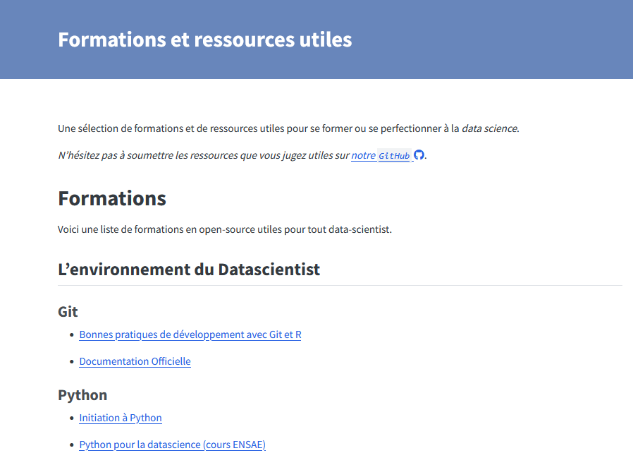

# Bienvenue à la **vingt septième infolettre** !

La rentrée est passée par là, les chaleurs s'éloignent (il faut toujours 35°C dans des écoles dans le sud quand même).

Bienvenue à cette infolettre de rentrée, avec beaucoup d'annonces et d'actualités.

# L'infographie

*The Straits Times*, journal quotidien de Singapour, publie une **belle infographie sur les retards de bus à Singapour** avec un style ressemblant à l'écriture extra-terrestre dans le film [Premier Contact](https://imgr.cineserie.com/2020/07/premier-contact-2-e1594048905709.jpg?width=660&height=&aspect_ratio=660:&quality=80).

Dans leur article [Why your wait for a bus in Singapore feels so long](https://www.straitstimes.com/multimedia/graphics/2026/07/singapore-bus-waits/index.html), ils analysent la **perception des temps d'attente** des bus via l'étude des temps d'arrivée réels des bus.Au delà de l'aspect quantitatif très bien rendu, les auteurs mentionnent les impacts de la fréquence et de l'imprévisibilité de l'arrivée des bus sur l'anxiété des usagers et leur qualité de vie.

*](bus_delay_straitstimes.png){width=600}

# Les actualités du réseau

## La quatrième journée du réseau arrive 📅 7 décembre - La Tréso (Malakoff)
**Réservez votre 7 décembre !** Pour la quatrième année consécutive, le SSPLab organise la journée du réseau pour rassembler les data-scientists de la statistique publique. Au menu : présentation de projets innovants, retour d'expérience et moments d'échanges informels (autrement appelés "pots" 🎉).

Comme les années précédentes, l'événement sera en présentiel et à distance pour permettre à tous de participer.
Les détails seront publiés sur la [page de l'événement](../../event/2026-12-network-day/index.qmd).
Si jamais vous voulez déjà vous inscrire alors que l'agenda n'est pas finalisé, c'est possible [ici](https://grist.numerique.gouv.fr/o/ssphub/forms/qvuQ97GVzgwHi3c7RRmhh5/55).

**Si vous souhaitez présenter un projet sur lequel vous travaillez, l'agenda est encore ouvert.**
N'hésitez pas à l'indiquer lors de l'inscription, par Tchap ou par [mail](mailto:nicolas.toulemonde@insee.fr).

👉️ [Ajouter cet événement à votre agenda](https://minio.lab.sspcloud.fr/ssphub/diffusion/website/2026-12-network/2026_12_4ejournee_SSPHub.ics)

## Le site a fait peau neuve et migre vers ssphub.fr
Au cours de l'été, le **site du réseau a fait une petite mue** pour mieux faire connaître les projets innovants et rassembler des contenus jusqu’ici dispersés.

Le site présente maintenant des [projets innovants](../../project.qmd) en français et en anglais, libre à vous d'ajouter vos projets.
Cela doit permettre de faciliter l’accès aux travaux du réseau et leur circulation : à l’Insee, avec les services statistiques ministériels mais aussi à l’international.

👉️ Un [article de blog](../../blog/2026_refonte/index.qmd) revient plus en détail sur ce travail.

Par exemple, [sept projets de **codification automatique**](https://ssphub.fr/project#category=codification%20automatique) utilisant le machine learning ou l'IA portés par l'Insee ou la Dares sont présentés.
Cela couvre des projets comme la **codification automatique de l'activité principale des entreprises** ou celle des **professions dans la PCS**.
Les méthodes de machine learning ont aussi été utilisées pour le **changement de nomenclature de la NACE** et enfin, *last but not least* pour constituer **la base Jocas de la Dares**, issue du webscraping des offres d'emploi en ligne.

## Une liste de formation en data science sur le site
Une [liste de formations](../../course.qmd) d'intérêt pour la **data science, toutes ouvertes et en ligne**, est aussi disponible sur le site.
Basé en partie sur le [catalogue des formations du SSPCloud](https://www.sspcloud.fr/catalog), cela permet d'aider à monter en compétence sur les différents sujets.

Les formations et ressources proposées couvrent **Git, Quarto, Python, R, S3 et les technologies du SSPCloud**.
Les liens vers les différents **funathons, formations à Python, au MLOps et les documents de travail** sont aussi rappelés.

{width=500}

N'hésitez pas à proposer de nouvelles formations!

# Actualités du SSP Cloud

Le service d'accès aux grands modèles de langage (LLM) [llm.lab](https://llm.lab.sspcloud.fr/), modèles auto-hébergés sur le SSP Cloud, devient de plus en plus connu et sollicité par les utilisateurs de la *célèbre* plateforme open-source de data science.
Depuis peu, un nouvel outil est disponible pour les utilisateurs les plus aguerris, avides de tester toujours plus de nouveaux LLM : **le déploiement de LLM à la demande**.

- **Le concept :** à partir d'un fichier YAML comprenant la configuration du LLM (*contrat de déploiement*), le modèle peut être déployé sur la plateforme, **sous réserve de disponibilité de GPU** (un modèle = un GPU).

- **Comment ça marche ?** Une fois le contrat de déploiement ajouté dans le projet GitHub [sspcloud-llm](https://github.com/InseeFrLab/sspcloud-llm) et les poids du modèle à déployer ajoutés dans le S3 du SSP Cloud, le modèle est déployé automatiquement sur la plateforme *via* ArgoCD. La disponibilité du nouveau modèle est aussi observable sur [status.lab.sspcloud.fr](https://status.lab.sspcloud.fr/status/sspcloud).

- **Les limites :** en plus de **la disponibilité des GPU**, une deuxième limite est la **capacité maximale en VRAM des GPU** (mémoire vive associée à la carte graphique).
Les GPU avec le plus de VRAM disponible sur la plateforme du SSP Cloud disposent d'environ 90 Go ; ils ne peuvent pas héberger les plus gros modèles disponibles en *open-weight* (c'est-à-dire des LLM avec des poids qui sont téléchargeables).
Des modèles comme `Kimi K3` ou `DeepSeek V4.1-Flash` ont un nombre de **paramètres totaux** (resp. 2 800 et 552 milliards) bien trop élevé pour la capacité d'un GPU du SSP Cloud.

# Actualités en data science
Avec la pause estivale, de nombreuses actualités en data science et ressources sont sorties.
Voici un **panorama synthétique** des innovations relevées.

## IA

### Efficacité de l'IA
- L'étude [Do Data Agents Need Semantic Metadata? A Comparative Study in Agentic Data Retrieval](https://arxiv.org/abs/2605.28787) de Google montre **l'importance d'avoir des données structurées** pour augmenter l'efficacité des agents autonomes.
En effet, les agents utilisant des métadonnées structurées surpassent nettement ceux naviguant sur le web non structuré en termes de précision (45% de réussite contre 20% pour les agents sans accès à des) et de conformité aux principes FAIR (l'agent de base réussit environ 40% des questions contre 66% pour les agents avec accès aux métadonnées structurées).

- Un article publié dans le NBER, [AI Agents and Prompt Engineering in Econometric Coding](https://www.nber.org/papers/w35588), analyse **l'efficacité des LLM pour la rédaction de code économétrique** entre chatbots et agents autonomes, c'est à dire pouvant tester le code qu'ils proposent et le corriger, sur Stata, R et Python.
L'étude a utilisé les modèles Sonnet 4.6 de Claude, GPT 5.4 et DeepSeek V4 Flash.
Résultat, sur 21 taches dédiées, les **agents autonomes sont bien plus efficaces** que des chatbots et **réussissent dans 96% des cas** lorsqu'il interagit avec l'humain (95% sans interaction).
Les **LLM codent par ailleurs le mieux en Python et en R**, et notamment avec un écart de taux de succès non significatif entre les deux languages.
Ils codent par contre largement moins bien en Stata (33%).

- Le site [FrontierHarness Eval](https://frontierharness.org/) **évalue 12 environnements pour agents IA sur des tâches de génie logiciel** par taux de réussite, vitesse et coût par tâche. Codex est celui qui réussit le mieux (67% des taches) à un coût pourtant six fois moindre que Claude Code.

### Adaptation à l'usage de l'IA
Un certain nombre d'outils et de site ont annoncé le déploiement d'outils ou de techniques pour protéger leur contenu de l'IA.

- Codeberg, une forge git allemande libre, annonce des **mesures pour protéger l'écosystème libre des LLM** dans un blog [Protecting our FLOSS commons from LLMs](https://blog.codeberg.org/protecting-our-floss-commons-from-llms.html) : l'association s'engage ainsi à ne pas utiliser les données des utilisateurs pour l'entraînement de LLMs et modifie ses conditions d'utilisation pour **proscrire les projets vibe-codés**. Par ailleurs, les membres de l'association ont adopté une motion estimant que les LLM mettent en danger l'écosystème des logiciels libres.

- Un développeur néerlandais, Isaque Seneda, a développé [ShieldFont](https://github.com/isaqueseneda/shieldfont), une **police open-source qui empoisonne les jeux de données d'entraînement de LLM** par substitution de texte tout en permettant une lecture humaine normale.

- Alors que les contenus générés par IA sont de plus en plus nombreux, **savoir les détecter est devenu d'autant plus important**.
Anthropic a ainsi présenté dans ce post de blog [How Claude marks AI-generated content](https://support.claude.com/en/articles/16266773-how-claude-marks-ai-generated-content) ses deux méthodes maison  pour **marquer les textes ou fichiers générés par ses modèles**.
Anthropic a aussi mis en place [un site](https://claude.com/check-files) pour vérifier si un fichier a été généré par Anthropic.
Pour savoir comment cela fonctionne, des universitaires, issus en grande partie d'universités chinoises, ont fait **un tour des différentes techniques de marquage de textes produits** par les LLMs dans leur article [A Survey of Text Watermarking in the Era of Large Language Models](https://arxiv.org/pdf/2312.07913).

## Ressources
- **Python**
  - [mcpgen : Transformez n'importe quelle API en serveur MCP Python](https://github.com/JnanaSrota/mcpgen) : Outil de génération automatique de serveurs MCP à partir de spécifications OpenAPI ou de collections Postman.

- **R**
  - [rv : Gestionnaire de packages R reproductible et déclaratif](https://github.com/a2-ai/rv) : Outil permettant de gérer et d'installer des packages R de manière rapide, déclarative et reproductible à la `uv` mais pour R.

  - [ggplot2qgis : Export de cartes ggplot2 et tmap vers QGIS](https://yutannihilation.github.io/ggplot2qgis/) : Package R permettant d'exporter des graphiques spatiaux ggplot2 ou tmap vers des fichiers de projet QGIS (.qgs) en préservant les échelles de couleurs, les styles de couches et en gérant les données vectorielles.

  - [ir 0.1.0 : self-describing R scripts and Quarto documents](https://opensource.posit.co/blog/2026-07-23_ir-0-1-0/) : Lancement de `ir`, un outil en ligne de commande pour exécuter des scripts R et documents Quarto. Il permet de gérer automatiquement les dépendances et les versions de R directement depuis le fichier, comme avec `uv`.

  - [Introducing lorax : Speaking for the Tree-Based Models](https://opensource.posit.co/blog/2026-07-28_lorax/) : Présentation de `lorax`, un nouveau package R conçu pour caractériser et visualiser les modèles basés sur des arbres. Il permet d'extraire les règles de décision, d'identifier les prédicteurs utilisés et d'uniformiser l'accès aux caractéristiques de divers modèles.

  - [mcptools 1.0.0 : le premier SDK R pour le Model Context Protocol](https://opensource.posit.co/blog/2026-07-06_mcptools-1-0-0/) : Lancement de la version 1.0.0 de mcptools sur CRAN. Ce SDK permet de déployer et de récupérer des outils MCP en R, avec support des images et des serveurs authentifiés.

- **Typst**
  - [Mosaic : Beautiful slides for Typst](https://github.com/vincentarelbundock/mosaic) : Outil permettant de créer des présentations de type slides directement via Typst.

  - [Build LinkedIn Carousels with Typst : the slide Layout](https://mickael.canouil.fr/posts/2026-05-28-typst-linkedin-carousels/index.html) : Tutoriel pour créer des carrousels LinkedIn en utilisant Typst.

- **OCR** : Un doctorant de Harvard présente [socOCRbench](https://noahdasanaike.github.io/posts/sococrbench.html), un nouveau benchmark d'OCR conçu pour les sciences sociales. Il évalue la reconnaissance de manuscrits, l'extraction de tableaux et de textes imprimés sur des documents complexes.

- [Guide to data tools landscape for developers](https://sinja.io/blog/data-landscape-guide-for-developers) : Guide d'introduction au paysage des outils de données pour les développeurs qui présente les différents métiers de la donnée et les étapes du cycle de vie de la donnée (ETL).
Le guide est pensé à **destination de developpeurs arrivant dans un environnement data et nouveaux dans la matière**.

## Fun/formation
- Vous cherchez un chiffre similaire à un autre et montrer par exemple à vos élèves l'importance des métadonnées ? [Spurious Comparisons](https://number.weyland.enterprises/?q=66438820) permet de **rechercher des statistiques par valeur absolue**.
Cela permet par exemple de voir que [666](https://number.weyland.enterprises/?q=666) c'est le nombre de vue pour la page Wikipedia de Narendra Modi le 15 septembre 2025 mais aussi la quantité de sulfates et autres produits chimiques exportés en 2021 par l'Equateur. Coïncidence ?

- Un package R dédié [cpge](https://CRAN.R-project.org/package=cpge) permet d'aider les étudiants en CPGE à choisir leur orientation et de voir les concours et secteurs d'activité des grandes écoles françaises.

- Une étonnante étude qui montre que **l'humain est assez fort pour optimiser seul** des problèmes complexes. [Why some people mow a lawn better than others](https://pudding.cool/2026/06/mow/) permet d'analyser  132 003 tentatives de tonte de pelouse virtuelle pour étudier l'efficacité humaine et les compare aux algorithmes de planification de trajectoire.

## Une plongée dans des articles plus exhaustifs

- [Self-hosting DuckDB : the road to production](https://motherduck.com/blog/self-hosting-duckdb-road-to-production/) : **Guide pratique sur l'auto-hébergement de DuckDB** selon différents niveaux de maturité. Analyse des compromis entre construction maison et services managés en passant du laptop au cloud.

- [How an AI agent signed itself up to MotherDuck and built a pipeline](https://motherduck.com/blog/agent-signup-cloud-data-warehouse/) : Un agent IA provisionne de manière autonome un entrepôt de données cloud sans inscription humaine. L'article explore **les nouveaux flux de travail où les agents gèrent l'infrastructure, l'ingestion de données et la visualisation**.

- [Grokking Apache Iceberg](https://thingsworthsharing.dev/iceberg) : **Exploration approfondie du fonctionnement technique d'Apache Iceberg** : comparaison avec l'ancien modèle Hive et démonstration des avantages du format de table pour la gestion des métadonnées.

- [Zvec | From rg to zg : Local Search Beyond Keywords](https://zvec.org/en/blog/2026-08-28-zvec-grep-open-source/) : Lancement de zg, une **infrastructure de recherche locale open source** conçue pour les humains et les agents IA.
