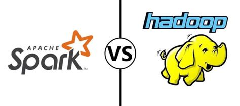

Vous avez une idée de sujet ? Toute personne souhaitant coontribuer est la bienvenue, quel que soit son statut, où elle travaille. Pour contribuer, proposez votre idée sur Github ou par mail. Le mode opératoire détaillé est rappelé sur [Github](https://github.com/InseeFrLab/ssphub/blob/main/CONTRIBUTING.md).

Pour rappel, les informations qui sont diffusées sur ce blog n’engagent que les contributeurs et en aucun cas les institutions dont ils dépendent.

  

##### Guide d’utilisation des données du recensement de la population au format `Parquet`

Un post de blog pour accompagner la mise à disposition des données détaillées du recensement au format `Parquet`.

23 oct. 2023

##### Onyxia: l’infrastructure cloud mère des dragons

Les technologies cloud sont incontournables dans l’écosystème de la donnée. Pour ne pas se rendre dépendante de fournisseurs de services externes, l’Insee a développé un…

10 mai 2023

##### Polars, une alternative fraîche à Pandas

Polars, une alternative moderne et fluide à `Pandas`

10 févr. 2023

##### Infolettre n°9

Après la rétrospective de l’année 2022 de la *data science*, il est temps de se pencher sur l’année du réseau avec des visualisations interactives produites grâce à…

10 janv. 2023

##### Rétrospective de l’année 2022

[La *data science* a beaucoup fait parler d’elle en 2022, notamment du fait des deux coups médiatiques d’](blog/retrospective2022/index.llms.md)[openAI](https://openai.com/), à savoir…

31 déc. 2022

##### Le plongement lexical ou comment apprendre à lire à un ordinateur

Introduction aux méthodes de traitement du langage naturel.

3 oct. 2022

##### Le *machine learning* aux Journées de la Méthodologie Statistique 2022 (JMS)

Revue des présentations en lien avec les travaux en *machine learning* aux JMS de 2022

6 avr. 2022

##### Parallélisation des traitements : Hadoop MapReduce vs Spark

1 juin 2016
