Une sélection de ressources utiles pour se former ou se perfectionner à la *data science*.

*N’hésitez pas à soumettre les ressources que vous jugez utiles sur [notre `GitHub` ](https://github.com/InseeFrLab/ssphub)*.

  

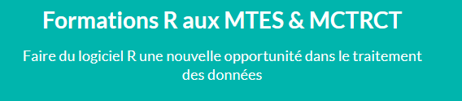

##### Les formations R du MTES

Une collection de cours \`R\` faite par le Ministère de la Transition Ecologique

1 janv. 2024

##### Appariements de données individuelles : concepts, méthodes, conseils

Un appariement consiste à rapprocher deux bases de données d’origine distincte partageant des unités statistiques communes mais contenant des informations différentes. Ce document de travail porte sur les cas où un identifiant commun n'existe pas et introduit en pratique les appariements de données individuelles sur traits d'identité.

3 juil. 2023

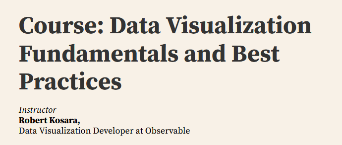

##### Cours sur la plateforme de dataviz Observable

When do you use a bar chart over a line chart? What are area charts good for? What's wrong with pie charts? Learn about how these different types of data visualization work, and how they're used, in Observable's first data visualization course! Attend lectures (or watch them later), ask questions, and once you've completed a small assignment at the end, you'll earn a certificate.

1 avr. 2023

##### Les réseaux de neurones appliqués à la statistique publique : méthodes et cas d’usages

Ce document de travail propose une introduction rapide aux réseaux de neurones, de leurs fondements théoriques jusqu’à leur mise en oeuvre pratique en R et python sur des problématiques spécifiques de statistique publique. Il illustre les possibilités et les limites à travers trois cas d’usage détaillés sur l’imputation de valeurs manquantes dans une enquête, l’exploitation de fichiers d’images et la réduction de dimension.

16 févr. 2023

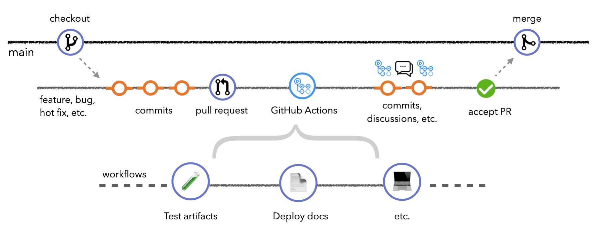

##### Parcours complet sur le MLOps

Un site web très complet qui fait un effort de synthèse sur l'écosystème foisonnant du MLOps

1 févr. 2023

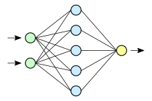

##### Neural Network: from zero to hero

A course by Andrej Karpathy on building neural networks, from scratch, in code.

> "We start with the basics of backpropagation and build up to modern deep neural networks, like `GPT`. Language models are an excellent place to learn deep learning, even if your intention is to eventually go to other areas like computer vision because most of what you learn will be immediately transferable."

16 janv. 2023

##### Observable pour la cartographie

[Nicolas Lambert (`neocarto`)](https://observablehq.com/@neocartocnrs) propose beaucoup de ressources pédagogiques sur la cartographie depuis `Observable`. Beaucoup de ressources s'appuient sur [`bertin.js`](https://observablehq.com/collection/@neocartocnrs/bertin), une librairie très puissante et flexible pour la représentation cartographique.

16 janv. 2023

##### Data visualisation with d3.js

`d3.js` est la librairie favorite des spécialistes de *dataviz* en `Javascript`. Dans cette série de notebooks, proposée par Arthur Katossky, vous découvrirez comment utiliser la librairie pour construire des visualisations de données réactives.

16 janv. 2023

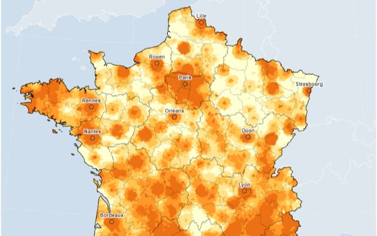

##### Découvrir Observable avec des données françaises

[Eric Mauvière](https://observablehq.com/@ericmauviere) propose beaucoup de ressources pédagogiques sur la plateforme `Observable`. Beaucoup s'appuient sur des données de la statistique publique, comme le fichier des prénoms ou le recensement.

16 janv. 2023

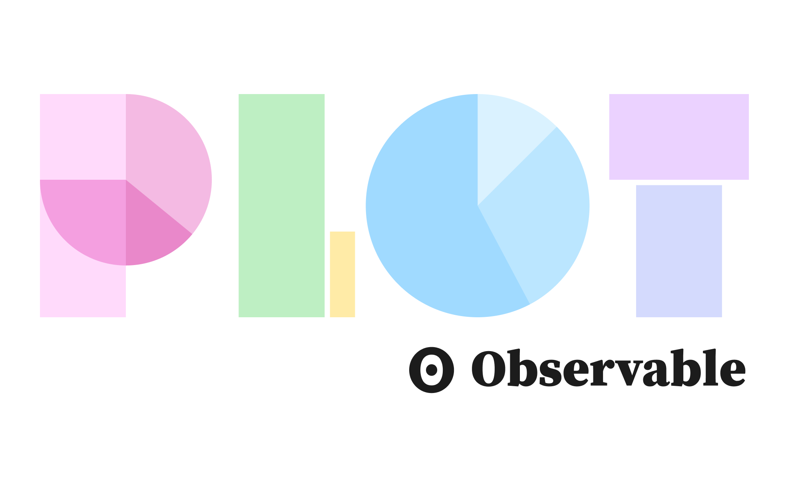

##### Introduction à Observable Plot.js

[La librairie](https://observablehq.com/@observablehq/plot) [`Plot.js`](https://observablehq.com/@observablehq/plot) vise à faciliter l'utilisation des fonctionnalités graphiques de `Javascript` . Elle propose une syntaxe très proche de celle des librairies `ggplot2` () ou `seaborn` (`Python` ).

16 janv. 2023

##### Python pour la data science

Un site web complet pour découvrir la richesse de `Python` pour la *data science*. Ce cours est enseigné par Lino Galiana en deuxième année (Master 1) de l'`ENSAE`.

27 avr. 2022

##### Mise en production de projets de data science

Un site web complet pour découvrir la manière dont des projets *data-science* peuvent être valorisés et maintenus dans le temps.

27 avr. 2022

##### Portail de la formation du SSPCloud

Le SSPCloud, la plateforme *cloud* développée par l'Insee, propose un certain nombre de tutoriels en `Python` ou `R` .

27 avr. 2022

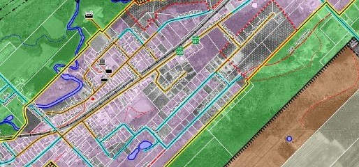

##### Géomatique appliquée à la statistique

Une présentation simple des outils géomatiques récents qui permettent de stocker, traiter et diffuser l'information spatiale

17 févr. 2022

##### L'économétrie en grande dimension

Ce document de travail est une courte introduction aux principaux problèmes que l'on rencontre lorsque l'on souhaite faire de l'économétrie en grande dimension, c'est-à-dire lorsque p \> n - pour chaque observation, on dispose d'un nombre de caractéristiques potentiellement proportionnel ou plus grand que la taille de l'échantillon.

17 févr. 2022

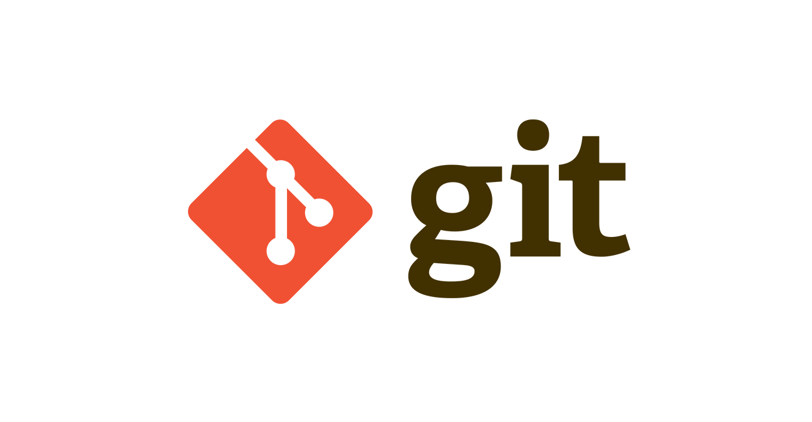

##### Utiliser Git dans Jupyter Notebook ?

[Un extrait du cours de](https://pythonds.linogaliana.fr/course/git/) [Python pour la data-science](https://pythonds.linogaliana.fr/) de l'ENSAE.

1 janv. 2022

##### dataESR: portail de l'open-data du Ministère de l'Enseignement Supérieur

[`#dataESR` est un portail développé par le](https://data.esr.gouv.fr/FR/) [service statistique du Ministère de l'Enseignement Supérieur et de la Recherche](https://www.enseignementsup-recherche.gouv.fr/fr/statistiques-et-analyses-50213) pour vous aider à trouver les ressources en données sur l'enseignement supérieur, la recherche et l'innovation.

1 janv. 2022

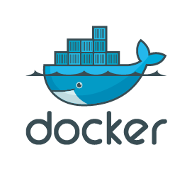

##### DevOps for Data Science

Un site web très complet sur la manière dont l'approche `DevOps` peut être importée dans des projets *data-science*.

27 avr. 2021

##### R reproducibility toolkit for the practical researcher

Un site web très complet développé par des universitaires sud-américains pour présenter la manière dont les projets en `R` peuvent être construits de manière reproductible.

27 avr. 2021

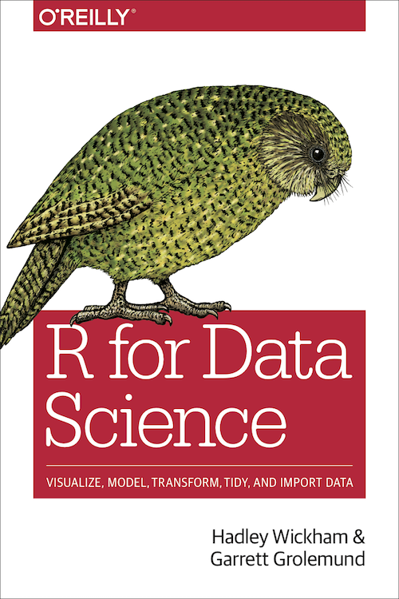

##### R for Data Science

Un incontournable écrit par Hadley Wickham afin de faire découvrir l'univers du `tidyverse` (`ggplot`, `dplyr`...) de manière thématique.

27 avr. 2021

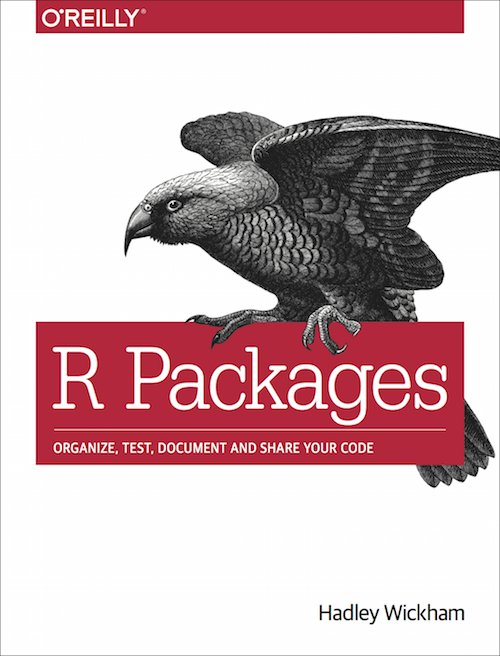

##### R Packages

Un incontournable écrit par Hadley Wickham afin d'apprendre à développer des *packages* `R`.

27 avr. 2021

##### RZine, une collection de ressources utiles en R

Un site web développé par l'université Paris Diderot comportant de nombreuses ressources utiles en `R`.

27 avr. 2021

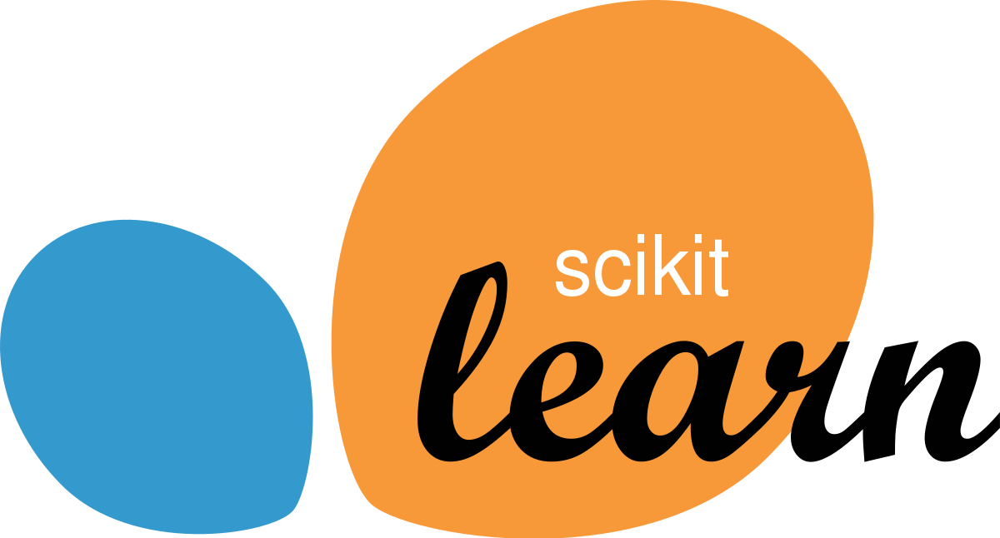

##### Machine Learning in Python with scikit-learn

Un MOOC de l'INRIA sur `scikit-learn`, l'écosystème central du *Machine Learning* en `Python`.

27 avr. 2021

##### utilitR

Le projet `utilitR` est une documentation sur l’usage du logiciel , née à l’Insee, destinée à tout utilisateur intéressé par la manipulation de données.

La documentation `utilitR` ne fait aucun pré-requis de niveau: à la fois le débutant et l'utilisateur plus expert désirant découvrir un nouveau champ ou bénéficier d'une aide-mémoire pourront trouver du contenu qui les intéresse.

[Afin que les exemples soient concrets, tous les jeux de données sont issus du](https://www.book.utilitr.org/) [site de l'Insee](https://www.insee.fr/fr/accueil).

27 avr. 2021

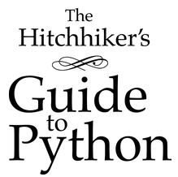

##### The Hitchhiker's guide to Python

Un livre de référence sur les bonnes pratiques pour des projets `Python` .

27 avr. 2016

##### Google’s R Style Guide

Un guide de référence sur les bonnes pratiques dans l'écriture de code `R`

27 avr. 2016

##### Formation Initiation au Deep Learning (FIDLE)

Une formation du CNRS sur les problématiques d'apprentissage automatique (*machine learning*) et d'apprentissage profond (*deep learning*).

27 avr. 2016

##### Apprendre Pandas en 10 minutes !

Un tutoriel des créateurs de `Pandas` pour apprendre en peu de temps à manipuler et analyser les données sous `Python` .

27 avr. 2016
