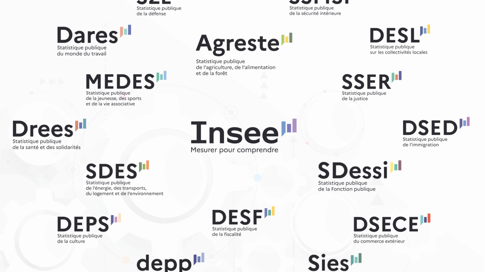

Welcome to the `SSPHub`, the website for *data scientists* working for the French Official Statistical Office

# Network of data scientists working for the French Official Statistical Office

This website is made for the `SSPHub`, a network to foster collaboration and exchange among *data scientists* from the [French Official Statistical Office](https://www.insee.fr/en/information/2386424). Indeed, in France, the French Official Statistical Office is decentralized :

- INSEE has its headquarters in Paris region but also has a network of regional offices.
- The other part of the French Officiel Statistical Office is composed of INSEE and 16 Ministerial Statistical Offices (MSOs). MSOs carry out statistical operations in their field of competence.
- INSEE coordinates the public statistics production work of the various MSOs.

The English version of the website aims at sharing code and innovative projects produced by the *data scientists* from the [French Official Statistical Office](https://www.insee.fr/en/information/2386424).

The French version of the website offers broader resources to *data scientists* (newsletter, courses … ). As it has limited value added for people outside of the French administration, it has not been translated. But, if you’re interested🙂, you are more than welcome to have a look (by using automated translation tools).

Find out more information about the `SSPHub` network on the [dedicated page](about.llms.md).

# Innovative projects

## What is considered as an innovative project?

It is always difficult to define ex ante what constitutes an innovative project. Technological innovation is by definition fluid and evolves very quickly. However, as stated in the [manifesto (in French)](../manifeste.llms.md), recent technological innovations aim to **simplify and accelerate** certain production processes, **facilitate the exploitation of non-traditional or large data sources**, **automate certain tasks**, **communicate** with wider audiences using responsive visualisations, and, among other things, reduce the gap between statisticians and computer scientists. For example, modernising a processing chain through the use of new packages or new methods of information processing is an innovation. However, this may not be ambitious enough on its own to constitute a truly innovative project, and therefore will not necessarily be included in the projects presented here. The use of web scraping to build a database that is automatically populated will be considered an innovative project. Conversely, simply updating code or using new administrative databases, if it does not involve any particular technological obstacles, is not considered technological innovation in itself. Such projects can however be necessary or welcome 😉.

Furthermore, a project that is innovative at a given point in time may no longer be so a few months or years later, when the innovation has become widespread enough to be considered conventional knowledge.

Innovation also occurs everywhere and is not limited to various data science innovation laboratories.

## What is the scope of the projects presented here?

The list of projects presented here is not intended to be exhaustive. It is based on **voluntary participation**. The aim is to provide a central hub for sharing between SSP data scientists, as outlined in the [manifesto (in French)](../manifeste.llms.md). **Any proposals for additions or mergers on our platform are welcome!**

## Innovative projects

##### sndsTools, a R package for extracting healthcare utilization in SNDS health data

The R package `sndsTools` facilitates the extraction of healthcare utilization from the Système National de Données de Santé (SNDS) health data hosted on the National Health…

17 Mar 2026

##### Comparison of forecasts between *nowcasting* and bottom-up approach

Use of real-time forecasting models (*nowcasting*) inspired by the Atlanta Federal Reserve’s “GDPnow” to forecast GDP growth and comparison with the bottom-up approach

1 Sept 2025

##### Use of banking data for INSEE economic forecasts

1 Jun 2025

##### An assessment of cross-border tobacco purchases and associated tax losses in France

Using the closing of borders in 2020 as a natural experiment to measure cross-border tobacco purchases

1 Jan 2024

##### scanR, an application for monitoring France’s research and innovation landscape

Aggregating and making available massive data on research and innovation in France using visualisations, ElasticSearch search engines and APIs

1 Jan 2024

##### Visualisations of SARS-Cov2 test data

Weekly publication of data relating to SARS-Cov2 detection tests by Shiny from the SI-DEP information system

1 Jun 2023

##### Doremifasol

The package `Doremifasol` makes it easier for data scientists to retrieve Insee data. The library is open source.

1 Jan 2023

##### pynsee, a  Python package for retrieving INSEE data

The package `pynsee` package makes it easier for data scientists to retrieve INSEE data. The library is open source.

1 Jan 2023

##### Using satellite images for official statistics

Using satellite images to improve population censuses in the French overseas territories

1 Oct 2022

##### GDP Tracker: a tool for continuous economic forecasting

Models of *machine learning* for real-time forecasting (*nowcasting*) to feed INSEE’s economic analyses

1 Jan 2022

##### Curiexplore, the platform for comparing national education and research policies

Interactive visualisation of the teaching environment and research environment in different countries.

1 Jan 2022

##### Methodological work on the Family Budget survey

Modernisation of the family budget survey using automatic classification tools

1 Jan 2022

##### Jocas, webscraping online job offers

The project `Jocas` (Job offers collection and analysis system) project enables the DARES (Ministerial Statistical Office for Labour) to automatically collect job offers…

1 Jan 2022

##### Open Science Monitor

To be able to monitor the opening up of scientific publications (the objective of the **national plan for open science**), the statistical service of the Ministry of Higher…

1 Jan 2022

##### Automatic coding of companies’ main activity

Develop a machine learning algorithm to automate the classification of companies’ main activities and put it into production

1 Jan 2022

##### Detecting cybercrime in procedures

Detection of cybercrime based on textual analysis of modus operandi

1 Jun 2021

##### Modelling road vehicle fleet ownership and use

Matching administrative databases and modelling to estimate the number of road vehicles in France

1 Jun 2021

##### Consumer price indices for hotel overnight stays: the experience of webscraping an online booking platform

Exploring webscraping tools to fetch hotel overnight stays in CPI

1 Jun 2021

##### Predicting growth by reading the newspaper

Use continuous press articles to build an indicator to help forecast growth

1 Mar 2021

##### Comparison of matching methods and the contribution of machine learning

To test and compare different matching methods in order to draw up recommendations for the work needed to build directories, particularly as part of the RESIL multiannual…

1 Jan 2021

##### Automatic extraction of the table of subsidiaries and holdings from company accounts

Extract information from company accounts tables, in particular tables of subsidiaries and holdings, contained in scanned images made available by INPI via an API

1 Jan 2021

##### Automatic coding of occupations in the PCS 2020 nomenclature

Automatically code occupations as part of the switch to the new PCS nomenclature (PCS 2020)

1 Jan 2021

##### Using credit card data and mobile phone data to forecast economic activity

The 2020 health crisis required a review of forecasting processes to be more responsive to events. INSEE used credit card transaction data to forecast economic activity.

1 Dec 2020

##### What do the electricity production and consumption data say about economic activity during the containment period?

Using electricity production and consumption data to forecast economic activity

1 Dec 2020

##### Population movements around the March 2020 containment using mobile phone network operators data

INSEE has had access to mobile telephony data as part of the monitoring of the 2020 health crisis. These data were used to produce the following statistics on population…

1 Nov 2020

##### Webscrape product characteristics to improve inflation measurement

Collect product characteristics on the web to improve the way quality effects are taken into account in the consumer price index.

1 Jun 2020

##### Classification of checkout data using machine learning

Using machine learning to classify scanner data in the COICOP nomenclature to calculate the CPI

1 Jan 2020

##### Automatic coding of association activity

Automatic coding of association activity using machine learning methods

1 Jun 2019

##### Detecting and processing outliers or missing values, application to the Déclaration Sociale Nominative (Social Nominative Declarations)

Use of machine learning methods to detect and process outliers or missing values, application to the Social Nominative Declarations (Déclaration Sociale Nominative)

1 Jan 2018

##### Urban segregation: insights from mobile phone data

Merging administrative data and MNO data to estimate urban segregation at a local level

1 Jan 2018
