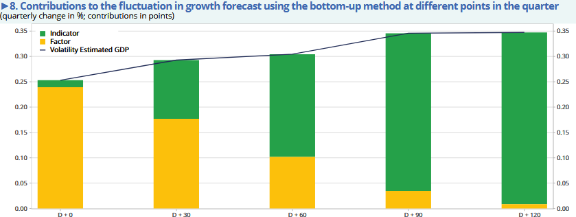

# Project summary

[TABLE]

# Similar projects

##### Comparison of forecasts between *nowcasting* and bottom-up approach

Use of real-time forecasting models (*nowcasting*) inspired by the Atlanta Federal Reserve’s “GDPnow” to forecast GDP growth and comparison with the bottom-up approach

1 Sept 2025

##### Use of banking data for INSEE economic forecasts

1 Jun 2025

##### Predicting growth by reading the newspaper

Use continuous press articles to build an indicator to help forecast growth

1 Mar 2021

##### Using credit card data and mobile phone data to forecast economic activity

The 2020 health crisis required a review of forecasting processes to be more responsive to events. INSEE used credit card transaction data to forecast economic activity.

1 Dec 2020

##### What do the electricity production and consumption data say about economic activity during the containment period?

Using electricity production and consumption data to forecast economic activity

1 Dec 2020

## Footnotes
