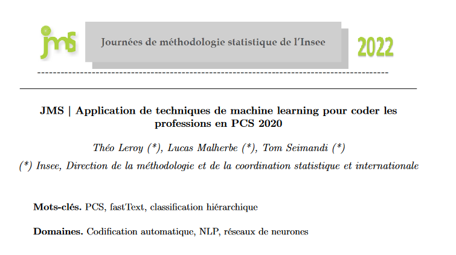

# Project summary

[TABLE]

# Similar projects

## Related to webscraping and IPC

Online data collection (web scraping) is not only used in the production of inflation figures. It is also used in other areas and by other entities within the public statistics service besides INSEE. Since 2020, INSEE has also been using checkout data in the definition of the CPI, as noted in the article [Using Scanner Data to Calculate the Consumer Price Index](https://www.insee.fr/en/information/5014725?sommaire=5014796) in the 2019 statistics newsletter.

##### Curiexplore, the platform for comparing national education and research policies

Interactive visualisation of the teaching environment and research environment in different countries.

1 Jan 2022

##### Jocas, webscraping online job offers

The project `Jocas` (Job offers collection and analysis system) project enables the DARES (Ministerial Statistical Office for Labour) to automatically collect job offers…

1 Jan 2022

##### Open Science Monitor

To be able to monitor the opening up of scientific publications (the objective of the **national plan for open science**), the statistical service of the Ministry of Higher…

1 Jan 2022

##### Consumer price indices for hotel overnight stays: the experience of webscraping an online booking platform

Exploring webscraping tools to fetch hotel overnight stays in CPI

1 Jun 2021

##### Predicting growth by reading the newspaper

Use continuous press articles to build an indicator to help forecast growth

1 Mar 2021

## Related to new data sources

##### Use of banking data for INSEE economic forecasts

1 Jun 2025

##### An assessment of cross-border tobacco purchases and associated tax losses in France

Using the closing of borders in 2020 as a natural experiment to measure cross-border tobacco purchases

1 Jan 2024

##### Methodological work on the Family Budget survey

Modernisation of the family budget survey using automatic classification tools

1 Jan 2022

##### Using credit card data and mobile phone data to forecast economic activity

The 2020 health crisis required a review of forecasting processes to be more responsive to events. INSEE used credit card transaction data to forecast economic activity.

1 Dec 2020

##### What do the electricity production and consumption data say about economic activity during the containment period?

Using electricity production and consumption data to forecast economic activity

1 Dec 2020

##### Population movements around the March 2020 containment using mobile phone network operators data

INSEE has had access to mobile telephony data as part of the monitoring of the 2020 health crisis. These data were used to produce the following statistics on population…

1 Nov 2020

##### Classification of checkout data using machine learning

Using machine learning to classify scanner data in the COICOP nomenclature to calculate the CPI

1 Jan 2020

##### Urban segregation: insights from mobile phone data

Merging administrative data and MNO data to estimate urban segregation at a local level

1 Jan 2018

## Related to automatic coding

##### Methodological work on the Family Budget survey

Modernisation of the family budget survey using automatic classification tools

1 Jan 2022

##### Jocas, webscraping online job offers

The project `Jocas` (Job offers collection and analysis system) project enables the DARES (Ministerial Statistical Office for Labour) to automatically collect job offers…

1 Jan 2022

##### Automatic coding of companies’ main activity

Develop a machine learning algorithm to automate the classification of companies’ main activities and put it into production

1 Jan 2022

##### Automatic coding of occupations in the PCS 2020 nomenclature

Automatically code occupations as part of the switch to the new PCS nomenclature (PCS 2020)

1 Jan 2021

##### Classification of checkout data using machine learning

Using machine learning to classify scanner data in the COICOP nomenclature to calculate the CPI

1 Jan 2020

##### Automatic coding of association activity

Automatic coding of association activity using machine learning methods

1 Jun 2019
