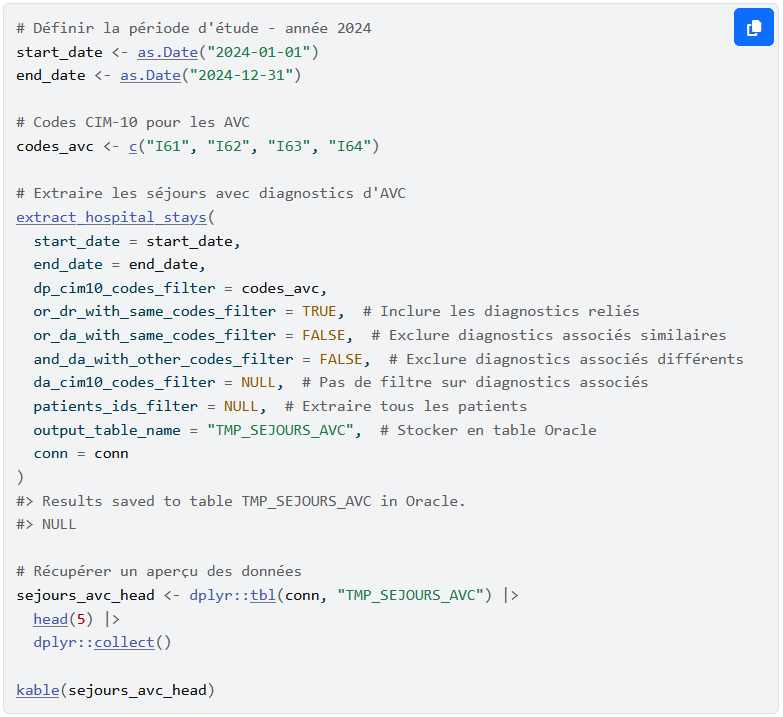

# Project summary

[TABLE]

# Similar projects

##### sndsTools, a R package for extracting healthcare utilization in SNDS health data

The R package `sndsTools` facilitates the extraction of healthcare utilization from the Système National de Données de Santé (SNDS) health data hosted on the National Health…

17 Mar 2026

##### Comparison of matching methods and the contribution of machine learning

To test and compare different matching methods in order to draw up recommendations for the work needed to build directories, particularly as part of the RESIL multiannual…

1 Jan 2021

##### Detecting and processing outliers or missing values, application to the Déclaration Sociale Nominative (Social Nominative Declarations)

Use of machine learning methods to detect and process outliers or missing values, application to the Social Nominative Declarations (Déclaration Sociale Nominative)

1 Jan 2018

##### Urban segregation: insights from mobile phone data

Merging administrative data and MNO data to estimate urban segregation at a local level

1 Jan 2018
