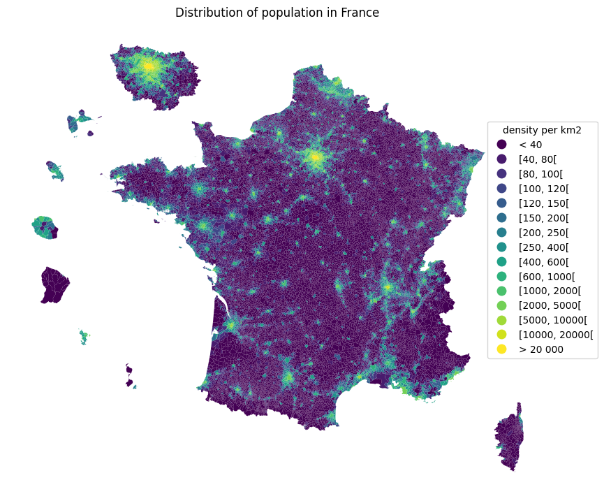
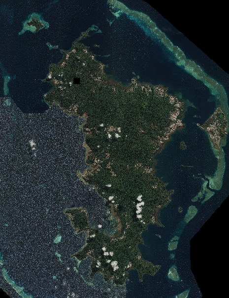

# Project summary

[TABLE]

# Project documents

# Similar projects

##### sndsTools, a R package for extracting healthcare utilization in SNDS health data

The R package `sndsTools` facilitates the extraction of healthcare utilization from the Système National de Données de Santé (SNDS) health data hosted on the National Health…

17 Mar 2026

##### Doremifasol

The package `Doremifasol` makes it easier for data scientists to retrieve Insee data. The library is open source.

1 Jan 2023

##### pynsee, a  Python package for retrieving INSEE data

The package `pynsee` package makes it easier for data scientists to retrieve INSEE data. The library is open source.

1 Jan 2023

##### Using satellite images for official statistics

Using satellite images to improve population censuses in the French overseas territories

1 Oct 2022

##### Methodological work on the Family Budget survey

Modernisation of the family budget survey using automatic classification tools

1 Jan 2022

##### Jocas, webscraping online job offers

The project `Jocas` (Job offers collection and analysis system) project enables the DARES (Ministerial Statistical Office for Labour) to automatically collect job offers…

1 Jan 2022

##### Automatic coding of occupations in the PCS 2020 nomenclature

Automatically code occupations as part of the switch to the new PCS nomenclature (PCS 2020)

1 Jan 2021

##### Classification of checkout data using machine learning

Using machine learning to classify scanner data in the COICOP nomenclature to calculate the CPI

1 Jan 2020

##### Automatic coding of association activity

Automatic coding of association activity using machine learning methods

1 Jun 2019
