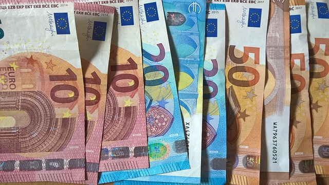

# Project summary

|  | An assessment of cross-border tobacco purchases and associated tax losses in France |
|----|----|
| **Project details** | Smoking is a major public health problem, causing many preventable diseases worldwide. In recent decades, increasing the price of tobacco has become the main strategy used by governments to reduce smoking. However, price differences between certain neighbouring countries are likely to limit the effectiveness of this measure by allowing some consumers to buy tobacco at a lower price in a neighbouring country. Although the problem of cross-border shopping is not new, the extent of the phenomenon remains poorly understood and is still the subject of regular debate. This study contributes to its assessment in France by exploiting an unprecedented natural experiment : the closure of land borders between March 2020 and June 2020 as part of the fight against the Covid-19 pandemic. |
| **Players** | Insee |
| **Project results** | Results show that the closure of the borders led to a 9.5 % surplus in tobacco purchases in mainland France compared to the counterfactual situation in which the borders had remained open. This result probably underestimates cross-border purchases. In fact, some tobacco consumption abroad may have continued during the first lockdown, as the borders were not completely closed, in particular for cross-border workers. Extrapolating the consumption observed in the rest of the country to border regions with identical characteristics, the revenue generated in France would be about 13.5 % higher if there were no cheaper alternatives abroad. |
| **Project products and documentation** | \- [An assessment of cross-border tobacco purchases and associated tax losses in France](https://www.insee.fr/en/statistiques/8172204) Insee Working Papers No. 2024-06, April 2024 |

# Similar projects

##### Use of banking data for INSEE economic forecasts

1 Jun 2025

##### Methodological work on the Family Budget survey

Modernisation of the family budget survey using automatic classification tools

1 Jan 2022

##### Using credit card data and mobile phone data to forecast economic activity

The 2020 health crisis required a review of forecasting processes to be more responsive to events. INSEE used credit card transaction data to forecast economic activity.

1 Dec 2020

##### What do the electricity production and consumption data say about economic activity during the containment period?

Using electricity production and consumption data to forecast economic activity

1 Dec 2020

##### Population movements around the March 2020 containment using mobile phone network operators data

INSEE has had access to mobile telephony data as part of the monitoring of the 2020 health crisis. These data were used to produce the following statistics on population…

1 Nov 2020

##### Classification of checkout data using machine learning

Using machine learning to classify scanner data in the COICOP nomenclature to calculate the CPI

1 Jan 2020

##### Urban segregation: insights from mobile phone data

Merging administrative data and MNO data to estimate urban segregation at a local level

1 Jan 2018
