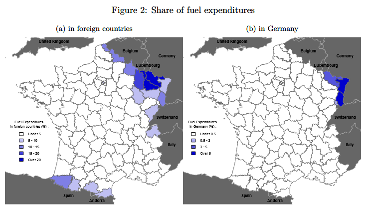
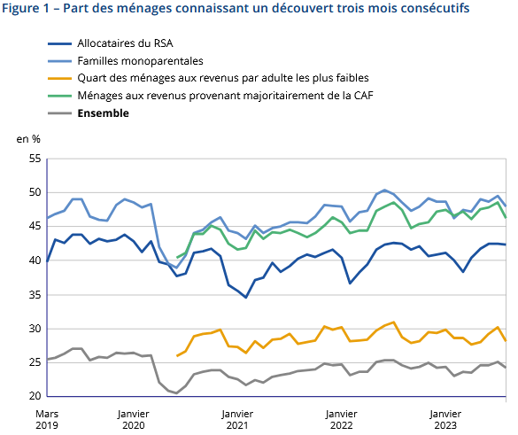
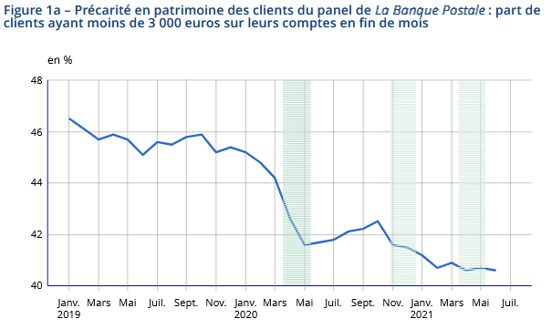

# Project summary

[TABLE]

# Similar projects

##### An assessment of cross-border tobacco purchases and associated tax losses in France

Using the closing of borders in 2020 as a natural experiment to measure cross-border tobacco purchases

1 Jan 2024

##### Methodological work on the Family Budget survey

Modernisation of the family budget survey using automatic classification tools

1 Jan 2022

##### Using credit card data and mobile phone data to forecast economic activity

The 2020 health crisis required a review of forecasting processes to be more responsive to events. INSEE used credit card transaction data to forecast economic activity.

1 Dec 2020

##### What do the electricity production and consumption data say about economic activity during the containment period?

Using electricity production and consumption data to forecast economic activity

1 Dec 2020

##### Population movements around the March 2020 containment using mobile phone network operators data

INSEE has had access to mobile telephony data as part of the monitoring of the 2020 health crisis. These data were used to produce the following statistics on population…

1 Nov 2020

##### Classification of checkout data using machine learning

Using machine learning to classify scanner data in the COICOP nomenclature to calculate the CPI

1 Jan 2020

##### Urban segregation: insights from mobile phone data

Merging administrative data and MNO data to estimate urban segregation at a local level

1 Jan 2018

# Other studies using bank data

Insee has also carried out other studies using bank account data. They are available on INSEE website:

##### The economy as told by banking data - What our account statements say about us (French only)

Courrier des statistiques n°12, Insee, Décembre 2024

1 Dec 2024

##### Cross-border shopping for fuel at the France-Germany border

Insee working documents n°2024-08, mai 2024

1 May 2024

##### Household finance on a day‑to-day basis

Insee Analyses n°90, December 2023

1 Dec 2023

##### Financial insecurity slightly up due to rising inflation, though lower in August 2022 than before the pandemic

Insee Analyses n°76, October 2022

1 Oct 2022

##### A measurement of marginal propensity to consume after external shocks using bank account data

Journées de méthodologie statistique 2022

1 Oct 2022

##### Impact of the health crisis on an anonymised panel of La Banque Postale customers

Insee Analyses n°69, November 2021

1 Nov 2021
