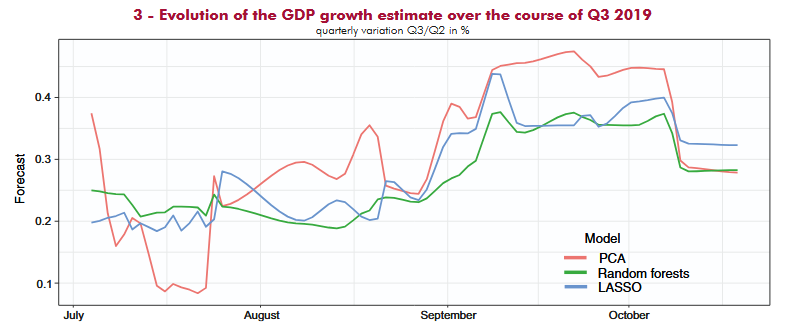

# Project summary

|  | Comparison of continuous GDP forecasting methods with a bottom-up method |
|----|----|
| **Project details** | INSEE bases its GDP growth forecasts on a so-called bottom-up model, which involves reproducing the mechanism for constructing quarterly accounts. The question arises, however, as to the performance of such an approach to forecasting GDP compared with that of a direct method such as *nowcasting*. A direct approach makes it possible to forecast GDP growth directly from business cycle series, without using quarterly accounts. In order to study the relative performance of the two approaches, we developed a new bottom-up forecasting model for GDP growth in France, inspired by the Federal Reserve Bank of Atlanta’s “GDPNow” model. |
| **Players** | Insee |
| **Project results** | At the beginning of the quarter, the direct approach performs slightly better than the bottom-up approach: few quantitative indicators are available at that time, and the added value represented by the use of a complete accounting framework is limited compared with a direct model, which is naturally more parsimonious. From the end of the second month onwards, on the other hand, more quantitative indicators become available, and the bottom-up approach performs slightly better than the direct approach estimated in this study, particularly at the time of publication of the Business Review. Finally, the difference in performance between the two approaches is clear between the end of the quarter and the publication of the first estimates of the quarterly accounts thirty days later: during this period, it is much better to use the information available via a bottom-up approach rather than a direct approach. |
| **Project products and documentation** | \- [How do the direct and bottom-up approaches compare in forecasting GDP for the current quarter?](https://www.insee.fr/en/statistiques/8642689?sommaire=8642697) INSEE Economic Outlook - September 2025 |

# Similar projects

##### Use of banking data for INSEE economic forecasts

1 Jun 2025

##### GDP Tracker: a tool for continuous economic forecasting

Models of *machine learning* for real-time forecasting (*nowcasting*) to feed INSEE’s economic analyses

1 Jan 2022

##### Predicting growth by reading the newspaper

Use continuous press articles to build an indicator to help forecast growth

1 Mar 2021

##### Using credit card data and mobile phone data to forecast economic activity

The 2020 health crisis required a review of forecasting processes to be more responsive to events. INSEE used credit card transaction data to forecast economic activity.

1 Dec 2020

##### What do the electricity production and consumption data say about economic activity during the containment period?

Using electricity production and consumption data to forecast economic activity

1 Dec 2020
