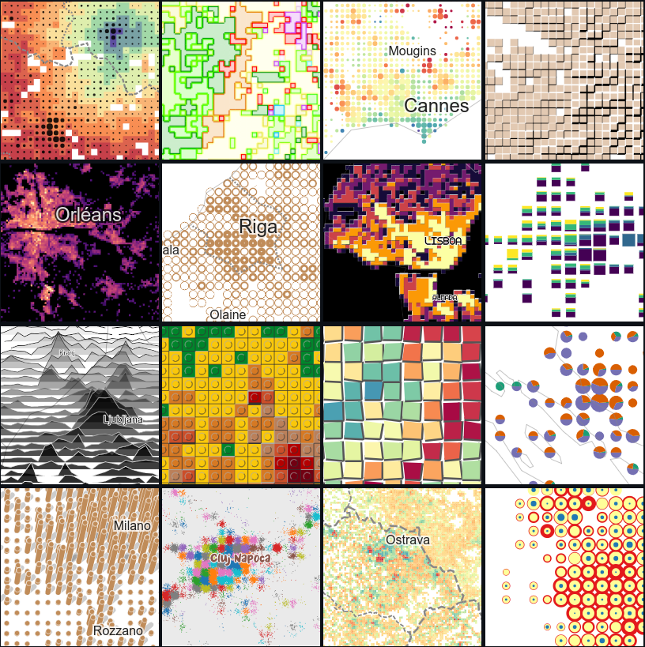

Présentation par Julien Gaffuri de la [librairie `Gridviz`](https://eurostat.github.io/gridviz/). Le **replay est [disponible plus bas 👇](#replay)**

`Gridviz` est une librairie *open source* ([disponible sur `Github`](https://github.com/eurostat/gridviz)) consacrée à la visualisation cartographique de données carroyées (ou données géolocalisées par des *(x,y)* à carroyer). Très efficace, elle permet de représenter de manière fluide des volumes importants de données.

## Support et replay

Le support est disponible [ici](https://minio.lab.sspcloud.fr/ssphub/diffusion/website/2023-01-gridviz/gridviz.pdf).
