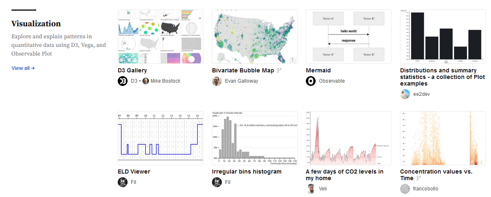
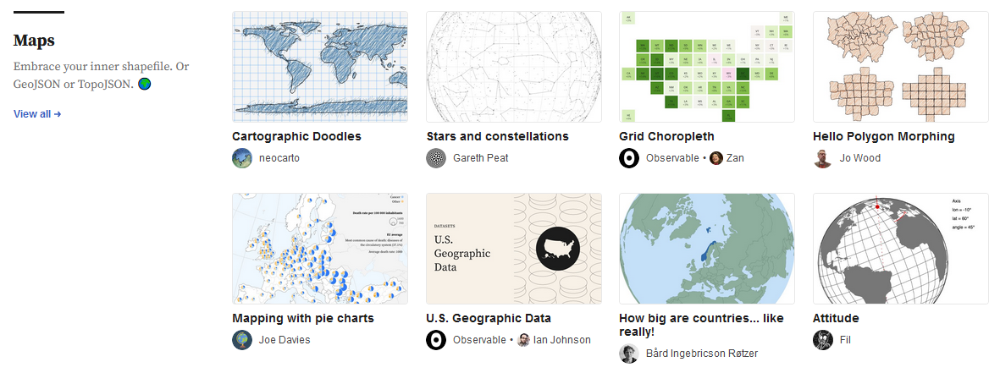

Présentation d’[`observable`](https://observablehq.com/explore) par [Nicolas Lambert](https://observablehq.com/@neocartocnrs) sous la forme d’un [*notebook* interactif](https://observablehq.com/@neocartocnrs/observable-et-donnees-spatiales).

Le replay est [disponible plus bas 👇](#replay)

[`observable`](https://observablehq.com/) est une plateforme de dataviz réactive qui propose des notebooks communautaires de visualisations de données:

Quelques ressources supplémentaires utiles:

- Les habitués de `ggplot2` trouveront sans doute [ce *notebook*](https://observablehq.com/@observablehq/plot-from-ggplot2) utile ;
- Présentation de l’utilisation de `duckdb` pour l’utilisation dans `Observable` de données volumineuses par [ici](https://observablehq.com/@observablehq/duckdb) ;
- Documentation sur l’usage d’`Observable` avec `quarto` par [là](https://quarto.org/docs/interactive/ojs/).

## Replay
