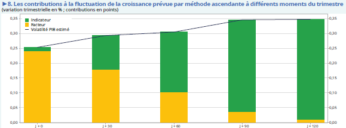
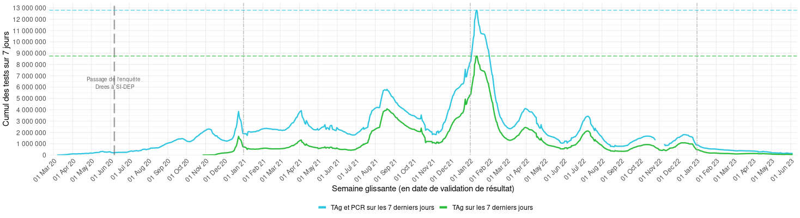
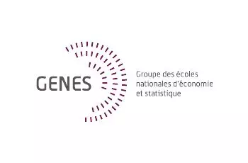
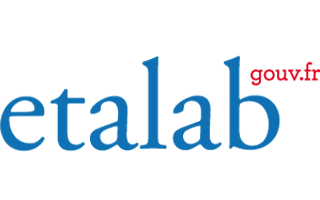

``` js
// echo: false
// output: false
inscrits = 730
```

``` js
// echo: false
badge = html`<a href="https://grist.numerique.gouv.fr/o/ssphub/forms/jSjAV3L2F8mmiRVuVEpfF7/103">
</a>
`
```

Le réseau des data scientists de la statistique publique

``` js
// echo: false
html`${badge}`
```

Le `SSPHub` centralise et vise à faire connaître le contenu créé par le réseau des *data scientists* du [Service Statistique Publique (SSP)](https://www.insee.fr/fr/information/1302192).

Une présentation du réseau est disponible sur la page [à propos](about.llms.md). Pour en savoir plus sur les objectifs du réseau, sa philosophie, et ses modes d’actions, vous pouvez découvrir le [Manifeste 📜](manifeste.llms.md) écrit collectivement.

  

## Les dernières actualités et contenus du réseau


##### Génération de commentaire de graphiques : retour d’expérience sur les statistiques agricoles et pistes d’amélioration

Le **14 avril (14h00 - 14h30)**, le SSM Agriculture a présenté son travail pour générer des commentaires de graphiques automatiquement.

14 avr. 2026


##### Génération de commentaire de graphiques : retour d’expérience sur les statistiques agricoles et pistes d’amélioration

Le **14 avril (14h00 - 14h30)**, le SSM Agriculture vient présenter leur travail pour générer des commentaires de graphiques automatiquement.

14 avr. 2026


##### LLM, fusées et lapins cartographes : bienvenue dans le tur-fu

Infolettre du mois de **mars 2026**

31 mars 2026

## Les derniers billets de blog et événements

L’ensemble des billets de blog peut être retrouvé sur la [page dédiée](blog.llms.md), tout comme les [événements](event.llms.md).


##### Génération de commentaire de graphiques : retour d’expérience sur les statistiques agricoles et pistes d’amélioration

Le **14 avril (14h00 - 14h30)**, le SSM Agriculture a présenté son travail pour générer des commentaires de graphiques automatiquement.

14 avr. 2026


##### Génération de commentaire de graphiques : retour d’expérience sur les statistiques agricoles et pistes d’amélioration

Le **14 avril (14h00 - 14h30)**, le SSM Agriculture vient présenter leur travail pour générer des commentaires de graphiques automatiquement.

14 avr. 2026


##### Analyse textuelle de documents longs : cas des accords d’entreprise

Le **18 mars (14h00 - 15h30)**, la DARES a présenté leur travail sur les conventions collectives ou accords d’entreprise.

18 mars 2026


##### Françoise Bahoken et Nicolas Lambert, présentation de leur livre Cartographia

Le **13 janvier (14h30 - 15h30)**, Françoise Bahoken et Nicolas Lambert nous ont présenté leur dernier livre…

13 janv. 2026


##### Troisième journée du SSPHub

Programme et modalités d’inscription à la 3e journée du réseau

1 déc. 2025


##### Atelier - Comment récupérer des données sous format Parquet ?

Le format `Parquet` est un format de données connaissant une popularité importante du fait de ses caractéristiques techniques (orientation colonne, compression…

16 avr. 2025

##### Atelier - Comment récupérer des données par API ?

Les API **(Application Programming Interface)** sont un mode d’accès aux données en expansion. Grâce aux API, l’automatisation de scripts est facilitée puisqu’il n’est plus…

9 avr. 2025

##### Deuxième journée du SSPHub

Programme et modalités d’inscription à la 2e journée du réseau

14 oct. 2024

##### Quarto : Une évolution de R Markdown pour des travaux statistiques reproductibles

Pour fiabiliser la production de documents construits en valorisant des données (tableaux, graphiques, etc.), *RStudio* (devenu *Posit* depuis) a construit il y a quelques…

2 mai 2024

##### Eric Mauvière, “La dataviz pour donner du sens aux données et communiquer un message”

Le **29 février (15h - 16h)**, Eric Mauvière nous fera une présentation, avec de nombreux exemples issus de la statistique publique, de la manière dont une visualisation de…

29 févr. 2024

##### Guide d’utilisation des données du recensement de la population au format `Parquet`

Un post de blog pour accompagner la mise à disposition des données détaillées du recensement au format `Parquet`.

23 oct. 2023

##### Onyxia: l’infrastructure cloud mère des dragons

Les technologies cloud sont incontournables dans l’écosystème de la donnée. Pour ne pas se rendre dépendante de fournisseurs de services externes, l’Insee a développé un…

10 mai 2023

##### Première journée du SSPHub

Replay de la première journée de présentation du SSPHub

29 mars 2023

##### “OCRisation, état de l’art et projets auxquels participe Teklia” par Christopher Kermorvant

Le 29 mars de 15h à 16h nous recevons Christopher Kermorvant, chercheur spécialisé en OCRisation et fondateur de Teklia. Il nous fera un état de l’art de l’OCRisation puis…

29 mars 2023

##### Présentation du projet Meta Academy - Carpentries

Pour favoriser l’adoption des langages `R`, `Python` et `Git` dans les administrations, le programme `ModernStat` piloté par l’OCDE et Statistics Canada, a lancé un projet…

28 mars 2023

##### Présentation des packages R et Python pour accéder à l’open data de l’Insee

[L’Insee met à disposition ses données par le biais d’](event/presentation-des-packages-r-et-python-pour-acceder-a-lopen-data-de-linsee/index.llms.md)[API](https://api.insee.fr/catalogue/) ou par son [site web](https://www.insee.fr/fr/accueil). Pour faciliter la…

13 févr. 2023

##### Polars, une alternative fraîche à Pandas

Polars, une alternative moderne et fluide à `Pandas`

10 févr. 2023

##### Présentation de gridviz par Julien Gaffuri

[Evénement de présentation de](event/presentation-de-gridviz-par-julien-gaffuri/index.llms.md) [`gridviz`](https://eurostat.github.io/gridviz/) par [Julien Gaffuri](https://github.com/jgaffuri) (Eurostat)

20 janv. 2023

##### Infolettre n°9

Après la rétrospective de l’année 2022 de la *data science*, il est temps de se pencher sur l’année du réseau avec des visualisations interactives produites grâce à…

10 janv. 2023

##### Rétrospective de l’année 2022

[La *data science* a beaucoup fait parler d’elle en 2022, notamment du fait des deux coups médiatiques d’](blog/retrospective2022/index.llms.md)[openAI](https://openai.com/), à savoir…

31 déc. 2022

##### Evénement de clôture de la saison 1 du programme 10%

Le **5 décembre**, a lieu l’**événement de clotûre de la saison 1 du programme 10%**. Au programme, restitution des \[projets portés cette…

5 déc. 2022

##### Présentation d’Observable par Nicolas Lambert

[observable](https://observablehq.com/) est la nouvelle plateforme de dataviz réactive. Initiée par Mike Bostock (créateur de D3.js), ce réseau social de la dataviz a pour…

16 nov. 2022

##### Le plongement lexical ou comment apprendre à lire à un ordinateur

Introduction aux méthodes de traitement du langage naturel.

3 oct. 2022

##### Funathon de juin 2022

Présentation du deuxième Funathon du SSPLab organisé le 20 juin 2022 autour de 9 sujets, en R et en Python.

19 juin 2022

##### Le *machine learning* aux Journées de la Méthodologie Statistique 2022 (JMS)

Revue des présentations en lien avec les travaux en *machine learning* aux JMS de 2022

6 avr. 2022

##### Funathon de juin 2021

Présentation du premier Funathon du SSPLab organisé le 21 juin 2021 autour de 8 sujets, en R et en Python, à partir de données Airbnb

20 juin 2021

##### Parallélisation des traitements : Hadoop MapReduce vs Spark

1 juin 2016

## Les projets innovants du SSPHub

L’ensemble des projets innovants peut être retrouvé sur la [page dédiée](project.llms.md).


##### sndsTools, un package R pour l’extraction de recours aux soins dans les données de santé du SNDS

Le package R `sndsTools` facilite l’extraction de recours aux soins à partir des données de santé du Système National de Données de Santé (SNDS) hébergées sur le portail de…

17 mars 2026



##### Comparaison des prévisions entre *nowcasting* et approche ascendante

Utilisation de modèles de prévisions en temps réel (*nowcasting*) inspiré du « GDPnow » de la Réserve Fédérale d’Atlanta pour prévoir la croissance du PIB et comparaison…

1 sept. 2025


##### Exploitation de données bancaires pour les prévisions de croissance du PIB

Analyse du comportement des ménages à partir de données de comptes bancaires pour les prévisions de croissance économique, pendant la crise sanitaire et entre 2023 et 2024

1 juin 2025


##### Une évaluation des achats transfrontaliers de tabac et des pertes fiscales associées en France

Exploitation d’une expérience naturelle, la fermeture des frontières en 2020, pour mesurer la part d’achats transfrontaliers de tabac

1 janv. 2024


##### scanR, une application pour observer le paysage de la recherche et de l’innovation en France

Agrégation et mise à disposition de données massives sur la recherche et l’innovation en France par des visualisations, des moteurs de recherche ElasticSearch et des API

1 janv. 2024



##### Visualisations des données liées aux tests du SARS-Cov2

Publication hebdomadaire des données liées aux tests de détection du SARS-Cov2 par Shiny à partir du système d’information SI-DEP

1 juin 2023

##### Doremifasol

Le package R Doremifasol facilite la récupération des données Insee pour les data scientists. La librairie est open source, disponible sur…

1 janv. 2023

##### pynsee, un package Python  pour récupérer les données de l’Insee

Le package `pynsee` facilite la récupération des données Insee pour les data scientists. La librairie est open source, disponible sur Github.

1 janv. 2023

##### Utilisation des images satellites pour la statistique publique

Utiliser les images satellites pour améliorer le recensement de la population dans les territoires ultra-marins

1 oct. 2022

##### Curiexplore, la plateforme de comparaison des politiques nationales d’enseignement et de recherche

Visualisation interactive de l’environnement de l’enseignement et de la recherche dans les différents pays.

1 janv. 2022

##### Travaux méthodologiques sur l’enquête Budget de Famille

Modernisation de l’enquête budget des familles par utilisation d’outils de classification automatique

1 janv. 2022

##### Jocas, webscraping des offres d’emploi en ligne

Le projet `Jocas` (Job offers collection and analysis system) permet à la DARES (Service statistique ministériel Travail) de collecter automatique des offres d’emploi en…

1 janv. 2022

##### Baromètre de la science ouverte

Pour être en mesure de suivre l’ouverture des publications scientifiques (objectif de la stratégie nationale de science ouverte), le service statistique du Ministère de…

1 janv. 2022

##### Codification automatique de l’activité principale des entreprises

Développer un algorithme de machine learning pour automatiser la classification de l’activité principale des entreprises et mise en production

1 janv. 2022

##### Détecter la cybercriminalité dans les procédures

Détection des infractions relevant de la cyberdélinquance à partir d’une analyse textuelle des manières d’opérer

1 juin 2021

##### Modélisation de l’appartenance au parc des véhicules routiers et de son utilisation

Appariement de bases administratives et modélisation pour estimer le nombre de véhicules routiers en France

1 juin 2021

##### Indices des prix à la consommation des nuitées hôtelières : l’expérience du webscraping d’une plateforme de réservation en ligne

Exploration des apports du *webscraping* pour mesurer le prix des nuitées hôtelières dans l’IPC

1 juin 2021

##### Prévoir la croissance en lisant le journal

Utiliser les articles de presse en continu pour construire un indicateur aidant à prévoir la croissance

1 mars 2021

##### Comparaison des méthodes d’appariement et apport du machine learning

Tester et comparer différentes méthodes d’appariements afin de dégager des recommandations pour les travaux nécessaires à la construction des répertoires, notamment dans le…

1 janv. 2021

##### Extraction automatique du tableau des filiales et participations des comptes sociaux des entreprises

Extraire les informations de tableaux de comptes sociaux, en particulier des tableaux des filiales et participations, contenus dans des images scannées mises à disposition…

1 janv. 2021

##### Codification automatique des professions dans la nomenclature PCS 2020

Codifier automatiquement les professions dans le cadre de la bascule vers la nouvelle nomenclature PCS (PCS 2020)

1 janv. 2021

##### Utilisation de données de cartes bancaires et de téléphonie mobile pour prévoir l’activité économique

La crise sanitaire de 2020 a nécessité de revoir les processus de prévision pour être plus réactif face aux événements. Dans ce cadre, l’Insee s’est appuyé sur les données…

1 déc. 2020

##### Que disent les données de production et de consommation d’électricité sur l’activité économique en période de confinement ?

Utilisation des données de production et de consommation d’électricité pour prévoir l’activité économique

1 déc. 2020

##### Mouvements de population autour du confinement de mars 2020 grâce aux données de téléphonie mobile

L’Insee a eu accès à des données de téléphonie mobile dans le cadre du suivi de la crise sanitaire de 2020. Ces données ont permis de produire les statistiques sur les…

1 nov. 2020

##### Webscrapper les caractéristiques des produits pour améliorer la mesure de l’inflation

Collecter sur le web les caractéristiques des produits pour améliorer la prise en compte des effets qualité dans l’indice des prix à la consommation

1 juin 2020

##### Classification des données de caisse à partir de machine learning

Classifier des données de caisse dans la nomenclature COICOP par machine learning pour le calcul de l’IPC

1 janv. 2020

##### « GDP Tracker » : un outil pour des prévisions économiques en continu

Modèles de *machine learning* pour effectuer des prévisions en temps réel (*nowcasting*) pour alimenter les analyses conjoncturelles de l’Insee

1 déc. 2019

##### Codification automatique de l’activité des associations

Codification automatique de l’activité des associations à partir de méthodes de machine learning

1 juin 2019

##### Détecter et traiter les valeurs aberrantes ou manquantes, application à la Déclaration Sociale Nominative

Utilisation des méthodes de machine learning pour la détection et le traitement des valeurs aberrantes ou manquantes, application à la Déclaration Sociale Nominative

1 janv. 2018

##### Ségrégation urbaine : un éclairage par les données de téléphonie mobile

Croisement de données administratives et de données de téléphonie pour analyser la ségrégation au niveau local

1 janv. 2018

## Les dernières *newsletters*

Toutes les *newsletters* précédemment publiées sont disponibles sur la [page dédiée](infolettre/infolettre.llms.md).


##### LLM, fusées et lapins cartographes : bienvenue dans le tur-fu

Infolettre du mois de **mars 2026**

31 mars 2026


##### L’IA dans l’oeil du cyclone

Infolettre du mois de **février 2026**

28 févr. 2026


##### La première infographie

Infolettre du mois de **janvier 2026**

30 janv. 2026


##### Qui pour financer l’open source?

Infolettre du mois de **décembre 2025**

10 déc. 2025


##### De belles cartographies, des packages R et l’importance des données d’entraînement pour l’IA

Infolettre du mois d’**octobre 2025**

25 oct. 2025


##### La rentrée 2025: actualités, nouveautés, interview de rentrée

Infolettre du mois de **Septembre 2025**

29 sept. 2025

##### Sora, la nouvelle IA d’OpenIA pour générer des vidéos ; Le Chat, le nouveau modèle de Mistral ; Observable, pour s’abstraire des notebooks

Infolettre du mois de **Mars 2024**

7 mars 2024

##### Le RAG pour limiter l’hallucination par l’IA ; l’avancée des bases de données vectorielles ; le format Parquet pour simplifier leur usage ; DuckDB débarque en version web

Infolettre du mois de **Février 2024**

20 janv. 2024

##### Rétrospective du réseau en 2023 (cocorico, beaucoup de nouveaux inscrits !) ; des nouvelles règles européennes pour l’IA ; le recensement de la population au format parquet ; un explorateur de fichier sur le SSPCloud

Infolettre du mois de **Décembre 2023**

21 déc. 2023

##### Coûts d’entrée trop élevés pour l’entraînement des modèles de langage qui s’orientent vers l’opensource ; LlaMaA et Falcon les nouveaux LLM

Infolettre de rentrée, **Septembre 2023**

10 sept. 2023

##### Propositions de lecture estivale

Infolettre estivale, **Juillet 2023**

1 juil. 2023

##### Des innovations rapides sur l’IA qui lancent un débat sur sa place dans la société ; algorithme de recommandation de Twitter

Infolettre du mois d’**Avril 2023**

1 avr. 2023

##### Tapis rouge et graph de l’Insee ; questionnement sur l’IA ; faillite dans la Silicon Valley

Infolettre du mois de **Mars 2023**, deuxième quinzaine

15 mars 2023

##### ChatGPT continue de faire parler ; Arrow et Polars pour le traitement de données tabulaires ; l’API Huggingface accessible depuis un navigateur web

Infolettre du mois de **Mars 2023**

1 mars 2023

##### DoReMiFaSol pour récupérer des données de l’Insee ; une masterclass datascientest sur les NLP et l’analyse d’images

Infolettre du mois de **Février 2023**

30 janv. 2023

##### Retex sur 2022, première année du réseau des datascientists ; snapshot de l’état du réseau à date ; présentation de Gridviz

Infolettre du mois de **Janvier 2023**

10 janv. 2023

##### L’année 2022 dans le monde de la data science : IA, transformation de RStudio, Observable

Infolettre du mois de **Décembre 2022**

31 déc. 2022

##### Archive des infolettres et lettres Big Data

Les infolettres et lettres Big Data antérieures 👵👴, avant la publication sous forme de blog

31 août 2022

## Les réseaux partenaires

Quelques communautés de la data-science avec lesquels nous collaborons


##### CoP OCDE

Le groupe *Community of Practice* de l'OCDE est un réseau informel organisé autour des sujets d'innovation statistique.


##### Eurostat & les *trusted smart statistics (TSS)*

Eurostat encadre les réseaux des instituts nationaux de statistiques et les travaux européens autour de l'exploration de nouvelles sources de données et des nouveaux outils de datascience pour la statistique officielle



##### L'ENSAE, l'ENSAI et le CREST

L'ENSAE, l'ENSAI sont des écoles d'ingénieur en statistiques, science des données et analyse économique. Le CREST est un centre rassemblant des enseignants-chercheurs d’économie de l’École polytechnique et du CNRS


##### La chaire Finance digitale

L’objectif de la chaire est de conduire des travaux de recherche sur l’ensemble des innovations, de services, de produits ou d’organisations en lien avec le numérique, susceptibles de modifier le métier de l’intermédiaire financier. Elle est le fruit d'un partenariat entre Télécom Paris, l’université Paris II Panthéon-Assas, l’Institut Louis Bachelier, le Groupement des Cartes Bancaires (CB), la Caisse des Dépôts et l'Insee.



##### Lab IA (Etalab) & la DINUM

La communauté des data scientists et acteurs de l’IA pour l’administration française et plus généralement la DINUM


##### Onyxia

[La communauté Onyxia, à l'origine du](https://datalab.sspcloud.fr/home) [SSPCloud](https://datalab.sspcloud.fr/), a pour objectif de fournir une plateforme flexible pour expérimenter les outils modernes de la *data-science*.


##### Spyrales

Une communauté d'agents de l'Etat pour s'entraider en R et Python


##### UNECE ML Group

Le travail de recherche du Groupe ML est divisé en 5 groupes de travail visant à traiter différentes problématiques liées à l'utilisation de l'apprentissage automatique pour les statistiques officielles.


##### grrr

[`Grrr`](https://app.slack.com/client/T9ML8RLMP) (*"pour quand votre `R` fait `Grrr`"*) est un groupe [`Slack`](https://app.slack.com/client/T9ML8RLMP) (plateforme de discussion instantanée) francophone dédié aux échanges et à l’entraide autour de `R`. Il s'agit du point central de la communauté `R` francophone. Il est ouvert à tou.te.s et se veut accessible aux débutants. Vous pouvez même utiliser un pseudonyme si vous préférez.
