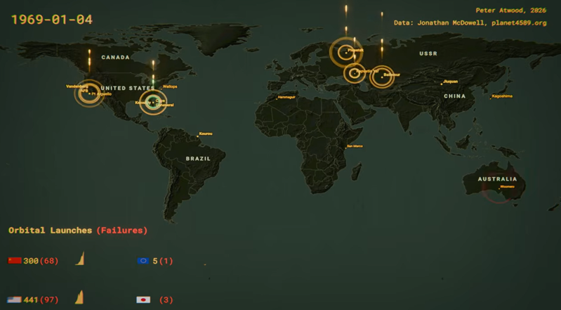
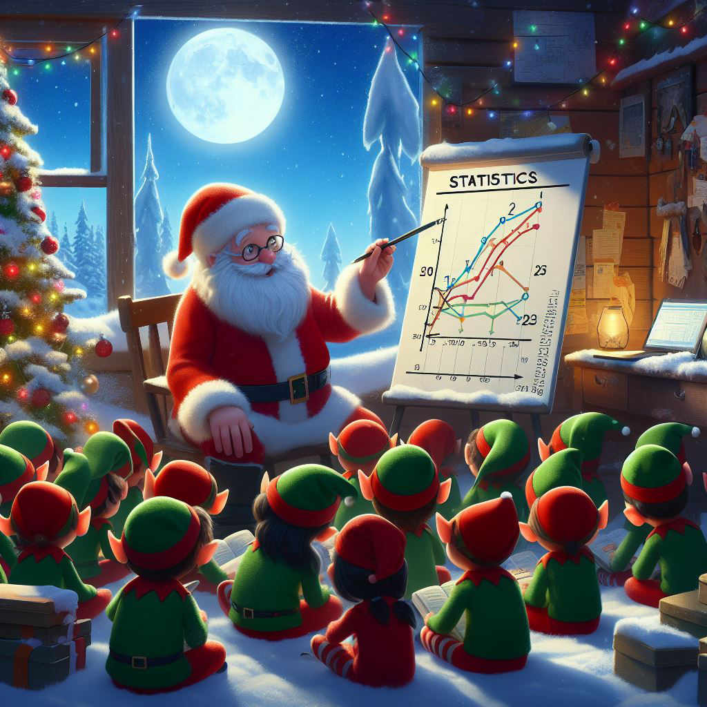
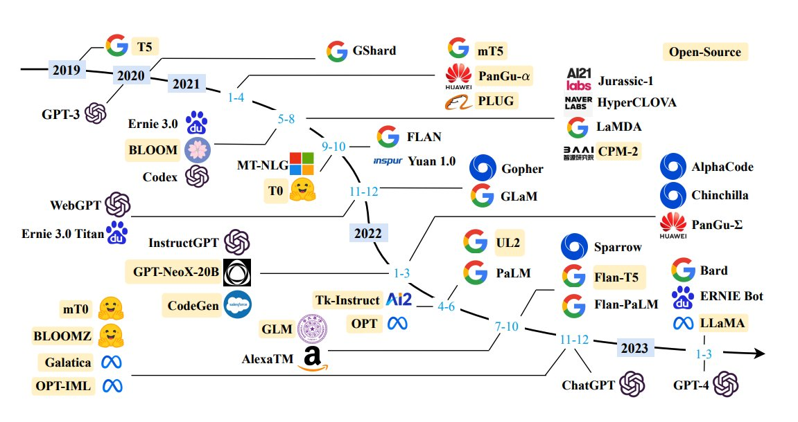
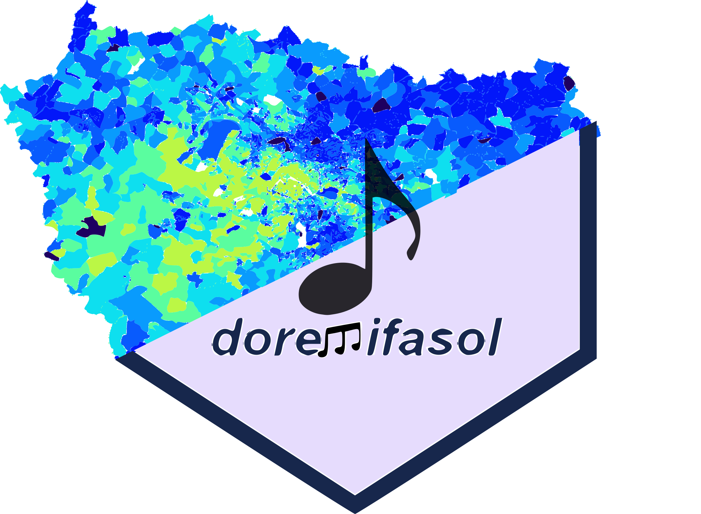
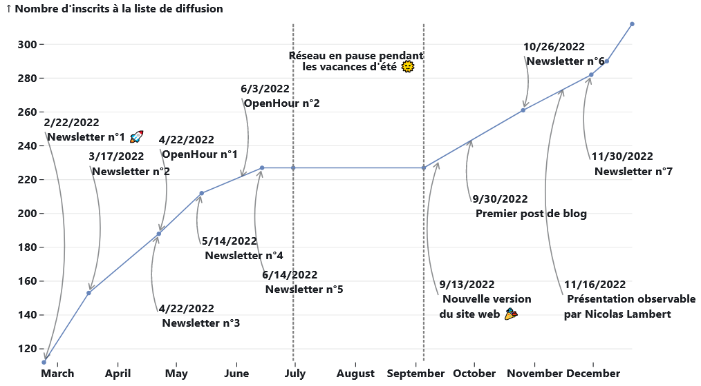

##### LLM, fusées et lapins cartographes : bienvenue dans le tur-fu

Infolettre du mois de **mars 2026**

31 mars 2026

##### L’IA dans l’oeil du cyclone

Infolettre du mois de **février 2026**

28 févr. 2026

##### La première infographie

Infolettre du mois de **janvier 2026**

30 janv. 2026

##### Qui pour financer l’open source?

Infolettre du mois de **décembre 2025**

10 déc. 2025

##### De belles cartographies, des packages R et l’importance des données d’entraînement pour l’IA

Infolettre du mois d’**octobre 2025**

25 oct. 2025

##### La rentrée 2025: actualités, nouveautés, interview de rentrée

Infolettre du mois de **Septembre 2025**

29 sept. 2025

##### Sora, la nouvelle IA d’OpenIA pour générer des vidéos ; Le Chat, le nouveau modèle de Mistral ; Observable, pour s’abstraire des notebooks

Infolettre du mois de **Mars 2024**

7 mars 2024

##### Le RAG pour limiter l’hallucination par l’IA ; l’avancée des bases de données vectorielles ; le format Parquet pour simplifier leur usage ; DuckDB débarque en version web

Infolettre du mois de **Février 2024**

20 janv. 2024

##### Rétrospective du réseau en 2023 (cocorico, beaucoup de nouveaux inscrits !) ; des nouvelles règles européennes pour l’IA ; le recensement de la population au format parquet ; un explorateur de fichier sur le SSPCloud

Infolettre du mois de **Décembre 2023**

21 déc. 2023

##### Coûts d’entrée trop élevés pour l’entraînement des modèles de langage qui s’orientent vers l’opensource ; LlaMaA et Falcon les nouveaux LLM

Infolettre de rentrée, **Septembre 2023**

10 sept. 2023

##### Propositions de lecture estivale

Infolettre estivale, **Juillet 2023**

1 juil. 2023

##### Des innovations rapides sur l’IA qui lancent un débat sur sa place dans la société ; algorithme de recommandation de Twitter

Infolettre du mois d’**Avril 2023**

1 avr. 2023

##### Tapis rouge et graph de l’Insee ; questionnement sur l’IA ; faillite dans la Silicon Valley

Infolettre du mois de **Mars 2023**, deuxième quinzaine

15 mars 2023

##### ChatGPT continue de faire parler ; Arrow et Polars pour le traitement de données tabulaires ; l’API Huggingface accessible depuis un navigateur web

Infolettre du mois de **Mars 2023**

1 mars 2023

##### DoReMiFaSol pour récupérer des données de l’Insee ; une masterclass datascientest sur les NLP et l’analyse d’images

Infolettre du mois de **Février 2023**

30 janv. 2023

##### Retex sur 2022, première année du réseau des datascientists ; snapshot de l’état du réseau à date ; présentation de Gridviz

Infolettre du mois de **Janvier 2023**

10 janv. 2023

##### L’année 2022 dans le monde de la data science : IA, transformation de RStudio, Observable

Infolettre du mois de **Décembre 2022**

31 déc. 2022

##### Archive des infolettres et lettres Big Data

Les infolettres et lettres Big Data antérieures 👵👴, avant la publication sous forme de blog

31 août 2022
