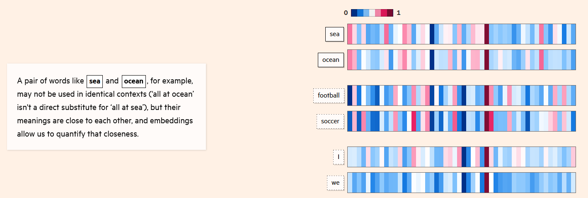
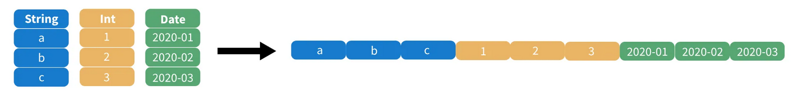

> **TIP:**
>
> ***Vous désirez intégrer la liste de diffusion ? L’inscription se fait [ici](https://grist.numerique.gouv.fr/o/ssphub/forms/jSjAV3L2F8mmiRVuVEpfF7/103).***

En ce début d’année 2024, nous prenons un peu de recul sur l’année écoulée et vous présentons les avancées marquantes de l’année 2023 dans le domaine de la data science. Ces avancées concernent l’intelligence artificielle générative, au cœur des débats médiatisés, mais aussi plusieurs développements technologiques très utiles pour l’analyse et la diffusion de bases de données. Des éléments plus techniques, qui ne sont pas nécessaires à la compréhension globale, sont présents dans des encadrés déroulables ou sont référencés dans les sections *“Pour en savoir plus”*.

La fin de la *newsletter* est consacrée à quelques annonces sur les prochains événements communautaires du réseau.

## Panorama des avancées ayant eu lieu en 2023 dans le domaine de la data science

### Les IA génératives toujours au coeur des débats

Dans la continuité de la sortie de `ChatGPT` en décembre 2022, les IA génératives ont continué en 2023 à focaliser une part importante de l’attention portée à la *data science*. Outre la publication de GPT-4 en mars (modèle embarqué dans la version Pro de `ChatGPT`), de nombreux grands modèles de langage (LLM) généralistes ont été publiés cette année : `Llama-2` (Meta), `Mixtral 7B` (Mistral), `Falcon 180B` (Technology Innovation Institute), `PaLM 2` (Google)…

Ces publications ont mis en avant le caractère stratégique de la mise à disposition de modèles *open source*. La récupération et la structuration de corpus massifs, l’entraînement de modèles intégrant des milliards de paramètres et l’évaluation *ex post* de ceux-ci est à la portée d’un nombre restreint d’acteurs. La publication en *open source* de modèles et de codes sources est dès lors indispensable pour, entre autres, être en mesure d’évaluer la pertinence scientifique des modèles ou permettre aux acteurs n’ayant pas ces moyens techniques et humains de pouvoir tout de même réutiliser ces modèles sur leurs propres données.

Néanmoins, malgré l’ouverture progressive de modèles, notamment par le biais d’une mise à disposition sur la plateforme `Hugging Face`, des contraintes limitent encore la réutilisation de ces modèles dans des infrastructures internes. Ces réseaux de neurones étant très gourmands en calculs du fait de leur architecture complexe (des milliards de paramètres pour les grands modèles de langage), afin d’obtenir une réponse du modèle il est généralement nécessaire d’effectuer les calculs par le biais de cartes graphiques (GPU), celles-ci permettant plus de parallélisme dans les calculs que les processeurs (CPU). Cependant, comme les GPU sont plus consommatrices d’énergie et plus coûteuses à l’achat du fait notamment d’une demande excédant l’offre, l’accès à cette ressource est limité pour de nombreux acteurs. Le retour à des modèles plus légers, pouvant être exploités depuis des architectures informatiques plus accessibles, constitue l’un des défis de l’année 2024.

Les débats concernant les droits d’exploitation commerciale d’informations collectées sur internet ont été nombreux en 2023. Après les plaintes médiatisées de *Getty Images* (envers Stability AI), d’un collectif d’auteurs célèbres (envers OpenAI), la grève des acteurs à Hollywood contre l’exploitation de leur image par des IA et des scénaristes contre l’utilisation des générateurs de texte, c’est maintenant le *New York Times* qui a déposé en décembre 2023 une plainte envers OpenAI auprès de la Cour Fédérale de Manhattan. A partir d’exemples, le journal américain met en avant le degré de confiance élevé que `ChatGPT` attribue aux informations issues des articles du quotidien, sans pour autant en citer la provenance, ni compenser financièrement le journal. Cela entraînerait un préjudice commercial dû à la réduction du trafic sur le site du *New York Times*. A contrario, le journal met en avant l’effet négatif sur son image que peuvent avoir des hallucinations attribuées au quotidien. Cette plainte fait suite à l’échec des négociations entre les deux acteurs au cours de l’année 2023. Ces actualités relatives aux droits d’auteurs interviennent dans un contexte où il s’agit de l’un des principaux axes d’intervention de l’*“Artificial Intelligence Act”* européen (voir [Infolettre \#16](../../infolettre/infolettre_16)).

> **NOTE:**
>
> - Un [article](https://www.washingtonpost.com/technology/interactive/2023/ai-chatbot-learning/?itid=mc_magnet-ai_inline_collection_1) du *Washington Post* sur le corpus d’entraînement des LLM ;
> - Un [article](https://ig.ft.com/generative-ai/) du *Financial Times* qui présente de manière très pédagogique la manière dont fonctionnent les LLM ;
> - Un [tutoriel](https://huggingface.co/docs/transformers/llm_tutorial) sur les LLM par `Hugging Face` ;
> - Un [article](https://www.nytimes.com/2023/08/16/technology/ai-gpu-chips-shortage.html) du *New York Times* sur la pénurie de GPU ;
> - Un article du site spécialisé *[The Verge](https://www.theverge.com/2023/12/4/23988403/getty-lawsuit-stability-ai-copyright-infringement)* sur les dernières évolutions de la plainte de *Getty Images* ;
> - Un article de [*Courrier International*](https://www.courrierinternational.com/article/litterature-george-r-r-martin-jonathan-franzen-et-john-grisham-partent-en-guerre-contre-chatgpt) sur la plainte d’un collectif d’auteurs envers OpenAI ;
> - *New York Times vs OpenAI* par [le *Monde*](https://www.lemonde.fr/pixels/article/2023/12/27/le-new-york-times-poursuit-en-justice-microsoft-et-openai-createur-de-chatgpt-pour-violation-de-droits-d-auteur_6207946_4408996.html) et le [*New York Times*](https://www.nytimes.com/2023/12/27/business/media/new-york-times-open-ai-microsoft-lawsuit.html) ;
> - Les chartes relatives au contenu produit par des IA génératives du [gouvernement britannique](https://www.gov.uk/government/publications/generative-ai-framework-for-hmg/generative-ai-framework-for-hmg-html) et d’une vingtaine de médias français recensés par l’[INA](https://larevuedesmedias.ina.fr/les-medias-face-lintelligence-artificielle-20-chartes-passees-au-crible).

### Des avancées scientifiques en arrière plan

La tendance des LLM à l’hallucination, c’est-à-dire à la production de contenu plausible par sa forme mais factuellement faux, a été l’objet d’inquiétudes quant à la véracité des informations pouvant être mises en avant par les IA amenées à occuper une place croissante dans la diffusion de contenu. Pour faire face à ce défi, au cours de l’année 2023, les équipes de conception des LLM ont utilisé de manière croissante la technique du **RAG (*Retrieval Augmentated Generation*)**. Celle-ci consiste, pour les modélisateurs, à cadrer le comportement du LLM en faisant en sorte qu’il privilégie des informations issues d’un corpus adapté spécialement à une tâche. Pour faire l’analogie avec l’apprentissage humain, les modèles où le RAG intervient peuvent être comparés à des étudiants préparant une dissertation s’appuyant sur un dossier préparé par les évaluateurs. Ce contexte pourra être utilisé pour construire une réponse argumentée et des exemples plus pertinents.

Le succès des IA de discussion comme `ChatGPT` est intrinsèquement lié au travail humain qui a été mis en œuvre pour évaluer la pertinence des réponses proposées par le modèle afin de régulièrement mettre à jour le comportement du modèle. Sur une question donnée, l’humain évalue la réponse la plus pertinente faite par l’IA. A partir d’un volume suffisant d’évaluations, l’algorithme pourra, dans les prochaines situations similaires, faire un choix plus pertinent s’il apprend de ses erreurs. La technique ayant gagné cette année en popularité pour cette tâche est la **DPO (*Direct Preference Optimization*)** qui vise à simplifier l’intégration des retours humains dans le cycle de réentraînement d’un modèle. Cette problématique de supervision et d’amélioration continue d’un modèle dépasse d’ailleurs le cadre des modèles de langage : afin de s’assurer que les algorithmes ne perdent pas en qualité, l’évaluation humaine par le biais, par exemple, de campagnes de labellisation ou de retours des utilisateurs, est un enjeu important dans le cycle de vie de tout modèle mis en production.

> **NOTE:**
>
> - La vidéo [“State of GPT”](https://www.youtube.com/watch?v=bZQun8Y4L2A) par Andrew Karpathy ;
> - Un [tutoriel](https://huggingface.co/blog/ray-rag) sur le RAG par *Hugging Face* ;
> - Le [blog](https://openai.com/research/learning-from-human-preferences) présentant la technique du *Reinforcement learning with human feedbacks* par OpenAI ;
> - L’[article académique](https://arxiv.org/pdf/2305.18290.pdf) présentant la DPO et un [tutoriel](https://huggingface.co/blog/pref-tuning) d’*Hugging Face* ;
> - Un [article de blog](https://www.deeplearning.ai/the-batch/issue-231/) d’Andrew Ng sur la DPO.

### Les bases de données vectorielles gagnent en popularité

Le langage de programmation `Python` est le [point d’entrée de référence](https://www.tiobe.com/tiobe-index/) dans le domaine de la *data science*, mais pour des besoins plus spécialisés, des logiciels dédiés viennent s’y intégrer.

C’est le cas notamment des bases de données vectorielles comme [`ChromaDB`](https://www.trychroma.com/). Ces bases facilitent la recherche de similarité entre documents textuels en exploitant des transformations de ceux-ci en vecteurs numériques (technique des [*embeddings*](https://ig.ft.com/generative-ai/)).

Par exemple, dans l’image ci-dessous, une base de données vectorielle pourra évaluer la similarité entre les termes en utilisant des techniques d’algèbre linéaire de manière plus efficace que ne le permettrait `Python`. Ce dernier est en effet un langage informatique généraliste, moins performant que des logiciels spécialisés pour faire de la recherche de similarité dans des corpus massifs. Dans une chaîne de production exploitant ce type de technique, `Python` servira de point d’entrée et déléguera ensuite les calculs complexes à la base de données vectorielle.

Un exemple d’*embedding* et de rapprochement de textes. Chaque bande représente une dimension latente de notre langage. Il est possible de rapprocher les termes à partir de celles-ci. Source: [*Financial Times*](https://ig.ft.com/generative-ai/).

> **NOTE:**
>
> - Le *framework* [`LangChain`](https://www.langchain.com/) pour construire par le biais de `Python` des applications utilisant des LLM : création d’une interface pour poser des questions à un LLM, transformation de la question en vecteur numérique par le biais d’une base vectorielle comme `ChromaDB`, interrogation du LLM, renvoi à l’utilisateur d’une réponse… ;
> - Un [tutoriel de realpython.com](https://realpython.com/chromadb-vector-database/) sur [`ChromaDB`](https://www.trychroma.com/).

## Diffuser des données au format `Parquet` pour simplifier leur usage

Dans le domaine de la diffusion des données *open data*, l’Insee a expérimenté le format `Parquet` à deux reprises pendant l’année 2023. En premier lieu, pour la diffusion des données du [Répertoire Electoral Unique](https://www.insee.fr/fr/metadonnees/source/serie/s1046). Plus récemment, ce sont les données détaillées du recensement de la population qui ont été diffusées dans ce format, accompagnées d’un [guide d’utilisation](../../blog/parquetRP) mis en ligne sur le blog du SSP Hub (plus de détails dans l’[infolettre \#16](../../infolettre/infolettre_16)).

*Quelques exemples de retours sur la publication des données détaillées du recensement au format `Parquet`.*

Le format de données `Parquet` est très intéressant pour les *data scientists* intéressés par le traitement de données volumineuses. Il permet des gains de performance importants par rapport au CSV sans être dépendant d’un logiciel propriétaire (contrairement aux formats `.sas7bdat`, `dbase`, etc.). Par exemple, les données détaillées du recensement diffusées par l’Insee pèsent 450Mo au format `Parquet` contre 5Go au format CSV. Des outils de traitement optimisés existent pour faciliter l’utilisation de ce format. Parmi ceux-ci, cette année a été marquée par la montée en puissance de `DuckDB`. Il s’agit d’un logiciel qui est utilisable par le biais des principaux langages maîtrisés par les *data scientists* : [`Python`](https://duckdb.org/docs/api/python/overview.html), [`R`](https://duckdb.org/docs/api/r.html), [`JavaScript`](https://duckdb.org/docs/api/wasm/overview.html) ou directement en ligne de commande.

Sa capacité à gérer de grandes quantités de données en faisant des requêtes SQL optimisées sur un fichier au format `Parquet` rend `DuckDB` particulièrement approprié pour le traitement de données volumineuses (voir les éléments plus techniques, ci-dessous). Avec ce logiciel, les données du recensement peuvent être lues en quelques secondes alors qu’il fallait plusieurs dizaines de minutes dans les précédents formats. Pour des utilisateurs de l’écosystème de l’*open data* ou pour des organisations dont le patrimoine de données prend plus la forme de fichiers que de bases de données `PostGreSQL`, `DuckDB` est une opportunité technologique permettant de valoriser des données dont le traitement et la diffusion nécessitait jusqu’à présent des ressources computationnelles importantes.

> **NOTE:**
>
> Ressources techniques:
>
> - Un [*notebook* ](https://datalab.sspcloud.fr/launcher/ide/rstudio-sparkr?autoLaunch=true&init.personalInit=%C2%ABhttps%3A%2F%2Fraw.githubusercontent.com%2FInseeFrLab%2Fformation-bceao%2Fmain%2Ftp%2Finit-tp.sh%C2%BB&resources.limits.memory=%C2%AB100Gi%C2%BB&persistence.size=%C2%AB40Gi%C2%BB) sur `DuckDB` issu d’une [formation de l’Insee](https://inseefrlab.github.io/formation-bceao/) donnée à la BCEAO ;
> - Une [fiche sur `Arrow`](https://www.book.utilitr.org/03_fiches_thematiques/fiche_arrow), l’écosystème sous-jacent à `DuckDB`, dans la documentation collaborative `utilitR` ;
> - Le [post de blog](../../blog/polars/) sur la librairie `Polars`, une approche alternative à `DuckDB` ;
> - L’[explorateur de données du SSPCloud](https://datalab.sspcloud.fr/data-explorer?source=https%3A%2F%2Fstatic.data.gouv.fr%2Fresources%2Frecensement-de-la-population-fichiers-detail-individus-localises-au-canton-ou-ville-2020-1%2F20231023-122841%2Ffd-indcvi-2020.parquet) qui repose sur `DuckDB`.
>
> Données diffusées par la statistique publique au format `Parquet` :
>
> - Les données du [Répertoire Electoral Unique](https://www.data.gouv.fr/fr/datasets/bureaux-de-vote-et-adresses-de-leurs-electeurs/#/resources) ;
> - Le guide d’utilisation des données du recensement de la population au format Parquet sous forme de [billet de blog](../../blog/parquetRP/). Voir aussi l’[*infolettre \#16*](../../infolettre/infolettre_16) ;
> - Les [données de la délinquance enregistrée par la police et gendarmerie nationales](https://www.linkedin.com/feed/update/urn:li:activity:7163102904906678272/) publiées par le service statistique ministériel de la sécurité intérieur publiées au format Parquet.
>
> Sur le format `Parquet` :
>
> - Un [article](https://www.insee.fr/fr/information/7635827?sommaire=7635842) sur le format `Parquet` dans le *Courrier des stats n°9* écrit par Alexis Dondon et Pierre Lamarche ;
> - Le blog d’[Eric Mauvière](https://www.icem7.fr/outils/3-explorations-bluffantes-avec-duckdb-1-interroger-des-fichiers-distants/) qui présente une série d’articles sur le format `Parquet` ;
> - La [présentation](https://www.linkedin.com/feed/update/urn:li:activity:7133760348129505281?updateEntityUrn=urn%3Ali%3Afs_feedUpdate%3A%28V2%2Curn%3Ali%3Aactivity%3A7133760348129505281%29) de Romain Lesur sur le sujet pour l’atelier *Modernisation of Official Statistics* de l’UNECE.

> **TIP:**
>
> Il existe principalement deux approches pour stocker, organiser et mettre à disposition des jeux de données structurés sous forme tabulaire : les **fichiers** et les **bases de données relationnelles**.
>
> Les bases de données relèvent d’une approche systémique. Un système de gestion de base de données (SGBD) est un logiciel qui gère à la fois le stockage d’un ensemble de données reliées, permet de mettre à jour celles-ci (ajout ou suppression d’informations, modification des caractéristiques d’une table…) et qui gère également les modalités d’accès à la donnée (type de requête, utilisateurs ayant les droits en lecture ou en écriture…). L’un des logiciels les plus connus dans le domaine est `PostgreSQL`.
>
> D’un autre côté, le stockage de données tabulaires sous forme de fichiers offre une approche plus décentralisée et flexible. Par rapport à des bases de données, les fichiers sont plus faciles à créer, partager et stocker et ne nécessitent pas systématiquement des logiciels spécialisés pour leur manipulation. Le stockage sous la forme de fichier consiste à organiser l’information présente dans un jeu de données dans des fichiers, de manière brute. Ces données peuvent être analysées sans recourir à un logiciel spécialisé. Même dans le cadre de formats propriétaires, comme le `.xlsx` ou `.sas7bdat`, le fait d’avoir une certaine forme de standardisation rend possible, même si ce n’est jamais parfaitement fiable, de lire ces données avec un autre logiciel que celui prévu initialement.
>
> La logique de la base de données est donc très différente de celle du fichier. Par rapport à une base de données, l’approche des fichiers présente plusieurs avantages, à condition de privilégier des formats libres.
>
> En premier lieu, les fichiers sont moins adhérents à un logiciel gestionnaire. Une transition d’un logiciel de traitement vers un autre n’implique pas de changer la source brute. En outre, alors que le traitement des bases de données nécessite l’intermédiation du logiciel de gestion adapté, les utilisateurs de `Python` ou `R` peuvent utiliser des fichiers à partir d’une librairie, donc un système beaucoup plus léger, qui sait comment transformer la donnée pour la retravailler depuis `Python` ou `R`.
>
> Pour ces raisons, entre autres, il est plus pratique pour des utilisateurs finaux de données d’avoir accès à des fichiers plutôt qu’à des bases de données, à condition d’avoir les ressources computationnelles suffisantes pour pouvoir traiter ces fichiers.
>
> Néanmoins, cette condition d’accès à des ressources computationnelles suffisantes peut représenter une contrainte limitante dans un environnement où les données sont de volume croissant. Dans les environnements où la volumétrie des données était importante, les bases de données ont connu une certaine popularité puisqu’elles permettaient de gérer efficacement de grandes quantités de données. Comme, de plus, les bases de données offraient une gestion plus fine et fiable des droits d’accès et d’écriture sur les bases que ne le permettaient des fichiers, cette approche a pu connaître une certaine popularité.
>
> Le développement conjoint de formats de stockages orientés objets (comme le protocole `S3`, utilisé par les systèmes *cloud* modernes à l’image du `SSPCloud`) et d’outils de traitement efficaces comme `DuckDB` permet d’associer les avantages de ce dernier à ceux d’un système cohérent de fichiers partagés (lecture/écriture optimisées, dissociation des utilisateurs pouvant lire et écrire un fichier…).
>
> Techniquement, `DuckDB` fonctionne de manière optimale avec des fichiers au format `Parquet`. Ce format de données, orienté colonne, permet en effet d’optimiser des traitements classiques des *data scientists* : sélectionner seulement certaines colonnes d’un jeu de données, regrouper des données pour faire des calculs d’agrégats, etc.
>
> 
>
> Une illustration du principe du stockage orienté colonne (Source: [Michael Berk](https://towardsdatascience.com/demystifying-the-parquet-file-format-13adb0206705))
>
> Par exemple, dans le schéma ci-dessus, si on ne s’intéresse qu’aux dates enregistrées, il suffit de ne prendre que le bloc de données *ad hoc*. Il n’est pas nécessaire de lire tout le fichier pour ne garder que les dates, comme ce serait le cas avec un format CSV.

## De la *data science* depuis un navigateur

Le gain de popularité de `DuckDB` au cours de l’année 2023 s’explique en partie grâce à sa version web qui permet d’exécuter des traitements de données par le biais de navigateurs web, sans avoir à installer de logiciel spécialisé comme `Python` ou . C’est une approche typique du [*web assembly*](https://developer.mozilla.org/fr/docs/WebAssembly) qui consiste à mettre à disposition des logiciels de calculs scientifiques par le biais d’un simple navigateur grâce à `Javascript` , qui est disponible sur tout navigateur. Cette approche est intéressante pour les institutions proposant des *data visualisations* car elle peut permettre de mettre en oeuvre des manipulations de données complexes directement depuis la source brute par le biais du navigateur, donc sans recourir à des serveurs externes hébergés dans des *cloud*.

> **NOTE:**
>
> Il est maintenant possible de faire du `R` directement depuis un navigateur *web* grâce à [`webR`](https://docs.r-wasm.org/webr/latest/), une librairie développée par *Posit* en 2023 et qui porte la grammaire `R` dans le navigateur sans recourir à `Shiny` (exemple à tester 👇️).
>
> L’idée est que le code d’analyse de données est en `R` mais qu’en arrière plan c’est du `Javascript` qui servira à l’exécution. La librairie est encore jeune mais celle-ci est prometteuse pour faciliter la transition entre du code d’analyse de données en `R` et une application interactive.
>
> Un exemple plus complexe, utilisant le *package* `ggplot2`:

> **NOTE:**
>
> - La [documentation officielle](https://docs.r-wasm.org/webr/latest/) de `WebR` ;
> - [Un *post*](https://thinkr.fr/retour-vers-le-turfu-r-le-web-et-webr/) sur le *web assembly* par *ThinkR* ;
> - L’extension [`quarto-webR`](https://quarto-webr.thecoatlessprofessor.com/) qui permet d’encapsuler du code `webR` dans un site web statique construit avec `Quarto` ;
> - Une [démonstration](https://observablehq.com/@hrbrmstr/webr-0-2-2-in-observable) de `WebR` sur `Observable`.

## Prochains événements du réseau

### “La dataviz pour donner du sens aux données et communiquer un message” par Eric Mauvière (📅 29 février, 15h-16h)

Le **29 février (15h - 16h)**, Eric Mauvière nous fera une présentation, avec de nombreux exemples issus de la statistique publique, de la manière dont une visualisation de données peut être construite pour transmettre un message clair aux lecteurs. Cette présentation permettra d’évoquer les bonnes pratiques et les outils simples pour construire des visualisations de données faciles à lire et à comprendre afin de rendre le message intelligible, efficace et utile à un large spectre de publics.

Cet événement aura lieu en visio sur [Zoom](https://insee-fr.zoom.us/j/92487784559?pwd=WVdsNUFNWXhUNnJYUW56WFdyNHlNdz09), il est ouvert à tous les membres du réseau. Pour les agents de la DG de l’Insee, une retransmission en salle 4-C-458 est organisée pour assister à la présentation puis échanger à l’issue de celle-ci.

Éric Mauvière est statisticien, passé par la diffusion et les études régionales de l’Insee. Il a ensuite créé le logiciel cartographique web `Géoclip` utilisé, par exemple, par le site <https://statistiques-locales.insee.fr/>. Plus récemment, il a participé à la conception du site <https://vizagreste.agriculture.gouv.fr/>, portail de visualisation de données du service statistique ministériel du ministère de l’Agriculture et de la Souveraineté alimentaire. Depuis 3 ans, au sein d’`Icem7`, il participe à la diffusion de connaissances sur les problématiques de *dataviz* et forme sur mesure en sémiologie graphique et analyse de données.

- [Invitation outlook](https://minio.lab.sspcloud.fr/ssphub/diffusion/website/2024-02-09-mauviere/_La%20dataviz%20pour%20donner%20du%20sens%20aux%20données%20et%20communiquer%20un%20message_%20par%20Eric%20Mauvière.ics)
- Lien [Zoom](https://insee-fr.zoom.us/j/92487784559?pwd=WVdsNUFNWXhUNnJYUW56WFdyNHlNdz09)

### Masterclass datascientest

De nouvelles *masterclass* en partenariat avec `datascientest` seront organisées prochainement. Un questionnaire pour recenser les besoins, similaire à celui proposé l’an dernier, sera transmis prochainement pour évaluer le contenu à prioriser.

### Programme 10%

La saison 3 du programme 10% démarre prochainement. Ce programme, issu des recommandations du [rapport de l’Inspection Générale de l’Insee et de la DINUM](https://www.numerique.gouv.fr/uploads/RAPPORT-besoins-competences-donnee.pdf), permet à des experts de la donnée de l’administration de monter en compétence en consacrant jusqu’à 10 % de leur temps de travail à des projets transversaux, à des formations ou encore à des moments informels qui favorisent l’échange entre pairs.

Le premier événement de la saison aura lieu le **11 mars 2024 au Lieu de la Transformation Publique** (Paris XV). L’objectif de cette journée est de définir collectivement les projets mutualisables pouvant entraîner des collaborations entre *data scientists* de différentes administrations pendant l’année 2024.  
Plus d’informations à venir sur le [site du programme](https://www.10pourcent.etalab.gouv.fr/).

- Inscription sur [Eventbrite](https://www.eventbrite.fr/e/billets-programme-10-journee-dideation-829916611927).

### Autoformation de découverte à `Python`

Depuis quelques semaines, une nouvelle formation est apparue au catalogue de formation de l’Insee et sur le [portail de formation du SSPCloud](https://www.sspcloud.fr/formation) : une **auto-formation de découverte de `Python`**, construite et mentorée par les équipes innovation de l’Insee.

Chaque chapitre de formation, disponible sous la forme de *notebooks `Jupyter`*, peut être ouvert en un clic à partir du [catalogue de formation](https://www.sspcloud.fr/formation?search=&path=%5B%22Initiation%20%C3%A0%20Python%22%5D) du `SSPCloud`. Ces ressources sont disponibles en continu, au-delà des périodes délimitées pour la formation.

Des cycles de 6 semaines pendant lesquels les participants peuvent bénéficier d’un mentorat ont vocation à être organisés régulièrement. Les premiers formés selon cette modalité ont commencé leur apprentissage en ce début d’année 2024.

Ce système de mentorat prend deux formes :

- tout au long de la formation : vous pouvez poser toutes vos questions sur le canal Tchap dédié ; les mentors de la formation répondent rapidement, afin que vous ne restiez jamais bloqué ;
- ponctuellement : une visio est réalisée si vous le désirez avec 1-2 mentors afin de pouvoir discuter plus en détail des problèmes que vous pouvez rencontrer.

Ce système de mentorat a l’avantage à la fois de favoriser une pédagogie par la pratique continue qui a fait ses preuves pour l’apprentissage des langages de programmation, tout en laissant à chacun la possibilité d’avancer à son rythme.

Les dates des prochains cycles de mentorat seront prochainement communiquées. Il est néanmoins possible, en attendant, d’explorer les ressources disponibles sur le `SSPCloud` ainsi que rejoindre le [canal `Tchap` `SSPy - Formation "Initiation à Python"`](https://matrix.to/#/#sspy:agent.finances.tchap.gouv.fr) afin d’échanger sur celle-ci (poser des questions de compréhension, comprendre un *bug*, assister les collègues bloqués, etc.).
