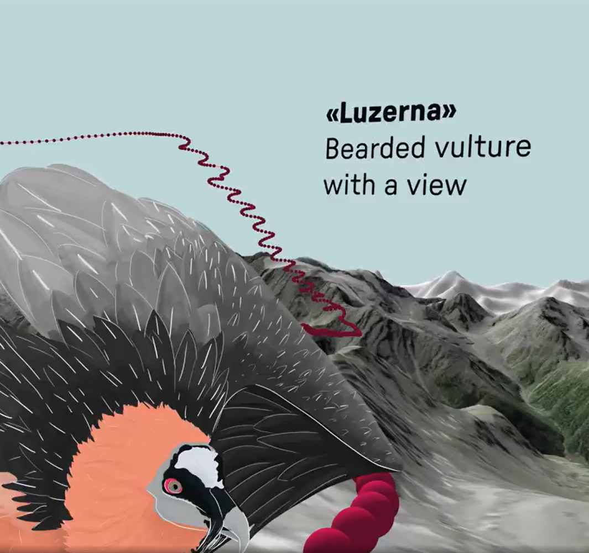

Bienvenue à la **vingtième infolettre** ! Il est temps de se mettre au défi de respecter ce qui a été dit il y a quelques semaines : une newsletter par mois ga-ran-tie je vous ai dit. Bon, à l’époque, je ne savais pas qu’un mois ça voulait dire 4 semaines et que 4, c’est pas beaucoup 🙃. Allez, on y va !

Bonne lecture 📔 !

# L’infographie

Beaucoup d’infographies ce mois-ci, le choix a été dur. Pour une fois, partons sur une vidéo réalisée par [Fabian Lang](https://www.fabianlang.net/schweizer-bergwelten/) : le trajet d’un gypaète barbu suivi par GPS en 3D dans les Alpes suisses. La vraie infographie, en format vidéo, est disponible [ici](https://www.linkedin.com/posts/fbnlng_vulture-beardedvulture-cartography-activity-7274787245021188097-L9vj). Attention, vertige.

# Actus du réseau

## La troisième journée du réseau 📅 1 décembre - La Tréso (Malakoff)

Les **inscriptions** pour la troisième journée du réseau le 1^(er) décembre 2025 sont [ouvertes](https://www.eventbrite.com/e/billets-3e-journee-du-reseau-des-data-scientists-1664052518879?aff=oddtdtcreator). Si vous souhaitez présenter un sujet, n’hésitez pas à me contacter !

## Présentation de Cartographia - 📅 13 janvier 2026 - format mixte (Montrouge et en ligne)

[Françoise Bahoken](https://bsky.app/profile/fbahoken.bsky.social) et [Nicolas Lambert](https://bsky.app/profile/neocarto.bsky.social) vont venir nous parler de leur livre [Cartographia](https://neocarto.hypotheses.org/22669) et des questions de cartographie (!) passionnantes qu’ils y abordent. Cela se passera **le 13 janvier 2026** en début d’après-midi, en format mixte : présentiel (à la DG de l’Insee) et à distance. Nicolas Lambert était déjà intervenu pour nous présenter Observable, une librairie Javascript très pratique pour faire des dataviz ([ici](../../event/presentation-dobservable-par-nicolas-lambert/index.llms.md), pour rappel). Si cela vous intéresse, réservez donc votre début d’après-midi !

# Actualités

Ce mois-ci, place aux belles images et à la cartographie. L’IA reste omniprésente : les institutions cherchent à favoriser la réutilisation de leurs données, certains contournent les LLM avec des consignes écrites « en blanc sur blanc », et les données d’entraînement sont au centre de l’attention.

> **TIP:**
>
> Vous voyez d’autres sujets d’actualité intéressants ? N’hésitez pas à les partager sur le [groupe Tchap 💬](https://tchap.gouv.fr/#/room/#ssphub:agent.finances.tchap.gouv.fr) directement !

## Datavisualisation

- Une [belle carte](https://neocarto.hypotheses.org/21980) de **migration simulée au niveau infra-national** en zone endémique paludéenne africaine. Françoise Bahoken, son autrice, sera notre invitée début 2026.  
- Pour les passionnés d’espace, voici une [**carte en 3D et dynamique**](https://atlasof.space/) du système solaire, comprenant les planètes mais aussi les astéroïdes! Vous pouvez jouer avec le temps pour savoir où sera la Terre quand vous aurez 30/40/50/60/70 ans (spoiler alert : c’est cyclique), et vérifier aussi qu’aucun astéroïde ne passe sur la Terre d’ici là.
- Pour les autres candidats à l’infographie du mois :
  - pour voir l’ensemble des **livres publiés** en une seule carte interactive, cela donne [cela](https://phiresky.github.io/isbn-visualization/?).
  - la cheffe de l’infographie d’Epsiloon (magazine de sciences) a publié les étapes [avant / après](https://www.figma.com/proto/C8xDR9mlWX8kBV0crJr1IK/Les-infographies-d-Epsiloon?page-id=3102%3A2581&node-id=3102-2979&viewport=1040%2C640%2C0.18&t=h0dF40xsTRgqYfJi-8&scaling=scale-down-width&content-scaling=fixed&starting-point-node-id=3102%3A2583&hide-ui=1) de ses infographies. Je vous recommande celle sur les **habitudes de sommeil par pays**.
- Enfin, un petit jeu à la SUTOM en version graphique : un [**graphique par jour**](https://chartle.cc/), devinez le pays !

## Cartographie

- Des chercheurs de l’Université de Charles (en Tchéquie) et de Freiburg ont publié une (très belle) **taxonomie des bâtiments urbains**, disponible en ligne. Tout est [ici](https://urbantaxonomy.org) et vous pouvez explorer le bâti urbain de six pays d’Europe centrale et de l’est.  
- L’IGN a publié [une cartographie](https://www.ign.fr/publications-de-l-ign/institut/kiosque/publications/atlas_anthropocene/2025/Atlas-2025-risque-inondation.pdf) très détaillée des **risques d’inondation et de submersion** sur tout le territoire national, notamment grâce aux images LIDAR. Par exemple, vous habitez à Saint-Maur-des-Fossés? Vous pouvez y voir la simulation d’une inondation majeure chez vous.  
- Utiliser l’**IA pour faire des fonds de carte** à partir d’image satellite ? Cela semble bien fonctionner d’après ce [post](https://www.linkedin.com/posts/davidoesch_map-generation-geospatial-activity-7379129420801875968-yNzj).
- A partir des données d’utilisateurs de Facebook, des [chercheurs](https://www.pnas.org/doi/10.1073/pnas.2409418122) ont bâti des **indicateurs mensuels de flux migratoires** couvrant 181 pays.
- Après la prévisualisation de données Parquet en ligne, cette fois [ce site](https://developmentseed.org/stac-map/) permet de **visualiser très facilement des fichiers de données géographiques** types STAC (dont Geoparquet). Explications sur la plomberie [ici](https://developmentseed.org/blog/2025-09-02-stacmap/).
- La communauté Apache Sedona publie [**SedonaDB**](https://sedona.apache.org/latest/blog/2025/09/24/introducing-sedonadb-a-single-node-analytical-database-engine-with-geospatial-as-a-first-class-citizen/), un moteur de base de données analytique open source et pensé nativement aussi pour des données spatiales.

## Le reste c’est le R

- Le [package R tinytable](https://vincentarelbundock.github.io/tinytable/), permet de faire des **tableaux de qualité** en de multiples formats. L’ambition de ce package est d’être simple, léger (0 dépendance à des packages externes), flexible et de différencier les données de l’affichage.
- Le [package R redoc](https://r-consortium.org/all-projects/2025-group-1.html#reviving-redoc) devrait être mis à jour. Il permet notamment de **faire le lien entre Quarto, et la suite Office**, par exemple si vous générez des documents qui seront relus par des personnes utilisant Word comme outil de travail 😉.  
- En machine learning, quels sont les problèmes posés par des **classes d’apprentissage de tailles très différentes** ? Selon cet [article](https://datascience.stackexchange.com/questions/134389/is-class-imbalance-really-a-problem-in-machine-learning), il s’agit surtout 1/ d’avoir des métriques de performance adéquates, 2/ d’avoir un nombre absolu d’observations dans la classe minoritaire suffisant (et non une part dans le total) et enfin 3/ de faire attention à la fongibilité entre classes.

## IA

- Qu’est-ce que les **paramètres des modèles publiés** disent des données d’entraînement sous-jacentes, confidentielles ? Des chercheurs sont [allés fouiller](https://fi-le.net/oss/) ce que cache GPT-5.
- Du côté de **l’entraînement des modèles**, la gamme des données disponibles s’enrichit pour que ses données soient mieux reprises par l’IA. C’est un nouvel épisode de la course à ne pas finir page 15 des résultats Google ou page 259 des blogs Myspace.
  - **Wikidata**, qui stocke les données structurées de Wikipédia et consorts, propose maintenant ses données sous format de [données vectorielles](https://www.wikidata.org/wiki/Wikidata:Embedding_Project/October_1_2025_Release).
  - Un programme d’**harmonisation des metadata et d’API**, l’[Open Semantic Interchange Initiative](https://www.snowflake.com/en/blog/open-semantic-interchange-ai-standard/), a été lancé pour enrichir les données d’apprentissage et la précision des IA. L’idée est d’avoir un langage YAML commun pour permettre aux IA d’échanger des données de manière robuste, par exemple par API et sans perte de sens au fur et à mesure de leur traitement par des agents d’IA.
  - Une fois que l’on a les données, on cherche ensuite à savoir de **combien de GPU j’ai besoin pour entraîner mon modèle**. La Dinum a développé [un outil](https://github.com/etalab-ia/InfraScale) pour estimer ses besoins pour cette étape.
- Des faiblesses des modèles de LLM sont, comme toujours, remontées, notamment sur **l’importance des données d’apprentissage et d’un prompt propre**. Cela met notamment en valeur le fait que les modèles ne sont pour le moment pas très efficaces quand il s’agit de trier des CV ou des articles.
  - Le “prompt injection” : c’est l’idée de truquer l’IA dans son CV/projet d’article scientifique/sur Linkedin, par exemple avec des instructions écrites en « blanc sur blanc », pour avoir plus de chance d’être sélectionné/de détecter les messages écrits par l’IA. Cela marche à presque 100 % des cas selon [cet article](https://arxiv.org/pdf/2509.10248), d’autant plus que l’IA a un biais positif naturel.
  - Une [étude](https://www.anthropic.com/research/small-samples-poison) confirme que l’IA est **particulièrement sensible à la qualité de la donnée d’apprentissage**. Ainsi, 250 observations fausses suffisent pour empoisonner durablement un LLM, et ce **quel que soit sa taille**. Une [présentation intéressante](https://www.youtube.com/watch?v=zKW8sVIOCTY) à une conférence PyData présentait par ailleurs ce qu’il se passait quand on entraîne une IA sur des images générés par une IA, avec des résultats similaires.  
- Le site [**AI Darwin Awards**](https://aidarwinawards.org/nominees-2025.html) rassemble des exemples d’usage raté d’IA. Globalement, les cas d’usage où l’IA est mis directement face à un client peuvent rapidement mal tourner… Peut-être que [Diella](https://www.politico.eu/article/albania-apppoints-worlds-first-virtual-minister-edi-rama-diella/), la première et seule ministre à être une IA dans le monde, rejoindra cette liste ?
- Si vous voulez **comparer le résultat de deux LLM et leur empreinte carbone**, n’oubliez pas l’outil [ComparIA](https://comparia.beta.gouv.fr/) créé par une start-up d’État du ministère de la Culture.

# La non interview du mois

Pas d’interview finie en temps et en heure ce mois-ci, priorité au direct, ce sera donc (peut-être) le mois prochain !
