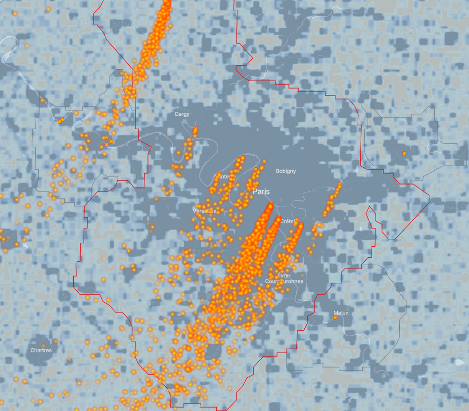
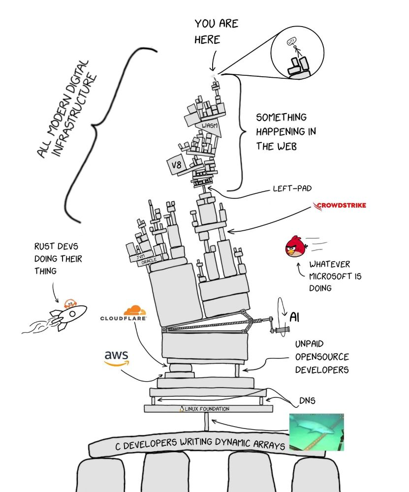

# Bienvenue à la **vingt et unième infolettre** !

Début décembre, c’est le deuxième moment dur de l’année après juin. En septembre, on se dit qu’on fera tout cela d’ici Noël, large. Et puis on se réveille, c’est déjà début décembre, la to-do-list est loin d’être finie et la préparation des fêtes de fin d’année arrive à grand pas.

Allez, courage, **dernier sprint** de 2025 !

# L’infographie

Ce mois-ci, découvrez un outil pour visualiser les **panaches de pollution aux particules fines (PM2.5)** émis par 9 500 sites les plus polluants dans plus de 2 500 zones urbaines. [**ClimateTRACE**](https://climatetrace.org) reconstitue une journée type de pollution par ces sites à partir des conditions météorologiques réelles.

Spoiler : la pollution de la centrale électrique d’Ivry s’envole jusque très très loin …

*source: [ClimateTRACE](https://climatetrace.org/air-pollution)*

# Actus du réseau

## La troisième journée du réseau a eu lieu le 1^(er) décembre

Le 1^(er) décembre 2025, le réseau a organisé sa troisième journée annuelle. Avec quatre présentations, deux interventions extérieures et un atelier de partage, cette édition a réuni une soixantaine de participants en présentiel et distanciel pour des échanges riches et constructifs. Merci à tous les participants pour leur participation active !

### Les présentations

1.  **Offre LLM du SSPCloud** : L’Insee (DIIT) a présenté les [nouvelles fonctionnalités](https://llm.lab.sspcloud.fr/) basées sur les modèles de langage (LLM) disponibles sur le SSPCloud, intégrant de manière plus poussée des fonctionnalités de complétion de code et d’analyses de données.
2.  **Extraction des compétences dans [JOCAS](https://dares.travail-emploi.gouv.fr/enquete-source/job-offers-collection-and-analysis-system)** : La Dares et l’Insee (DEE) ont partagé une version test de leur projet d’extraction des compétences numériques dans les offres d’emploi, combinant reconnaissance d’entités nommées et classification par LLM. Ce projet vise à améliorer l’analyse des métiers et des parcours professionnels.
3.  **Automatisation des infos rapides justice** : Le SSER (SSM Justice) a présenté son package R `chartegraphique.sser`, conçu pour automatiser la production des [infos rapides justice](https://www.justice.gouv.fr/documentation/etudes-et-statistiques?categories%5B%5D=394&items_per_page=10). Les détails techniques sont disponibles sur le site des [Journées de Méthodologie Statistique (JMS)](https://journees-methodologie-statistique.insee.net/automatisation-de-la-production-des-infos-rapides-justice-a-la-charte-graphique-du-sser-au-format-pdf-a-laide-dun-outil-combinant-rmarkdown-et-pagedown/).
4.  **Package de classification textuelle** : L’Insee (SSPLab) a présenté [torchTextClassifiers](https://pypi.org/project/torchtextclassifiers/), un package Python de classification textuelle, étendant fastText et reposant sur PyTorch. Ce package permet d’entraîner des modèles maisons à taille réduite en gardant le contrôle de leur architecture.

### Atelier collaboratif

Un atelier d’échange entre les participants a permis de partager nos pratiques quotidiennes d’utilisation des outils d’IA pour les data scientists et statisticiens :

1.  Quels sont nos cas d’usage?
2.  Quels outils privilégier, et quels sont leurs avantages et limites ?

Nos échanges, riches et nombreux, ont permis de partager des retours d’expérience concrets et nos bonnes (et moins bonnes) pratiques.

### Invités

1.  La **Dinum** a présenté les dernières évolutions de [data.gouv.fr](https://www.data.gouv.fr/), dont `data.pass`.
2.  L’**INA** a présenté [data.ina](https://data.ina.fr/), un portail pour construire des indicateurs de suivi des médias.

Les présentations et le replay de la journée sont disponibles sur la [page de l’événement](../../event/2025-12-01-network-day/index.llms.md).

## Prochain événement : présentation de Cartographia - 📅 13 janvier 2026 - format mixte (Montrouge et en ligne)

Le prochain événement du réseau sera le **13 janvier 2026**. [Françoise Bahoken](https://bsky.app/profile/fbahoken.bsky.social) et [Nicolas Lambert](https://bsky.app/profile/neocarto.bsky.social) viendront nous parler de leur livre [**Cartographia**](https://neocarto.hypotheses.org/22669) et des questions de cartographie passionnantes qu’ils y abordent.

Nicolas Lambert était déjà intervenu pour présenter [Observable](https://observablehq.com/), une librairie JavaScript très pratique pour faire des dataviz.

# Actualités

Une foule d’articles a été publiée dernièrement sur l’importance de l’open-source, son interdépendance avec les solutions payantes et le coût caché de sa maintenance. Et, bizarrement, il y a moins d’articles sur l’IA ce mois-ci 🤷‍♀️.

## Résilience et open-source

### Le monde numérique est très interdépendant

- De récents incidents ont rappelé que **notre monde numérique est très interdépendant** de solutions parfois lointaines. Un bug dans un logiciel ou service critique, open-source ou payant, se répercute ainsi rapidement à échelle mondiale. Cloudflare a par exemple connu une [panne le 18 novembre 2025](https://blog.cloudflare.com/18-november-2025-outage/)[^1], mettant KO de nombreux sites, y compris [downdetector](https://downdetector.fr/) qui signale les pannes. La panne était due à une mise en production (ratée du coup). De la même manière, une [panne de DNS chez Amazon Web Services](https://www.lemonde.fr/pixels/article/2025/10/21/aws-le-service-cloud-d-amazon-annonce-avoir-resolu-la-panne-qui-a-touche-des-applications-dans-le-monde-entier_6648232_4408997.html) le 20 octobre 2025 a perturbé de nombreuses applications dans le monde.

*En 2020, par [XKCD](https://www.explainxkcd.com/wiki/index.php/2347:_Dependency)*

*En 2025, par [Timothy A.](https://bsky.app/profile/flipperpa.bsky.social/post/3m63xgtlh4k2d)*

*La dépendance numérique en images*

### L’open source dépend du travail gratuit d’inconnus

- Au-delà de la simple interdépendance à des logiciels payants, le code open-source est souvent **maintenu bénévolement par des inconnus**, comme les secours en mer ou les pompiers volontaires.

Un [débat](https://thenewstack.io/ffmpeg-to-google-fund-us-or-stop-sending-bugs/) est ainsi apparu après que FFmpeg, un framework open-source vidéo largement utilisé (notamment par Chrome, Firefox ou YouTube), s’est retrouvé submergé de demande de correction de bugs, trouvés par l’IA de Google. Or dans l’open source, les bugs sont réparés par des mainteneurs, le plus souvent bénévoles, et qui ne peuvent plus suivre le rythme. Certaines personnes appellent ainsi Google, et plus largement les entreprises qui bénéficient de l’open-source et génèrent des revenus ~~supérieurs aux PIB de certains pays du monde~~, à financer directement la maintenance des logiciels open-source qu’ils utilisent même si ce n’est pas qu’une question de financement.

- Des sous, des sous, des sous, oui mais combien ? On parle étonnamment de sommes plutôt faibles : à titre de comparaison, la fondation qui gère **Python** a un budget annuel de 5 millions de dollars. On l’apprend notamment dans ce [billet de blog](https://pyfound.blogspot.com/2025/10/NSF-funding-statement.html) où la fondation explique pourquoi elle a refusé un financement de 1,5 million de dollars du gouvernement américain après l’avoir demandé (si vous n’avez pas le temps: c’est parce que le financement venait avec l’engagement de ne pas faire de promotion sur les thèmes de la diversité, de l’équité et de l’inclusion).

### Des alternatives existent

- **Blois** : La ville a choisi de prendre la fin des mises à jour de Windows 10 comme une opportunité et de basculer vers [PrimTux](https://www.blois.fr/info/2025/11/numeriquelibre-primtux), une distribution Linux éducative.
- **Cour internationale de justice (ICC)** : En 2025, la Cour internationale de justice (qui dépend de l’ONU) et 9 de ses magistrats ont été ciblés par des sanctions américaines. Cela serait en soit une histoire en termes de souveraineté, mais vous avez déjà plus d’info en bas de page [^2]. Le président de la Cour a ensuite perdu l’accès à ses mails. Les versions divergent ensuite : Microsoft a-t-il volontairement coupé l’accès du président à ses mails avant de le rétablir ou cela était-il juste un incident? Toujours est-il que la Cour internationale de justice a annoncé en octobre 2025 son intention de basculer vers **des solutions européennes[^3]**, comme rapporté par le [Handelsblatt (auf Deutsch 🇩🇪)](https://www.handelsblatt.com/technik/it-internet/software-strafgerichtshof-ersetzt-microsoft-durch-deutsche-loesung/100166382.html).

## IA, IA, IA

### Les modèles de langage seraient inversibles

Une étude récente ([Nikolaou et al., 2025](https://arxiv.org/abs/2510.15511)) montre que les modèles de language sont **injectifs**[^4] : chaque entrée est mappée à une représentation interne unique. Le papier propose par ailleurs un algorithme, **SipIt**, capable de reconstruire le prompt original avec 100% de réussite et rapidement.

## Very big data isn’t dead

- Du mal à faire tourner des tables de 2 Go ? Imaginez le CERN, où le laboratoire du LHCb génère **25 millions de collisions de protons par seconde**, soit la paille de 4 To de données par seconde. Comment faire ? Comme expliqué dans [ce post](https://lhcb-outreach.web.cern.ch/filtering-data-in-real-time/), ils ont mis en place l’infrastructure pour filtrer les données et ne garder que 10 Go de données générées par seconde. C’est un peu la citation de Einstein :

> Do not worry about your difficulties in mathematics; I can assure you that mine are still greater.

*Filtering data in real time, [LHCb](https://lhcb-outreach.web.cern.ch/filtering-data-in-real-time/)*

## Ressources et fun

### Nouveaux outils

- **R** : [Jarl](https://r-consortium.org/posts/jarl-just-another-r-linter/), un nouveau linter pour R, conçu pour être simple et efficace.
- [**Murmure**](https://murmure.al1x-ai.com/) : Un outil d’IA open-source pour générer des résumés et des analyses de texte hors ligne et en local, développé par [`Al1X-AI`](https://www.al1x-ai.com/).

### Ressources et formation

- **IA** : [Gender Bias in Large Language Models](https://mikexcohen.substack.com/p/gender-bias-in-large-language-models) explique de manière très pédagogique le fonctionnement des LLM
- **Python** : [Python is Not a Great Language for Data Science](https://blog.genesmindsmachines.com/p/python-is-not-a-great-language-for) : comment démarrer en Python, et une comparaison (subjective) entre Python et R
- **Docker** : [Voici un tuto](https://muhammadraza.me/2024/building-container-runtime-python/) pour (un peu) démystifier les conteneurs et en construire un avec Python.

### Fun

- [**Advent of Code**](https://adventofcode.com/) : Un calendrier de l’avent pour développeurs (au niveau certain).
- **GenZ vs Boomers** : Si vous ne savez pas si vous êtes côté boomer ou genZ, allez faire un tour sur [genzplyr](https://github.com/hadley/genzplyr) et [boomerplyr](https://bradlindblad.github.io/boomerplyr/) : vous comprendrez vite qu’il y a l’un des deux packages que vous ne comprenez pas. Je sais de quel côté je suis 👴.

## Notes de bas de page

[^1]: Ils ont même eu la bonne idée d’avoir une deuxième panne, plus rapidement réglée, le jour de la rédaction de cette infolettre 🙃.

[^2]: Nicolas Guillou, juge français de la CPI qui faisait partie des juges ayant validé les mandats d’arrêt contre le premier ministre israélien et son ministre de la défense, explique dans [cet article du Monde](https://www.lemonde.fr/international/article/2025/11/19/nicolas-guillou-juge-francais-de-la-cpi-sanctionne-par-les-etats-unis-face-aux-attaques-les-magistrats-de-la-cour-tiendront_6654016_3210.html) et dans son discours au congrès annuel de l’Union Syndicale des Magistrats (USM), [ici](https://www.union-syndicale-magistrats.org/sanctions-americaines-contre-le-juge-francais-de-la-cpi/#flipbook-df_41449/1/), ce que signifie concrètement vivre sous sanction américaine. Plus de carte Visa ou Mastercard, vos comptes clients dans des entreprises comme Amazon ou Airbnb sont fermés, des banques, même non implantées aux ?États-Unis, ferment votre compte bancaire par sur-application des règles (*over-compliance*). Vos proches sont aussi touchés : interdiction de séjourner aux États-Unis, expulsion s’ils y sont et, légalement parlant, vos proches de nationalité américaine ne peuvent plus vous fournir de service sinon ils pourraient être poursuivis pénalement aux États-Unis. Or, beaucoup de fonctionnaires français ont des enfants américains : il suffit que leurs enfants soient nés aux États-Unis quand les parents travaillaient à l’ambassade de France ou dans les institutions internationales et, grâce au droit du sol, les enfants sont aussi de nationalité américaine.

[^3]: L’indépendance complète de ces solutions est par ailleurs sujette à débat.

[^4]: vieux rappel de maths : injectif veut dire à peu près que si deux objects transformés sont les mêmes, c’est que les objets avant transformation sont les mêmes.
