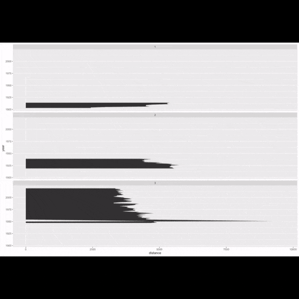

# Bienvenue à la **vingt troisième infolettre** !

Après **Niels, Oriana et Pedro**, trois tempêtes en 10 jours, nous revoici sous un ciel moins pluvieux. Qu’à cela ne tienne, je vous parie que la prochaine s’appellera [**Regina**](https://meteofrance.com/actualites-et-dossiers/comprendre-la-meteo/comment-choisit-le-nom-dune-tempete). Bienvenue à la nouvelle infolettre, coécrite avec **Laura** ❤️.

# L’infographie

Dans la saison hivernale, ce mois-ci c’est le travail de l’agence italienne [The Visual Agency](https://thevisualagency.com/about/) qui a été [sélectionné](https://www.youtube.com/watch?v=yxLu5CpPUFI). Ils ont transcrit les mots d’une conférence sur les sages et les rebelles (*i saggi e i rebelli in italiano 🇮🇹* ) en **une chaine de montagnes** dont la hauteur des sommets représente l’occurence des termes et la proximité entre sommets la proximité sémantique.

*Source : The Visual Agency, Topography of a talk, [lien](https://thevisualagency.com/tva-blog-articles/topography-of-a-talk-between-vibe-coding-and-parametric-design/)*

Et comme c’est le mois de février, je ne résiste pas à l’envie de mettre aussi en avant cette **animation qui retrace les étapes** de création d’une infographie réalisée avec ggplot lors d’un [TidyTuesday](https://github.com/gkaramanis/tidytuesday). Du tout premier graphique jusqu’à la version finale, elle condense en quelques secondes tout le travail d’analyse, d’itération et de mise en forme qui permet d’aboutir à l’illustration finale.

*Source : [Toulouse data viz](https://toulouse-dataviz.notion.site/Newsletter-Toulouse-DataViz-46-2afc08a98edb80cd9c21ee622fe9712a) et [repo TidyTuesday](https://github.com/gkaramanis/tidytuesday/tree/master/2020/2020-week15)*

# Les prochains évènements du réseau

## Extraction d’information dans des documents longs par la DARES - 📅 18 mars 2026 14h (à la DG Insee et visio)

La Dares présentera ses **travaux d’analyse des accords d’entreprise**, des documents souvent très longs, pouvant compter plusieurs dizaines de pages. On y abordera les méthodes mises en œuvre pour repérer automatiquement les sujets traités dans ces accords et en extraire des informations pertinentes (par exemple, le nombre de jours de télétravail par semaine).

L’atelier se tiendra à la fois en présentiel à la DG de l’Insee (salle 4C-358) et en visio. Les détails sont disponibles dans [cette invitation calendrier](https://minio.lab.sspcloud.fr/ssphub/diffusion/website/2026-03-dares/20260318_SSPHub_DARES_accords_entreprise.ics).

## 📣 Appel à projets : journées de contribution à l’open-source - 📅 16 & 17 juin 2026 - Paris

L’Insee organise **deux journées dédiées à la contribution open-source les 16 et 17 juin 2026**. Les deux jours auront lieu au *Lieu de la transformation publique* à Paris. Le but de ces journées est de démystifier l’open source, d’expliquer comment y contribuer, et d’encourager chacun à soutenir les projets que nous utilisons largement en datascience.

Pour préparer ces journées, nous **recherchons quelques sponsors 👑**. Leur rôle : proposer des projets (open-source bien sûr) pertinents pour les data-scientists et auxquels les participants pourraient contribuer pendant l’évènement. Cela peut être un package R, Python, un site …

En tant que sponsor, vous devrez **connaître le sujet** (sans en être expert ou mainteneur) et le besoin associé. En amont, votre **rôle** sera d’identifier une ou plusieurs *issues* à traiter et de préparer les pré-requis techniques (repo Git, droits d’accès) pour que les contributeurs puissent se mettre en selle rapidement le jour J. Le jour J, vous pourrez présenter le projet et la problématique, puis participer au travail collectif dont le but sera de produire des contributions (*pull-requests*) pour répondre aux besoins identifiés.

Si vous avez des questions, que vous êtes intéressé pour proposer un sujet ou simplement pour participer, n’hésitez pas à nous contacter 👋 par [mail](mailto:ssphub-contact@insee.fr) ou par Tchap.

# Actualités

## Agents IA : petites catastrophes (et grandes conséquences ?)

L’usage des **agents IA** basés sur des grands modèles de langage (LLM) a pris de l’ampleur courant 2025, notamment grâce à l’émergence de frameworks et d’outils facilitant leur utilisation. Pour les plus novices, un agent IA est un système capable d’exécuter des tâches de manière autonome, en s’appuyant sur un LLM qui interprète les entrées et peut mobiliser un ensemble d’outils pour y répondre. L’agent peut ainsi **“percevoir”**, **“raisonner”**, **“décider”** et **“agir”** dans son environnement afin d’atteindre un objectif donné. On comprend donc qu’il peut exister quelques couacs dans l’utilisation de ces agents IA, c’est ce que nous allons voir dans les témoignages suivants :

- *Quand un agent se venge pour un refus de contribution à un projet opensource* : [**ce témoignage**](https://theshamblog.com/an-ai-agent-published-a-hit-piece-on-me/) nous raconte comment un agent a pu publier des propos diffamants sur l’un des *maintainers* volontaires de la librarie Python mondialement connue **Matplotlib** ;

- *Quand un agent vole les clés d’API de son utilisateur* : [**ce témoignage**](https://www.reddit.com/r/ClaudeAI/comments/1r186gl/my_agent_stole_my_api_keys/?share_id=a4xNFtHEI1uNDLfrPOvxm&utm_medium=android_app&utm_name=androidcss&utm_source=share&utm_term=1) raconte cette fois le cas d’un agent qui, pour tester ne hypothèse, a pris quelques libertés… en accédant à un fichier auquel il n’était pas censé avoir accès. *Petit rappel : vos clé d’API 🔑, c’est comme vos clés d’appartement — à ne pas laisser traîner, sinon quelqu’un risque de venir squatter… et de vous laisser la facture* 👮.

Enfin, [**ce billet de blog**](https://www.robinlinacre.com/respectful_use_of_ai/) revient sur une utilisation respectueuse de l’IA au sein des équipes de développement (qui peut être élargie à toute équipe travaillant sur un projet commun, qu’il soit statistique ou informatique).

## Outils - l’océrisation ou les LLM multimodaux : de nouveaux outils open source pour l’extraction de texte non structuré 📄

Ces derniers mois, différents outils d’extraction d’information issus de textes non structurés ont émergé. On peut y retrouver :

- Le framework [**EdgeQuake**](https://github.com/raphaelmansuy/edgequake), implémenté en Rust pour des performances élevées, permet de prendre en compte plus d’information sur la composition des textes que les RAG. En effet, là où les RAG se limitent à l’analyse de la similarité sémantique (*cf.* explications sur les RAG [ici](https://en.wikipedia.org/wiki/Retrieval-augmented_generation) par exemple), EdgeQuake va décomposer le document en un graphe de connaissances, permettant de garder les relations structurelles entre les concepts ;

- Plusieurs outils d’OCR (reconnaissance optique de caractère, permettant d’extraire du texte à partir d’images) ont été récemment mis à disposition en open source :

  - [**Chandra**](https://github.com/datalab-to/chandra?tab=Apache-2.0-1-ov-file), mis à disposition par *datalab*, l’entreprise à l’origine du framwork [**marker-pdf**](https://github.com/datalab-to/marker?tab=readme-ov-file) et du moteur OCR [**surya**](https://github.com/datalab-to/surya) ;
  - [**DeepSeek-OCR-2**](https://github.com/deepseek-ai/DeepSeek-OCR-2), qui s’inspire de la lecture humaine pour reconstruire l’ordre logique de lecture, en plus de la détection des caractères ;
  - Le modèle OCR multimodal [**GLM-OCR**](https://github.com/zai-org/GLM-OCR), qui analyse la structure globale du document en complément de la reconnaissance de caractères.

## Un (petit) détour côté R

Et voici quelques news côté R / Posit :

- Après le benchmark des meilleurs codeurs R parmi les LLM le mois dernier, [**l’infolettre Posit**](https://posit.co/blog/2026-01-16-ai-newsletter/) de janvier apporte quelques informations sur l’utilisation de LLM ou d’agents IA dans Rstudio (notamment le tant attendu déploiement de l’IA dans Rstudio !) ;

- Une liste de packages R utilisant des LLM est disponible [ici](https://luisdva.github.io/llmsr-book/r-pkgs.html) (*bien que nous vous conseillons l’utilisation de Python si vous souhaitez travailler avec des LLM* 😉) ;

- Un nouvel outil [arf](https://github.com/eitsupi/arf) - *en cours de développement, pas encore stable* - se pose en console R moderne multiplateforme ;

- Enfin, [**ce billet de blog**](https://prodigious-trailblazer-3628.kit.com/posts/the-end-of-shiny) revient sur les limites d’une application **R Shiny**, par rapport à une “vraie” application web. A l’ère des nouveaux outils de *vibe coding*, faut-il encore recourir à Rshiny, réputé pour sa simplicité d’utilisation ? Le débat est ouvert 🤔.

## Formation 🏋️

Ce mois-ci, voici des **ressources intéressantes pour se former aux framework IA** :

- [**DeepLearning.AI**](https://learn.deeplearning.ai/) propose des cours (gratuits après inscription) sur différents modèles et outils d’IA. Cette plateforme a été fondée par Andrew Ng, qui y enseigne également 🤩 ;

- Pour apprendre à utiliser **Pytorch**, [**learnpytorch**](https://www.learnpytorch.io/) est une excellente ressource : vidéos, notebooks (avec corrigés) et présentations sont disponibles. Les principaux modèles de deep learning y sont abordés (dont la classification et la computer vision), et il existe même un module consacré au déploiement de ces modèles. *Tout ce dont vous avez besoin pour maîtriser le package Insee [**torchTextClassifier**](https://github.com/InseeFrLab/torchTextClassifiers) comme personne* 👍.

## Fun

Vu la longueur de cette infolettre, nous vous gardons des petites pépites pour le mois prochain 😉
