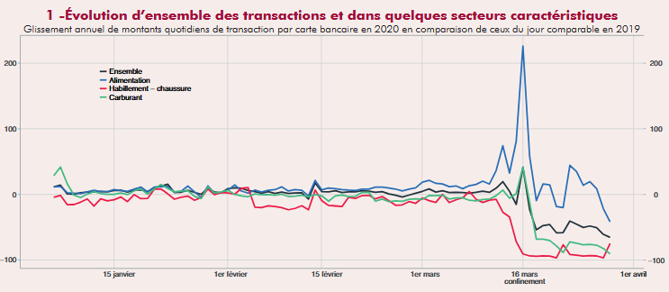
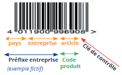

# Synthèse du projet

[TABLE]

# Projets similaires liés aux nouvelles sources de données

##### Exploitation de données bancaires pour les prévisions de croissance du PIB

Analyse du comportement des ménages à partir de données de comptes bancaires pour les prévisions de croissance économique, pendant la crise sanitaire et entre 2023 et 2024

1 juin 2025

##### Une évaluation des achats transfrontaliers de tabac et des pertes fiscales associées en France

Exploitation d’une expérience naturelle, la fermeture des frontières en 2020, pour mesurer la part d’achats transfrontaliers de tabac

1 janv. 2024

##### Travaux méthodologiques sur l’enquête Budget de Famille

Modernisation de l’enquête budget des familles par utilisation d’outils de classification automatique

1 janv. 2022

##### Utilisation de données de cartes bancaires et de téléphonie mobile pour prévoir l’activité économique

La crise sanitaire de 2020 a nécessité de revoir les processus de prévision pour être plus réactif face aux événements. Dans ce cadre, l’Insee s’est appuyé sur les données…

1 déc. 2020

##### Que disent les données de production et de consommation d’électricité sur l’activité économique en période de confinement ?

Utilisation des données de production et de consommation d’électricité pour prévoir l’activité économique

1 déc. 2020

##### Classification des données de caisse à partir de machine learning

Classifier des données de caisse dans la nomenclature COICOP par machine learning pour le calcul de l’IPC

1 janv. 2020

##### Ségrégation urbaine : un éclairage par les données de téléphonie mobile

Croisement de données administratives et de données de téléphonie pour analyser la ségrégation au niveau local

1 janv. 2018
