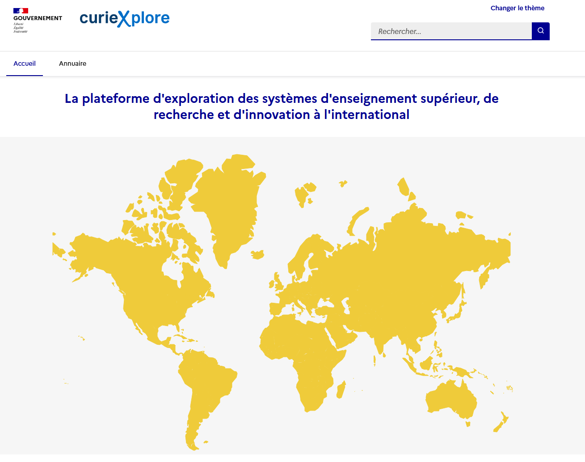
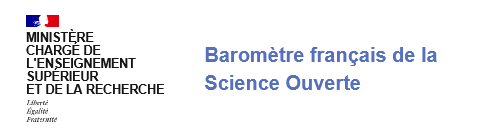
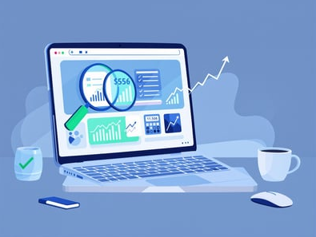

# Synthèse du projet

[TABLE]

# Projets similaires

##### Curiexplore, la plateforme de comparaison des politiques nationales d’enseignement et de recherche

Visualisation interactive de l’environnement de l’enseignement et de la recherche dans les différents pays.

1 janv. 2022

##### Jocas, webscraping des offres d’emploi en ligne

Le projet `Jocas` (Job offers collection and analysis system) permet à la DARES (Service statistique ministériel Travail) de collecter automatique des offres d’emploi en…

1 janv. 2022

##### Baromètre de la science ouverte

Pour être en mesure de suivre l’ouverture des publications scientifiques (objectif de la stratégie nationale de science ouverte), le service statistique du Ministère de…

1 janv. 2022

##### Indices des prix à la consommation des nuitées hôtelières : l’expérience du webscraping d’une plateforme de réservation en ligne

Exploration des apports du *webscraping* pour mesurer le prix des nuitées hôtelières dans l’IPC

1 juin 2021

##### Webscrapper les caractéristiques des produits pour améliorer la mesure de l’inflation

Collecter sur le web les caractéristiques des produits pour améliorer la prise en compte des effets qualité dans l’indice des prix à la consommation

1 juin 2020
