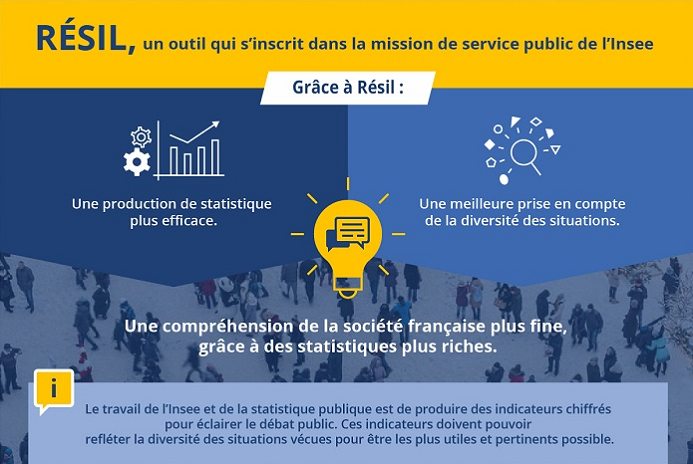
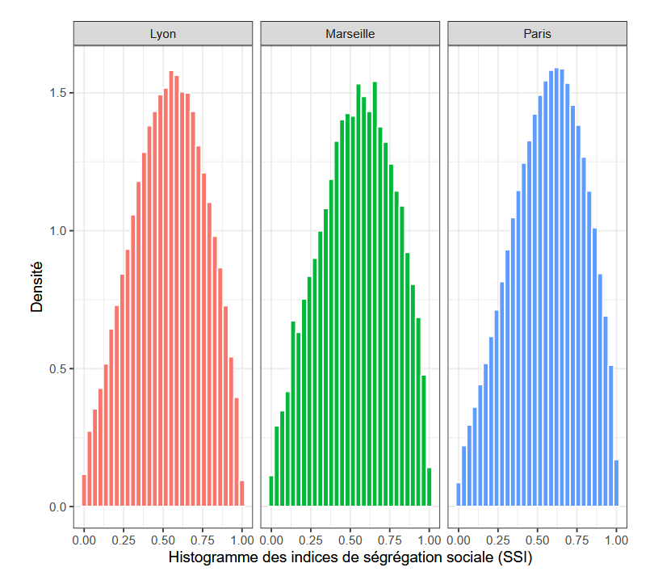

# Synthèse du projet

[TABLE]

# Projets similaires

##### sndsTools, un package R pour l’extraction de recours aux soins dans les données de santé du SNDS

Le package R `sndsTools` facilite l’extraction de recours aux soins à partir des données de santé du Système National de Données de Santé (SNDS) hébergées sur le portail de…

17 mars 2026

##### Comparaison des méthodes d’appariement et apport du machine learning

Tester et comparer différentes méthodes d’appariements afin de dégager des recommandations pour les travaux nécessaires à la construction des répertoires, notamment dans le…

1 janv. 2021

##### Détecter et traiter les valeurs aberrantes ou manquantes, application à la Déclaration Sociale Nominative

Utilisation des méthodes de machine learning pour la détection et le traitement des valeurs aberrantes ou manquantes, application à la Déclaration Sociale Nominative

1 janv. 2018

##### Ségrégation urbaine : un éclairage par les données de téléphonie mobile

Croisement de données administratives et de données de téléphonie pour analyser la ségrégation au niveau local

1 janv. 2018
