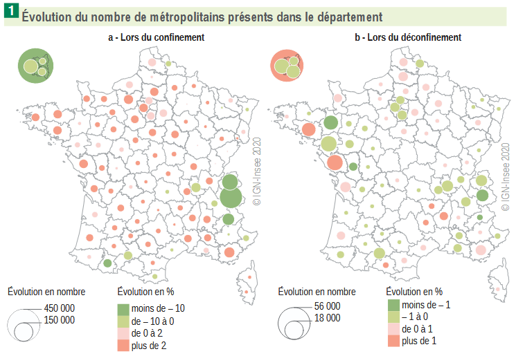

# Synthèse du projet

|  | Une évaluation des achats transfrontaliers de tabac et des pertes fiscales associées en France |
|----|----|
| **Détail du projet** | Le tabagisme est un problème majeur de santé publique, à l’origine de nombreuses maladies évitables à travers le monde. Au cours des dernières décennies, l’augmentation du prix du tabac s’est imposée comme la principale stratégie des États pour lutter contre le tabagisme. Toutefois, les différences de prix entre certains pays frontaliers sont susceptibles de limiter l’efficacité de cette mesure en permettant à certains consommateurs d’acheter du tabac à un prix inférieur dans un État voisin. Si le problème des achats transfrontaliers n’est pas nouveau, l’ampleur du phénomène reste mal connue et fait encore l’objet de débats réguliers. Cette étude contribue à son évaluation en France en exploitant une expérience naturelle sans précédent : la fermeture des frontières terrestres entre mars 2020 et juin 2020 dans le cadre de la lutte contre la pandémie de Covid-19. |
| **Acteurs** | Insee |
| **Résultats du projet** | Les résultats montrent que la fermeture des frontières a généré un surplus d’achats de tabac de 9,5 % en France métropolitaine, par rapport à la situation contrefactuelle où les frontières seraient restées ouvertes. Il s’agit probablement d’une estimation basse des achats transfrontaliers. En effet, une partie de la consommation de tabac en provenance de l’étranger a pu persister pendant le premier confinement, les frontières n’ayant pas été complètement fermées, notamment aux travailleurs frontaliers. En extrapolant la consommation observée dans le reste du pays aux régions frontalières, à caractéristiques identiques, les recettes générées en France seraient environ 13,5 % plus élevées s’il n’existait pas d’alternatives moins chères à l’étranger. |
| **Produits et documentation du projet** | \- [Une évaluation des achats transfrontaliers de tabac et des pertes fiscales associées en France](https://www.insee.fr/fr/statistiques/8172202), Documents de travail de l’Insee n°2024-06, avril 2024 |

# Projets similaires

##### Exploitation de données bancaires pour les prévisions de croissance du PIB

Analyse du comportement des ménages à partir de données de comptes bancaires pour les prévisions de croissance économique, pendant la crise sanitaire et entre 2023 et 2024

1 juin 2025

##### Travaux méthodologiques sur l’enquête Budget de Famille

Modernisation de l’enquête budget des familles par utilisation d’outils de classification automatique

1 janv. 2022

##### Utilisation de données de cartes bancaires et de téléphonie mobile pour prévoir l’activité économique

La crise sanitaire de 2020 a nécessité de revoir les processus de prévision pour être plus réactif face aux événements. Dans ce cadre, l’Insee s’est appuyé sur les données…

1 déc. 2020

##### Que disent les données de production et de consommation d’électricité sur l’activité économique en période de confinement ?

Utilisation des données de production et de consommation d’électricité pour prévoir l’activité économique

1 déc. 2020

##### Mouvements de population autour du confinement de mars 2020 grâce aux données de téléphonie mobile

L’Insee a eu accès à des données de téléphonie mobile dans le cadre du suivi de la crise sanitaire de 2020. Ces données ont permis de produire les statistiques sur les…

1 nov. 2020

##### Classification des données de caisse à partir de machine learning

Classifier des données de caisse dans la nomenclature COICOP par machine learning pour le calcul de l’IPC

1 janv. 2020

##### Ségrégation urbaine : un éclairage par les données de téléphonie mobile

Croisement de données administratives et de données de téléphonie pour analyser la ségrégation au niveau local

1 janv. 2018
