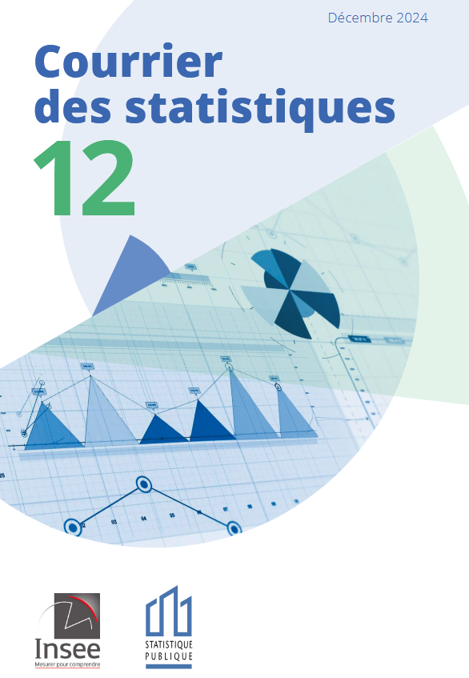
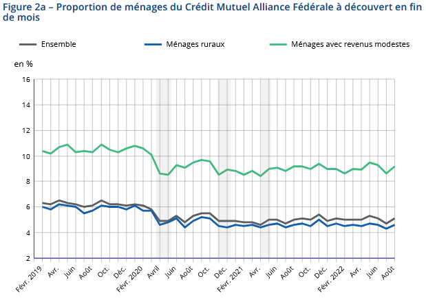

# Synthèse du projet

[TABLE]

# Projets similaires

##### Une évaluation des achats transfrontaliers de tabac et des pertes fiscales associées en France

Exploitation d’une expérience naturelle, la fermeture des frontières en 2020, pour mesurer la part d’achats transfrontaliers de tabac

1 janv. 2024

##### Travaux méthodologiques sur l’enquête Budget de Famille

Modernisation de l’enquête budget des familles par utilisation d’outils de classification automatique

1 janv. 2022

##### Utilisation de données de cartes bancaires et de téléphonie mobile pour prévoir l’activité économique

La crise sanitaire de 2020 a nécessité de revoir les processus de prévision pour être plus réactif face aux événements. Dans ce cadre, l’Insee s’est appuyé sur les données…

1 déc. 2020

##### Que disent les données de production et de consommation d’électricité sur l’activité économique en période de confinement ?

Utilisation des données de production et de consommation d’électricité pour prévoir l’activité économique

1 déc. 2020

##### Mouvements de population autour du confinement de mars 2020 grâce aux données de téléphonie mobile

L’Insee a eu accès à des données de téléphonie mobile dans le cadre du suivi de la crise sanitaire de 2020. Ces données ont permis de produire les statistiques sur les…

1 nov. 2020

##### Classification des données de caisse à partir de machine learning

Classifier des données de caisse dans la nomenclature COICOP par machine learning pour le calcul de l’IPC

1 janv. 2020

##### Ségrégation urbaine : un éclairage par les données de téléphonie mobile

Croisement de données administratives et de données de téléphonie pour analyser la ségrégation au niveau local

1 janv. 2018

# Autres études menées grâces aux données bancaires

Par ailleurs, d’autres études ont été menées par l’Insee en utilisant des données de compte bancaires. Elles sont disponibles sur le site de l’Insee :

##### L’économie racontée par les données bancaires - Ce que nos relevés de comptes disent de nous

Courrier des statistiques n°12, Insee, Décembre 2024

1 déc. 2024

##### Achats transfrontaliers de carburant à la frontière franco-allemande

Documents de travail de l’Insee n°2024-08, mai 2024

1 mai 2024

##### La situation financière des ménages au jour le jour

Insee Analyses n°90, décembre 2023

1 déc. 2023

##### Avec l’inflation, une précarité financière en légère hausse, mais inférieure en août 2022 à son niveau d’avant-crise sanitaire

Insee Analyses n°76, octobre 2022

1 oct. 2022

##### Une mesure de la réponse en consommation à des chocs de revenus à partir des données bancaires

Journées de méthodologie statistique 2022

1 oct. 2022

##### Impact de la crise sanitaire sur un panel anonymisé de clients de La Banque Postale

Insee Analyses n°69, novembre 2021

1 nov. 2021
