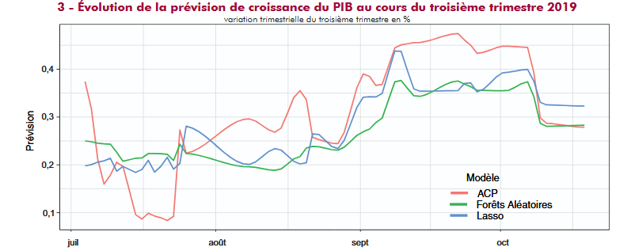

# Synthèse du projet

|  | Comparaison des méthodes de prévision du PIB en continu avec une méthode ascendante |
|----|----|
| **Détail du projet** | L’Insee effectue ses prévisions de croissance du PIB à partir d’un modèle dit ascendant, permettant de répliquer la mécanique des comptes trimestriels en agrégeant les prévisions fines sur chaque poste. Se pose toutefois la question de la performance d’une telle approche pour prévoir le PIB par rapport à celle des approches directes, ou *nowcasting*. Une approche directe permet de prévoir directement la croissance du PIB à partir de séries conjoncturelles, sans utiliser de comptes trimestriels. Afin d’étudier les performances relatives des deux approches, un nouveau modèle de prévision ascendant de la croissance du PIB de la France, inspiré du *« GDPnow »* de la Réserve Fédérale d’Atlanta, a été mis au point dans le cadre de cette étude. |
| **Acteurs** | Insee |
| **Résultats du projet** | En début de trimestre, l’approche directe est légèrement plus performante que l’approche ascendante : en effet, peu d’indicateurs quantitatifs sont alors disponibles et la plus-value que représente l’utilisation d’un cadre comptable complet est limitée par rapport à un modèle direct, naturellement plus parcimonieux. À partir de la fin du deuxième mois en revanche, les indicateurs quantitatifs disponibles deviennent plus nombreux et l’approche ascendante présente des performances légèrement meilleures que l’approche directe estimée dans cette étude, c’est en particulier le cas au moment de la publication de la Note de conjoncture. Enfin, la différence de performance entre les deux approches est nette entre la fin du trimestre et la publication des premières estimations des comptes trimestriels trente jours plus tard : au cours de cette période, il est largement préférable d’exploiter l’information disponible via une approche ascendante plutôt que par une approche directe. |
| **Produits et documentation du projet** | \- [Comment se comparent les approches directe et ascendante pour prévoir le PIB du trimestre courant ?](https://www.insee.fr/fr/statistiques/8638815?sommaire=8638823), Note de conjoncture de l’Insee - septembre 2025 |

# Projets similaires

##### Exploitation de données bancaires pour les prévisions de croissance du PIB

Analyse du comportement des ménages à partir de données de comptes bancaires pour les prévisions de croissance économique, pendant la crise sanitaire et entre 2023 et 2024

1 juin 2025

##### Prévoir la croissance en lisant le journal

Utiliser les articles de presse en continu pour construire un indicateur aidant à prévoir la croissance

1 mars 2021

##### Utilisation de données de cartes bancaires et de téléphonie mobile pour prévoir l’activité économique

La crise sanitaire de 2020 a nécessité de revoir les processus de prévision pour être plus réactif face aux événements. Dans ce cadre, l’Insee s’est appuyé sur les données…

1 déc. 2020

##### Que disent les données de production et de consommation d’électricité sur l’activité économique en période de confinement ?

Utilisation des données de production et de consommation d’électricité pour prévoir l’activité économique

1 déc. 2020

##### « GDP Tracker » : un outil pour des prévisions économiques en continu

Modèles de *machine learning* pour effectuer des prévisions en temps réel (*nowcasting*) pour alimenter les analyses conjoncturelles de l’Insee

1 déc. 2019
