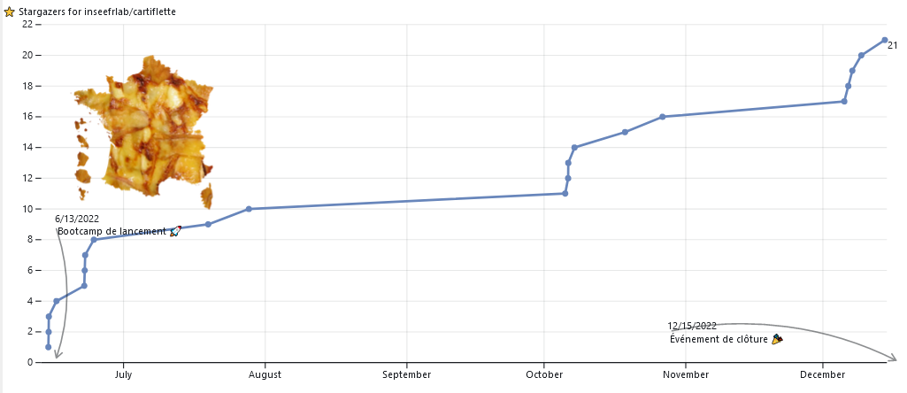
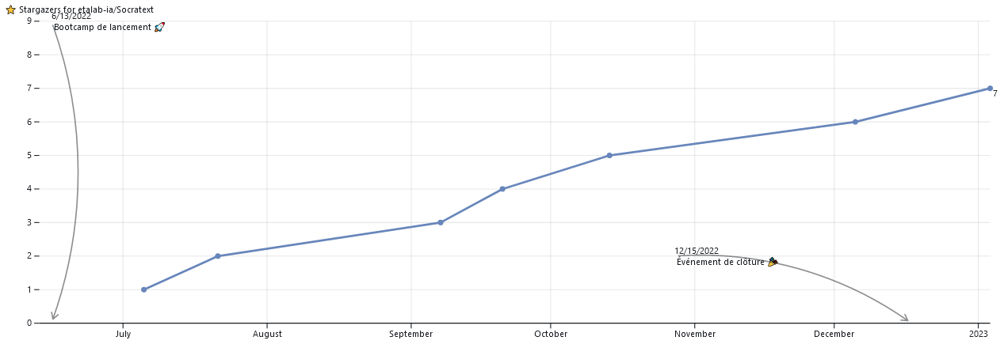
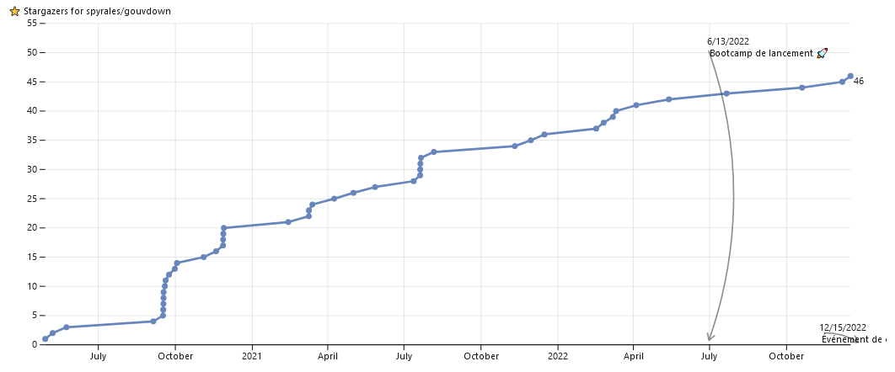
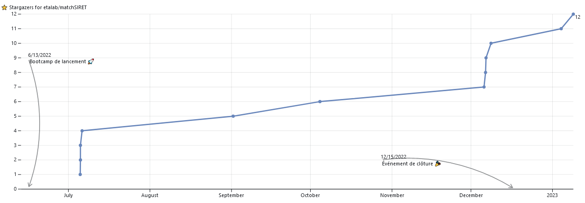
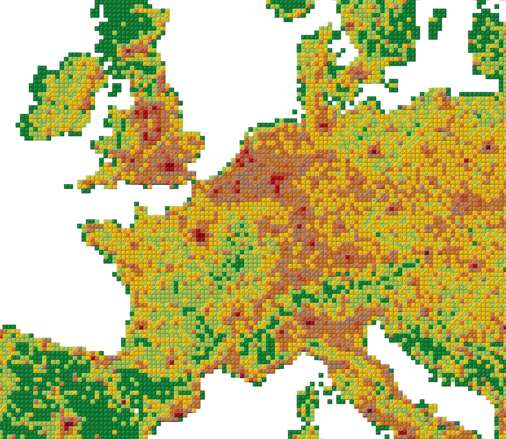

*Vous désirez intégrer la liste de diffusion ? Un mail à <ssphub-contact@insee.fr> suffit*

La [rétrospective de l’année 2022](https://ssphub.netlify.app/post/retrospective2022/) promettait une version plus personnalisée, inspirée des visualisations proposées par les réseaux sociaux pour synthétiser l’activité de leurs utilisateurs.

Cette *newsletter* un peu spéciale propose un retour sur la première année du réseau des data scientists de la statistique publique dont la préfiguration a commencé en mars 2022 et qui a été lancé officiellement en septembre. Vous pourrez retrouver à la fin de la *newsletter* des informations plus classiques: événements, retour sur les actions du réseau, formations, etc.

Elle permet aussi d’illustrer le potentiel d’outils qui ont été présentés dans la [rétrospective de l’année 2022](https://ssphub.netlify.app/post/retrospective2022/). Toutes les figures sont réactives, notamment quand vous passez votre souris dessus. Les principaux ingrédients qui ont été ici utilisés, et qui avaient été mentionnés dans la première partie de la rétrospective, sont `Observable`, `Quarto` et `DuckDB`. Les données sont stockées sur le système de stockage `S3` du `SSPCloud`.

> **NOTE:**
>
> Ce *notebook* utilise certaines les fonctionalités d’`Observable` pour proposer des visualisations interactives de manière efficace.
>
> Si vous êtes intéressés par le *making-of* de cette page *web*, cliquez sur le menu déroulant (partie plus technique).
>
>   
> `Observable` est à la fois un langage visant à simplifier l’usage de `JavaScript` pour mettre en oeuvre des visualisations interactives et une [plateforme](https://observablehq.com/) permettant de simplifier la mise à disposition de ces visualisations sous une forme de *notebook*.
>
> Les statistiques de comptage sont enregistrées sous format `Parquet` sur le système de stockage `S3` du `SSPCloud`. L’intégration native de `DuckDB` à `Observable` permet au navigateur *web* de lire et d’effectuer des manipulations de données à travers des requêtes SQL de manière très efficace. Sur ce sujet, outre la [documentation officielle d’`Observable`](https://observablehq.com/@observablehq/duckdb), je recommande vivement le [tutoriel d’Eric Mauvière](https://observablehq.com/@ericmauviere/duckdb-redonne-nouvelle-vie-sql).
>
> La librairie [`Plot`](https://observablehq.com/@observablehq/plot) propose de nombreuses fonctionalités utiles pour construire des visualisations interactives. Sa logique est assez proche de celle des *frameworks* [`ggplot2` en `R`](https://observablehq.com/@observablehq/plot-from-ggplot2) ou [`matplotlib` en `Python`](https://observablehq.com/@observablehq/plot-overview-for-matplotlib-users). Lorsque la librairie `Plot` n’est plus suffisante, comme pour le *treemap* sur cette page, le *framework* `d3.js` est utile.
>
> L’intégration de figures construites à partir du langage `Observable` peut être faite de plusieurs manières:
>
> - Utiliser [`Quarto`](https://quarto.org/docs/interactive/ojs/) qui permet de créer une page *web* statique autosuffisante à partir d’une suite d’instructions dans des blocs `{ojs}`. Cette méthode est très intéressante pour l’intégration de figures `JavaScript` dans des sites *web* complets générés de manière automatique. Bien qu’initialement envisagée, cette méthode ne fait pas encore bon ménage avec [`Hugo`](https://gohugo.io/) qui n’attend pas des `Quarto Markdown` mais des `Markdown` classiques
> - Utiliser la plateforme [`observablehq`](https://observablehq.com/@linogaliana) pour créer un *notebook* proposant le code à l’origine des visualisations puis intégrer ces dernières par le biais d’`<iframe>` ou de l’intégration via `Runtime JS`. Cela permet d’avoir ces visualisations sur une page statique sans stocker au même endroit le code ayant permis de les générer et permettant de les reproduire, qui n’intéresse pas nécessairement le même public.
>
> La deuxième approche, celle de l’intégration depuis un *notebook* `observable` a été choisie. Ce *notebook* est disponible sur [la plateforme](https://observablehq.com/@linogaliana/2022-year-recap-data-scientists-network) pour les utilisateurs intéressés par la réutilisation des figures, des données sous-jacentes ou des utilitaires ayant permis d’aboutir à certaines visualisations. Le code source de cette page, disponible sur le [`Github inseefrlab/ssphub`](https://raw.githubusercontent.com/InseeFrLab/ssphub/main/content/post/recap2022/index.md) illustre la manière dont les figures peuvent être intégrées à un site *web* depuis la plateforme [`observablehq`](https://observablehq.com/). Bien que j’ai privilégié la méthode `Runtime JS`, qui permet d’intégrer la visualisation sans le bandeau `Observable` sous la figure, pour certaines d’entre elles, j’ai dû utiliser la méthode `<iframe>` du fait de certaines limitations dans l’héritage de règles CSS aux `svg` générés par `Plot` qui affectaient la colorisation et donc la lecture de certaines figures.

## L’année du réseau

Le réseau comporte deux canaux de communication: une liste de diffusion mail et un canal de discussions instantanées. Intéressons nous d’abord à la liste de diffusion mail !

Pendant l’année 2022, **7 *newsletters*** ont été diffusées par mail. Chacune a permis d’augmenter sensiblement le nombre de personnes dans la liste de diffusion. A la fin de l’année, il y avait **312 inscrits**[^1] dans la liste de diffusion.

Le réseau a organisé **trois événements** pendant l’année 2022. D’abord, avant l’été, deux *open hours* ont eu lieu. Cet événement informel prenant la forme de retour d’expérience a été l’occasion de discussions stimulantes autour de d’usage de la *data science* pour l’administration. En novembre, l’[événement autour d’`Observable`](../../talk/presentation-dobservable-par-nicolas-lambert/) animé par [Nicolas Lambert](https://observablehq.com/@neocartocnrs) a réuni près de 50 personnes.

## Répartition des modes d’accès au réseau

Le réseau propose **deux canaux de diffusion** de l’information: une liste de diffusion par mail et un canal de discussion instantanée qui utilise la messagerie sécurisée de l’Etat [`Tchap`](https://www.tchap.gouv.fr/). Environ **55%** des membres de la liste de diffusion (soit plus de 180 personnes) sont également inscrits sur le canal de discussion instantanée.

[Lino Galiana](/@linogaliana)[2022 Year Recap for French data scientists network](/@linogaliana/2022-year-recap-data-scientists-network)

![](data:image/svg+xml;base64,PHN2ZyB2aWV3Ym94PSItMyAwIDE3MSAyOCIgaGVpZ2h0PSIxNSI+PHN2ZyByb2xlPSJpbWciIHZpZXdib3g9IjAgMCAyNSAyOCIgd2lkdGg9IjI1IiBoZWlnaHQ9IjI4IiBhcmlhLWxhYmVsPSJPYnNlcnZhYmxlIiBmaWxsPSJjdXJyZW50Q29sb3IiPjxwYXRoIGQ9Ik0xMi41IDIyLjY2NjdDMTEuMzQ1OCAyMi42NjY3IDEwLjM0NTggMjIuNDE1MyA5LjUgMjEuOTEyN0M4LjY1NzIxIDIxLjQxMiA3Ljk4MzM5IDIwLjcwMjcgNy41NTUyMSAxOS44NjU0QzcuMDk5OTcgMTguOTk0MiA2Ljc2NjcyIDE4LjA3MjkgNi41NjM1NCAxNy4xMjM5QzYuMzQ3OTYgMTYuMDk0NyA2LjI0Mjk0IDE1LjA0ODMgNi4yNSAxNEM2LjI1IDEzLjE2OTkgNi4zMDQxNyAxMi4zNzY0IDYuNDEzNTQgMTEuNjE3NkM2LjUyMTg4IDEwLjg1OTggNi43MjI5MiAxMC4wODk0IDcuMDE1NjMgOS4zMDc0OEM3LjMwODMzIDguNTI1NTUgNy42ODU0MiA3Ljg0NzYzIDguMTQ0NzkgNy4yNzI3NEM4LjYyMzA0IDYuNjgzNzggOS4yNDE0MSA2LjIwNDM4IDkuOTUyMDggNS44NzE2M0MxMC42OTc5IDUuNTEyNDQgMTEuNTQ1OCA1LjMzMzMzIDEyLjUgNS4zMzMzM0MxMy42NTQyIDUuMzMzMzMgMTQuNjU0MiA1LjU4NDY3IDE1LjUgNi4wODczM0MxNi4zNDI4IDYuNTg4IDE3LjAxNjYgNy4yOTczMyAxNy40NDQ4IDguMTM0NTlDMTcuODk2OSA4Ljk5NjQ0IDE4LjIyNzEgOS45MTAzIDE4LjQzNjUgMTAuODc2MUMxOC42NDQ4IDExLjg0MSAxOC43NSAxMi44ODMgMTguNzUgMTRDMTguNzUgMTQuODMwMSAxOC42OTU4IDE1LjYyMzYgMTguNTg2NSAxNi4zODI0QzE4LjQ2OTkgMTcuMTcwMiAxOC4yNjM5IDE3Ljk0NDYgMTcuOTcxOSAxOC42OTI1QzE3LjY2OTggMTkuNDc0NCAxNy4yOTQ4IDIwLjE1MjQgMTYuODQyNyAyMC43MjczQzE2LjM5MDYgMjEuMzAyMSAxNS43OTI3IDIxLjc2OTIgMTUuMDQ3OSAyMi4xMjg0QzE0LjMwMzEgMjIuNDg3NiAxMy40NTQyIDIyLjY2NjcgMTIuNSAyMi42NjY3Wk0xNC43MDYzIDE2LjI5NDVDMTUuMzA0IDE1LjY5NDQgMTUuNjM2NSAxNC44NjQgMTUuNjI1IDE0QzE1LjYyNSAxMy4xMDczIDE1LjMyNiAxMi4zNDI1IDE0LjcyOTIgMTEuNzA1NUMxNC4xMzEzIDExLjA2ODUgMTMuMzg4NSAxMC43NSAxMi41IDEwLjc1QzExLjYxMTUgMTAuNzUgMTAuODY4OCAxMS4wNjg1IDEwLjI3MDggMTEuNzA1NUM5LjY4NTMyIDEyLjMxMjMgOS4zNjE5OCAxMy4xNDA1IDkuMzc1IDE0QzkuMzc1IDE0Ljg5MjcgOS42NzM5NiAxNS42NTc1IDEwLjI3MDggMTYuMjk0NUMxMC44Njg4IDE2LjkzMTUgMTEuNjExNSAxNy4yNSAxMi41IDE3LjI1QzEzLjM4ODUgMTcuMjUgMTQuMTI0IDE2LjkzMTUgMTQuNzA2MyAxNi4yOTQ1Wk0xMi41IDI3QzE5LjQwMzEgMjcgMjUgMjEuMTc5MiAyNSAxNEMyNSA2LjgyMDc1IDE5LjQwMzEgMSAxMi41IDFDNS41OTY4NyAxIDAgNi44MjA3NSAwIDE0QzAgMjEuMTc5MiA1LjU5Njg3IDI3IDEyLjUgMjdaIiBmaWxsPSJjdXJyZW50Q29sb3IiIC8+PC9zdmc+)![](data:image/svg+xml;base64,PHN2ZyByb2xlPSJpbWciIHZpZXdib3g9IjAgMCAxMzggMzUiIHdpZHRoPSIxMzgiIGhlaWdodD0iMzUiIGFyaWEtbGFiZWw9Ik9ic2VydmFibGUiIGZpbGw9ImN1cnJlbnRDb2xvciI+PHBhdGggZD0iTTYuNDE1ODcgMTcuNzUxMkM2LjQxNTg3IDE4Ljg0NzcgNi40NjY0OCAxOS44NDI5IDYuNTY3NjkgMjAuNzM3QzYuNjg1NzcgMjEuNjE0MSA2Ljg2Mjg5IDIyLjM2NDggNy4wOTkwNSAyMi45ODg5QzcuMzM1MjEgMjMuNjEzMSA3LjYzODg1IDI0LjEwMjMgOC4wMDk5NiAyNC40NTY1QzguMzgxMDcgMjQuNzkzOSA4LjgzNjUzIDI0Ljk2MjYgOS4zNzYzMiAyNC45NjI2QzkuOTE2MTIgMjQuOTYyNiAxMC4zNzE2IDI0Ljc5MzkgMTAuNzQyNyAyNC40NTY1QzExLjExMzggMjQuMTAyMyAxMS40MTc0IDIzLjYxMzEgMTEuNjUzNiAyMi45ODg5QzExLjg4OTggMjIuMzY0OCAxMi4wNTg0IDIxLjYxNDEgMTIuMTU5NyAyMC43MzdDMTIuMjc3NyAxOS44NDI5IDEyLjMzNjggMTguODQ3NyAxMi4zMzY4IDE3Ljc1MTJDMTIuMzM2OCAxNi42NzE2IDEyLjI3NzcgMTUuNjg0OCAxMi4xNTk3IDE0Ljc5MDhDMTIuMDU4NCAxMy44OTY3IDExLjg4OTggMTMuMTM3NiAxMS42NTM2IDEyLjUxMzVDMTEuNDE3NCAxMS44NzI1IDExLjExMzggMTEuMzgzMyAxMC43NDI3IDExLjA0NTlDMTAuMzcxNiAxMC42OTE3IDkuOTE2MTIgMTAuNTE0NSA5LjM3NjMyIDEwLjUxNDVDOC44MzY1MyAxMC41MTQ1IDguMzgxMDcgMTAuNjkxNyA4LjAwOTk2IDExLjA0NTlDNy42Mzg4NSAxMS4zODMzIDcuMzM1MjEgMTEuODcyNSA3LjA5OTA1IDEyLjUxMzVDNi44NjI4OSAxMy4xMzc2IDYuNjg1NzcgMTMuODk2NyA2LjU2NzY5IDE0Ljc5MDhDNi40NjY0OCAxNS42ODQ4IDYuNDE1ODcgMTYuNjcxNiA2LjQxNTg3IDE3Ljc1MTJaTTkuMzc2MzIgOC45OTYzNkMxMC40MzkxIDguOTk2MzYgMTEuNDU5NiA5LjE3MzQ4IDEyLjQzOCA5LjUyNzczQzEzLjQxNjQgOS44ODE5NyAxNC4yODUxIDEwLjQyMTggMTUuMDQ0MiAxMS4xNDcxQzE1LjgwMzMgMTEuODcyNSAxNi40MDIxIDEyLjc4MzQgMTYuODQwNyAxMy44Nzk4QzE3LjI5NjIgMTQuOTc2MyAxNy41MjM5IDE2LjI2NjggMTcuNTIzOSAxNy43NTEyQzE3LjUyMzkgMTkuMjM1NyAxNy4yOTYyIDIwLjUyNjEgMTYuODQwNyAyMS42MjI2QzE2LjQwMjEgMjIuNzE5IDE1LjgwMzMgMjMuNjI5OSAxNS4wNDQyIDI0LjM1NTNDMTQuMzAyIDI1LjA4MDcgMTMuNDMzMiAyNS42MjA1IDEyLjQzOCAyNS45NzQ3QzExLjQ1OTYgMjYuMzI4OSAxMC40MzkxIDI2LjUwNjEgOS4zNzYzMiAyNi41MDYxQzguMzEzNiAyNi41MDYxIDcuMjg0NjEgMjYuMzI4OSA2LjI4OTM1IDI1Ljk3NDdDNS4zMTA5NyAyNS42MjA1IDQuNDQyMjMgMjUuMDgwNyAzLjY4MzE0IDI0LjM1NTNDMi45NDA5MiAyMy42Mjk5IDIuMzQyMDggMjIuNzE5IDEuODg2NjMgMjEuNjIyNkMxLjQ0ODA0IDIwLjUyNjEgMS4yMjg3NSAxOS4yMzU3IDEuMjI4NzUgMTcuNzUxMkMxLjIyODc1IDE2LjI2NjggMS40NDgwNCAxNC45NzYzIDEuODg2NjMgMTMuODc5OEMyLjM0MjA4IDEyLjc4MzQgMi45NDkzNSAxMS44NzI1IDMuNzA4NDUgMTEuMTQ3MUM0LjQ2NzU0IDEwLjQyMTggNS4zMzYyNyA5Ljg4MTk3IDYuMzE0NjYgOS41Mjc3M0M3LjI5MzA0IDkuMTczNDggOC4zMTM2IDguOTk2MzYgOS4zNzYzMiA4Ljk5NjM2Wk0xOC42OTg3IDI2LjAyNTNWMjQuNzM0OEwxOS44MzczIDI0LjQ4MThDMTkuODU0MiAyMy44NzQ1IDE5Ljg2MjcgMjMuMjI1MSAxOS44NjI3IDIyLjUzMzVDMTkuODYyNyAyMS44NDE5IDE5Ljg2MjcgMjEuMjM0NiAxOS44NjI3IDIwLjcxMTdWMTAuMjEwOUwxOC40OTYzIDEwLjAzMzhWOC44OTUxNUwyNC4yNjU0IDcuNzU2NTFMMjQuNjk1NSA4LjAzNDg1TDI0LjU5NDMgMTEuNTUyVjE0Ljc0MDJDMjUuNTg5NiAxMy43NjE4IDI2Ljc4NzIgMTMuMjcyNiAyOC4xODczIDEzLjI3MjZDMjguODc5IDEzLjI3MjYgMjkuNTI4NCAxMy40MDc1IDMwLjEzNTcgMTMuNjc3NEMzMC43NDMgMTMuOTQ3MyAzMS4yNzQzIDE0LjM1MjIgMzEuNzI5OCAxNC44OTJDMzIuMTg1MiAxNS40MzE4IDMyLjUzOTUgMTYuMTA2NSAzMi43OTI1IDE2LjkxNjJDMzMuMDYyNCAxNy43MjU5IDMzLjE5NzMgMTguNjcwNiAzMy4xOTczIDE5Ljc1MDJDMzMuMTk3MyAyMC43OTYgMzMuMDM3MSAyMS43MzIyIDMyLjcxNjYgMjIuNTU4OEMzMi40MTMgMjMuMzY4NSAzMi4wMDgxIDI0LjA2MDEgMzEuNTAyIDI0LjYzMzZDMzAuOTk2IDI1LjIwNzIgMzAuNDE0IDI1LjY0NTggMjkuNzU2MSAyNS45NDk0QzI5LjA5ODMgMjYuMjUzIDI4LjQxNTEgMjYuNDA0OCAyNy43MDY2IDI2LjQwNDhDMjYuOTY0NCAyNi40MDQ4IDI2LjMyMzQgMjYuMjc4MyAyNS43ODM2IDI2LjAyNTNDMjUuMjYwNiAyNS43ODkxIDI0Ljc5NjcgMjUuNDQzMyAyNC4zOTE5IDI0Ljk4NzlMMjMuODg1OCAyNi40MDQ4TDE4LjY5ODcgMjYuMDI1M1pNMjUuODU5NSAyMy45NzU4QzI2LjUzNDIgMjMuOTc1OCAyNy4wNzQgMjMuNjM4NCAyNy40Nzg5IDIyLjk2MzZDMjcuODgzNyAyMi4yNzIgMjguMDg2MSAyMS4yMDA5IDI4LjA4NjEgMTkuNzUwMkMyOC4wODYxIDE4LjI5OTQgMjcuODgzNyAxNy4yNzg5IDI3LjQ3ODkgMTYuNjg4NUMyNy4wNzQgMTYuMDgxMiAyNi41MzQyIDE1Ljc3NzYgMjUuODU5NSAxNS43Nzc2QzI1LjQ1NDYgMTUuNzc3NiAyNS4wNTgyIDE1LjkwNDEgMjQuNjcwMiAxNi4xNTcxVjIzLjYyMTVDMjUuMDA3NiAyMy44NTc3IDI1LjQwNCAyMy45NzU4IDI1Ljg1OTUgMjMuOTc1OFpNMzguOTY3NiAyNi40MDQ4QzM3LjIxMzMgMjYuNDA0OCAzNS42NjE0IDI1Ljk5MTYgMzQuMzExOSAyNS4xNjVMMzQuNDM4NCAyMS45MjYySDM2Ljc0MUwzNy4xNDU4IDI0LjU1NzdDMzcuNDMyNiAyNC42NzU4IDM3LjcxOTMgMjQuNzY4NiAzOC4wMDYxIDI0LjgzNjFDMzguMzA5NyAyNC44ODY3IDM4LjYzMDMgMjQuOTEyIDM4Ljk2NzYgMjQuOTEyQzM5LjYwODYgMjQuOTEyIDQwLjEwNjMgMjQuODE5MiA0MC40NjA1IDI0LjYzMzZDNDAuODE0NyAyNC40MzEyIDQwLjk5MTkgMjQuMDg1NCA0MC45OTE5IDIzLjU5NjJDNDAuOTkxOSAyMy4yNTg4IDQwLjg1NjkgMjIuOTYzNiA0MC41ODcgMjIuNzEwNkM0MC4zMzQgMjIuNDQwNyAzOS43ODU4IDIyLjE4NzcgMzguOTQyMyAyMS45NTE1TDM3LjUgMjEuNTcyQzM2LjQ4NzkgMjEuMzAyMSAzNS43MjA0IDIwLjgyOTcgMzUuMTk3NSAyMC4xNTVDMzQuNjkxNCAxOS40ODAzIDM0LjQzODQgMTguNjQ1MyAzNC40Mzg0IDE3LjY1QzM0LjQzODQgMTcuMDI1OSAzNC41NTY1IDE2LjQ0MzkgMzQuNzkyNiAxNS45MDQxQzM1LjA0NTcgMTUuMzY0MyAzNS40MDgzIDE0LjkwMDQgMzUuODgwNyAxNC41MTI0QzM2LjM2OTggMTQuMTI0NCAzNi45NjAzIDEzLjgyMDggMzcuNjUxOSAxMy42MDE1QzM4LjM2MDQgMTMuMzgyMiAzOS4xNyAxMy4yNzI2IDQwLjA4MSAxMy4yNzI2QzQwLjg1NjkgMTMuMjcyNiA0MS41NzM4IDEzLjM1NjkgNDIuMjMxNyAxMy41MjU2QzQyLjg4OTYgMTMuNjk0MyA0My41NzI4IDEzLjk0NzMgNDQuMjgxMyAxNC4yODQ3TDQ0LjA3ODggMTcuMTQzOUg0MS43NTFMNDEuMTk0MyAxNC44OTJDNDEuMDI1NiAxNC44NTgyIDQwLjg0IDE0LjgzMjkgNDAuNjM3NiAxNC44MTYxQzQwLjQ1MjEgMTQuNzgyMyA0MC4yMjQzIDE0Ljc2NTUgMzkuOTU0NCAxNC43NjU1QzM5LjQ2NTMgMTQuNzY1NSAzOS4wNjA0IDE0Ljg3NTEgMzguNzM5OSAxNS4wOTQ0QzM4LjQxOTQgMTUuMjk2OCAzOC4yNTkxIDE1LjYxNzMgMzguMjU5MSAxNi4wNTU5QzM4LjI1OTEgMTYuMTkwOSAzOC4yODQ0IDE2LjMyNTggMzguMzM1IDE2LjQ2MDhDMzguMzg1NyAxNi41Nzg4IDM4LjQ3ODQgMTYuNzA1NCAzOC42MTM0IDE2Ljg0MDNDMzguNzY1MiAxNi45NTg0IDM4Ljk2NzYgMTcuMDg0OSAzOS4yMjA3IDE3LjIxOThDMzkuNDkwNiAxNy4zMzc5IDM5Ljg0NDggMTcuNDU2IDQwLjI4MzQgMTcuNTc0MUw0MS43MDA0IDE3Ljk1MzZDNDIuODgxMiAxOC4yNzQxIDQzLjcyNDYgMTguNzcxOCA0NC4yMzA3IDE5LjQ0NjVDNDQuNzUzNiAyMC4xMDQ0IDQ1LjAxNSAyMC45Mzk0IDQ1LjAxNSAyMS45NTE1QzQ1LjAxNSAyMi42OTM3IDQ0Ljg3MTcgMjMuMzQzMiA0NC41ODQ5IDIzLjg5OThDNDQuMjk4MSAyNC40NTY1IDQzLjg5MzMgMjQuOTIwNCA0My4zNzA0IDI1LjI5MTVDNDIuODQ3NCAyNS42NjI2IDQyLjIxNDggMjUuOTQxIDQxLjQ3MjYgMjYuMTI2NUM0MC43MzA0IDI2LjMxMjEgMzkuODk1NCAyNi40MDQ4IDM4Ljk2NzYgMjYuNDA0OFpNNTIuODMwOSAxMy4yNzI2QzUzLjc0MTggMTMuMjcyNiA1NC41MzQ3IDEzLjQxNiA1NS4yMDk0IDEzLjcwMjdDNTUuODg0MSAxMy45ODk1IDU2LjQ0OTMgMTQuMzg1OSA1Ni45MDQ3IDE0Ljg5MkM1Ny4zNjAyIDE1LjM5OCA1Ny42OTc1IDE1Ljk4ODQgNTcuOTE2OCAxNi42NjMyQzU4LjE1MyAxNy4zMzc5IDU4LjI3MTEgMTguMDU0OCA1OC4yNzExIDE4LjgxMzlDNTguMjcxMSAxOS4wODM4IDU4LjI2MjYgMTkuMzIgNTguMjQ1OCAxOS41MjI0QzU4LjIyODkgMTkuNzA4IDU4LjE5NTIgMTkuOTE4OCA1OC4xNDQ2IDIwLjE1NUg1MS4xMTAzQzUxLjI0NTMgMjEuNDAzMyA1MS42MDc5IDIyLjMwNTggNTIuMTk4MyAyMi44NjI0QzUyLjc4ODcgMjMuNDAyMiA1My40NjM1IDIzLjY3MjEgNTQuMjIyNiAyMy42NzIxQzU0Ljg2MzYgMjMuNjcyMSA1NS40MTE4IDIzLjU2MjUgNTUuODY3MyAyMy4zNDMyQzU2LjMzOTYgMjMuMTA3IDU2Ljc1MjkgMjIuODIwMyA1Ny4xMDcxIDIyLjQ4MjlMNTguMDkzOSAyMy40NDQ0QzU3LjU1NDEgMjQuNDczNCA1Ni44MjA0IDI1LjIyNCA1NS44OTI2IDI1LjY5NjRDNTQuOTY0OCAyNi4xNjg3IDUzLjg2ODMgMjYuNDA0OCA1Mi42MDMyIDI2LjQwNDhDNTEuNjU4NSAyNi40MDQ4IDUwLjc4MTQgMjYuMjYxNSA0OS45NzE3IDI1Ljk3NDdDNDkuMTYyIDI1LjY3MTEgNDguNDYxOSAyNS4yNDA5IDQ3Ljg3MTUgMjQuNjg0MkM0Ny4yOTggMjQuMTEwNyA0Ni44NDI1IDIzLjQxOTEgNDYuNTA1MiAyMi42MDk0QzQ2LjE4NDcgMjEuNzgyOCA0Ni4wMjQ0IDIwLjg0NjYgNDYuMDI0NCAxOS44MDA4QzQ2LjAyNDQgMTguNzIxMiA0Ni4yMTg0IDE3Ljc3NjUgNDYuNjA2NCAxNi45NjY4QzQ3LjAxMTIgMTYuMTQwMyA0Ny41MzQxIDE1LjQ1NzEgNDguMTc1MiAxNC45MTczQzQ4LjgzMyAxNC4zNjA2IDQ5LjU2NjggMTMuOTQ3MyA1MC4zNzY1IDEzLjY3NzRDNTEuMTg2MiAxMy40MDc1IDUyLjAwNDQgMTMuMjcyNiA1Mi44MzA5IDEzLjI3MjZaTTUyLjUyNzMgMTQuNjM4OUM1Mi4zMjQ5IDE0LjYzODkgNTIuMTM5MyAxNC43MDY0IDUxLjk3MDYgMTQuODQxNEM1MS44MDE5IDE0Ljk1OTQgNTEuNjUwMSAxNS4xNzg3IDUxLjUxNTIgMTUuNDk5MkM1MS4zOTcxIDE1LjgxOTcgNTEuMjk1OSAxNi4yNDE1IDUxLjIxMTUgMTYuNzY0NEM1MS4xNDQgMTcuMjg3MyA1MS4xMDE5IDE3LjkzNjggNTEuMDg1IDE4LjcxMjdINTIuMjc0M0M1Mi44ODE1IDE4LjcxMjcgNTMuMjg2NCAxOC41OTQ2IDUzLjQ4ODggMTguMzU4NUM1My43MDgxIDE4LjEwNTUgNTMuODE3NyAxNy42NTg0IDUzLjgxNzcgMTcuMDE3NEM1My44MTc3IDE2LjE0MDMgNTMuNjgyOCAxNS41MjQ1IDUzLjQxMjkgMTUuMTcwM0M1My4xNTk5IDE0LjgxNjEgNTIuODY0NyAxNC42Mzg5IDUyLjUyNzMgMTQuNjM4OVpNNTkuMzE3OCAyNlYyNC43MDk1TDYwLjUzMjMgMjQuNDMxMkM2MC41NDkyIDIzLjgyMzkgNjAuNTU3NiAyMy4xODI5IDYwLjU1NzYgMjIuNTA4MkM2MC41NTc2IDIxLjgxNjYgNjAuNTU3NiAyMS4yMDkzIDYwLjU1NzYgMjAuNjg2NFYxOS4wOTIzQzYwLjU1NzYgMTguNzM4IDYwLjU1NzYgMTguNDQyOCA2MC41NTc2IDE4LjIwNjdDNjAuNTU3NiAxNy45NzA1IDYwLjU0OTIgMTcuNzUxMiA2MC41MzIzIDE3LjU0ODhDNjAuNTMyMyAxNy4zNDY0IDYwLjUyMzkgMTcuMTUyNCA2MC41MDcgMTYuOTY2OEM2MC41MDcgMTYuNzY0NCA2MC40OTg2IDE2LjUzNjcgNjAuNDgxNyAxNi4yODM2TDU5LjExNTQgMTYuMDU1OVYxNS4wMTg1TDY0LjcwNzMgMTMuMjcyNkw2NS4xNjI4IDEzLjU1MDlMNjUuMzY1MiAxNi40NjA4QzY1LjcwMjYgMTUuMzgxMiA2Ni4xODMzIDE0LjU3OTkgNjYuODA3NSAxNC4wNTdDNjcuNDQ4NSAxMy41MzQgNjguMDcyNiAxMy4yNzI2IDY4LjY3OTkgMTMuMjcyNkM2OS4zMDQgMTMuMjcyNiA2OS44MjcgMTMuNDU4MSA3MC4yNDg3IDEzLjgyOTJDNzAuNjg3MyAxNC4xODM1IDcwLjk0ODcgMTQuNzQ4NiA3MS4wMzMxIDE1LjUyNDVDNzAuOTk5MyAxNi4yMTYyIDcwLjc5NjkgMTYuNzQ3NSA3MC40MjU4IDE3LjExODZDNzAuMDU0NyAxNy40ODk3IDY5LjYxNjEgMTcuNjc1MyA2OS4xMTAxIDE3LjY3NTNDNjguNjg4MyAxNy42NzUzIDY4LjMwODggMTcuNTY1NyA2Ny45NzE0IDE3LjM0NjRDNjcuNjUwOSAxNy4xMjcxIDY3LjMyMiAxNi43NzI4IDY2Ljk4NDYgMTYuMjgzNkw2Ni44NTgxIDE2LjEwNjVDNjYuNTU0NCAxNi40NDM5IDY2LjI1MDggMTYuODgyNSA2NS45NDcyIDE3LjQyMjNDNjUuNjYwNCAxNy45NjIxIDY1LjQ2NjQgMTguNTE4NyA2NS4zNjUyIDE5LjA5MjNWMjAuNjg2NEM2NS4zNjUyIDIxLjE3NTYgNjUuMzY1MiAyMS43NDkxIDY1LjM2NTIgMjIuNDA3QzY1LjM2NTIgMjMuMDY0OCA2NS4zNzM2IDIzLjY4OSA2NS4zOTA1IDI0LjI3OTRMNjcuMzY0MSAyNC43MDk1VjI2SDU5LjMxNzhaTTc5LjI1NDggMjZINzYuOTc3NUw3Mi40NzM2IDE1LjExOTdMNzEuMjU5IDE0Ljg2NjdWMTMuNjc3NEg3OC44NzUyVjE0Ljg2NjdMNzcuNTM0MiAxNS4xNzAzTDc5LjYzNDMgMjAuOTY0N0w4MS41ODI3IDE1LjE0NUw4MC4xOTEgMTQuODY2N1YxMy42Nzc0SDg0Ljk0OFYxNC44NjY3TDgzLjQyOTggMTUuMTE5N0w3OS4yNTQ4IDI2Wk05MC42MTIzIDI0LjIwMzVDOTAuOTMyOCAyNC4yMDM1IDkxLjI4NyAyNC4wNjAxIDkxLjY3NSAyMy43NzMzVjE5LjU3M0M5MS40MjIgMTkuNjQwNSA5MS4xNzc0IDE5LjczMzMgOTAuOTQxMiAxOS44NTE0QzkwLjc1NTcgMTkuOTM1NyA5MC41NzAxIDIwLjA1MzggOTAuMzg0NiAyMC4yMDU2QzkwLjE5OSAyMC4zNDA2IDkwLjAyMTkgMjAuNTA5MiA4OS44NTMyIDIwLjcxMTdDODkuNjg0NSAyMC45MTQxIDg5LjU0OTYgMjEuMTU4NyA4OS40NDg0IDIxLjQ0NTVDODkuMzQ3MSAyMS43MTU0IDg5LjI5NjUgMjIuMDE5IDg5LjI5NjUgMjIuMzU2NEM4OS4yOTY1IDIyLjk4MDUgODkuNDIzMSAyMy40NDQ0IDg5LjY3NjEgMjMuNzQ4Qzg5LjkyOTEgMjQuMDUxNyA5MC4yNDEyIDI0LjIwMzUgOTAuNjEyMyAyNC4yMDM1Wk05NC43ODczIDI2LjQwNDhDOTMuOTc3NiAyNi40MDQ4IDkzLjMzNjYgMjYuMjUzIDkyLjg2NDMgMjUuOTQ5NEM5Mi4zOTE5IDI1LjY0NTggOTIuMDQ2MSAyNS4xOTg3IDkxLjgyNjggMjQuNjA4M0M5MS41NzM4IDI0Ljg3ODIgOTEuMzI5MiAyNS4xMjI4IDkxLjA5MzEgMjUuMzQyMUM5MC44NzM4IDI1LjU2MTQgOTAuNjIwNyAyNS43NTU0IDkwLjMzNCAyNS45MjQxQzkwLjA2NDEgMjYuMDc1OSA4OS43NjA0IDI2LjE5NCA4OS40MjMxIDI2LjI3ODNDODkuMDg1NyAyNi4zNjI3IDg4LjY4OTMgMjYuNDA0OCA4OC4yMzM4IDI2LjQwNDhDODcuMjIxNyAyNi40MDQ4IDg2LjQyMDQgMjYuMTI2NSA4NS44MyAyNS41Njk4Qzg1LjIzOTYgMjQuOTk2MyA4NC45NDQ0IDI0LjE4NjYgODQuOTQ0NCAyMy4xNDA4Qzg0Ljk0NDQgMjIuNjUxNiA4NS4wMjAzIDIyLjIwNDUgODUuMTcyMSAyMS43OTk3Qzg1LjMyNCAyMS4zNzggODUuNTkzOSAyMC45OSA4NS45ODE4IDIwLjYzNThDODYuMzg2NyAyMC4yODE1IDg2LjkxODEgMTkuOTUyNiA4Ny41NzU5IDE5LjY0ODlDODguMjUwNyAxOS4zNDUzIDg5LjEwMjYgMTkuMDU4NSA5MC4xMzE1IDE4Ljc4ODZDOTAuMzM0IDE4LjczOCA5MC41NzAxIDE4LjY3OSA5MC44NCAxOC42MTE1QzkxLjEwOTkgMTguNTQ0IDkxLjM4ODMgMTguNDY4MSA5MS42NzUgMTguMzgzOFYxNy40NzI5QzkxLjY3NSAxNi45MzMxIDkxLjY0OTcgMTYuNDg2MSA5MS41OTkxIDE2LjEzMThDOTEuNTQ4NSAxNS43NjA3IDkxLjQ0NzMgMTUuNDY1NSA5MS4yOTU1IDE1LjI0NjJDOTEuMTYwNSAxNS4wMjY5IDkwLjk2NjUgMTQuODc1MSA5MC43MTM1IDE0Ljc5MDhDOTAuNDc3MyAxNC42ODk1IDkwLjE1NjggMTQuNjM4OSA4OS43NTIgMTQuNjM4OUg4OS4zNzI0VjE1LjQ5OTJDODkuMzcyNCAxNi41MjgyIDg5LjE2MTYgMTcuMjYyIDg4LjczOTkgMTcuNzAwNkM4OC4zMTgyIDE4LjEyMjMgODcuODM3NCAxOC4zMzMyIDg3LjI5NzYgMTguMzMzMkM4Ni4yNjg2IDE4LjMzMzIgODUuNjI3NiAxNy44Nzc3IDg1LjM3NDYgMTYuOTY2OEM4NS4zNzQ2IDE1Ljg3MDQgODUuODg5MSAxNC45ODQ3IDg2LjkxODEgMTQuMzFDODcuOTYzOSAxMy42MTg0IDg5LjUwNzQgMTMuMjcyNiA5MS41NDg1IDEzLjI3MjZDOTIuNDI1NyAxMy4yNzI2IDkzLjE2NzkgMTMuMzY1NCA5My43NzUyIDEzLjU1MDlDOTQuMzgyNSAxMy43MzY1IDk0Ljg3MTYgMTQuMDMxNyA5NS4yNDI4IDE0LjQzNjVDOTUuNjMwNyAxNC44MjQ1IDk1LjkwOTEgMTUuMzMwNiA5Ni4wNzc4IDE1Ljk1NDdDOTYuMjQ2NCAxNi41Nzg4IDk2LjMzMDggMTcuMzIxMSA5Ni4zMzA4IDE4LjE4MTRWMjMuOTc1OEM5Ni4zMzA4IDI0LjI2MjUgOTYuNDc0MiAyNC40MDU5IDk2Ljc2MDkgMjQuNDA1OUM5Ni44NjIxIDI0LjQwNTkgOTYuOTYzNCAyNC4zNzIyIDk3LjA2NDYgMjQuMzA0N0M5Ny4xNjU4IDI0LjIzNzIgOTcuMjkyMyAyNC4wODU0IDk3LjQ0NDEgMjMuODQ5Mkw5OC4xNzc5IDI0LjI1NDFDOTcuODc0MyAyNS4wMzAxIDk3LjQ2MSAyNS41ODY3IDk2LjkzODEgMjUuOTI0MUM5Ni40MTUxIDI2LjI0NDYgOTUuNjk4MiAyNi40MDQ4IDk0Ljc4NzMgMjYuNDA0OFpNOTguNjg0OSAyNi4wMjUzVjI0LjczNDhMOTkuODIzNiAyNC40ODE4Qzk5Ljg0MDUgMjMuODc0NSA5OS44NDg5IDIzLjIyNTEgOTkuODQ4OSAyMi41MzM1Qzk5Ljg0ODkgMjEuODQxOSA5OS44NDg5IDIxLjIzNDYgOTkuODQ4OSAyMC43MTE3VjEwLjIxMDlMOTguNDgyNSAxMC4wMzM4VjguODk1MTVMMTA0LjI1MiA3Ljc1NjUxTDEwNC42ODIgOC4wMzQ4NUwxMDQuNTgxIDExLjU1MlYxNC43NDAyQzEwNS41NzYgMTMuNzYxOCAxMDYuNzczIDEzLjI3MjYgMTA4LjE3NCAxMy4yNzI2QzEwOC44NjUgMTMuMjcyNiAxMDkuNTE1IDEzLjQwNzUgMTEwLjEyMiAxMy42Nzc0QzExMC43MjkgMTMuOTQ3MyAxMTEuMjYxIDE0LjM1MjIgMTExLjcxNiAxNC44OTJDMTEyLjE3MSAxNS40MzE4IDExMi41MjYgMTYuMTA2NSAxMTIuNzc5IDE2LjkxNjJDMTEzLjA0OSAxNy43MjU5IDExMy4xODQgMTguNjcwNiAxMTMuMTg0IDE5Ljc1MDJDMTEzLjE4NCAyMC43OTYgMTEzLjAyMyAyMS43MzIyIDExMi43MDMgMjIuNTU4OEMxMTIuMzk5IDIzLjM2ODUgMTExLjk5NCAyNC4wNjAxIDExMS40ODggMjQuNjMzNkMxMTAuOTgyIDI1LjIwNzIgMTEwLjQgMjUuNjQ1OCAxMDkuNzQyIDI1Ljk0OTRDMTA5LjA4NCAyNi4yNTMgMTA4LjQwMSAyNi40MDQ4IDEwNy42OTMgMjYuNDA0OEMxMDYuOTUxIDI2LjQwNDggMTA2LjMxIDI2LjI3ODMgMTA1Ljc3IDI2LjAyNTNDMTA1LjI0NyAyNS43ODkxIDEwNC43ODMgMjUuNDQzMyAxMDQuMzc4IDI0Ljk4NzlMMTAzLjg3MiAyNi40MDQ4TDk4LjY4NDkgMjYuMDI1M1pNMTA1Ljg0NiAyMy45NzU4QzEwNi41MiAyMy45NzU4IDEwNy4wNiAyMy42Mzg0IDEwNy40NjUgMjIuOTYzNkMxMDcuODcgMjIuMjcyIDEwOC4wNzIgMjEuMjAwOSAxMDguMDcyIDE5Ljc1MDJDMTA4LjA3MiAxOC4yOTk0IDEwNy44NyAxNy4yNzg5IDEwNy40NjUgMTYuNjg4NUMxMDcuMDYgMTYuMDgxMiAxMDYuNTIgMTUuNzc3NiAxMDUuODQ2IDE1Ljc3NzZDMTA1LjQ0MSAxNS43Nzc2IDEwNS4wNDQgMTUuOTA0MSAxMDQuNjU2IDE2LjE1NzFWMjMuNjIxNUMxMDQuOTk0IDIzLjg1NzcgMTA1LjM5IDIzLjk3NTggMTA1Ljg0NiAyMy45NzU4Wk0xMTQuMjQ4IDguODk1MTVMMTIwLjA5MyA3Ljc1NjUxTDEyMC41MjMgOC4wMzQ4NUwxMjAuNDIxIDExLjU1MlYyMC42ODY0QzEyMC40MjEgMjEuMzI3NCAxMjAuNDIxIDIxLjk1OTkgMTIwLjQyMSAyMi41ODQxQzEyMC40MzggMjMuMjA4MiAxMjAuNDU1IDIzLjg0MDggMTIwLjQ3MiAyNC40ODE4TDEyMS42MTEgMjQuNzA5NVYyNkgxMTQuNDI1VjI0LjcwOTVMMTE1LjU2MyAyNC40NTY1QzExNS41OCAyMy44MTU1IDExNS41ODkgMjMuMTkxNCAxMTUuNTg5IDIyLjU4NDFDMTE1LjYwNSAyMS45NTk5IDExNS42MTQgMjEuMzI3NCAxMTUuNjE0IDIwLjY4NjRWMTAuMjg2OEwxMTQuMjQ4IDEwLjAzMzhWOC44OTUxNVpNMTI5LjU1NSAxMy4yNzI2QzEzMC40NjYgMTMuMjcyNiAxMzEuMjU5IDEzLjQxNiAxMzEuOTM0IDEzLjcwMjdDMTMyLjYwOSAxMy45ODk1IDEzMy4xNzQgMTQuMzg1OSAxMzMuNjI5IDE0Ljg5MkMxMzQuMDg1IDE1LjM5OCAxMzQuNDIyIDE1Ljk4ODQgMTM0LjY0MSAxNi42NjMyQzEzNC44NzggMTcuMzM3OSAxMzQuOTk2IDE4LjA1NDggMTM0Ljk5NiAxOC44MTM5QzEzNC45OTYgMTkuMDgzOCAxMzQuOTg3IDE5LjMyIDEzNC45NyAxOS41MjI0QzEzNC45NTMgMTkuNzA4IDEzNC45MiAxOS45MTg4IDEzNC44NjkgMjAuMTU1SDEyNy44MzVDMTI3Ljk3IDIxLjQwMzMgMTI4LjMzMiAyMi4zMDU4IDEyOC45MjMgMjIuODYyNEMxMjkuNTEzIDIzLjQwMjIgMTMwLjE4OCAyMy42NzIxIDEzMC45NDcgMjMuNjcyMUMxMzEuNTg4IDIzLjY3MjEgMTMyLjEzNiAyMy41NjI1IDEzMi41OTIgMjMuMzQzMkMxMzMuMDY0IDIzLjEwNyAxMzMuNDc3IDIyLjgyMDMgMTMzLjgzMiAyMi40ODI5TDEzNC44MTggMjMuNDQ0NEMxMzQuMjc5IDI0LjQ3MzQgMTMzLjU0NSAyNS4yMjQgMTMyLjYxNyAyNS42OTY0QzEzMS42ODkgMjYuMTY4NyAxMzAuNTkzIDI2LjQwNDggMTI5LjMyOCAyNi40MDQ4QzEyOC4zODMgMjYuNDA0OCAxMjcuNTA2IDI2LjI2MTUgMTI2LjY5NiAyNS45NzQ3QzEyNS44ODYgMjUuNjcxMSAxMjUuMTg2IDI1LjI0MDkgMTI0LjU5NiAyNC42ODQyQzEyNC4wMjMgMjQuMTEwNyAxMjMuNTY3IDIzLjQxOTEgMTIzLjIzIDIyLjYwOTRDMTIyLjkwOSAyMS43ODI4IDEyMi43NDkgMjAuODQ2NiAxMjIuNzQ5IDE5LjgwMDhDMTIyLjc0OSAxOC43MjEyIDEyMi45NDMgMTcuNzc2NSAxMjMuMzMxIDE2Ljk2NjhDMTIzLjczNiAxNi4xNDAzIDEyNC4yNTkgMTUuNDU3MSAxMjQuOSAxNC45MTczQzEyNS41NTggMTQuMzYwNiAxMjYuMjkxIDEzLjk0NzMgMTI3LjEwMSAxMy42Nzc0QzEyNy45MTEgMTMuNDA3NSAxMjguNzI5IDEzLjI3MjYgMTI5LjU1NSAxMy4yNzI2Wk0xMjkuMjUyIDE0LjYzODlDMTI5LjA0OSAxNC42Mzg5IDEyOC44NjQgMTQuNzA2NCAxMjguNjk1IDE0Ljg0MTRDMTI4LjUyNiAxNC45NTk0IDEyOC4zNzUgMTUuMTc4NyAxMjguMjQgMTUuNDk5MkMxMjguMTIyIDE1LjgxOTcgMTI4LjAyIDE2LjI0MTUgMTI3LjkzNiAxNi43NjQ0QzEyNy44NjkgMTcuMjg3MyAxMjcuODI2IDE3LjkzNjggMTI3LjgxIDE4LjcxMjdIMTI4Ljk5OUMxMjkuNjA2IDE4LjcxMjcgMTMwLjAxMSAxOC41OTQ2IDEzMC4yMTMgMTguMzU4NUMxMzAuNDMzIDE4LjEwNTUgMTMwLjU0MiAxNy42NTg0IDEzMC41NDIgMTcuMDE3NEMxMzAuNTQyIDE2LjE0MDMgMTMwLjQwNyAxNS41MjQ1IDEzMC4xMzcgMTUuMTcwM0MxMjkuODg0IDE0LjgxNjEgMTI5LjU4OSAxNC42Mzg5IDEyOS4yNTIgMTQuNjM4OVoiIC8+PC9zdmc+)

## Composition du réseau

La diffusion d’informations par le réseau a permis de réunir des *data scientists* de **27 organisations différentes**. L’[Insee](https://www.insee.fr/fr/accueil), qui représente 47% de l’effectif du réseau, est majoritaire. Suivent dans le palmarès, les services statistiques du [Ministère de la Santé (DREES)](https://drees.solidarites-sante.gouv.fr/) et du [Ministère du Développement Durable (SDES)](https://www.statistiques.developpement-durable.gouv.fr/).

## Évolution de la composition du réseau

La diffusion progressive d’informations par le biais des *newsletters* a permis de diversifier progressivement la composition de la liste de diffusion. Alors que la première *newsletter* de l’année 2022 avait été diffusée auprès de **14 institutions**, ce sont des agents de **27 organisations** qui ont reçues la dernière.

Les événements organisés par le réseau ou les présentations spéciales, comme celle pour les [administrateurs de l’INSEE en poste à l’ENSAE](https://prez-nouveaux-admin-ssphub-20221125.netlify.app/#/title-slide), ont également pu motiver des personnes à intégrer le réseau.

## Programme 10%

Les membres du réseau des *data scientists* ont été particulièrement actifs dans le cadre du **[programme interministériel 10%](https://10pourcent.etalab.studio/)**, issu des recommandations d’un [rapport INSEE-DINUM “Évaluation des besoins de l’État en compétences et expertises en matière de donnée”](https://www.numerique.gouv.fr/uploads/RAPPORT-besoins-competences-donnee.pdf).

La saison 1 a donné sa chance à **quatre projets**, portés par différentes administrations. Si l’un d’eux existait déjà depuis plus de deux ans (projet [`Gouvdown`](https://github.com/spyrales/gouvdown)), trois sont nés pour l’occasion, avec la mise en ligne de code immédiate (`Cartiflette`) ou postérieure au *bootcamp* de lancement (`Socratext` et `matchSIRET`) .

Tous les projets sont ouverts et disponible sur `Github`. Une statistique qui permet de représenter leur succès est le nombre de ⭐: c’est un peu un mélange entre un site en favori sous `Firefox` puisque cela permet de facilement retrouver un projet dans `Github` et le nombre de *followers* d’une page sur `Facebook` ou sur `Twitter` puisque cela permet de suivre l’activité d’un dépôt `Github`.

> **NOTE:**
>
> Cette visualisation fait appel à l’API `Github`. Si les figures ne s’affichent pas, cela peut être dû à un dépassement du nombre de requêtes par heure autorisées par l’API `Github` sans jeton. A l’heure actuelle, il n’existe pas encore de fonctionalité gratuite sous `Observable` pour stocker de manière sécurisée un jeton pour l’API `Github`.
>
> Dérouler pour afficher une version non réactive
>
> 
>
> Projet `cartiflette`
>
> 
>
> Projet `Socratext`
>
> 
>
> Projet `Gouvdown`
>
> 
>
> Projet `matchSIRET`

[Lino Galiana](/@linogaliana)[2022 Year Recap for French data scientists network](/@linogaliana/2022-year-recap-data-scientists-network)

![](data:image/svg+xml;base64,PHN2ZyB2aWV3Ym94PSItMyAwIDE3MSAyOCIgaGVpZ2h0PSIxNSI+PHN2ZyByb2xlPSJpbWciIHZpZXdib3g9IjAgMCAyNSAyOCIgd2lkdGg9IjI1IiBoZWlnaHQ9IjI4IiBhcmlhLWxhYmVsPSJPYnNlcnZhYmxlIiBmaWxsPSJjdXJyZW50Q29sb3IiPjxwYXRoIGQ9Ik0xMi41IDIyLjY2NjdDMTEuMzQ1OCAyMi42NjY3IDEwLjM0NTggMjIuNDE1MyA5LjUgMjEuOTEyN0M4LjY1NzIxIDIxLjQxMiA3Ljk4MzM5IDIwLjcwMjcgNy41NTUyMSAxOS44NjU0QzcuMDk5OTcgMTguOTk0MiA2Ljc2NjcyIDE4LjA3MjkgNi41NjM1NCAxNy4xMjM5QzYuMzQ3OTYgMTYuMDk0NyA2LjI0Mjk0IDE1LjA0ODMgNi4yNSAxNEM2LjI1IDEzLjE2OTkgNi4zMDQxNyAxMi4zNzY0IDYuNDEzNTQgMTEuNjE3NkM2LjUyMTg4IDEwLjg1OTggNi43MjI5MiAxMC4wODk0IDcuMDE1NjMgOS4zMDc0OEM3LjMwODMzIDguNTI1NTUgNy42ODU0MiA3Ljg0NzYzIDguMTQ0NzkgNy4yNzI3NEM4LjYyMzA0IDYuNjgzNzggOS4yNDE0MSA2LjIwNDM4IDkuOTUyMDggNS44NzE2M0MxMC42OTc5IDUuNTEyNDQgMTEuNTQ1OCA1LjMzMzMzIDEyLjUgNS4zMzMzM0MxMy42NTQyIDUuMzMzMzMgMTQuNjU0MiA1LjU4NDY3IDE1LjUgNi4wODczM0MxNi4zNDI4IDYuNTg4IDE3LjAxNjYgNy4yOTczMyAxNy40NDQ4IDguMTM0NTlDMTcuODk2OSA4Ljk5NjQ0IDE4LjIyNzEgOS45MTAzIDE4LjQzNjUgMTAuODc2MUMxOC42NDQ4IDExLjg0MSAxOC43NSAxMi44ODMgMTguNzUgMTRDMTguNzUgMTQuODMwMSAxOC42OTU4IDE1LjYyMzYgMTguNTg2NSAxNi4zODI0QzE4LjQ2OTkgMTcuMTcwMiAxOC4yNjM5IDE3Ljk0NDYgMTcuOTcxOSAxOC42OTI1QzE3LjY2OTggMTkuNDc0NCAxNy4yOTQ4IDIwLjE1MjQgMTYuODQyNyAyMC43MjczQzE2LjM5MDYgMjEuMzAyMSAxNS43OTI3IDIxLjc2OTIgMTUuMDQ3OSAyMi4xMjg0QzE0LjMwMzEgMjIuNDg3NiAxMy40NTQyIDIyLjY2NjcgMTIuNSAyMi42NjY3Wk0xNC43MDYzIDE2LjI5NDVDMTUuMzA0IDE1LjY5NDQgMTUuNjM2NSAxNC44NjQgMTUuNjI1IDE0QzE1LjYyNSAxMy4xMDczIDE1LjMyNiAxMi4zNDI1IDE0LjcyOTIgMTEuNzA1NUMxNC4xMzEzIDExLjA2ODUgMTMuMzg4NSAxMC43NSAxMi41IDEwLjc1QzExLjYxMTUgMTAuNzUgMTAuODY4OCAxMS4wNjg1IDEwLjI3MDggMTEuNzA1NUM5LjY4NTMyIDEyLjMxMjMgOS4zNjE5OCAxMy4xNDA1IDkuMzc1IDE0QzkuMzc1IDE0Ljg5MjcgOS42NzM5NiAxNS42NTc1IDEwLjI3MDggMTYuMjk0NUMxMC44Njg4IDE2LjkzMTUgMTEuNjExNSAxNy4yNSAxMi41IDE3LjI1QzEzLjM4ODUgMTcuMjUgMTQuMTI0IDE2LjkzMTUgMTQuNzA2MyAxNi4yOTQ1Wk0xMi41IDI3QzE5LjQwMzEgMjcgMjUgMjEuMTc5MiAyNSAxNEMyNSA2LjgyMDc1IDE5LjQwMzEgMSAxMi41IDFDNS41OTY4NyAxIDAgNi44MjA3NSAwIDE0QzAgMjEuMTc5MiA1LjU5Njg3IDI3IDEyLjUgMjdaIiBmaWxsPSJjdXJyZW50Q29sb3IiIC8+PC9zdmc+)![](data:image/svg+xml;base64,PHN2ZyByb2xlPSJpbWciIHZpZXdib3g9IjAgMCAxMzggMzUiIHdpZHRoPSIxMzgiIGhlaWdodD0iMzUiIGFyaWEtbGFiZWw9Ik9ic2VydmFibGUiIGZpbGw9ImN1cnJlbnRDb2xvciI+PHBhdGggZD0iTTYuNDE1ODcgMTcuNzUxMkM2LjQxNTg3IDE4Ljg0NzcgNi40NjY0OCAxOS44NDI5IDYuNTY3NjkgMjAuNzM3QzYuNjg1NzcgMjEuNjE0MSA2Ljg2Mjg5IDIyLjM2NDggNy4wOTkwNSAyMi45ODg5QzcuMzM1MjEgMjMuNjEzMSA3LjYzODg1IDI0LjEwMjMgOC4wMDk5NiAyNC40NTY1QzguMzgxMDcgMjQuNzkzOSA4LjgzNjUzIDI0Ljk2MjYgOS4zNzYzMiAyNC45NjI2QzkuOTE2MTIgMjQuOTYyNiAxMC4zNzE2IDI0Ljc5MzkgMTAuNzQyNyAyNC40NTY1QzExLjExMzggMjQuMTAyMyAxMS40MTc0IDIzLjYxMzEgMTEuNjUzNiAyMi45ODg5QzExLjg4OTggMjIuMzY0OCAxMi4wNTg0IDIxLjYxNDEgMTIuMTU5NyAyMC43MzdDMTIuMjc3NyAxOS44NDI5IDEyLjMzNjggMTguODQ3NyAxMi4zMzY4IDE3Ljc1MTJDMTIuMzM2OCAxNi42NzE2IDEyLjI3NzcgMTUuNjg0OCAxMi4xNTk3IDE0Ljc5MDhDMTIuMDU4NCAxMy44OTY3IDExLjg4OTggMTMuMTM3NiAxMS42NTM2IDEyLjUxMzVDMTEuNDE3NCAxMS44NzI1IDExLjExMzggMTEuMzgzMyAxMC43NDI3IDExLjA0NTlDMTAuMzcxNiAxMC42OTE3IDkuOTE2MTIgMTAuNTE0NSA5LjM3NjMyIDEwLjUxNDVDOC44MzY1MyAxMC41MTQ1IDguMzgxMDcgMTAuNjkxNyA4LjAwOTk2IDExLjA0NTlDNy42Mzg4NSAxMS4zODMzIDcuMzM1MjEgMTEuODcyNSA3LjA5OTA1IDEyLjUxMzVDNi44NjI4OSAxMy4xMzc2IDYuNjg1NzcgMTMuODk2NyA2LjU2NzY5IDE0Ljc5MDhDNi40NjY0OCAxNS42ODQ4IDYuNDE1ODcgMTYuNjcxNiA2LjQxNTg3IDE3Ljc1MTJaTTkuMzc2MzIgOC45OTYzNkMxMC40MzkxIDguOTk2MzYgMTEuNDU5NiA5LjE3MzQ4IDEyLjQzOCA5LjUyNzczQzEzLjQxNjQgOS44ODE5NyAxNC4yODUxIDEwLjQyMTggMTUuMDQ0MiAxMS4xNDcxQzE1LjgwMzMgMTEuODcyNSAxNi40MDIxIDEyLjc4MzQgMTYuODQwNyAxMy44Nzk4QzE3LjI5NjIgMTQuOTc2MyAxNy41MjM5IDE2LjI2NjggMTcuNTIzOSAxNy43NTEyQzE3LjUyMzkgMTkuMjM1NyAxNy4yOTYyIDIwLjUyNjEgMTYuODQwNyAyMS42MjI2QzE2LjQwMjEgMjIuNzE5IDE1LjgwMzMgMjMuNjI5OSAxNS4wNDQyIDI0LjM1NTNDMTQuMzAyIDI1LjA4MDcgMTMuNDMzMiAyNS42MjA1IDEyLjQzOCAyNS45NzQ3QzExLjQ1OTYgMjYuMzI4OSAxMC40MzkxIDI2LjUwNjEgOS4zNzYzMiAyNi41MDYxQzguMzEzNiAyNi41MDYxIDcuMjg0NjEgMjYuMzI4OSA2LjI4OTM1IDI1Ljk3NDdDNS4zMTA5NyAyNS42MjA1IDQuNDQyMjMgMjUuMDgwNyAzLjY4MzE0IDI0LjM1NTNDMi45NDA5MiAyMy42Mjk5IDIuMzQyMDggMjIuNzE5IDEuODg2NjMgMjEuNjIyNkMxLjQ0ODA0IDIwLjUyNjEgMS4yMjg3NSAxOS4yMzU3IDEuMjI4NzUgMTcuNzUxMkMxLjIyODc1IDE2LjI2NjggMS40NDgwNCAxNC45NzYzIDEuODg2NjMgMTMuODc5OEMyLjM0MjA4IDEyLjc4MzQgMi45NDkzNSAxMS44NzI1IDMuNzA4NDUgMTEuMTQ3MUM0LjQ2NzU0IDEwLjQyMTggNS4zMzYyNyA5Ljg4MTk3IDYuMzE0NjYgOS41Mjc3M0M3LjI5MzA0IDkuMTczNDggOC4zMTM2IDguOTk2MzYgOS4zNzYzMiA4Ljk5NjM2Wk0xOC42OTg3IDI2LjAyNTNWMjQuNzM0OEwxOS44MzczIDI0LjQ4MThDMTkuODU0MiAyMy44NzQ1IDE5Ljg2MjcgMjMuMjI1MSAxOS44NjI3IDIyLjUzMzVDMTkuODYyNyAyMS44NDE5IDE5Ljg2MjcgMjEuMjM0NiAxOS44NjI3IDIwLjcxMTdWMTAuMjEwOUwxOC40OTYzIDEwLjAzMzhWOC44OTUxNUwyNC4yNjU0IDcuNzU2NTFMMjQuNjk1NSA4LjAzNDg1TDI0LjU5NDMgMTEuNTUyVjE0Ljc0MDJDMjUuNTg5NiAxMy43NjE4IDI2Ljc4NzIgMTMuMjcyNiAyOC4xODczIDEzLjI3MjZDMjguODc5IDEzLjI3MjYgMjkuNTI4NCAxMy40MDc1IDMwLjEzNTcgMTMuNjc3NEMzMC43NDMgMTMuOTQ3MyAzMS4yNzQzIDE0LjM1MjIgMzEuNzI5OCAxNC44OTJDMzIuMTg1MiAxNS40MzE4IDMyLjUzOTUgMTYuMTA2NSAzMi43OTI1IDE2LjkxNjJDMzMuMDYyNCAxNy43MjU5IDMzLjE5NzMgMTguNjcwNiAzMy4xOTczIDE5Ljc1MDJDMzMuMTk3MyAyMC43OTYgMzMuMDM3MSAyMS43MzIyIDMyLjcxNjYgMjIuNTU4OEMzMi40MTMgMjMuMzY4NSAzMi4wMDgxIDI0LjA2MDEgMzEuNTAyIDI0LjYzMzZDMzAuOTk2IDI1LjIwNzIgMzAuNDE0IDI1LjY0NTggMjkuNzU2MSAyNS45NDk0QzI5LjA5ODMgMjYuMjUzIDI4LjQxNTEgMjYuNDA0OCAyNy43MDY2IDI2LjQwNDhDMjYuOTY0NCAyNi40MDQ4IDI2LjMyMzQgMjYuMjc4MyAyNS43ODM2IDI2LjAyNTNDMjUuMjYwNiAyNS43ODkxIDI0Ljc5NjcgMjUuNDQzMyAyNC4zOTE5IDI0Ljk4NzlMMjMuODg1OCAyNi40MDQ4TDE4LjY5ODcgMjYuMDI1M1pNMjUuODU5NSAyMy45NzU4QzI2LjUzNDIgMjMuOTc1OCAyNy4wNzQgMjMuNjM4NCAyNy40Nzg5IDIyLjk2MzZDMjcuODgzNyAyMi4yNzIgMjguMDg2MSAyMS4yMDA5IDI4LjA4NjEgMTkuNzUwMkMyOC4wODYxIDE4LjI5OTQgMjcuODgzNyAxNy4yNzg5IDI3LjQ3ODkgMTYuNjg4NUMyNy4wNzQgMTYuMDgxMiAyNi41MzQyIDE1Ljc3NzYgMjUuODU5NSAxNS43Nzc2QzI1LjQ1NDYgMTUuNzc3NiAyNS4wNTgyIDE1LjkwNDEgMjQuNjcwMiAxNi4xNTcxVjIzLjYyMTVDMjUuMDA3NiAyMy44NTc3IDI1LjQwNCAyMy45NzU4IDI1Ljg1OTUgMjMuOTc1OFpNMzguOTY3NiAyNi40MDQ4QzM3LjIxMzMgMjYuNDA0OCAzNS42NjE0IDI1Ljk5MTYgMzQuMzExOSAyNS4xNjVMMzQuNDM4NCAyMS45MjYySDM2Ljc0MUwzNy4xNDU4IDI0LjU1NzdDMzcuNDMyNiAyNC42NzU4IDM3LjcxOTMgMjQuNzY4NiAzOC4wMDYxIDI0LjgzNjFDMzguMzA5NyAyNC44ODY3IDM4LjYzMDMgMjQuOTEyIDM4Ljk2NzYgMjQuOTEyQzM5LjYwODYgMjQuOTEyIDQwLjEwNjMgMjQuODE5MiA0MC40NjA1IDI0LjYzMzZDNDAuODE0NyAyNC40MzEyIDQwLjk5MTkgMjQuMDg1NCA0MC45OTE5IDIzLjU5NjJDNDAuOTkxOSAyMy4yNTg4IDQwLjg1NjkgMjIuOTYzNiA0MC41ODcgMjIuNzEwNkM0MC4zMzQgMjIuNDQwNyAzOS43ODU4IDIyLjE4NzcgMzguOTQyMyAyMS45NTE1TDM3LjUgMjEuNTcyQzM2LjQ4NzkgMjEuMzAyMSAzNS43MjA0IDIwLjgyOTcgMzUuMTk3NSAyMC4xNTVDMzQuNjkxNCAxOS40ODAzIDM0LjQzODQgMTguNjQ1MyAzNC40Mzg0IDE3LjY1QzM0LjQzODQgMTcuMDI1OSAzNC41NTY1IDE2LjQ0MzkgMzQuNzkyNiAxNS45MDQxQzM1LjA0NTcgMTUuMzY0MyAzNS40MDgzIDE0LjkwMDQgMzUuODgwNyAxNC41MTI0QzM2LjM2OTggMTQuMTI0NCAzNi45NjAzIDEzLjgyMDggMzcuNjUxOSAxMy42MDE1QzM4LjM2MDQgMTMuMzgyMiAzOS4xNyAxMy4yNzI2IDQwLjA4MSAxMy4yNzI2QzQwLjg1NjkgMTMuMjcyNiA0MS41NzM4IDEzLjM1NjkgNDIuMjMxNyAxMy41MjU2QzQyLjg4OTYgMTMuNjk0MyA0My41NzI4IDEzLjk0NzMgNDQuMjgxMyAxNC4yODQ3TDQ0LjA3ODggMTcuMTQzOUg0MS43NTFMNDEuMTk0MyAxNC44OTJDNDEuMDI1NiAxNC44NTgyIDQwLjg0IDE0LjgzMjkgNDAuNjM3NiAxNC44MTYxQzQwLjQ1MjEgMTQuNzgyMyA0MC4yMjQzIDE0Ljc2NTUgMzkuOTU0NCAxNC43NjU1QzM5LjQ2NTMgMTQuNzY1NSAzOS4wNjA0IDE0Ljg3NTEgMzguNzM5OSAxNS4wOTQ0QzM4LjQxOTQgMTUuMjk2OCAzOC4yNTkxIDE1LjYxNzMgMzguMjU5MSAxNi4wNTU5QzM4LjI1OTEgMTYuMTkwOSAzOC4yODQ0IDE2LjMyNTggMzguMzM1IDE2LjQ2MDhDMzguMzg1NyAxNi41Nzg4IDM4LjQ3ODQgMTYuNzA1NCAzOC42MTM0IDE2Ljg0MDNDMzguNzY1MiAxNi45NTg0IDM4Ljk2NzYgMTcuMDg0OSAzOS4yMjA3IDE3LjIxOThDMzkuNDkwNiAxNy4zMzc5IDM5Ljg0NDggMTcuNDU2IDQwLjI4MzQgMTcuNTc0MUw0MS43MDA0IDE3Ljk1MzZDNDIuODgxMiAxOC4yNzQxIDQzLjcyNDYgMTguNzcxOCA0NC4yMzA3IDE5LjQ0NjVDNDQuNzUzNiAyMC4xMDQ0IDQ1LjAxNSAyMC45Mzk0IDQ1LjAxNSAyMS45NTE1QzQ1LjAxNSAyMi42OTM3IDQ0Ljg3MTcgMjMuMzQzMiA0NC41ODQ5IDIzLjg5OThDNDQuMjk4MSAyNC40NTY1IDQzLjg5MzMgMjQuOTIwNCA0My4zNzA0IDI1LjI5MTVDNDIuODQ3NCAyNS42NjI2IDQyLjIxNDggMjUuOTQxIDQxLjQ3MjYgMjYuMTI2NUM0MC43MzA0IDI2LjMxMjEgMzkuODk1NCAyNi40MDQ4IDM4Ljk2NzYgMjYuNDA0OFpNNTIuODMwOSAxMy4yNzI2QzUzLjc0MTggMTMuMjcyNiA1NC41MzQ3IDEzLjQxNiA1NS4yMDk0IDEzLjcwMjdDNTUuODg0MSAxMy45ODk1IDU2LjQ0OTMgMTQuMzg1OSA1Ni45MDQ3IDE0Ljg5MkM1Ny4zNjAyIDE1LjM5OCA1Ny42OTc1IDE1Ljk4ODQgNTcuOTE2OCAxNi42NjMyQzU4LjE1MyAxNy4zMzc5IDU4LjI3MTEgMTguMDU0OCA1OC4yNzExIDE4LjgxMzlDNTguMjcxMSAxOS4wODM4IDU4LjI2MjYgMTkuMzIgNTguMjQ1OCAxOS41MjI0QzU4LjIyODkgMTkuNzA4IDU4LjE5NTIgMTkuOTE4OCA1OC4xNDQ2IDIwLjE1NUg1MS4xMTAzQzUxLjI0NTMgMjEuNDAzMyA1MS42MDc5IDIyLjMwNTggNTIuMTk4MyAyMi44NjI0QzUyLjc4ODcgMjMuNDAyMiA1My40NjM1IDIzLjY3MjEgNTQuMjIyNiAyMy42NzIxQzU0Ljg2MzYgMjMuNjcyMSA1NS40MTE4IDIzLjU2MjUgNTUuODY3MyAyMy4zNDMyQzU2LjMzOTYgMjMuMTA3IDU2Ljc1MjkgMjIuODIwMyA1Ny4xMDcxIDIyLjQ4MjlMNTguMDkzOSAyMy40NDQ0QzU3LjU1NDEgMjQuNDczNCA1Ni44MjA0IDI1LjIyNCA1NS44OTI2IDI1LjY5NjRDNTQuOTY0OCAyNi4xNjg3IDUzLjg2ODMgMjYuNDA0OCA1Mi42MDMyIDI2LjQwNDhDNTEuNjU4NSAyNi40MDQ4IDUwLjc4MTQgMjYuMjYxNSA0OS45NzE3IDI1Ljk3NDdDNDkuMTYyIDI1LjY3MTEgNDguNDYxOSAyNS4yNDA5IDQ3Ljg3MTUgMjQuNjg0MkM0Ny4yOTggMjQuMTEwNyA0Ni44NDI1IDIzLjQxOTEgNDYuNTA1MiAyMi42MDk0QzQ2LjE4NDcgMjEuNzgyOCA0Ni4wMjQ0IDIwLjg0NjYgNDYuMDI0NCAxOS44MDA4QzQ2LjAyNDQgMTguNzIxMiA0Ni4yMTg0IDE3Ljc3NjUgNDYuNjA2NCAxNi45NjY4QzQ3LjAxMTIgMTYuMTQwMyA0Ny41MzQxIDE1LjQ1NzEgNDguMTc1MiAxNC45MTczQzQ4LjgzMyAxNC4zNjA2IDQ5LjU2NjggMTMuOTQ3MyA1MC4zNzY1IDEzLjY3NzRDNTEuMTg2MiAxMy40MDc1IDUyLjAwNDQgMTMuMjcyNiA1Mi44MzA5IDEzLjI3MjZaTTUyLjUyNzMgMTQuNjM4OUM1Mi4zMjQ5IDE0LjYzODkgNTIuMTM5MyAxNC43MDY0IDUxLjk3MDYgMTQuODQxNEM1MS44MDE5IDE0Ljk1OTQgNTEuNjUwMSAxNS4xNzg3IDUxLjUxNTIgMTUuNDk5MkM1MS4zOTcxIDE1LjgxOTcgNTEuMjk1OSAxNi4yNDE1IDUxLjIxMTUgMTYuNzY0NEM1MS4xNDQgMTcuMjg3MyA1MS4xMDE5IDE3LjkzNjggNTEuMDg1IDE4LjcxMjdINTIuMjc0M0M1Mi44ODE1IDE4LjcxMjcgNTMuMjg2NCAxOC41OTQ2IDUzLjQ4ODggMTguMzU4NUM1My43MDgxIDE4LjEwNTUgNTMuODE3NyAxNy42NTg0IDUzLjgxNzcgMTcuMDE3NEM1My44MTc3IDE2LjE0MDMgNTMuNjgyOCAxNS41MjQ1IDUzLjQxMjkgMTUuMTcwM0M1My4xNTk5IDE0LjgxNjEgNTIuODY0NyAxNC42Mzg5IDUyLjUyNzMgMTQuNjM4OVpNNTkuMzE3OCAyNlYyNC43MDk1TDYwLjUzMjMgMjQuNDMxMkM2MC41NDkyIDIzLjgyMzkgNjAuNTU3NiAyMy4xODI5IDYwLjU1NzYgMjIuNTA4MkM2MC41NTc2IDIxLjgxNjYgNjAuNTU3NiAyMS4yMDkzIDYwLjU1NzYgMjAuNjg2NFYxOS4wOTIzQzYwLjU1NzYgMTguNzM4IDYwLjU1NzYgMTguNDQyOCA2MC41NTc2IDE4LjIwNjdDNjAuNTU3NiAxNy45NzA1IDYwLjU0OTIgMTcuNzUxMiA2MC41MzIzIDE3LjU0ODhDNjAuNTMyMyAxNy4zNDY0IDYwLjUyMzkgMTcuMTUyNCA2MC41MDcgMTYuOTY2OEM2MC41MDcgMTYuNzY0NCA2MC40OTg2IDE2LjUzNjcgNjAuNDgxNyAxNi4yODM2TDU5LjExNTQgMTYuMDU1OVYxNS4wMTg1TDY0LjcwNzMgMTMuMjcyNkw2NS4xNjI4IDEzLjU1MDlMNjUuMzY1MiAxNi40NjA4QzY1LjcwMjYgMTUuMzgxMiA2Ni4xODMzIDE0LjU3OTkgNjYuODA3NSAxNC4wNTdDNjcuNDQ4NSAxMy41MzQgNjguMDcyNiAxMy4yNzI2IDY4LjY3OTkgMTMuMjcyNkM2OS4zMDQgMTMuMjcyNiA2OS44MjcgMTMuNDU4MSA3MC4yNDg3IDEzLjgyOTJDNzAuNjg3MyAxNC4xODM1IDcwLjk0ODcgMTQuNzQ4NiA3MS4wMzMxIDE1LjUyNDVDNzAuOTk5MyAxNi4yMTYyIDcwLjc5NjkgMTYuNzQ3NSA3MC40MjU4IDE3LjExODZDNzAuMDU0NyAxNy40ODk3IDY5LjYxNjEgMTcuNjc1MyA2OS4xMTAxIDE3LjY3NTNDNjguNjg4MyAxNy42NzUzIDY4LjMwODggMTcuNTY1NyA2Ny45NzE0IDE3LjM0NjRDNjcuNjUwOSAxNy4xMjcxIDY3LjMyMiAxNi43NzI4IDY2Ljk4NDYgMTYuMjgzNkw2Ni44NTgxIDE2LjEwNjVDNjYuNTU0NCAxNi40NDM5IDY2LjI1MDggMTYuODgyNSA2NS45NDcyIDE3LjQyMjNDNjUuNjYwNCAxNy45NjIxIDY1LjQ2NjQgMTguNTE4NyA2NS4zNjUyIDE5LjA5MjNWMjAuNjg2NEM2NS4zNjUyIDIxLjE3NTYgNjUuMzY1MiAyMS43NDkxIDY1LjM2NTIgMjIuNDA3QzY1LjM2NTIgMjMuMDY0OCA2NS4zNzM2IDIzLjY4OSA2NS4zOTA1IDI0LjI3OTRMNjcuMzY0MSAyNC43MDk1VjI2SDU5LjMxNzhaTTc5LjI1NDggMjZINzYuOTc3NUw3Mi40NzM2IDE1LjExOTdMNzEuMjU5IDE0Ljg2NjdWMTMuNjc3NEg3OC44NzUyVjE0Ljg2NjdMNzcuNTM0MiAxNS4xNzAzTDc5LjYzNDMgMjAuOTY0N0w4MS41ODI3IDE1LjE0NUw4MC4xOTEgMTQuODY2N1YxMy42Nzc0SDg0Ljk0OFYxNC44NjY3TDgzLjQyOTggMTUuMTE5N0w3OS4yNTQ4IDI2Wk05MC42MTIzIDI0LjIwMzVDOTAuOTMyOCAyNC4yMDM1IDkxLjI4NyAyNC4wNjAxIDkxLjY3NSAyMy43NzMzVjE5LjU3M0M5MS40MjIgMTkuNjQwNSA5MS4xNzc0IDE5LjczMzMgOTAuOTQxMiAxOS44NTE0QzkwLjc1NTcgMTkuOTM1NyA5MC41NzAxIDIwLjA1MzggOTAuMzg0NiAyMC4yMDU2QzkwLjE5OSAyMC4zNDA2IDkwLjAyMTkgMjAuNTA5MiA4OS44NTMyIDIwLjcxMTdDODkuNjg0NSAyMC45MTQxIDg5LjU0OTYgMjEuMTU4NyA4OS40NDg0IDIxLjQ0NTVDODkuMzQ3MSAyMS43MTU0IDg5LjI5NjUgMjIuMDE5IDg5LjI5NjUgMjIuMzU2NEM4OS4yOTY1IDIyLjk4MDUgODkuNDIzMSAyMy40NDQ0IDg5LjY3NjEgMjMuNzQ4Qzg5LjkyOTEgMjQuMDUxNyA5MC4yNDEyIDI0LjIwMzUgOTAuNjEyMyAyNC4yMDM1Wk05NC43ODczIDI2LjQwNDhDOTMuOTc3NiAyNi40MDQ4IDkzLjMzNjYgMjYuMjUzIDkyLjg2NDMgMjUuOTQ5NEM5Mi4zOTE5IDI1LjY0NTggOTIuMDQ2MSAyNS4xOTg3IDkxLjgyNjggMjQuNjA4M0M5MS41NzM4IDI0Ljg3ODIgOTEuMzI5MiAyNS4xMjI4IDkxLjA5MzEgMjUuMzQyMUM5MC44NzM4IDI1LjU2MTQgOTAuNjIwNyAyNS43NTU0IDkwLjMzNCAyNS45MjQxQzkwLjA2NDEgMjYuMDc1OSA4OS43NjA0IDI2LjE5NCA4OS40MjMxIDI2LjI3ODNDODkuMDg1NyAyNi4zNjI3IDg4LjY4OTMgMjYuNDA0OCA4OC4yMzM4IDI2LjQwNDhDODcuMjIxNyAyNi40MDQ4IDg2LjQyMDQgMjYuMTI2NSA4NS44MyAyNS41Njk4Qzg1LjIzOTYgMjQuOTk2MyA4NC45NDQ0IDI0LjE4NjYgODQuOTQ0NCAyMy4xNDA4Qzg0Ljk0NDQgMjIuNjUxNiA4NS4wMjAzIDIyLjIwNDUgODUuMTcyMSAyMS43OTk3Qzg1LjMyNCAyMS4zNzggODUuNTkzOSAyMC45OSA4NS45ODE4IDIwLjYzNThDODYuMzg2NyAyMC4yODE1IDg2LjkxODEgMTkuOTUyNiA4Ny41NzU5IDE5LjY0ODlDODguMjUwNyAxOS4zNDUzIDg5LjEwMjYgMTkuMDU4NSA5MC4xMzE1IDE4Ljc4ODZDOTAuMzM0IDE4LjczOCA5MC41NzAxIDE4LjY3OSA5MC44NCAxOC42MTE1QzkxLjEwOTkgMTguNTQ0IDkxLjM4ODMgMTguNDY4MSA5MS42NzUgMTguMzgzOFYxNy40NzI5QzkxLjY3NSAxNi45MzMxIDkxLjY0OTcgMTYuNDg2MSA5MS41OTkxIDE2LjEzMThDOTEuNTQ4NSAxNS43NjA3IDkxLjQ0NzMgMTUuNDY1NSA5MS4yOTU1IDE1LjI0NjJDOTEuMTYwNSAxNS4wMjY5IDkwLjk2NjUgMTQuODc1MSA5MC43MTM1IDE0Ljc5MDhDOTAuNDc3MyAxNC42ODk1IDkwLjE1NjggMTQuNjM4OSA4OS43NTIgMTQuNjM4OUg4OS4zNzI0VjE1LjQ5OTJDODkuMzcyNCAxNi41MjgyIDg5LjE2MTYgMTcuMjYyIDg4LjczOTkgMTcuNzAwNkM4OC4zMTgyIDE4LjEyMjMgODcuODM3NCAxOC4zMzMyIDg3LjI5NzYgMTguMzMzMkM4Ni4yNjg2IDE4LjMzMzIgODUuNjI3NiAxNy44Nzc3IDg1LjM3NDYgMTYuOTY2OEM4NS4zNzQ2IDE1Ljg3MDQgODUuODg5MSAxNC45ODQ3IDg2LjkxODEgMTQuMzFDODcuOTYzOSAxMy42MTg0IDg5LjUwNzQgMTMuMjcyNiA5MS41NDg1IDEzLjI3MjZDOTIuNDI1NyAxMy4yNzI2IDkzLjE2NzkgMTMuMzY1NCA5My43NzUyIDEzLjU1MDlDOTQuMzgyNSAxMy43MzY1IDk0Ljg3MTYgMTQuMDMxNyA5NS4yNDI4IDE0LjQzNjVDOTUuNjMwNyAxNC44MjQ1IDk1LjkwOTEgMTUuMzMwNiA5Ni4wNzc4IDE1Ljk1NDdDOTYuMjQ2NCAxNi41Nzg4IDk2LjMzMDggMTcuMzIxMSA5Ni4zMzA4IDE4LjE4MTRWMjMuOTc1OEM5Ni4zMzA4IDI0LjI2MjUgOTYuNDc0MiAyNC40MDU5IDk2Ljc2MDkgMjQuNDA1OUM5Ni44NjIxIDI0LjQwNTkgOTYuOTYzNCAyNC4zNzIyIDk3LjA2NDYgMjQuMzA0N0M5Ny4xNjU4IDI0LjIzNzIgOTcuMjkyMyAyNC4wODU0IDk3LjQ0NDEgMjMuODQ5Mkw5OC4xNzc5IDI0LjI1NDFDOTcuODc0MyAyNS4wMzAxIDk3LjQ2MSAyNS41ODY3IDk2LjkzODEgMjUuOTI0MUM5Ni40MTUxIDI2LjI0NDYgOTUuNjk4MiAyNi40MDQ4IDk0Ljc4NzMgMjYuNDA0OFpNOTguNjg0OSAyNi4wMjUzVjI0LjczNDhMOTkuODIzNiAyNC40ODE4Qzk5Ljg0MDUgMjMuODc0NSA5OS44NDg5IDIzLjIyNTEgOTkuODQ4OSAyMi41MzM1Qzk5Ljg0ODkgMjEuODQxOSA5OS44NDg5IDIxLjIzNDYgOTkuODQ4OSAyMC43MTE3VjEwLjIxMDlMOTguNDgyNSAxMC4wMzM4VjguODk1MTVMMTA0LjI1MiA3Ljc1NjUxTDEwNC42ODIgOC4wMzQ4NUwxMDQuNTgxIDExLjU1MlYxNC43NDAyQzEwNS41NzYgMTMuNzYxOCAxMDYuNzczIDEzLjI3MjYgMTA4LjE3NCAxMy4yNzI2QzEwOC44NjUgMTMuMjcyNiAxMDkuNTE1IDEzLjQwNzUgMTEwLjEyMiAxMy42Nzc0QzExMC43MjkgMTMuOTQ3MyAxMTEuMjYxIDE0LjM1MjIgMTExLjcxNiAxNC44OTJDMTEyLjE3MSAxNS40MzE4IDExMi41MjYgMTYuMTA2NSAxMTIuNzc5IDE2LjkxNjJDMTEzLjA0OSAxNy43MjU5IDExMy4xODQgMTguNjcwNiAxMTMuMTg0IDE5Ljc1MDJDMTEzLjE4NCAyMC43OTYgMTEzLjAyMyAyMS43MzIyIDExMi43MDMgMjIuNTU4OEMxMTIuMzk5IDIzLjM2ODUgMTExLjk5NCAyNC4wNjAxIDExMS40ODggMjQuNjMzNkMxMTAuOTgyIDI1LjIwNzIgMTEwLjQgMjUuNjQ1OCAxMDkuNzQyIDI1Ljk0OTRDMTA5LjA4NCAyNi4yNTMgMTA4LjQwMSAyNi40MDQ4IDEwNy42OTMgMjYuNDA0OEMxMDYuOTUxIDI2LjQwNDggMTA2LjMxIDI2LjI3ODMgMTA1Ljc3IDI2LjAyNTNDMTA1LjI0NyAyNS43ODkxIDEwNC43ODMgMjUuNDQzMyAxMDQuMzc4IDI0Ljk4NzlMMTAzLjg3MiAyNi40MDQ4TDk4LjY4NDkgMjYuMDI1M1pNMTA1Ljg0NiAyMy45NzU4QzEwNi41MiAyMy45NzU4IDEwNy4wNiAyMy42Mzg0IDEwNy40NjUgMjIuOTYzNkMxMDcuODcgMjIuMjcyIDEwOC4wNzIgMjEuMjAwOSAxMDguMDcyIDE5Ljc1MDJDMTA4LjA3MiAxOC4yOTk0IDEwNy44NyAxNy4yNzg5IDEwNy40NjUgMTYuNjg4NUMxMDcuMDYgMTYuMDgxMiAxMDYuNTIgMTUuNzc3NiAxMDUuODQ2IDE1Ljc3NzZDMTA1LjQ0MSAxNS43Nzc2IDEwNS4wNDQgMTUuOTA0MSAxMDQuNjU2IDE2LjE1NzFWMjMuNjIxNUMxMDQuOTk0IDIzLjg1NzcgMTA1LjM5IDIzLjk3NTggMTA1Ljg0NiAyMy45NzU4Wk0xMTQuMjQ4IDguODk1MTVMMTIwLjA5MyA3Ljc1NjUxTDEyMC41MjMgOC4wMzQ4NUwxMjAuNDIxIDExLjU1MlYyMC42ODY0QzEyMC40MjEgMjEuMzI3NCAxMjAuNDIxIDIxLjk1OTkgMTIwLjQyMSAyMi41ODQxQzEyMC40MzggMjMuMjA4MiAxMjAuNDU1IDIzLjg0MDggMTIwLjQ3MiAyNC40ODE4TDEyMS42MTEgMjQuNzA5NVYyNkgxMTQuNDI1VjI0LjcwOTVMMTE1LjU2MyAyNC40NTY1QzExNS41OCAyMy44MTU1IDExNS41ODkgMjMuMTkxNCAxMTUuNTg5IDIyLjU4NDFDMTE1LjYwNSAyMS45NTk5IDExNS42MTQgMjEuMzI3NCAxMTUuNjE0IDIwLjY4NjRWMTAuMjg2OEwxMTQuMjQ4IDEwLjAzMzhWOC44OTUxNVpNMTI5LjU1NSAxMy4yNzI2QzEzMC40NjYgMTMuMjcyNiAxMzEuMjU5IDEzLjQxNiAxMzEuOTM0IDEzLjcwMjdDMTMyLjYwOSAxMy45ODk1IDEzMy4xNzQgMTQuMzg1OSAxMzMuNjI5IDE0Ljg5MkMxMzQuMDg1IDE1LjM5OCAxMzQuNDIyIDE1Ljk4ODQgMTM0LjY0MSAxNi42NjMyQzEzNC44NzggMTcuMzM3OSAxMzQuOTk2IDE4LjA1NDggMTM0Ljk5NiAxOC44MTM5QzEzNC45OTYgMTkuMDgzOCAxMzQuOTg3IDE5LjMyIDEzNC45NyAxOS41MjI0QzEzNC45NTMgMTkuNzA4IDEzNC45MiAxOS45MTg4IDEzNC44NjkgMjAuMTU1SDEyNy44MzVDMTI3Ljk3IDIxLjQwMzMgMTI4LjMzMiAyMi4zMDU4IDEyOC45MjMgMjIuODYyNEMxMjkuNTEzIDIzLjQwMjIgMTMwLjE4OCAyMy42NzIxIDEzMC45NDcgMjMuNjcyMUMxMzEuNTg4IDIzLjY3MjEgMTMyLjEzNiAyMy41NjI1IDEzMi41OTIgMjMuMzQzMkMxMzMuMDY0IDIzLjEwNyAxMzMuNDc3IDIyLjgyMDMgMTMzLjgzMiAyMi40ODI5TDEzNC44MTggMjMuNDQ0NEMxMzQuMjc5IDI0LjQ3MzQgMTMzLjU0NSAyNS4yMjQgMTMyLjYxNyAyNS42OTY0QzEzMS42ODkgMjYuMTY4NyAxMzAuNTkzIDI2LjQwNDggMTI5LjMyOCAyNi40MDQ4QzEyOC4zODMgMjYuNDA0OCAxMjcuNTA2IDI2LjI2MTUgMTI2LjY5NiAyNS45NzQ3QzEyNS44ODYgMjUuNjcxMSAxMjUuMTg2IDI1LjI0MDkgMTI0LjU5NiAyNC42ODQyQzEyNC4wMjMgMjQuMTEwNyAxMjMuNTY3IDIzLjQxOTEgMTIzLjIzIDIyLjYwOTRDMTIyLjkwOSAyMS43ODI4IDEyMi43NDkgMjAuODQ2NiAxMjIuNzQ5IDE5LjgwMDhDMTIyLjc0OSAxOC43MjEyIDEyMi45NDMgMTcuNzc2NSAxMjMuMzMxIDE2Ljk2NjhDMTIzLjczNiAxNi4xNDAzIDEyNC4yNTkgMTUuNDU3MSAxMjQuOSAxNC45MTczQzEyNS41NTggMTQuMzYwNiAxMjYuMjkxIDEzLjk0NzMgMTI3LjEwMSAxMy42Nzc0QzEyNy45MTEgMTMuNDA3NSAxMjguNzI5IDEzLjI3MjYgMTI5LjU1NSAxMy4yNzI2Wk0xMjkuMjUyIDE0LjYzODlDMTI5LjA0OSAxNC42Mzg5IDEyOC44NjQgMTQuNzA2NCAxMjguNjk1IDE0Ljg0MTRDMTI4LjUyNiAxNC45NTk0IDEyOC4zNzUgMTUuMTc4NyAxMjguMjQgMTUuNDk5MkMxMjguMTIyIDE1LjgxOTcgMTI4LjAyIDE2LjI0MTUgMTI3LjkzNiAxNi43NjQ0QzEyNy44NjkgMTcuMjg3MyAxMjcuODI2IDE3LjkzNjggMTI3LjgxIDE4LjcxMjdIMTI4Ljk5OUMxMjkuNjA2IDE4LjcxMjcgMTMwLjAxMSAxOC41OTQ2IDEzMC4yMTMgMTguMzU4NUMxMzAuNDMzIDE4LjEwNTUgMTMwLjU0MiAxNy42NTg0IDEzMC41NDIgMTcuMDE3NEMxMzAuNTQyIDE2LjE0MDMgMTMwLjQwNyAxNS41MjQ1IDEzMC4xMzcgMTUuMTcwM0MxMjkuODg0IDE0LjgxNjEgMTI5LjU4OSAxNC42Mzg5IDEyOS4yNTIgMTQuNjM4OVoiIC8+PC9zdmc+)

## Autres actualités du réseau

### Présentation de `Gridviz` par Julien Gaffuri

Pour rappel, le **20 Janvier 2023 de 11h à 12h30** Julien Gaffuri (Eurostat) viendra nous présenter la librairie open-source [`Gridviz`](https://eurostat.github.io/gridviz/). Réservez ce créneau pour découvrir cette librairie qui ouvre de nouvelles perspectives pour la mise à disposition de données géographiques !

[Télécharger l’invitation à l’événement sous format `Outlook`](gridviz.ics)

Source: [Notebook `Hello Gridviz` par `neocarto` sur `Observable`](https://observablehq.com/@neocartocnrs/hello-gridviz)

### Première place européenne au *hackathon* Big Data de l’ONU

Les résultats du *hackathon big data* de l’ONU, ayant eu lieu du 7 au Novembre 2022, ont été annoncés ! L’[équipe `Datadive`](https://github.com/InseeFrLab/hackathon-un-2022) - constituée de membres du réseau de l’INSEE, de la DGFIP et du CASD - est arrivée à la [première place des équipes européennes](https://unstats.un.org/bigdata/events/2022/hackathon/winners-bde.cshtml) 🎉.

### `Git` et bonnes pratiques: des formations de formateurs prévus pour les statisticiens publics

Les nouvelles formations à `Git` et aux bonnes pratiques avec `R`, testées récemment à l’Insee et au service statistique du Ministère du Travail, la DARES, (voir *newsletters* de [Novembre](../../uploads/infolettre_6.pdf) et [Décembre]((/uploads/infolettre_7.pdf))), deviennent des formations nationales.

Pour pouvoir diffuser les bonnes pratiques favorisant le partage de codes et la qualité des projets statistiques, il est nécessaire d’avoir le plus d’enseignants possibles pour cette formation. Pour permettre cela, un appel à candidat pour une **formation de formateurs** a été diffusée à l’Insee et dans les services statistiques ministériels. Si vous êtes intéressés et ne l’avez pas reçu, n’hésitez pas à envoyer un mail à ssphub-contact@insee.fr

En attendant, les supports de ces formations sont déjà disponibles sur [inseefrlab.github.io/formation-bonnes-pratiques-git/](https://inseefrlab.github.io/formation-bonnes-pratiques-git/#/title-slide) et sur [inseefrlab.github.io/formation-bonnes-pratiques-R/](https://inseefrlab.github.io/formation-bonnes-pratiques-R/#/title-slide). Les codes sources sont bien-sûr ouverts et disponibles sur `Github`, tant pour la [première partie](https://github.com/InseeFrLab/formation-bonnes-pratiques-git) que pour [la seconde](https://github.com/InseeFrLab/formation-bonnes-pratiques-R). Ceux-ci sont construits collectivement, n’hésitez pas à suggérer des modifications depuis `Github`.

Un site web plus complet devrait prochainement voir le jour pour accompagner cette formation. En complément de celui-ci, des éléments peuvent déjà être trouvés dans le cours de 3e année de l’ENSAE sur la [mise en production de projets *data science*](https://ensae-reproductibilite.netlify.app/) et dans la documentation collaborative [`utilitR`](https://www.utilitr.org/).

## Notes de bas de page

[^1]: Les actions de communication du mois de janvier ont permis d’augmenter sensiblement le nombre de personnes dans cette liste (340 début janvier). Un retour spécial sur le mois de janvier sera l’occasion idéale pour une autre rétrospective quantitative.
