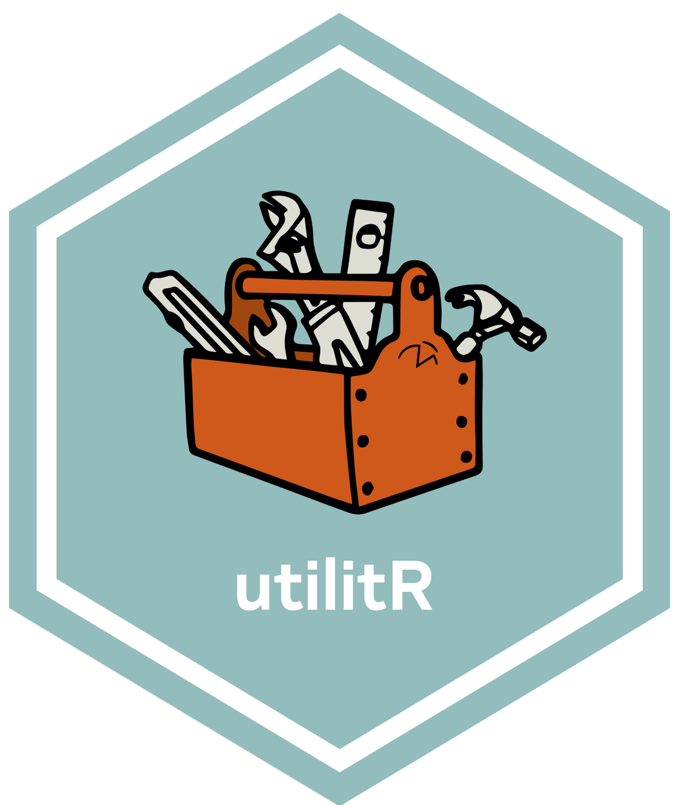
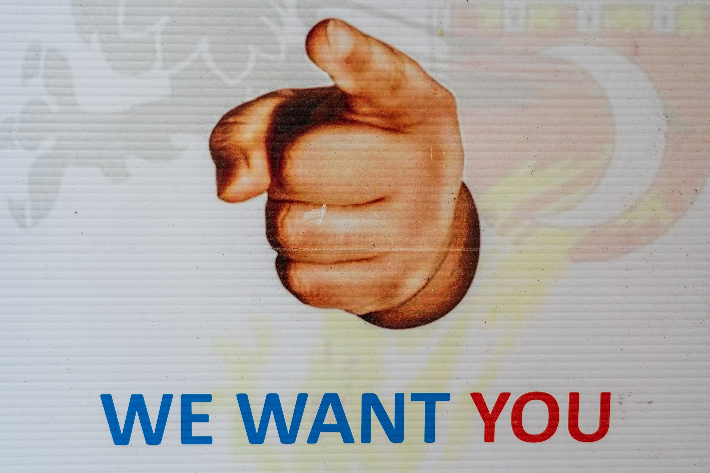

*Vous désirez intégrer la liste de diffusion ? Un mail à <ssphub-contact@insee.fr> suffit*

## Un événement autour des packages facilitant l’accès à l’open data de l’Insee

Après les présentations [d’`observable`](../../talk/presentation-dobservable-par-nicolas-lambert/) et de [`gridviz`](../../talk/presentation-de-gridviz-par-julien-gaffuri/) nous vous proposons un nouvel événement. Celui-ci sera autour de l’*open data* à travers la présentation des **packages facilitant la récupération de données de l’Insee** disponibles depuis le site web ou les API.

Deux présentations sont prévues : - Pierre Lamarche présentera le package [`doremifasol`](https://github.com/InseeFrLab/DoReMIFaSol). C’est notamment grâce à ce package que la documentation `utilitR` peut s’appuyer sur des données bien connues des utilisateurs d’*open data* (Filosofi, recensement…) - Hadrien Leclerc nous présentera le package [`Pynsee`](https://github.com/InseeFrLab/pynsee) qui est utilisé depuis deux ans à l’ENSAE pour apprendre aux futurs data scientists à récupérer des données de cadrage.

Ces deux présentations seront suivies d’un temps d’échange.

Cet événement aura lieu le **13 février de 15h à 16h30** ([📅 invitation `Outlook`](https://minio.lab.sspcloud.fr/ssphub/diffusion/website/2023-02-opendata_Insee/Présentation_SSPHub_packages_open_data_Insee.ics)). Si vous êtes utilisateurs de données, que vous veniez de l’Insee ou non, ces packages peuvent vous intéresser !

## Masterclass datascientest

Les masterclass organisées avec l’organisme de formation spécialisé `datascientest` reprennent ! Après une première masterclass au mois de décembre consacrée au MLOps, notre réseau va proposer de nouvelles séances.

Les premières séances vont s’organiser autour de **deux cursus parallèles**, qui commenceront par des introductions pour monter graduellement en niveau et se rapprocher des cas d’usages que rencontrent nos data scientists.

Le premier parcours sera orienté autour des problématiques de NLP. La première séance aura lieu le **10 février, de 10h à 12h** et constituera une introduction au NLP avec un retour sur certains concepts centraux (*preprocessing*, *tokenisation*, *lemmatisation*…) et des exemples d’applications avec le package [`SpaCy`](https://spacy.io/). Une deuxième séance dans ce parcours est déjà programmée, le **24 mars de 10h à 12h**, sur le thème de la similarité textuelle et de la classification de textes grâce aux méthodes d’*embeddings*.

Le deuxième parcours cible la problématique de l’analyse d’images. Une première séance, qui aura lieu le **10 mars de 10h à 12h** reviendra sur certains concepts centraux du *deep learning* (perceptron, convolution, *transfer learning*…). Les séances suivantes, dont les dates n’ont pas encore été arrêtées, s’intéresseront à des cas d’usages comme l’OCRisation ou la détection d’objets dans des images.

> **NOTE:**
>
> **Pour vous inscrire, il suffit de remplir [ce formulaire](https://framaforms.org/participation-aux-masterclass-datascientest-1675096179) !**

## Questionnaire sur vos besoins en formation data science

En cette période de recensement, le réseau propose également le sien ! Pour déterminer au mieux la répartition des besoins en formation sur les sujets data science et ainsi pouvoir proposer des événements pertinents, **nous vous proposons un [questionnaire](https://framaforms.org/besoin-de-formations-en-data-science-1674150129)** sur vos besoins en formation.

## `utilitR` recherche des rédacteurs d’exercices !

Dans le but de continuer à développer [`utilitR`](https://www.book.utilitr.org/), documentation collaborative et ouverte, l’équipe du projet souhaite encourager des contributions volontaires pour **ajouter des exercices à chaque fiche thématique**. L’objectif est de produire pour chaque chapitre un ensemble d’exercices, de difficulté graduelle, permettant de mettre en application les concepts présentés dans la fiche.

Ces exercices seraient accessibles depuis le [site web](https://www.book.utilitr.org/) mais aussi à travers le [portail de formation du `SSP Cloud`](https://www.sspcloud.fr/formation), sous la forme de *notebooks* d’autoformation.

L’équipe du projet `utilitR` est donc à la **recherche des personnes motivées pour rédiger des exercices ou mettre à disposition des bouts de code ou des exercices déjà préparés**. Si vous désirez apporter votre pierre à l’édifice, toute contribution, même modeste, sur cette [page](https://github.com/InseeFrLab/utilitR/issues/462), sera appréciée par l’équipe `utilitr`.

Cette évolution de la documentation vise à prolonger l’effort continu pour construire une documentation vivante, interactive et originale. L’esthétique du [site web book.utilitr.org](https://www.book.utilitr.org/) a ainsi été revue récemment afin de rendre la documentation plus ergonomique tout en ajoutant des fonctionnalités utiles aux lecteurs, comme la possibilité de surligner ou de prendre des notes.

## Proposez un billet de blog !

Le site web du réseau (https://ssphub.netlify.app/) propose depuis septembre une section blog. **Vos idées et contributions sont les bienvenues pour l’enrichir !**

Pour souligner l’aspect collectif de cette section, un [guide des contributeurs](https://github.com/InseeFrLab/ssphub/blob/main/CONTRIBUTING.md) vient de voir le jour. Celui-ci expose la démarche à suivre, de la phase de discussion pour définir le sujet du billet aux outils proposés pour faciliter la rédaction et la soumission de celui-ci depuis [`Github` ](https://github.com/InseeFrLab/ssphub).

## La saison 2 du programme 10% arrive

L’attente était insoutenable mais la nouvelle saison de 10% est enfin là ! **Rejoignez ce programme**, issu des recommandations du [rapport de l’Inspection Générale de l’Insee et de la DINUM](https://www.numerique.gouv.fr/uploads/RAPPORT-besoins-competences-donnee.pdf), où des data scientists proposent de consacrer jusqu’à 10% de leur temps de travail à des projets transversaux !

Au-delà de la participation à ces projets, le programme 10% est également l’opportunité d’échanger des idées avec des data scientists d’autres administrations et de bénéficier de formations.

Après un **webinaire d’information sur le programme le 31 janvier** (inscription via [eventbrite](https://www.eventbrite.fr/e/billets-saison-2023-du-programme-10-webinaire-dinformation-520302437597)), la **journée de lancement** de la saison 2 se tiendra le **14 février au Bercy Lab** (plus d’infos à venir).

Cette saison, plus longue que la première, permettra de pérenniser certains des projets de la saison 1 mais aussi de lancer de nouveaux projets.

**Inscrivez-vous dès maintenant pour ne pas manquer la saison 2 de 10%!**

> **NOTE:**
>
> Pour plus d’information sur le programme : <lab-ia@data.gouv.fr>

## Report de la journée de la donnée

La **journée de la donnée** organisée par l’Administrateur Ministériel des Données, Algorithmes et Codes sources (AMDAC) du Ministère de la Santé, **initialement prévue le 31 janvier, est reportée à une date ultérieure**.
