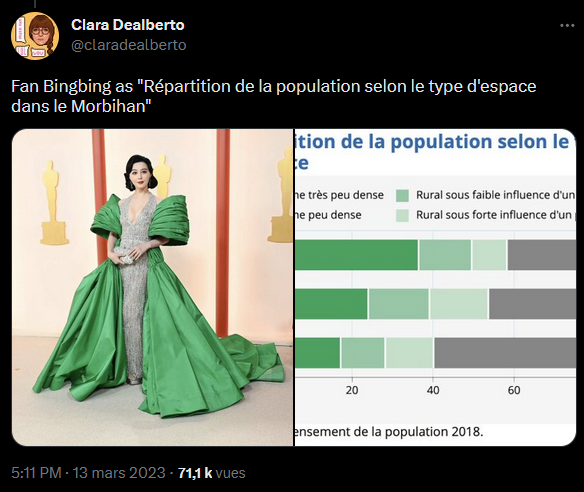
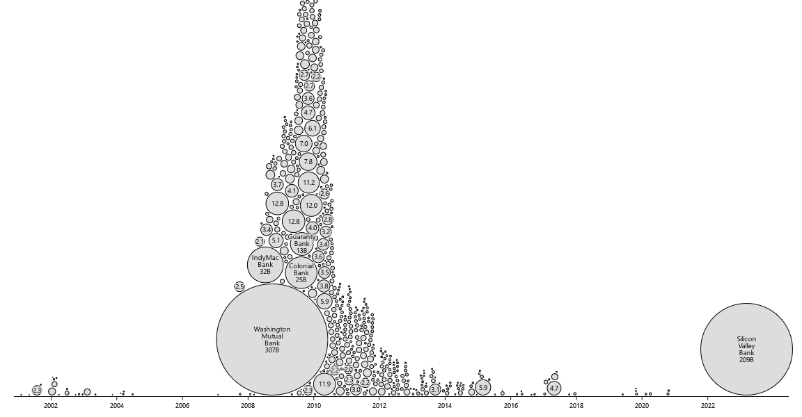

> **NOTE:**
>
> ***Vous désirez intégrer la liste de diffusion ? L’inscription se fait [ici](https://grist.numerique.gouv.fr/o/ssphub/forms/jSjAV3L2F8mmiRVuVEpfF7/103).***

Du fait de la densité des actualités dans le monde de la *data science* et des multiples événements à venir dans le cadre de ce réseau, nous proposons d’accélérer le rythme de publication des *newsletters*.  

# Actualités de la data science

## La charte graphique de l’Insee sur le tapis rouge

La semaine dernière avait lieu la cérémonie des Oscars. Grâce à un [fil de Clara Dealberto](https://twitter.com/claradealberto/status/1635310454628298753), on peut mesurer l’influence des graphistes de l’Insee sur les stylistes des stars :

Tweet de Clara Dealberto

Le [fil](https://twitter.com/claradealberto/status/1635310454628298753?s=20), qui met à l’honneur l’Insee, vaut le détour ; n’hésitez pas à le consulter ! Ou à découvrir celui sur le [*Met Gala*](https://twitter.com/claradealberto/status/1521417299210686464).

## ChatGPT encore et toujours

`ChatGPT` continue de focaliser l’attention. Dans la veine de l’article désignant les modèles de langages sous le terme de [*“stochastic parrots”*](https://dl.acm.org/doi/10.1145/3442188.3445922) (“perroquets stochastiques”), Arthur Charpentier parle lui de [“société du bullshit”](https://freakonometrics.hypotheses.org/66144) pour désigner la manière dont `ChatGPT` offre, sous un raisonnement en apparence logique, de manière indifférenciée des absurdités et des vérités.

Espérons que lorsque `ChatGPT` sera [embarqué dans les voitures *General Motors*](https://arstechnica.com/cars/2023/03/gm-plans-to-let-you-talk-to-your-car-with-chatgpt-knight-rider-style/), il ne nous donnera pas de fausse indication pour changer un pneu ou ne se retournera pas contre le conducteur comme le ferait HAL 9000.

Un article intéressant de [Wired](https://www.wired.com/story/the-generative-ai-search-race-has-a-dirty-secret/) questionne d’ailleurs l’empreinte carbone que pourrait impliquer la généralisation des modèles de langage dans les moteurs de recherche, qui font face à des milliards de requêtes quotidiennes.

Au moment où `OpenAI` rend public [GPT-4](https://openai.com/product/gpt-4), une version plus riche de son modèle `GPT-3` qui servait de base à `ChatGPT`, l’un des cofondateurs d’`OpenAI` revient sur la stratégie d’ouverture (ou plutôt l’absence d’ouverture) d’`OpenAI` : *“Nous avions tord”* ([voir *The Verge*](https://www.theverge.com/2023/3/15/23640180/openai-gpt-4-launch-closed-research-ilya-sutskever-interview)). Hasard du calendrier, cette déclaration a eu lieu presque au même moment que la publication d’un robot conversationnel ouvert [`OpenChatKit`](https://www.together.xyz/blog/openchatkit). La concurrence est néanmoins âpre puisqu’une équipe de Microsoft a déjà proposé l’intégration à `ChatGPT` d’un module permettant d’interagir avec `ChatGPT` également par le [biais d’images](https://www.linkedin.com/posts/thomas-wolf-a056857_ai-opensource-chatgpt-activity-7040347000814383104-eCXz/?utm_source=share&utm_medium=member_android).

## Des turbulences dans la Silicon Valley

Une infographie des faillites bancaires par Mike Bostock. Source: [Notebook Observable](https://observablehq.com/@mbostock/bank-failures)

L’autre actualité phare des quinze derniers jours est la faillite de la *Silicon Valley Bank*. Aux Etats-Unis, il s’agit de la plus principale faillite bancaire depuis 2008 aux Etats-Unis.

La Fed est rapidement intervenue pour endiguer la panique bancaire, même si la banque était en fait déjà dans ses radars bien avant sa faillite ([voir NYT](https://www.nytimes.com/2023/03/19/business/economy/fed-silicon-valley-bank.html)).

## Retour sur les évolutions récentes du monde de la data science

Le [panorama technologique 2023 de Matt Turck](https://mattturck.com/mad2023/) confirme la tendance à la diversification des technologies à maîtriser pour mener un projet de *data science*. Cette complexification des outils et des rôles dans l’écosystème de la donnée, évoquée dans l’article [*“Is Data Scientist Still the Sexiest Job of the 21st Century?”*](https://hbr.org/2022/07/is-data-scientist-still-the-sexiest-job-of-the-21st-century), est ici confirmée.

Les derniers sondages auprès des recruteurs américains montrent la popularité des *data engineers*, plus spécialisés que les *data scientists* dans la mise en oeuvre d’infrastructures techniques pour valoriser des données. Le profil de *data engineer* apparaît en deuxième place dans le classement des profils les plus recherchés par les recruteurs alors que les *data scientists* n’apparaissent plus dans les premières places du classement.

## Le big data n’est pas mort

Une [réponse intéressante](https://ponder.io/big-data-is-dead-long-live-big-data/) à l’article *“Big data is dead”* ([voir Newsletter \#11](https://ssphub.netlify.app/infolettre/infolettre_11/)) revient sur l’intérêt de disposer de données historiques longues pour l’entrainement de modèles d’apprentissage.

## `R` directement dans le navigateur

Avec un peu de retard sur [`Python`](https://github.com/pyodide/pyodide), il devient maintenant possible de faire du `R` directement depuis le navigateur web, c’est-à-dire sans installation du logiciel `R`, grâce à [`WebR`](https://www.tidyverse.org/blog/2023/03/webr-0-1-0/). Cette approche est typique du *Web Assembly* où les langages de programmation sont directement utilisés depuis le navigateur, sans installation préalable.

# Actualités du réseau: événements à venir

Place aux actualités de notre réseau avec les prochains événements que nous organisons.

## Première journée du réseau en avril (17 avril)

Déjà annoncée dans la [*Newsletter \#11*](https://ssphub.netlify.app/infolettre/infolettre_11/), nous rappelons la **journée du réseau le 17 avril, en présentiel** 📅.

Le nombre de places dans l’espace à disposition étant limité, une invitation par mail et un lien d’inscription seront communiqués dans la semaine pour pouvoir participer à cet événement en présentiel dans le tiers-lieu [la Tréso](https://www.latreso.fr/) à Malakoff.

## Bonnes pratiques en `Python` : présentation lors des ateliers du programme 10% (30 mars)

Dans le cadre du programme 10%, des présentations ont lieu avant certains ateliers de travail sur les projets communautaires.

La prochaine présentation, qui aura lieu le **jeudi 30 mars de 14h à 15h 📅**, sera donnée par des membres du réseau. Elle portera sur une présentation des outils favorisant les bonnes pratiques de développement en `Python` et de l’intérêt de ces bonnes pratiques pour faciliter la mise en production de projets de *data science*. Il s’agira d’une présentation succincte du contenu du cours de l’ENSAE [“Bonnes pratiques et mise en production de projets data science”](https://ensae-reproductibilite.netlify.app/).

Plus d’infos à venir par le biais du canal `Tchap` de notre réseau.

## Un événement autour de l’OCRisation avec Christopher Kermorvant (29 mars)

Le **mercredi 29 mars de 15h à 16h 📅** nous recevons [Christopher Kermorvant](https://www.linkedin.com/in/christopher-kermorvant-87158b2/?originalSubdomain=fr), chercheur spécialisé en OCRisation et fondateur de [Teklia](https://teklia.com/). Christopher mène actuellement plusieurs projets de numérisation de textes anciens, notamment d’OCRisation de vieux recensements avec l’INED.

Pendant cet événement, Christopher nous fera un état de l’art de l’OCRisation puis nous présentera des projets qu’il a pu mener récemment avec Teklia.

Il est possible de suivre la présentation via [**Zoom**](https://insee-fr.zoom.us/j/99414476694?pwd=NTg2UTl4TUdzMi9TOGk5QzdKOUZjdz09) ou, pour les personnes présentes à l’Insee, en **2-C-496**.

## Présentation de la documentation collaborative *Carpentries* (28 mars)

Pour rappel, Kate Burnett-Isaacs, de Statistics Canada, nous présentera l’initiative Meta Academy / Carpentries le **mardi 28 mars à 15h** 📅. Plus de détails dans la [*Newsletter \#11*](https://ssphub.netlify.app/infolettre/infolettre_11/).

**[Invitation `Outlook` ici](https://minio.lab.sspcloud.fr/ssphub/diffusion/website/2023-03-carpentries/carpentries.ics)**.

# Actualités du réseau: dernières nouveautés

## Post de blog sur `Polars`

Pour faire suite à la [*Newsletter \#11*](https://ssphub.netlify.app/infolettre/infolettre_11/) qui présentait l’écosystème autour du package [`Python` `Polars`](https://www.pola.rs/), Romain Tailhurat (Insee) nous propose un [post de blog](https://ssphub.netlify.app/post/polars/) pour découvrir ce *package*.

Celui-ci est accompagné par un tutoriel pas-à-pas pour découvrir les principales fonctionnalités de la librairie. Il est possible de tester le *notebook* en un seul clic sur le `SSP Cloud` ou sur `Google Colab`.

Vous pouvez également retrouver ce tutoriel depuis l’[espace formation](https://www.sspcloud.fr/formation) du SSP Cloud.
