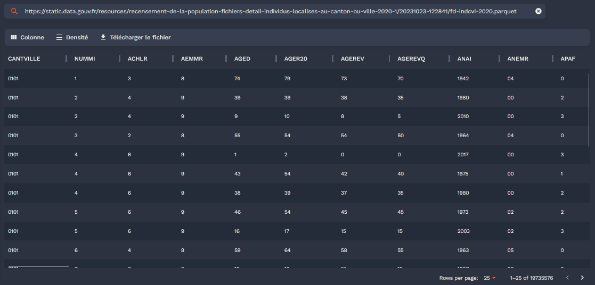

> **TIP:**
>
> ***Vous désirez intégrer la liste de diffusion ? L’inscription se fait [ici](https://grist.numerique.gouv.fr/o/ssphub/forms/jSjAV3L2F8mmiRVuVEpfF7/103).***

Noël approchant, avant d’ouvrir vos cadeaux, de dévorer une bûche ou tout autre met délicieux, nous vous proposons de nous retourner sur la progression de l’audience du réseau durant l’année 2023. Cette newsletter commencera ainsi par une rétrospective du réseau, en écho à celle de l’[année 2022](../../infolettre/infolettre_09/index.llms.md). Une partie consacrée aux actualités de la *data science* suivra.

> **NOTE:**
>
> `Observable` est à la fois un langage visant à simplifier l’usage de `JavaScript` pour mettre en oeuvre des visualisations interactives et une [plateforme](https://observablehq.com/) permettant de simplifier la mise à disposition de ces visualisations sous une forme de *notebook*.
>
> Les statistiques de comptage sont enregistrées sous format `Parquet` sur le système de stockage `S3` du `SSPCloud`. L’intégration native de `DuckDB` à `Observable` permet au navigateur *web* de lire et d’effectuer des manipulations de données à travers des requêtes SQL de manière très efficace. Sur ce sujet, outre la [documentation officielle d’`Observable`](https://observablehq.com/documentation/data/databases/database-clients#duckdb), il est recommandé de lire le [tutoriel d’Eric Mauvière](https://observablehq.com/@ericmauviere/duckdb-redonne-nouvelle-vie-sql).
>
> La librairie [`Plot`](https://observablehq.com/@observablehq/plot) propose de nombreuses fonctionalités utiles pour construire des visualisations interactives. Sa logique est assez proche de celle des *frameworks* [`ggplot2` en `R`](https://observablehq.com/@observablehq/plot-from-ggplot2) ou [`matplotlib` en `Python`](https://observablehq.com/@observablehq/plot-overview-for-matplotlib-users).
>
> Ce *post* s’appuie sur [`Quarto`](https://quarto.org/docs/interactive/ojs/) qui permet de créer une page *web* statique autosuffisante à partir d’une suite d’instructions dans des blocs `{ojs}`. Cette méthode est très intéressante pour l’intégration de figures `JavaScript` dans des sites *web* complets générés de manière automatique. Le code utilisé est mis à disposition des curieux par le biais de menus déroulants.
>
> L’ensemble des codes sources nécessaires à la reproduction de cette page sont disponibles sur le [`Github inseefrlab/ssphub`](https://github.com/InseeFrLab/ssphub/blob/main/infolettre/infolettre_16/). Pour limiter les duplications de code, les scripts ont été modularisés dans des fichiers séparés.  
> Les éléments ne sont pas nécessairement présentés dans l’ordre car `JavaScript` est un langage *asynchrone*, les éléments ne sont pas executés dans l’ordre de définition mais dans l’ordre par lequel ils sont nécessaires pour obtenir un objet donné.

## Rétrospective du réseau en 2023

### Une audience en progression

``` js
html`<div><span class = "underline-big">${start_count}</span> personnes faisaient partie de la liste de diffusion en début d'année 2023.</div><br>`
```

``` js
html`<div>${plot_bar_participants}</div><br>`
```

``` js
html`<div>${message}</div><br>`
```

Découvrir le code

Voir plus bas la définition des objets Javascript 👇️

``` javascript
html`<div><span class = "underline-big">${start_count}</span> personnes faisaient parti de la liste de diffusion en début d'année.</div><br>`
html`<div>${plot_bar_participants}</div><br>`
html`<div>${message}</div>`
```

A l’exception du mois d’août (pause estivale oblige), la progression de l’audience a été assez régulière grâce aux événements et contenus publiés sur le site du `SSP Hub`.

``` js
html`<div>Pendant l'année 2023, le réseau a ainsi connu <span class="underline-big">${events.length}</span> événements et publications de contenu (${countEvents("Infolettre")}, ${countEvents("Post de blog")}, ${countEvents("Evénement virtuel ou présentiel")}, ${countEvents("Masterclass")}).</div><br>`
```

``` js
html`<div>${lineplot}</div>`
```

``` js
html`<div>${warm_strip}</div>`
```

``` js
md`__Choisir les événements du réseau à afficher 👇️__`
```

``` js
html`<div>${viewof events_chosen_figure1}</div>`
```

``` js
html`<div>${table_events}</div>`
```

Code pour générer les différents blocs de cette figure

Code pour générer la figure principale

``` js
// Voir plus bas 👇️ les arrays utilisés
// Animation faite avec le Scrubber ci-dessous
lineplot = Plot.plot({
    y: {
        grid: true,
        label: "Nombre d'inscrits"
    },
    x: {
        label: "Date",
        domain: [new Date("2023-01-10"), new Date("2023-12-09")]
    },
    color: {
        range: Object.values(color_mapping_events),
        domain: Object.keys(color_mapping_events),
        label: "Type d'événement"
    }, 
    marginLeft: 50,
    marks: [
        Plot.line(
          serie_contacts, {
            x: "date", y: "mail",
            stroke: "#6886bb",
            tip: "xy"
            }),
        Plot.crosshairX(serie_contacts_complete, { //<1>
            x: (d) => new Date(d.date), y: "mail", stroke: "red"
            }),
        Plot.dot(
          serie_contacts_complete,
          Plot.pointerX({x: (d) => new Date(d.date), y: "mail", stroke: "red"})), //<2>
        Plot.dot(serie_contacts, {
            x: "date", y: "mail",
            stroke: "#6886bb",
            fill: "#6886bb",
            title: "Effectif"
            }),
        Plot.tickX(events_data_figure1_b, {
            x: (d) => new Date(d.date), text: html``,
            stroke: "type",
            opacity: 0.1,
            color: "x",
            tip: true
            }),            
        Plot.axisX(events_data_figure1_b, {
            x: (d) => new Date(d.date),
            text: "",
            color: "type"
            }),
    ]
})
```

1.  Elément de réactivité lorsque la souris passe sur la figure.
2.  Elément de réactivité lorsque la souris passe sur la figure.

Code pour générer la bande sous la figure principale

``` js
warm_strip = Plot.plot({ //<1>
  height: 40,
  marginLeft: 50,
  color: {
    scheme: "ylorrd",
    },
  marks: [
    Plot.crosshair(serie_contacts_complete, {
      x: (d) => new Date(d.date),
      strokeOpacity: 0.2,
      fill: "mail",
      interval: d3.utcDay.every(3),
      inset: 0 // no gaps
    }),
    Plot.barX(serie_contacts_complete, {
      x: (d) => new Date(d.date),
      strokeOpacity: 0.2,
      fill: "mail",
      interval: d3.utcDay.every(3),
      inset: 0 // no gaps
    })
  ]
})
```

1.  Inspiration : https://observablehq.com/@observablehq/plot-warming-stripes

Code pour générer le sélecteur d’événements

``` js
function underline_event(x){
    const x_underlined = `<span style="text-transform: capitalize; border-bottom: solid 4px ${color_mapping_events[x]}; margin-bottom: -2px;">${x}</span>` ;
    return x_underlined
}

viewof events_chosen_figure1 = Inputs.checkbox(
    unique(events.map(d => d.type)),
    {
        value: unique(events.map(d => d.type)),
        format: x => html`${underline_event(x)}`
    }
)
```

Code pour générer la table interactive

``` js
table_events = Inputs.table(
    events_data_figure1_b,
    {
        columns: ["date", "event", "type"],
        header: {
            date: "Date",
            event: "Evénement du réseau",
            type: "Type d'événement"
        },
        format: {
            type: (x) => html`
            <span style="text-transform: capitalize; display: inline-flex; align-items: center;">
    <span style="border-bottom: solid 1px ${color_mapping_events[x]}; margin-bottom: -2px;">${x}</span>
    <span style="width: 10px; height: 10px; margin-left: 5px; background-color: ${color_mapping_events[x]};"></span>
    </span>
            `,
        event: (x) => html`<a ${links_website_ssphub[x] !== undefined ? `href="${links_website_ssphub[x]}" target="_blank"` : ''}>${x}</a>`
        }
    })
```

### Du contenu qui intéresse au-delà des statisticiens publics

Si les statistiques concernant la composition du réseau parmi les organismes de la statistique publique sont relativement stables par rapport à l’an dernier, le changement principal ayant eu lieu en 2023 est l’ouverture progressive à des publics hors de la statistique publique (administrations hors du SSP, chercheurs et étudiants…)

``` js
html`<div>${barplot_ssp}</div>`
```

Code pour générer la figure

``` js
barplot_ssp = Plot.plot({
  marginLeft: 60,
  marginRight: 100,
  x: {label: "Frequency"},
  y: {label: null},
  color: {
    domain: ["Hors du SSP", "Service Statistique Public (SSP)"],
    range: ["forestgreen", "#6886bb"]
    },
  marks: [
    Plot.barX(hors_ssp_data,
    {
      y: "SSP",
      fy: (d) => new Date(d.date).toLocaleString("fr", {
        "month": "long",
        "year": "numeric"
      }),
      x: "mail", inset: 0.5, fill: "SSP", sort: "mail",
      tip: true, channels: {share: (d)  => `${100*d.share.toFixed(2)}%`}
    }),
    Plot.axisY({textAnchor: "start", fill: "black", dx: 14}),
    Plot.ruleX([0])
  ]
})
```

Les deux dernières publications sur le site du réseau, à savoir l’[infolettre \#15](../../infolettre/infolettre_15/index.llms.md) sur le réentrainement des modèles de langage et, surtout, le [*post* de blog](../../post/parquetRP/index.llms.md) sur la publication du recensement de la population au format `Parquet` ont connu un écho important hors des cercles de *data scientist* du service statistique public et ont amené de nouveaux publics à suivre les contenus proposés par le réseau.

# Actualités de la *data science*

## La startup Mistral AI publie un modèle à l’état de l’art

Mistral AI, une *startup* française spécialisée dans l’intelligence artificielle, vient de publier un modèle nommé [`Mixtral`](https://mistral.ai/news/mixtral-of-experts/) qui repose sur le principe du [*mixture of experts*](https://huggingface.co/blog/moe). Cette technique consiste à privilégier une architecture construite à partir de sous-modèles spécialisés plutôt qu’un modèle généraliste qui s’adapte en fin de procédure à une question spécialisée. Dans ce type de modèles, l’enjeu est ainsi d’interpréter la question pour diriger la réponse vers l’expert adéquat : si une question porte sur un sujet de cuisine, un.e expert.e spécialisé.e en code sera de peu de secours.

D’après les premières évaluations publiées, ce modèle surpasserait les capacités des autres modèles ouverts (notamment `Llama 2`) et s’approcherait des performances de GPT 3.5, le modèle derrière la version gratuite de ChatGPT. Cette annonce a eu lieu en pleine période de levée de fonds pour Mistral AI qui aurait obtenu un financement de 385 millions d’euros.

Tableau des performances (source: [Mistral AI](https://mistral.ai/news/mixtral-of-experts/))


Tableau des performances publié par Mistral AI

> **NOTE:**
>
> - Un [article du *Monde*](https://www.lemonde.fr/economie/article/2023/12/11/la-start-up-francaise-mistral-ai-a-leve-385-millions-d-euros_6205065_3234.html) sur l’entreprise Mistral AI ;
> - Le modèle `Mixtral` sur [Huggingface](https://huggingface.co/docs/transformers/model_doc/mixtral) ;
> - Le principe des architectures *mixture of experts* ([article Wikipedia](https://en.wikipedia.org/wiki/Mixture_of_experts)).

## L’Europe parvient à un accord sur les premières règles au monde en matière d’IA

Dans un accord provisoire signé le 9 décembre 2023 et nommé *“Artificial Intelligence Act”*, les États Membres et le Parlement européen ont établi une proposition relative à des règles harmonisées concernant l’intelligence artificielle (IA).

Débutées en 2018, avant que les IA génératives ne deviennent si populaires, ces discussions dépassent le cadre exclusif de ces dernières. Néanmoins, concernant celles-ci, le compromis prévoit une approche différenciée suivant le contexte de développement et l’usage de ces modèles. Outre le respect des règles européennes de propriété intellectuelle, les développeurs de modèles génératifs devront s’assurer que les produits diffusés sont bien identifiés comme artificiels, afin de limiter la diffusion de [*deepfakes*](https://fr.wikipedia.org/wiki/Deepfake). Les développeurs de ces modèles devront également communiquer sur la qualité des données utilisées pour entraîner les modèles et sur le coût énergétique de ceux-ci. Les modèles *open source* et ceux construits à des fins de recherche bénéficient d’exemptions de ces règles.

Des contraintes renforcées s’appliqueront aux systèmes jugés à *“haut risque”* dans des domaines comme la défense, l’éducation, les ressources humaines ou encore la santé. Pour ces systèmes, il sera nécessaire de réaliser une analyse d’impact avant la mise sur le marché. Par ailleurs, une obligation de transparence et d’explicabilité des modèles est mise en place afin d’être en mesure de comprendre les règles de décision de ces IA.

L’accord provisoire interdit également l’utilisation de l’IA dans quelques domaines, jugés trop sensibles. Par exemple, la reconnaissance faciale de masse est interdite, hormis lorsque celle-ci est justifiée par des motifs de sécurité nationale. D’autres utilisations, qui peuvent amener à des dérives, comme la notation sociale basée sur le comportement ou des caractéristiques personnelles, sont interdits. Les travaux se poursuivront maintenant au niveau technique dans les semaines à venir afin de mettre au point les détails du nouveau règlement. Une fois ces travaux terminés, la présidence présentera le texte de compromis aux représentants des États membres pour approbation.

> **NOTE:**
>
> - La [présentation de l’accord](https://www.consilium.europa.eu/fr/press/press-releases/2023/12/09/artificial-intelligence-act-council-and-parliament-strike-a-deal-on-the-first-worldwide-rules-for-ai/) sur le site web du Conseil de l’Europe.

## Nouveau *post* de blog: diffusion du recensement de la population au format `Parquet`

Chaque année, l’Insee diffuse des statistiques construites à partir du recensement de la population, l’une des enquêtes phares de l’institut. Pour accompagner ces résultats et permettre à de nombreux acteurs de creuser ces données très riches dans des dimensions qui les intéressent, l’Insee diffuse également des bases de données détaillées construites après anonymisation de près de 20 millions de données individuelles.

Ces données, d’une extrême richesse, étaient historiquement complexes à manipuler du fait de leur volumétrie. La diffusion de celles-ci sous le format `Parquet`, une première mondiale parmi les instituts de statistique publique, vise à simplifier leur exploitation. Pour accompagner cette innovation, en partenariat avec les services de diffusion de l’Insee, le [dernier *post* de blog](https://ssphub.netlify.app/post/parquetrp/) du réseau présente un guide pratique d’utilisation de ces données dans plusieurs langages de traitement ( , `Python` et `Observable` ) par le biais de `DuckDB`.

Combien d’habitants de Toulouse ont changé de logement sur l’année ? Quels sont les départements avec le plus de centenaires ? Le [*post* de blog](https://ssphub.netlify.app/post/parquetrp/) vous montrera comment calculer ces statistiques. Et si vous désirez découvrir ce format avec des exemples additionnels, ce *post* d’[Eric Mauvière](https://www.icem7.fr/outils/3-explorations-bluffantes-avec-duckdb-1-interroger-des-fichiers-distants/) vous intéressera également.

> **NOTE:**
>
> - Le [*post* de blog](https://ssphub.netlify.app/post/parquetrp/) ;
> - Un [article](https://www.insee.fr/fr/information/7635827?sommaire=7635842) sur le format `Parquet` dans le *Courrier des stats n°9* écrit par Alexis Dondon et Pierre Lamarche ;
> - Le blog d’[Eric Mauvière](https://www.icem7.fr/outils/3-explorations-bluffantes-avec-duckdb-1-interroger-des-fichiers-distants/) qui présente une série d’articles sur le format `Parquet`;
> - La [présentation](https://www.linkedin.com/feed/update/urn:li:activity:7133760348129505281?updateEntityUrn=urn%3Ali%3Afs_feedUpdate%3A%28V2%2Curn%3Ali%3Aactivity%3A7133760348129505281%29) de Romain Lesur sur le sujet pour l’atelier *Modernisation of Official Statistics* de l’UNECE.

## Le [SSPCloud](https://datalab.sspcloud.fr) se dote d’un explorateur de fichiers basé sur `DuckDB`

`DuckDB` est un outil extrêmement efficace pour lire des fichiers `Parquet` et `CSV`. Outre son efficacité, `DuckDB` présente l’avantage d’être disponible par le biais de plusieurs clients: , `Python` mais aussi un navigateur web grâce à `Javascript` . Des acteurs majeurs de l’écosystème de la *data science*, notamment [Observable](https://observablehq.com/documentation/data/databases/database-clients#duckdb), ont fait de `DuckDB` une pierre angulaire de leurs explorateurs de données. L’avantage de cette approche, typique du [*web assembly*](https://developer.mozilla.org/fr/docs/WebAssembly) (approche visant à mettre à disposition des logiciels de calculs scientifiques par le biais d’un simple navigateur), est que seul `Javascript` , qui est disponible sur tout navigateur, est nécessaire pour visualiser et effectuer des traitements analytiques sur des données.

Le [`SSPCloud`](https://datalab.sspcloud.fr), la plateforme moderne de traitement de données développée par l’Insee et mise à disposition de près de 3000 agents de l’administration ou étudiants, vient de mettre en oeuvre [un explorateur](https://datalab.sspcloud.fr/data-explorer?rowsPerPage=25&page=1&columnWidths=%7B%7D&columnVisibility=%7B%7D) aux fonctionnalités similaires 🚀.



Un exemple d’utilisation de cet explorateur sur les données détaillées du recensement 👆️

Celui-ci s’appuie sur `DuckDB` et permet de visualiser de manière très fluide les fichiers aux formats `Parquet` et `CSV`. Il ne se restreint pas aux données disponibles sur les espaces de stockage personnels du `SSPCloud`: n’importe quel fichier, au format adéquat et disponible sur internet, peut être lu avec ce visualiseur. Il n’est d’ailleurs pas nécessaire d’avoir un compte sur le [`SSPCloud`](https://datalab.sspcloud.fr) pour l’utiliser, il suffit que le fichier que l’on souhaite lire soit un fichier *open data* 😍 !

> **NOTE:**
>
> - [Des éléments](https://developer.mozilla.org/fr/docs/WebAssembly) sur le *web assembly* ;
> - [L’explorateur de fichier du `SSPCloud`](https://datalab.sspcloud.fr/data-explorer?rowsPerPage=25&page=1&columnWidths=%7B%7D&columnVisibility=%7B%7D) ;
> - [L’explorateur de fichiers de `data.gouv`](https://explore.data.gouv.fr/tableau) basé sur la même approche technologique.

## L’accessibilité de `Jupyter` améliorée avec le concours de l’Insee

Afin de ne pas pénaliser certains publics, les logiciels doivent respecter des critères d’accessibilité. Ils doivent notamment avoir de nombreuses fonctionnalités accessibles sans souris, exclusivement par le biais du clavier. Cependant, `Jupyter`, logiciel bien connu des *data scientists*, par la structure complexe de son interface, présentait plusieurs défauts, comme la difficulté à naviguer dans la page pour trouver le menu nécessaire pour éditer du code.

Grâce à une subvention de l’Insee, des travaux d’amélioration de l’accessibilité de `Jupyter` ont pu être menés. Les prochaines versions du logiciel devraient être plus accessibles, et, entre autres, plus pratiques d’usage pour les *data scientists* qui privilégient le clavier à la souris pour se déplacer dans un document.

> **NOTE:**
>
> - L’[annonce](https://blog.jupyter.org/recent-keyboard-navigation-improvements-in-jupyter-4df32f97628d) sur le blog de `Jupyter` ;
> - Le principe d’[accessibilité clavier](https://www.w3.org/WAI/WCAG21/Understanding/keyboard-accessible) du W3C.

# Annexe pour les curieux: le code `Observable` utilisé pour cette page

Les librairies ou imports externes utilisés

``` js
Plot = require('@observablehq/plot@0.6.12/dist/plot.umd.min.js') //<1>
import {disposal} from "@mbostock/disposal"
import {Scrubber} from "@mbostock/scrubber"
```

1.  La librairie `Plot` embarquée par défaut dans `Quarto` est un peu vieille mais la mettre à jour est assez simple.

Objets réactifs nécessaires pour modifier en continu l’input de la figure 1

``` js
message = {
  const class_to_use = (scrubber_participants < end_count - 100) ? "blurred-element" : "underline-big";

  const message_to_print = `
  En fin d'année, <span class = "${class_to_use}" >${end_count}</span> personnes étaient membres de la liste de diffusion 🚀🚀.
  `

  return message_to_print
}
```

``` js
numbers2 = {
  const startValue = start_count;
  const endValue = end_count;

  const numbers = Array.from({ length: endValue - startValue + 1 }, (_, i) => i + startValue);
  return numbers
}
```

``` js
current_bar = {
  const startValue = 0;
  const endValue = scrubber_participants;

  const numbers = Array.from({ length: endValue - startValue + 1 }, (_, i) => i + startValue) ;
  return numbers

}
```

``` js
viewof scrubber_participants = Scrubber(numbers2, {loopDelay: 4000, initial: start_count})
```

La première figure, animée par la réactivité de ses inputs

``` js
plot_bar_participants = Plot.plot({
  height: 40,
  marginLeft: 60,
  x: {label: "Frequency →", domain: [336, 552]},
  y: {label: null},
  color: {
    scheme: "ylorrd",
    domain: [236, scrubber_participants] 
    },
  marks: [
    Plot.barX(current_bar, {x: 1, inset: 0.5, fill: (d) => d}),    //<1>
  ]
})
```

1.  Elément réactif

Fonctions utilisées

``` js
dateFormat = d3.utcFormat("%Y-%m-%d")
```

``` js
function pluralizeEvent(input) {
  switch (input) {
    case "Evénement virtuel ou présentiel":
      return "événements virtuels ou présentiels";
    case "Infolettre":
      return "infolettres";
    case "Post de blog":
      return "posts de blog";
    case "Masterclass":
      return "masterclasses";
    default:
      return "unknown event type";
  }
}
```

``` js
function countEvents(x){

  const pluriel = pluralizeEvent(x);

  const message = `
  <span style="border-bottom: solid 4px ${color_mapping_events[x]}; margin-bottom: -2px;">${nombre_events.get(x)} ${pluriel}
  </span>
  ` ;

  return message
}
```

``` js
function leftJoinArrays(array1, array2, key, mean, deviation) {
  const randomNoise = d3.randomNormal(mean, deviation);

  // Sort arrays by date
  array1.sort((a, b) => new Date(a.date) - new Date(b.date));
  array2.sort((a, b) => new Date(a.date) - new Date(b.date));

  // Perform left join
  const result = array1.map((item1, index) => {
    const matchingItem = array2.find((item2) => item2[key] === item1[key]);
    const noise = matchingItem ? randomNoise() : 0;
    const noisedMail = matchingItem ? matchingItem.mail + noise : undefined;
    return { rowNumber: index + 1, ...item1, ...matchingItem, noisedMail };
  });

  return result;
}
```

``` js
function unique(data, accessor) {
  return Array.from(new Set(accessor ? data.map(accessor) : data));
}
```

``` js
function interpolateDates(data) {
  // Sort the data by date
  data.sort((a, b) => new Date(a.date) - new Date(b.date));

  // Create an array to store the interpolated data
  const interpolatedData = [];

  // Loop through the data to interpolate values between dates
  for (let i = 0; i < data.length - 1; i++) {
    const currentDate = new Date(data[i].date);
    const nextDate = new Date(data[i + 1].date);
    
    // Calculate the difference in days between current and next date
    const daysDiff = (nextDate - currentDate) / (1000 * 60 * 60 * 24);

    // Calculate the daily increment
    const dailyIncrement = (data[i + 1].mail - data[i].mail) / daysDiff;

    // Interpolate values for each day between the current and next date
    for (let j = 0; j < daysDiff; j++) {
      const interpolatedDate = new Date(currentDate);
      interpolatedDate.setDate(currentDate.getDate() + j);
      
      const interpolatedValue = data[i].mail + j * dailyIncrement;

      interpolatedData.push({
        date: interpolatedDate.toISOString().split('T')[0],
        mail: Math.round(interpolatedValue), // Round to the nearest integer
      });
    }
  }

  // Add the last data point
  interpolatedData.push({
    date: data[data.length - 1].date,
    mail: data[data.length - 1].mail,
  });

  return interpolatedData;
}
```

*Inputs* pour `DuckDB` 🦆

``` js
url_events = `https://minio.lab.sspcloud.fr/ssphub/diffusion/website/2023-12-retrospective/events_orginazed_2023.json`
url_latest = 's3://ssphub/diffusion/website/2023-12-retrospective/list_contacts_latest.parquet'
url_hors_ssp = 's3://ssphub/diffusion/website/2023-12-retrospective/series_part_ssp.parquet'
url_latest2 = 's3://ssphub/diffusion/website/2023-12-retrospective/series_nombre_contact.parquet'
```

``` js
configuredClient = {
  const client = await DuckDBClient.of();
  await client.sql`
    SET s3_endpoint='minio.lab.sspcloud.fr'
  `;
  return client;
}

db = {
  await configuredClient.query(`
    CREATE VIEW share_ssp AS 
    SELECT * FROM read_parquet('${url_hors_ssp}') ;
  `);
  await configuredClient.query(`
    CREATE VIEW latest AS 
    SELECT * FROM read_parquet('${url_latest}') WHERE date > '2023-01-01' ;
  `);
  await configuredClient.query(`
    CREATE VIEW serie AS 
    SELECT * FROM read_parquet('${url_latest2}') WHERE date > '2023-01-01' ;
  `);
  return configuredClient
}
```

``` js
serie_contacts = db.sql`
SELECT date, CAST(SUM(mail) AS int) AS mail
FROM serie
GROUP BY date
`
serie_contacts_domain = db.sql`
SELECT date, domain, CAST(mail AS int) AS mail
FROM serie
`
```

``` js
hors_ssp_data = db.query(`
SELECT * FROM share_ssp WHERE date in ('2023-12-09', '2023-01-10')
`)
```

``` js
events = d3.json(url_events)
```

*Arrays* intermédiaire

``` js
serie_contacts_complete = interpolateDates(serie_contacts);
```

``` js
start_count = serie_contacts.filter((d) => dateFormat(d.date) == "2023-01-10").map((d) => d.mail)[0]
```

``` js
end_count = serie_contacts.filter((d) => dateFormat(d.date) == "2023-12-09").map((d) => d.mail)[0]
```

``` js
events_data_figure1 = events.filter(d => events_chosen_figure1.includes(d.type))
events_data_figure1
```

``` js
nombre_events = d3.rollup(events, (D) => D.length, (d) => d.type)
```

``` js
measured_dates = db.query(`SELECT DISTINCT strftime(date, '%Y-%m-%d') AS date FROM serie`)
date_selected = measured_dates.map(d => d.date)
list_dates2 = db.query(`SELECT DISTINCT strftime(date, '%Y-%m-%d') AS date FROM serie`)
```

``` js
links_website_ssphub = {
    const toto = {};

    events_data_figure1_b.forEach(item => {
    toto[item.event] = item.href;
    });

    return toto
}
links_website_ssphub
```

``` js
events_data_figure1_b = leftJoinArrays(events_data_figure1, serie_contacts_complete, "date", 0, 40)
```

Quelques *array* utiles

``` js
color_mapping_events = {

    const color_mapping_events = {
    "Evénement virtuel ou présentiel": "#4d78a6",
    "Infolettre": "#f28e2c",
    "Post de blog": "#e05658",
    "Masterclass": "#76b7b1"
    };

  return color_mapping_events
}
```

``` js
dates_2023 = Array.from({length: 365}, (_, i) => {
  const date = new Date(2023, 0, 1);
  date.setDate(i + 1);
  return date;
})
```
