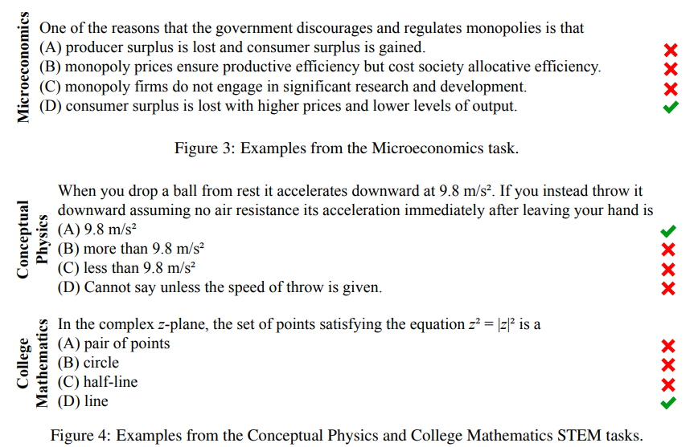
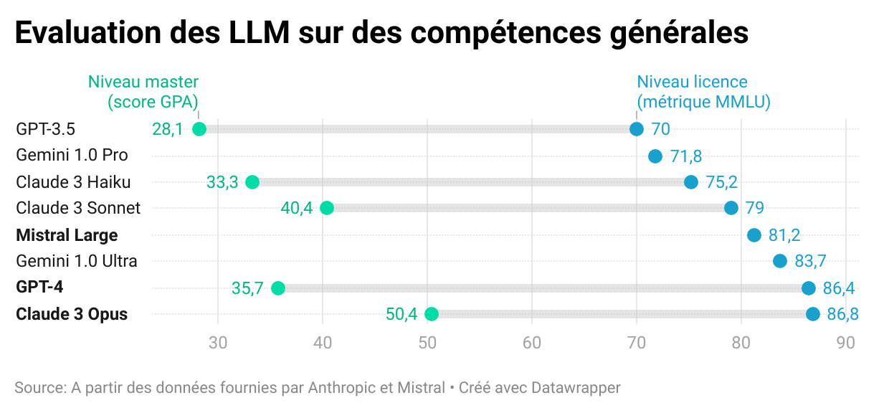
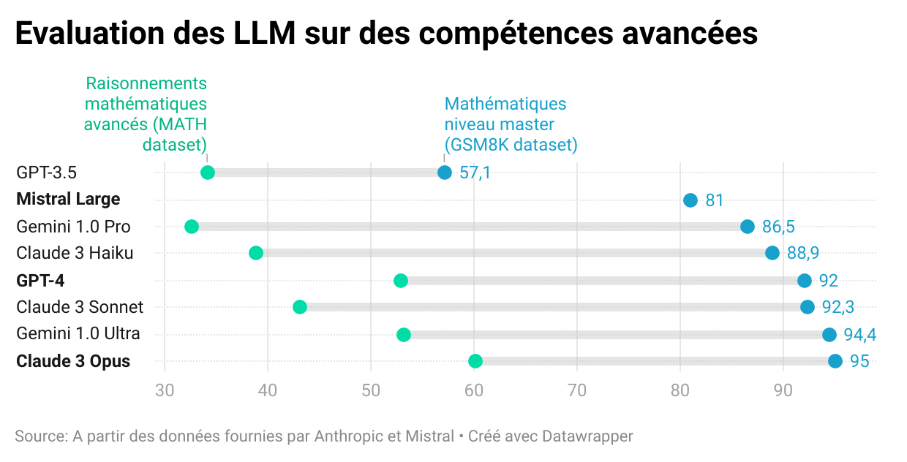

> **TIP:**
>
> ***Vous désirez intégrer la liste de diffusion ? L’inscription se fait [ici](https://grist.numerique.gouv.fr/o/ssphub/forms/jSjAV3L2F8mmiRVuVEpfF7/103).***

Ce mois-ci, la première partie de la *newsletter* est consacrée à l’actualité dense dans le domaine des IA génératives et à l’annonce d’un nouveau générateur de site web pour les *data scientists*. Suivent les actualités du réseau, notamment une présentation de `Quarto` par Christophe Dervieux (Posit) et le replay de la présentation d’Eric Mauvière sur le sujet des bonnes pratiques de *dataviz*.

## `Sora`, la nouvelle IA d’OpenAI pour générer des vidéos

  

*Source : [New York Times](https://www.nytimes.com/2024/02/15/technology/openai-sora-videos.html) d’après OpenAI.*

Instruction utilisée par OpenAI pour générer cette vidéo

*“Animated scene features a close-up of a short fluffy monster kneeling beside a melting red candle. The art style is 3D and realistic, with a focus on lighting and texture. The mood of the painting is one of wonder and curiosity, as the monster gazes at the flame with wide eyes and open mouth. Its pose and expression convey a sense of innocence and playfulness, as if it is exploring the world around it for the first time. The use of warm colors and dramatic lighting further enhances the cozy atmosphere of the image.”*

  

Après avoir révolutionné le champ de la génération d’image avec `DallE` (texte \\\to\\ image), de la génération de textes avec `ChatGPT` (texte \\\to\\ texte), OpenAI a rendu public les premières productions d’un modèle de génération de vidéos à partir d’instructions (texte \\\to\\ vidéo). Ce produit, nommé `Sora`, génère des vidéos d’un réalisme qui n’avait encore jamais été atteint par les IA génératrices de vidéos. Jusqu’à présent, les modèles de ce type généraient des images dont les formes étaient grossières, la résolution d’une qualité faible et dont les mouvements étaient peu vraisemblables.

  


*Source* : [Le Monde](https://www.lemonde.fr/videos/video/2024/02/18/openai-devoile-sora-un-outil-qui-transforme-les-textes-en-videos-ultrarealistes_6217183_1669088.html)

  

`Sora` n’est pas directement mis à disposition du grand public, contrairement aux autres services d’OpenAI. Ce produit n’est partagé qu’à des utilisateurs identifiés par OpenAI comme pouvant représenter le public cible - des réalisateurs par exemple - ou ayant une expertise sur des sujets comme la désinformation, les biais, la connaissance des algorithmes de recommandation, etc. Cette diffusion restreinte vise à recevoir des retours de la part de potentiels clients ou d’experts sur les risques de ces technologies. La communication par le biais de quelques vidéos choisies par OpenAI permet, dans le même temps, de créer une attente du grand public avant la mise à disposition plus large.

Comme `Dall-E`, `Midjourney` et consorts qui généraient des mains avec [trop de doigts](https://www.newyorker.com/culture/rabbit-holes/the-uncanny-failures-of-ai-generated-hands), le réseau de neurones derrière `Sora` a encore des difficultés à respecter certaines règles élémentaires de vraisemblance. Par exemple, dans la vidéo ci-dessous, les événements liés à un bris de verre s’enchaînent dans un ordre incohérent.

*Source : [OpenAI](https://openai.com/research/video-generation-models-as-world-simulators)*

OpenAI a déjà prévu de [nombreuses applications](https://openai.com/research/video-generation-models-as-world-simulators) à ce modèle. Outre la génération de vidéos à partir d’instructions verbales, `Sora` est capable d’animer une image, de compléter une vidéo déjà existante avec une vidéo fictionnelle, d’éditer une vidéo déjà existante pour changer des éléments… Les secteurs de la communication, de la création et de la diffusion de contenu sont concernés au premier chef mais la richesse des fonctionnalités possibles et la simplicité d’usage des produits d’OpenAI laissent penser que les applications iront bien au-delà de ces secteurs économiques ; la vidéo occupe maintenant une place prédominante sur internet et sur les réseaux sociaux pour de multiples usages.

Ce modèle soulève, comme `Dall-E` ou `ChatGPT` avant lui, des enjeux de propriété intellectuelle puisqu’il a aussi été entraîné sur des corpus massifs collectés depuis internet. Le réalisme des vidéos générées peut également laisser craindre, sans marque d’identification claire du fait que la vidéo est générée numériquement (principe du [*watermark*](https://fr.wikipedia.org/wiki/Tatouage_num%C3%A9rique)), des dérives autour de la mésinformation, notamment des vidéos malveillantes et réalistes de personnes dans des situations inventées (des *deepfakes*) ou la prolifération de contenus choquants si les garde-fous dans la génération de contenus sont outrepassés.

> **NOTE:**
>
> - La [présentation de `Sora`](https://openai.com/sora) sur le site d’OpenAI ;
> - Un [article](https://openai.com/research/video-generation-models-as-world-simulators) plus technique d’OpenAI sur les fonctionnalités de Sora ;
> - Les [10mn de vidéos de présentation](https://www.youtube.com/watch?v=HK6y8DAPN_0) de `Sora` par OpenAI ;
> - Un [article](https://www.nytimes.com/2024/02/15/technology/openai-sora-videos.html) du *New York Times* présentant `Sora`
> - Un [article](https://theconversation.com/openais-new-generative-tool-sora-could-revolutionize-marketing-and-content-creation-223806) sur le site *The Conversation* sur les enjeux pour certains secteurs économiques.

## “`Le Chat`” : un concurrent à `ChatGPT` par Mistral AI 🐱

Fin février, la *startup* française Mistral AI a rendu public, en accès libre, une IA conversationnelle aux fonctionnalités similaires à `ChatGPT` nommée [*“Le Chat”*](https://mistral.ai/fr/news/le-chat-mistral/).

Ce service utilise le grand modèle de langage (LLM) `Mistral Large`, dernier né des LLM multilangues entraînés par Mistral AI. Contrairement à d’autres modèles de Mistral AI, celui-ci n’est pas ouvert ; l’accès n’y est possible que par le biais des services de Mistral ou par le biais du *cloud* Microsoft Azure, suite à un partenariat entre l’entreprise américaine et la startup française (tarification en fonction du volume de requêtes).

Selon les évaluations réalisées fin février, avant la sortie de Claude 3 (voir plus bas 👇️), ce modèle présentait des performances supérieures à celles des modèles *open source*, notamment `LLaMa-2`, sur une série d’évaluations de la véracité des réponses proposées par une IA et sur les capacités de raisonnement de celle-ci à partir de tests standardisés. Sur des questions d’un niveau de premier cycle universitaire (métrique MMLU proposée par Hendrycks et al. ([2021](#ref-hendrycks2021measuring))), Mistral Large propose la bonne réponse dans 81% des cas, ce qui l’amène presque au niveau de GPT-4 (86%) et bien au-dessus de Llama-2 (70%), le meilleur modèle *opensource* à l’heure actuelle.

Classement des principaux modèles de langage lors de la sortie de `Mistral Large`


Performance des principaux LLM sur la métrique [MMLU](https://arxiv.org/abs/2009.03300), une série de 57 tests sur la fiabilité des réponses et les capacités de raisonnement des IA conversationnelles. Source : [Mistral AI](https://mistral.ai/fr/news/mistral-large/), fin février



Exemple de questions de niveau licence posées pour évaluer la qualité d’un modèle selon la métrique MMLU proposée par Hendrycks et al. ([2021](#ref-hendrycks2021measuring)) ([accéder à l’article de recherche](https://arxiv.org/abs/2009.03300))

> **NOTE:**
>
> - [https://chat.mistral.ai/](https://chat.mistral.ai/chat), l’IA conversationnelle proposée par Mistral AI ;
> - Le [*post* de blog](https://mistral.ai/fr/news/mistral-large/) par Mistral AI annonçant `Mistral Large` ;
> - La [*newsletter* d’Andrew Ng](https://info.deeplearning.ai/mistral-living-large-googles-open-source-challenger-robot-chemist-schooling-language-models-in-math-1) consacrée à Mistral Large ;
> - L’[article d’Hendrycks et al. (2021)](https://arxiv.org/abs/2009.03300) à l’origine de la métrique MMLU utilisée pour classer les modèles.

## Les performances de GPT-4 dépassées pour la première fois

Quelques jours seulement après la sortie de Mistral Large, un autre modèle de langage est venu concurrencer le modèle d’OpenAI GPT-4. Ce modèle nommé `Claude 3` est le premier à obtenir des performances supérieures à GPT-4 (le modèle derrière la version Pro de `ChatGPT`) sur les principaux tests de qualité des modèles. Ce modèle, créé par Anthropic et disponible en trois versions plus ou moins puissantes (*Haiku*, *Sonnet* et *Opus*), n’est pas encore disponible pour les utilisateurs résidant dans l’Union Européenne.

Les trois modèles `Claude-3` disponibles


Source : [Anthropic](https://www.anthropic.com/news/claude-3-family)

Comparaison des performances des LLM

 

Les modèles `Claude` sont développés par l’entreprise Anthropic, créée par des anciens employés d’OpenAI considérant que la problématique de la [sécurité des IA](https://fr.wikipedia.org/wiki/S%C3%BBret%C3%A9_des_intelligences_artificielles) n’était pas assez mise en avant par OpenAI. Valorisée autour de 18 milliards d’euros en ce début d’année 2024, elle a bénéficié de financements importants d’Amazon et de Google, ces deux entreprises ayant investi respectivement 4 et 2 milliards de dollars. Les modèles `Claude` sont disponibles pour les utilisateurs des *cloud* d’Amazon (AWS) ou de *Google* (GCP) à l’instar des modèles GPT disponibles aux utilisateurs du *cloud* de Microsoft (Azure). La concurrence entre OpenAI et Anthropic est ainsi l’occasion d’un affrontement entre les trois principaux acteurs du *cloud*. Au-delà de la concurrence entre leurs investisseurs, les modèles économiques d’Anthropic et d’OpenAI diffèrent. Anthropic vise plutôt à proposer des services à des entreprises accessibles par le biais d’API là où OpenAI propose plutôt des outils grands publics avec des fonctionnalités supplémentaires pour les acteurs spécialisés. Parmi les partenaires principaux d’Anthropic, on retrouve Gitlab, Quora ou Salesforce (l’éditeur de logiciel derrière Slack). A l’instar des modèles Mistral Large ou GPT-4, le modèle Claude 3 n’est pas *open source*.

> **NOTE:**
>
> - L’[annonce de Claude 3](https://www.anthropic.com/news/claude-3-family) par Anthropic ;
> - Un [article](https://www.nytimes.com/2024/02/20/technology/anthropic-funding-ai.html) sur Anthropic par le *New York Times* et [un autre](https://www.forbes.com/sites/alexkonrad/2024/03/04/anthropic-releases-claude-3-claims-beat-openai/) par Forbes.

## `Observable` propose un constructeur de sites statiques, pour s’abstraire des *notebooks*

Afin de démocratiser l’utilisation de `Javascript` au-delà du cercle des développeurs *web*, Mike Bostock, ancien responsable des *dataviz* du *New York Times*, la référence en la matière, a créé il y a quelques années `Observable`.

En plus d’être une extension du langage `Javascript` à la grammaire familière aux connaisseurs de `Python` et `R`, `Observable` vise à créer une communauté d’utilisateurs de `Javascript` à l’interface entre *data scientists* et développeurs *web*. Pour cela, le site [observablehq.com](https://observablehq.com/) se propose d’être un réseau social de *notebooks* en `Javascript`, un peu comme `Github` faisant office de réseau social du code. Les notebooks *Observable* permettent de rapidement prendre en main du code `Javascript` pour créer des analyses de données interactives qui peuvent ensuite être facilement partagées par le biais du site [observablehq.com](https://observablehq.com/) pour simplifier les réutilisations du code proposé ou des données sous-jacentes.

Cependant, si les *notebooks* sont un terrain fertile pour l’expérimentation, ils montrent rapidement leurs limites dès qu’on désire s’abstraire de l’hébergement sur [observablehq.com](observablehq.com/). Pour mettre à disposition des visualisations interactives sur d’autres sites, les sites statiques sont plus simples d’usage. Historiquement, l’écosystème Javascript est construit autour d’imposants *frameworks* comme [`React`](https://fr.legacy.reactjs.org/), bien connus des développeurs web mais méconnus des *data scientists* qui sont néanmoins amenés à livrer de plus en plus d’applications interactives pour valoriser des données.

L’annonce d’[`Observable Framework`](https://observablehq.com/blog/observable-2-0), un constructeur de sites statiques, représente un changement d’approche. `Observable Framework` vise à être un *framework* permettant aux *data scientists* de construire des sites web en mélangeant des étapes de préparation de données en `R`, `Python` ou `SQL` (via `DuckDB`), du formattage de texte en `Markdown` et de l’interactivité grâce au langage `Observable`. L’approche est ainsi similaire à celle de `Quarto`, la référence pour les *data scientists* désirant construire des publications reproductibles (voir la section événements 👇️ pour en apprendre plus). Ce dernier écosystème permet déjà depuis quelques temps de compléter du travail de données en `R` ou `Python` avec des traitements en `Observable` pour obtenir un site web interactif sans besoin de solutions techniques complexes comme `Shiny` ou `Streamlit`.

Les évolutions à venir d’`Observable Framework` sont donc à surveiller, cet écosystème pouvant être amené, s’il rencontre du succès, à rentrer dans la boîte à outil standard des *data scientists* comme `Quarto` est déjà en train de le faire. Le site [observablehq.com](observablehq.com/) ne va pas pour autant disparaître : celui-ci restera un lieu où on peut tirer avantage de la simplicité des *notebooks* pour l’expérimentation ou pour la mise à disposition de tutoriels pédagogiques. Ce virage est similaire à celui pris par `Python` dans la communauté des *data scientists* où les *notebooks*, après avoir connu une phase hégémonique, sont revenus à leur fonction initiale : des carnets pour expérimenter servant de brouillon avant l’écriture de scripts ou alors de belles pages, mêlant texte et code, pour présenter une démarche de manière pédagogique.

> **NOTE:**
>
> - L’annonce d’[`Observable Framework`](https://observablehq.com/framework/) ;
> - L’[interactivité dans `Quarto`](https://quarto.org/docs/interactive/ojs/) grâce aux cellules `Observable` ;
> - Le [cours de “Mise en production de projets data science”](https://ensae-reproductibilite.github.io/website/) de l’ENSAE où les enjeux techniques et humains de la mise à disposition de tels sites sont évoqués.

# Actus du réseau

## Chistophe Dervieux, “`Quarto` : Une évolution de `R Markdown` pour des travaux statistiques reproductibles” (📅 **2 mai**)

Pour fiabiliser la production de documents construits en valorisant des données (tableaux, graphiques, etc.), *RStudio* (devenu *Posit* depuis) a construit il y a quelques années l’écosystème `R Markdown` permettant de produire du document en mélangeant code et texte.

Cette problématique des publications reproductibles est devenue incontournable dans l’écosystème `R` et la solution `R Markdown` est dorénavant largement utilisée. Pour étendre les vertus de cette approche à d’autres langages, *Posit* a commencé à développer `Quarto`, un écosystème reprenant le principe de `R Markdown` mais étendant ces fonctionnalités à d’autres langages de programmation, notamment `Python` et `Observable`.

Le **2 mai de 15h à 16h**, Christophe Dervieux (*Posit*) nous présentera `Quarto`, l’écosystème de publications reproductibles qui succède à `R Markdown`. Cet événement est proposé de manière hybride : par le biais de *Zoom* ou, pour les agents en poste à la Direction Générale de l’Insee, en salle 4-C-458.

- 👉️ [Ajouter cet événement à votre agenda `Outlook`](https://minio.lab.sspcloud.fr/ssphub/diffusion/website/2024-05-02-quarto/quarto.ics)
- 👉️ [Lien zoom](https://insee-fr.zoom.us/j/94214258071?pwd=WlBSRVgvVHZ2TXJ1Ull0cWUzN0Npdz09)

## Vos besoins de formation

L’an dernier, nous avions organisé un questionnaire pour connaître les besoins de formations des membres du réseau. Ce questionnaire est utile pour que les événements organisés dans le cadre du réseau répondent au mieux aux besoins.

Afin de connaître les attentes et centres d’intérêt en cette année 2024, nous vous proposons un nouveau questionnaire. Celui-ci est également l’occasion d’accueillir vos retours sur les *masterclass* menées en 2023 en collaboration avec *Datascientest* si vous avez participé à celles-ci.

- [👉️ Questionnaire](https://framaforms.org/besoin-de-formations-en-data-science-en-2024-1709718778)

## Replay de la présentation d’Eric Mauvière “La dataviz pour donner du sens aux données et communiquer un message”


La présentation d’Eric Mauvière sur les bonnes pratiques de *dataviz* a rencontré un réel succès avec près de 150 participants. Le *replay* et les *slides* de cette présentation essentielle sont disponibles ci-dessous :

``` js
html`${slides_button}`
```

``` js
slides = "https://minio.lab.sspcloud.fr/ssphub/diffusion/website/2024-02-09-mauviere/conf_ssphub_item7-1.pdf"
```

``` js
slides_button = html`<p class="text-center">
  <a class="btn btn-primary btn-lg cv-download" href="${slides}" target="_blank">
    <i class="fa-solid fa-file-arrow-down"></i>&ensp;Télécharger les slides
  </a>
</p>`
```

## Les références

Hendrycks, Dan, Collin Burns, Steven Basart, et al. 2021. *Measuring Massive Multitask Language Understanding*. <https://arxiv.org/abs/2009.03300>.
