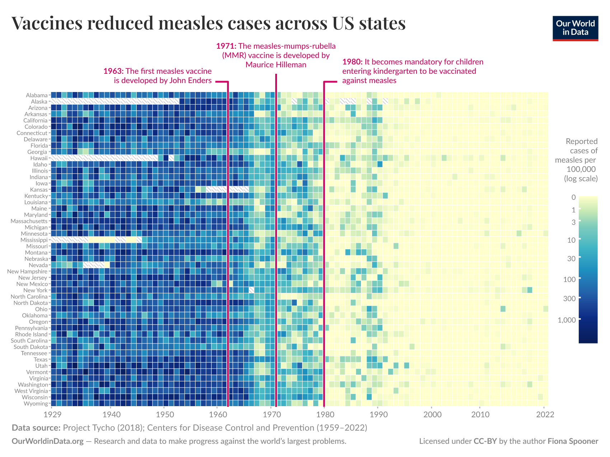

# ~~La newsletter~~ L’infolettre est morte, vive l’infolettre !

À l’occasion de cette **dix-neuvième infolettre**, on a discuté, réfléchi et pensé au sens de la vie. On a décidé de revoir le schéma de l’infolettre selon plusieurs critères :

- une périodicité mensuelle “garantie”, quitte à avoir des infolettres moins denses que d’autres ;
- simplifier la rédaction et le contenu ;
- continuer de parler à toutes les personnes intéressées par la science des données, quel que soit son niveau d’expertise ;
- contribuer à mettre en avant plus facilement des personnes ou des projets au sein du réseau.

Nouvelle structure, moins longue, plus ramassée, vous aurez plus de travail pour creuser plus loin les sujets ! L’idée est ainsi d’insérer au moins dans chaque veille :

- une datavisualisation
- les actualités du réseau et une veille
- une interview de quelqu’un ou d’une équipe selon un canevas à peu près stable.

Bonne lecture 📔 !

# La datavisualisation

Une version interactive est disponible sur le site du [Wall Street Journal](https://graphics.wsj.com/infectious-diseases-and-vaccines/).

# Actus du réseau

## La troisième journée du réseau 📅 1 décembre - La Tréso (Malakoff)

**Réservez votre 1^(er) décembre !** Pour la troisième année consécutive, le SSPLab organise la journée du réseau pour rassembler les data-scientists de la statistique publique. Au menu : présentation de projets innovants, retour d’expérience et moments d’échanges informels (autrement appelés “pots” 🎉).

Comme les années précédentes, l’événement sera en présentiel et à distance pour permettre à tous de participer. Les détails seront publiés sur le [site du réseau](../../talk/2025-12-01-network-day/index.llms.md) et si jamais vous voulez déjà vous inscrire alors que l’agenda n’est pas finalisé, c’est possible [ici](https://www.eventbrite.com/e/billets-3e-journee-du-reseau-des-data-scientists-1664052518879?aff=oddtdtcreator).

- 👉️ [Ajouter cet événement à votre agenda `Outlook`](https://minio.lab.sspcloud.fr/ssphub/diffusion/website/2025-12-network/2025_12_3ejournee_SSPHub.ics)

## Le site du réseau évolue

**L’inscription** à la liste de diffusion a été revue et utilise maintenant [Grist](https://lasuite.numerique.gouv.fr/produits/grist). Pour s’inscrire à la liste de diffusion, c’est par [ici](https://grist.numerique.gouv.fr/o/ssphub/forms/jSjAV3L2F8mmiRVuVEpfF7/103). Une fois inscrit, vous pouvez créer un compte sur [Grist](https://grist.numerique.gouv.fr) et vous connecter directement sur [l’annuaire](https://grist.numerique.gouv.fr/o/ssphub/iTFX7gryL8jK/Annuaire?utm_id=share-doc) pour mettre à jour vos données, demander votre désinscription en cochant la case “Supprimez mon compte”.

Par ailleurs, le **site du réseau devrait évoluer dans les prochaines semaines**. Il va s’étoffer pour présenter plus de projets en cours et permettre ainsi à tout un chacun de savoir qu’un projet existe et pouvoir échanger entre pairs. Si vous souhaitez valoriser un projet, n’hésitez pas à nous le faire savoir !

# Actualités

Voici une liste de sujets d’actualité depuis cet été jugés subjectivement intéressants.

## IA

Comme toujours, une flopée d’articles a été publiée sur l’IA : le nouveau modèle d’OpenAI (GPT-5) a été déployé cet été, l’usage de l’IA se développe, des craintes se font entendre sur l’existence d’une bulle financière et, avec l’augmentation de son utilisation, de plus en plus de failles de sécurité liées sont découvertes. Un petit florilège rapide, **non exhaustif** :

- En France, **l’IA est de plus en plus utilisée par les entreprises** d’après une [étude de l’Insee](https://www.insee.fr/fr/statistiques/8604126#:~:text=En%202024%2C%2010%20%25%20des%20entreprises%20fran%C3%A7aises%20de%2010%20salari%C3%A9s%20ou,quelle%20que%20soit%20leur%20taille). En 2024 ainsi, une entreprise sur dix utilise l’IA, et ce phénomène concerne particulièrement 33% des grandes entreprises et 42% de celles de l’information. L’usage de l’IA augmente de 4 points par rapport à 2023. L’IA est par ailleurs légèrement moins utilisée par les entreprises en France que dans l’Europe, où 13% des entreprises disent utiliser l’IA en 2024.

- Sur l’**impact de l’IA**, notamment sur le travail et la productivité, de nombreuses études continuent d’être publiées. Petit disclaimer, la technologie évolue encore très vite : depuis son arrivée il y a moins de trois ans, les bugs relevés au début ne sont plus du tout d’actualité aujourd’hui : les images sont de bien meilleure qualité, des RAG ont été mis en place … Face à un domaine aussi changeant, les résultats des études varient donc encore beaucoup.

  - Ceci étant dit, les études montrent globalement que l’IA permettrait d’améliorer l’efficacité des travailleurs, particulièrement des **non-experts**, et réduit les **inégalités de performance**, même si les résultats sont contrastés. Selon [cette étude](https://digitaleconomy.stanford.edu/publications/canaries-in-the-coal-mine/), l’IA commence à avoir un impact négatif sur l’emploi, quand [celle-ci](https://arxiv.org/abs/2507.09089) estime à l’inverse que les gains de productivité pour les développeurs sont sur-estimés.
  - L’usage de l’IA serait particulièrement efficace pour effectuer des **tâches moyennement rares**, l’humain restant plus efficace sur les tâches courantes (*cf.* par exemple [ce papier](https://www.nber.org/papers/w31161)). Par ailleurs, sur les tâches complexes ou rares, l’IA serait largement moins efficace que l’humain et produirait des résultats de qualité moindre (*cf.* ce [papier](https://www.hbs.edu/ris/Publication%20Files/24-013_d9b45b68-9e74-42d6-a1c6-c72fb70c7282.pdf)).

- Concernant la **technologie en soit**, des chercheurs ont réussi, à partir d’un petit modèle d’IA générative, à classifier du texte aussi efficacement qu’avec un gros modèle et nécessitant bien moins de données. Pour ce faire, ils ont utilisé un modèle de régression pénalisée (type Lasso/Ridge) sur la représentation numérique sous-jacente du texte. Plus de détails dans [leur article](https://papers.ssrn.com/sol3/papers.cfm?abstract_id=5303840).

- De nombreux articles font craindre l’existence d’une **bulle financière autour de l’IA**.

  - Edward Zitron, un publiciste britannique, auteur et podcasteur, rappelle sur [son blog](https://www.wheresyoured.at/the-haters-gui/) toutes les raisons pour laquelle une bulle existerait actuellement sur l’IA. Il rappelle notamment que les 560Md\$ investis par les GAFAM dans l’IA n’ont généré que très peu de bénéfices et que le seul gagnant est Nvidia. Comme le dit le proverbe, **“Pendant la ruée vers l’or, ce ne sont pas les chercheurs d’or qui se sont le plus enrichis, mais les vendeurs de pelles et de pioches”**.
  - L’adoption de l’IA par les entreprises prendrait par ailleurs **plus de temps qu’anticipé** et n’aurait pas des rendements aussi rapides qu’espéré.
  - Plus généralement, des articles, comme cet article de [Forbes](https://www.forbes.com/sites/paulocarvao/2025/08/21/is-the-ai-bubble-bursting-lessons-from-the-dot-com-era/), rappellent que l’IA reste très utilisée aujourd’hui et que, même si aujourd’hui des investissements sont fait vers des projets peu productifs, **l’adoption de nouvelles technologies prend du temps**. Les articles citent beaucoup l’exemple d’internet, et de la bulle du début des années 2000 : les attentes du marché étaient trop hautes par rapport à tout le travail qu’il restait à faire, et cela n’empêche pas que aujourd’hui, 25 ans après cette bulle, les investissements dans le réseau internet ont permis de changer la société.

- Enfin, avec l’augmentation de son utilisation, la **sécurité** de la technologie est un enjeu qui est de plus en plus discuté, au-delà du **détournement à des fins illégales** qui attend toute innovation numérique :

  - Des **données confidentielles de Microsoft** ont fuité après le piratage d’agents Copilot. Les [hackeurs](https://x.com/mbrg0/status/1953815729947447770/photo/1) ont ainsi reçu par mail des extraits des contacts et des ventes de Microsoft.
  - Selon le [rapport d’Anthropic](https://www-cdn.anthropic.com/b2a76c6f6992465c09a6f2fce282f6c0cea8c200.pdf) sur les menaces liées à l’IA, cette technologie a notamment été détournée pour :
    - s’assurer des postes bien payés pour des **Nord-Coréens**, qui leur ont permis de rapatrier les capitaux au pays ;
    - massifier les **fraudes aux données personnelles** ;
    - **automatiser les attaques par ransomware**.

## Parquet

- Le site [Hyperparam](https://hyperparam.app/) permet **d’afficher très rapidement des données Parquet volumineuses** sur son explorateur web très rapidement (en moins de 500ms). Pour la tuyauterie, tout est expliqué [sur ce blog](https://blog.hyperparam.app/2025/07/24/quest-for-instant-data/).

## Kubernetes

- **Comment détecter facilement des pods Kubernetes peu actifs et les désactiver?** Un début de processus a été publié sur [Devops.dev](https://blog.devops.dev/reclaiming-idle-gpus-in-kubernetes-a-practical-approach-and-a-call-for-ideas-08cbad89f988).

## Nouveautés

- Une **nouvelle version des notebooks Observable** est disponible en pré-production, avec un kit open source pour générer des notebooks et des sites statiques et une application pour Mac pour éditer ses notebooks en local, intégrant de manière plus fluide les apports de l’IA. Plus de détails par [ici](https://observablehq.com/notebook-kit/) et une [galerie](https://observablehq.com/notebook-kit/gallery) d’exemples de sites.
- L’université allemande de Hanovre [a publié](https://geovectors.l3s.uni-hannover.de/) une **base d’embedding des entités d’Openstreetmap** directement utilisable pour entraîner des modèles de machine learning.
- Selon une [étude de Posit](https://posit.co/blog/python-llm-evaluation/), le **meilleur modèle d’IA pour aider à coder en Python** serait ceux d’OpenAI (o3-mini, o4-mini) ou d’Anthropic (Claude Sonnet 4).

## Fun

- Vous vous êtes déjà demandé comment résoudre un [SUTOM](https://sutom.nocle.fr/) avec les **dépendances de Python** ? Non ? Et bien quelqu’un a trouvé le moyen de résoudre des Sudoku et des Motus grâce à cela ! Tout est expliqué [ici](https://mildbyte.xyz/blog/solving-wordle-with-uv-dependency-resolver/)
- Avez-vous déjà vu une **intelligence artificielle jouer au Loup-Garou** ? Des étudiants de l’ENSAE ~~se sont amusés~~ ont [étudié](https://werewolf.foaster.ai/) quelles IA étaient meilleures au jeu du Loup-Garou. Ce jeu nécessite en effet de mentir, de convaincre, et d’adapter sa stratégie pour survivre (pour les villageois) ou tuer tous les villageois (pour les loup-garous). A la fin, **GPT-5 gagne dans 97 % des 60 matchs joués, contre 15% pour GPT-OSS-120b**.

> **TIP:**
>
> Vous voyez d’autres sujets d’actualité intéressants ? N’hésitez pas à les partager sur le [groupe Tchap 💬](https://tchap.gouv.fr/#/room/#ssphub:agent.finances.tchap.gouv.fr) directement !

# L’interview

Première interview, je propose donc humblement de m’auto-interviewer pour lancer ce format et de comparer les questions que j’ai trouvées avec celles proposées par une IA.

## Première interview avec Nicolas, qui travaille à l’Insee (SSPLab)

[TABLE]

## L’interview à laquelle vous avez échappé

Quelle est la plus-value de l’IA par rapport à un travail humain ? J’ai comparé les questions que j’avais trouvées avec des idées produites par une IA. Voici les questions qu’il m’a proposées, que j’ai proposé de ne pas suivre. Remarquez, ces questions sont le résultat de deux ou trois échanges avec l’IA, je n’y ai pas passé beaucoup plus de temps.

> Voici une proposition de questions adaptées à des data scientists ou des managers de data scientists travaillant dans l’administration publique :
>
> 1.  **Formations et influences** *“Quelle formation ou influence majeure a façonné votre approche des données et de la gestion dans l’administration ?”*
>
> 2.  **Expériences professionnelles** *“Quelles ont été les étapes clés de votre carrière dans l’administration qui ont influencé votre façon de gérer ou d’analyser les données ?”*
>
> 3.  **Motivations et passions** *“Qu’est-ce qui vous motive le plus dans l’analyse ou la gestion des données au sein de l’administration publique ?”*
>
> 4.  **Réalisations majeures** *“Quels sont vos principaux accomplissements en matière de gestion ou d’analyse de données dans votre rôle actuel ?”*
>
> 5.  **Développement personnel** *“Quels défis spécifiques aux données avez-vous rencontrés dans le secteur public et comment les avez-vous surmontés ?”*
>
> 6.  **Projets actuels** *“Sur quels projets liés aux données travaillez-vous actuellement, et qu’est-ce qui les rend particulièrement intéressants ou innovants ?”*
>
> 7.  **Regrets ou aspirations** *“Y a-t-il des projets ou réalisations en lien avec les données que vous auriez aimé accomplir dans votre carrière mais qui ne se sont pas concrétisés ?”*
>
> 8.  **Vision future** *“Comment voyez-vous l’évolution de l’importance des données dans l’administration publique dans les années à venir, et quel rôle aimeriez-vous y jouer ?”*
>
> 9.  **Conseils aux jeunes générations** *“Quel conseil donneriez-vous à un jeune professionnel qui souhaite devenir data scientist ou manager de data scientists dans le secteur public ?”*
>
> 10. **Philosophie personnelle** *“Si vous deviez partager une philosophie ou un credo concernant la gestion ou l’analyse des données dans l’administration, quelle serait-elle ?”*
>
> Ces questions devraient aider à explorer les nuances spécifiques du travail des data scientists et de leurs managers dans le secteur public. Si vous souhaitez ajuster davantage ou ajouter des thèmes spécifiques, n’hésitez pas à me le faire savoir !
