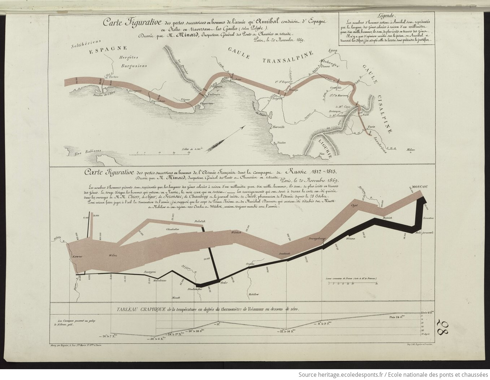
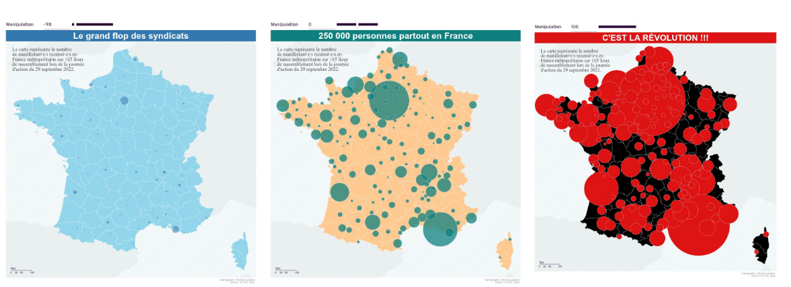

# Bienvenue à la **vingt deuxième infolettre** !

Bienvenue en 2026, l’année pendant laquelle les gens né(e)s en 2000 vont avoir 26 ans.

# L’infographie

Ce mois-ci, je vous propose de découvrir une infographie faite au XIX^(ième) siècle (et à 88 ans !) par Charles Minard. Il s’agit de la *carte figurative des pertes successives en hommes de l’armée française dans la campagne de Russie 1812-1813*. Cette carte est considérée comme l’une des **premières infographies modernes** 🐓 et fait figurer :

- l’itinéraire de l’armée napoléonienne en Russie (en deux couleurs, pour la campagne à l’aller en rose et la retraite en noir) ;
- la taille de l’armée, prenant en compte les arrivées et les morts ;
- la température lors de la retraite (jusque -30[°R](https://fr.wikipedia.org/wiki/%C3%89chelle_R%C3%A9aumur), soit -37,5°C 🥶 ).

A noter que des récentes analyses ADN ont montré que les causes de mortalité étaient sûrement multiples parmi les troupes napoléoniennes. En effet, le matériel génétique de maladies (typhus, diarrhée, fièvre paratyphoïde) a aussi [été retrouvé](https://www.lemonde.fr/sciences/article/2025/10/24/ces-infections-qui-ont-fauche-la-grande-armee-de-napoleon-en-1812_6649197_1650684.html) dans des dépouilles le soldats napoléoniens.

[*Tableaux graphiques et cartes figuratives*, par Charles Minard](https://heritage.ecoledesponts.fr/ark:/12148/btv1b10484829h/f52.item.r=minard)

Cette carte est tellement connue qu’elle a été copiée, traduite, refaite avec les moyens modernes :

- la voici [in English](https://www.datavis.ca/gallery/re-minard.php) ou [in italiano](https://www.datavis.ca/gallery/minard/minard-MarcoMeschini.png) ;
- en [R (avec ggplot2)](https://www.datavis.ca/gallery/minard/ggplot2/march.jpg) ;
- en [SAS (pff, so 2025)](https://www.datavis.ca/gallery/minard/Minard-IML.gif).

Pour les curieux, le livre complet, comprenant d’autres très belles cartographies de Minard, sont disponibles dans les [bien-heureuses archives numérisées de l’École des Ponts](https://heritage.ecoledesponts.fr/ark:/12148/btv1b10484829h.r=minard?rk=257512%3B0).

# What’s up le réseau ?

## Présentation de Cartographia

Le 13 janvier, nous avons reçu Françoise Bahoken et Nicolas Lambert. Ils nous ont présenté leur passionnant livre [Cartographia](https://www.dunod.com/histoire-geographie-et-sciences-politiques/cartographia-comment-geographes-redessinent-monde), qui explore ludiquement les grandes questions de la cartographie. Le livre rappelle aussi que toute cartographie est une **simplification de la réalité** et qu’elle comprend ainsi forcément un parti pris, dont il faut être conscient. L’enjeu est alors de ne pas chercher à manipuler l’information à travers une cartographie et de tenter d’adopter **le point de vue le plus neutre possible**.

Comment des données identiques peuvent véhiculer un message totalement différent par les choix de visualisation effectués

Le replay et leur présentation sont [en ligne](../../talk/2026-01-cartographia/index.llms.md).

## Journée contribution open source 📅 16 & 17 juin 2026 - Paris

A vos agendas ! Le SSPLab organise une journée autour de la contribution open-source les 16 et 17 juin 2026. Cela aura lieu au Lieu de la transformation publique à Paris. Le but de cette journée est de démystifier l’open source, d’expliquer comment y contribuer, et d’encourager chacun à soutenir les projets que nous utilisons largement en datascience.

Le programme est en cours d’élaboration donc si vous avez une idée de projets open-source d’intérêt auquel vous souhaitez contribuer, n’hésitez pas à nous contacter !

# Actualités

Beaucoup d’actualités ce mois-ci, mais c’est plus calme côté data science 🤷‍♀️. Si vous n’êtes pas friands de techniques, et que vous avez déjà reçu 2 mails depuis que vous avez commencé à lire cette infolettre, vous pouvez passer la veille ce mois-ci 😉.

## LLM

Dans la série agents, cet [article de Posit](https://posit.co/blog/r-llm-evaluation-03/) compare **différents modèles de LLM pour coder en R** (sans les modèles de Mistral 😮🇫🇷😮). Résultat : les modèles les mieux évalués à date, mais attention les classements évoluent très vite, sont Claude Sonnet 4.5, Claude Opus 4.5 et OpenAI GPT-5.

## Outils

Deux outils open-source pour synthétiser des données ou les valoriser.

- Si vous cherchez à générer des **données synthétiques**, il y a [NeMo](https://nvidia-nemo.github.io/DataDesigner/latest/). Open-source, l’objectif de ce package Python est de permettre de générer des données synthétiques facilement, en se branchant au LLM de votre choix.
- Côté **valorisation des données**, il y a [Marmot](https://marmotdata.io/), un outil open-source pour parcourir plus facilement vos différents jeux de données.
- Un peu plus d’**interactivité dans des cellules de code en Quarto** ? [Quarto-live](https://r-wasm.github.io/quarto-live/) permet de faire des cellules de code réactives dans une page HTML Quarto.
- Du côté des **publications en ligne reproductibles et interactives**, l’OFCE a publié depuis plusieurs années son package maison [OFCE](https://github.com/OFCE/ofce). Il permet de publier sur Internet les études de l’OFCE, en insérant des graphiques interactifs et en gérant aussi la charte graphique de l’OFCE.

## Formation

Quelques ressources intéressantes de formation ou articles de blog.

- Côté Python, le célèbre livre [*Python datascience Handbook*](https://jakevdp.github.io/PythonDataScienceHandbook/) est disponible aussi en version web ;
- Pour comprendre la manière dont fonctionnent les **filtres Bloom** dans la technologie **Parquet**, je vous recommande ce [très utile post de blog](https://www.icem7.fr/outils/les-filtres-de-bloom-dans-parquet/) d’Éric Mauvière.

## Fun

- Une excellente BD permet d’**expliquer les statistiques facilement** (aussi pour les enfants). Dans [*Les statistiques en BD*](https://e-pedago.institut-agro-dijon.fr/bd-statistiques/), [Laurence Dujourdy](https://linkedin.com/in/laurence-dujourdy-b9a2a36) et Mathieu Bartoletti vulgarisent simplement les concepts que l’on a appris il y a un certain temps. Le tout est dessiné par [Thibault Roy](https://linkedin.com/in/thibault-roy-129b98195) et est porté par [l’institut Agro de Dijon](https://institut-agro-dijon.fr/).
- Pour avoir une lecture sociale des évolutions de Paris, n’oubliez pas d’aller voir l’analyse [**Ce que la carte des kebabs révèle de Paris**](https://www.lesechos.fr/politique-societe/societe/ce-que-la-carte-des-kebabs-revele-de-paris-2191635) publiée dans *Les Echos*. A travers les kebabs, Jules Grandin analyse la géographie de Paris et son évolution. Il retrouve ainsi les grandes avenues, les gares, les quartiers densément peuplés et enfin les inégalités d’âge et de revenus.
