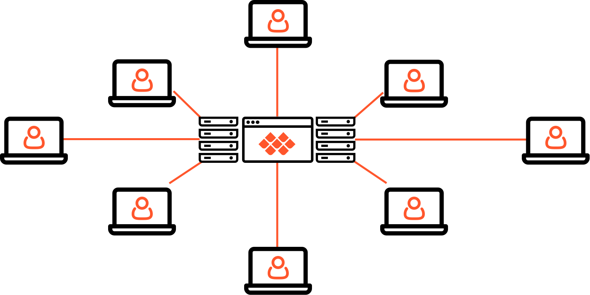
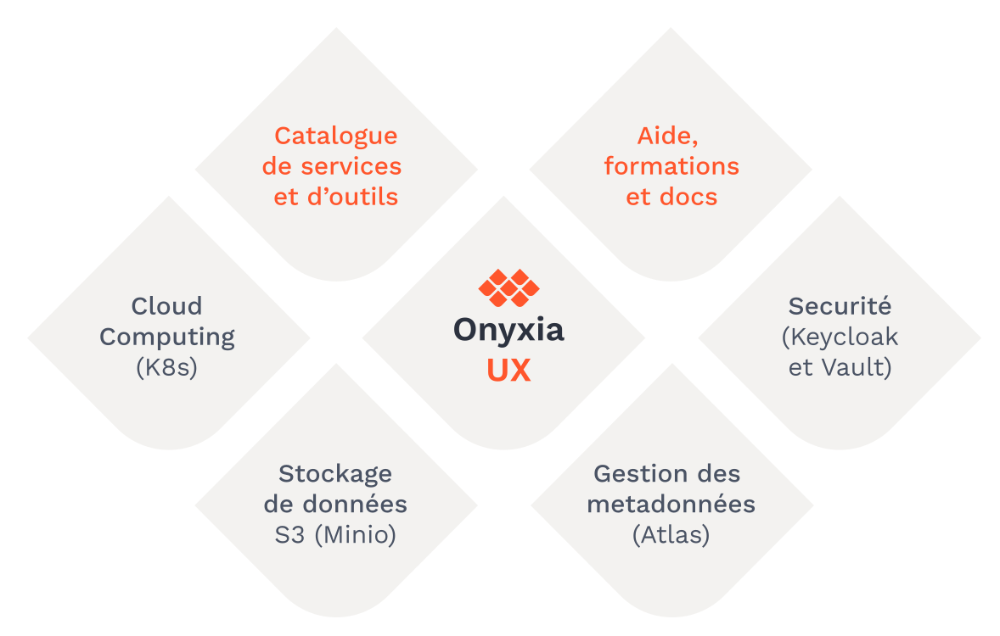
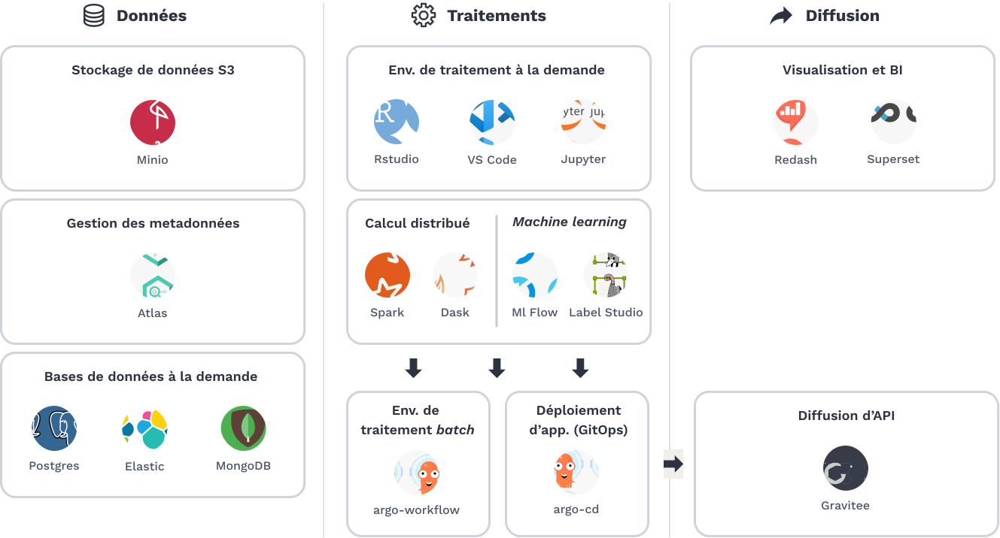
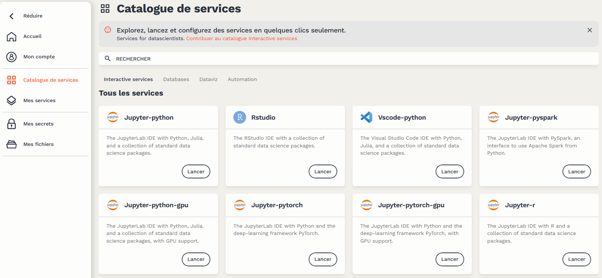
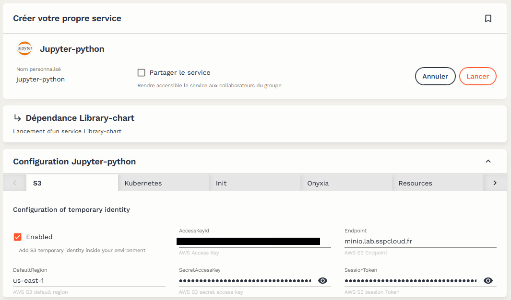
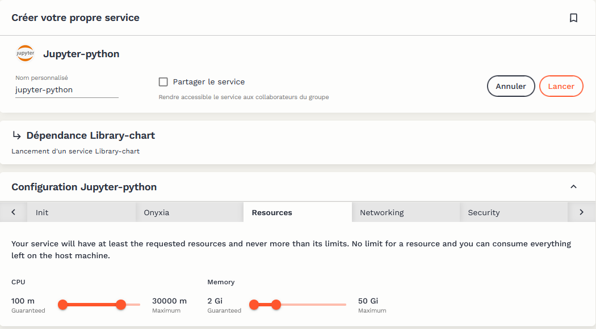
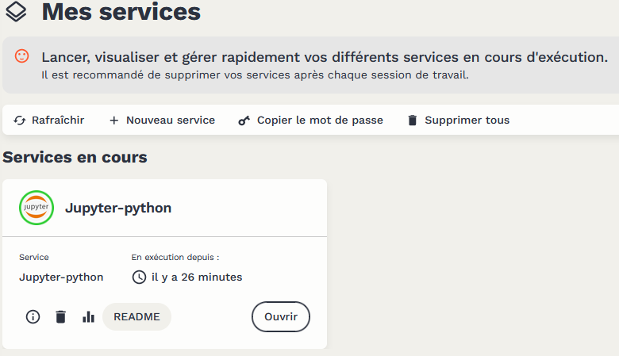
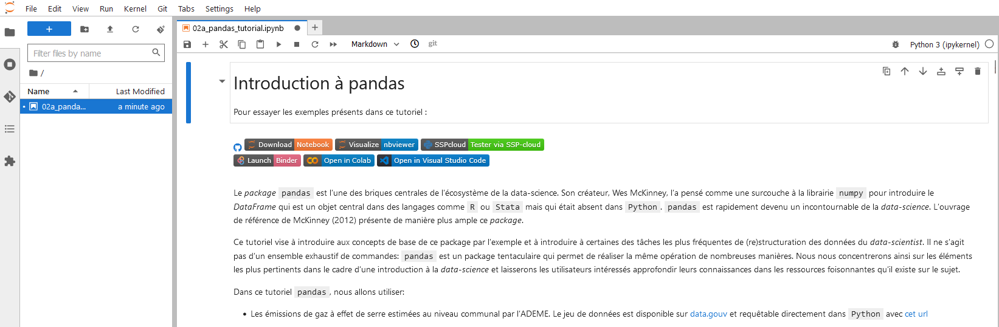

`Onyxia` est un logiciel *open source* développé par l’Insee ([disponible sur `Github` ](https://github.com/InseeFrLab/onyxia-web)) permettant de fournir un environnement de traitement de données à l’état de l’art. Principalement conçu pour permettre le travail interactif des data scientists, l’expérience fournie avec `Onyxia` favorise également la reproductibilité des travaux et leur mise en production.

Le logiciel `Onyxia` est installé par des organisations souhaitant créer un *datalab*, c’est-à-dire une plateforme interactive de traitement de données. Ces organisations ont toutes le point commun de vouloir construire une plateforme qui embrasse les technologies *cloud* que sont la conteneurisation et le stockage objet tout en mettant à disposition celles-ci dans un environnement *user-friendly* où l’interconnexion entre ces différentes briques est gérée de manière cohérente. Les technologies *cloud native* sont devenues indispensables dans l’écosystème de la donnée, du fait d’une meilleure gestion des ressources de traitement ou de la capacité à créer un environnement parfaitement reproductible pour une mise en production accélérée.

Ce *post* de blog a pour objectif de présenter la raison d’être d’`Onyxia`, sa génèse et les solutions qu’apporte cette infrastructure à des irritants classiques des projets novateurs de data science.

## Contexte

L’écosystème de la data science est en mouvement accéléré depuis 10 ans et le rôle du *data scientist* dans les organisations valorisant de la donnée évolue continuellement ([Davenport et Patil 2022](#ref-davenport2022data)). Les data scientists modernes sont amenés à utiliser de plus en plus de langages et doivent être capables de maîtriser plusieurs architectures informatiques. La frontière est ainsi moins nette que par le passé entre statisticiens et informaticiens. De plus, les innovations récentes dans le monde du développement logiciel, notamment l’adoption massive de l’approche `DevOps` - approche qui consiste à automatiser la production de livrables dès la conception du prototype - a également fait évoluer les pratiques des data scientists.

Ce besoin de ressources informatiques croissantes, de flexibilité dans le prototypage de solutions informatiques et l’évolution des pratiques consistant à mettre à disposition en continu des livrables ont eu des implications importantes sur les architectures informatiques dominantes dans l’écosystème de la donnée. Pour répondre au besoin croissant de puissance de traitement, les serveurs partagés, organisés sous forme de *clusters*, se sont développés dans de nombreuses organisations. Après avoir connue son heure de gloire au début des années 2010, l’infrastructure [`HDFS` (*Hadoop Distributed File System*)](https://openclassrooms.com/fr/courses/4467481-creez-votre-data-lake/4509426-decouvrez-le-systeme-de-fichiers-distribue-hdfs), qui reposait sur des *clusters* où les données et la puissance de traitement étaient distribuées et collocalisées, a laissé place à des infrastructures plus *scalables*, basées sur l’approche de la conteneurisation.

## De HDFS à la conteneurisation

> **NOTE:**
>
> Cette partie plus technique développe des éléments pour comprendre le succès récent des infrastructures conteneurisées.
>
> Elle pourra intéresser le lecteur curieux sur les fondements des infrastructures *cloud* modernes mais n’est pas nécessaire à la compréhension générale de l’article.

La conteneurisation, qui repose sur l’idée que les serveurs de stockage de la donnée peuvent être dissociés de ceux effectuant les traitements, sert de fondement aux principales plateformes *cloud* actuelles fournissant des services à la demande.

Ce nouveau paradigme part de deux constats. Le premier est que les échanges de données entre les noeuds d’un serveur sont aujourd’hui peu coûteux. Avec des flux réseaux suffisants et une technologie performante, il est donc possible d’échanger à un coût modéré de gros volumes de données au sein d’une infrastructure. Le deuxième constat est que la maintenance d’une infrastructure conteneurisée, faite pour être très malléable, est plus légère que celle d’une infrastructure basée sur des machines virtuelles ou sur les infrastructrures calibrées pour l’analytique *big data* comme `HDFS` reposant sur la collocalisation des données et des traitements[^1].

Les données étant stockées sur des serveurs différents de ceux exécutant les traitements, l’accès à celles-ci se fait à travers des API qui permettent de traiter le système de stockage distant comme un système de fichiers classique. `Onyxia` a adopté une implémentation *open source* du système de stockage [`S3`](https://fr.wikipedia.org/wiki/Amazon_S3) appelée [`MinIO`](https://min.io/).

En ce qui concerne le traitement des données, le fait d’utiliser un système de conteneurs, c’est-à-dire une configuration logicielle portable minimaliste prête à l’emploi (par opposition aux machines virtuelles qui impliquent un système d’exploitation complet), offre une grande liberté sur le choix des logiciels de traitement. De nombreuses technologies *open source* devenues standards dans le monde de la *data science* (`Jupyter`, `RStudio`, `ElasticSearch`…) existent déjà sous cette forme et peuvent ainsi être adoptées dans une telle infrastructure pour fournir des services prêts-à-l’emploi pour les data scientists. La mise en musique de toutes ces petites boites auto-suffisantes, notamment l’optimisation des ressources concurrentes sur un serveur, est permise par la technologie d’orchestration [`Kubernetes`](https://kubernetes.io/fr/).

  

*Centralisation des ressources par `Onyxia`*

  

> **NOTE:**
>
> Les infrastructures *big data* reposent sur le principe du *cluster* (grappe) informatique. Des serveurs sont connectés entre eux, ce qui forme de manière imagée une grappe. Cette interconnexion de plusieurs serveurs entre eux peut se faire au niveau :
>
> - du **stockage** : les données volumineuses ne sont pas stockées sur un seul serveur mais au contraire réparties ;
> - du **traitement** : les calculs sont effectués par blocs sur plusieurs serveurs et le résultat de ceux-ci est ensuite transmis à un serveur maître.
>
> Le système *Hadoop Distributed File System* a été pensé pour tirer parti de l’algorithme de traitement parallélisé [`MapReduce`](https://fr.wikipedia.org/wiki/MapReduce) proposé en 2004 par `Google`. Les fichiers volumineux sont fractionnés et répartis sur plusieurs serveurs.
>
> 
>
> *Fonctionnement d’une architecture `MapReduce` (source: [Datascientest](https://datascientest.com/mapreduce))*
>
> La spécificité de l’architecture `HDFS` est que non seulement le stockage est distribué mais également aussi la puissance de traitement associée. On parle à ce propos de **collocalisation** : les traitements ont lieu sur les mêmes serveurs que ceux où sont stockés les données. Cela permet de réduire les mouvements de données (*shuffle* dans l’image ci-dessus) qui sont coûteux du point de vue de la performance. Cette collocalisation a permis au système `HDFS` de devenir, au début de la décennie 2010, le paradigme dominant. En tirant parti de la parallélisation permise par des langages très efficaces comme `Spark` tout en limitant les échanges réseaux pouvant faire perdre en performance, cette architecture a attiré au-delà de l’écosystème du *big data*.
>
> Le système HDFS présente néanmoins certaines limites qui expliquent sa perte de succès avec l’émergence d’un nouveau paradigme plus flexible.
>
> En premier lieu, ce système nécessite beaucoup de ressources du fait de son *design*. Comme les traitements sont lourds et partagés pour des usages concurrents, les noeuds constituant le *cluster* peuvent subir des arrêts à cause de surcharge des ressources. Pour tenir compte de la nature instable de cette infrastructure *big data*, les fichiers sont dupliqués. Ainsi, lors d’une erreur sur le serveur générant un arrêt du nœud (par exemple à cause de traitements trop gourmands), les traitements sur l’ensemble des données sont sécurisés évitant également la perte partielle ou totale de ces dernières.
>
> L’implication est que les données, déjà volumineuses, sont dupliquées plusieurs fois impliquant des architectures assez monumentales. Si la duplication de la donnée n’est pas en soi choquante afin d’éviter la perte de données, cela a un effet pervers dans un système de collocalisation. A chaque ajout de noeuds pour le stockage de données, il est également nécessaire d’ajouter des ressources pour les traiter. Il est donc compliqué de décorréler l’ajout de ressources de stockage et de traitement. Cette absence de flexibilité est pénalisante dans un monde où les données sont mises à jour fréquemment et où les technologies de traitement, donc les besoins associés, évoluent rapidement. Les infrastructures `HDFS` sont donc lourdes à changer, que ce soit pour ajouter des ressources ou faire évoluer les distributions logicielles présentes dessus.
>
> Le deuxième facteur qui a favorisé le changement de paradigme est l’amélioration des échanges réseaux. Il n’est plus aussi coûteux que par le passé de transférer des volumes importants de données au sein d’une infrastructure. Cela facilite la décorrélation entre environnement de stockage et de traitement.
>
> Cette séparation des environnements de stockage et de traitement permet alors d’adopter pour chacun les technologies les plus performantes. Dans le domaine du stockage, celle qui a rencontré le plus de succès est le système de stockage [`S3`](https://aws.amazon.com/fr/s3/) développé par Amazon. L’implémentation *open source* du système S3 est [`MinIO`](https://min.io/), utilisée par `Onyxia`.
>
> Dans le domaine du traitement, la technologie la plus performante dépend de la nature de la tâche réalisée. Selon qu’on désire effectuer de la recherche textuelle, des visualisations de données ou de l’analyse d’image, on ne va pas vouloir utiliser la même technologie. Pour mettre à disposition des logiciels sur un serveur, il existe principalement deux approches concurrentes.
>
> La première repose sur le principe des machines virtuelles. Cette approche n’est pas nouvelle et de nombreuses organisations ont proposé ou proposent encore ce type d’infrastructures pour des serveurs collectifs de traitement. Cette approche est néanmoins lourde : elle nécessite un système d’exploitation complet dont il faudra ensuite adapter la configuration lors de l’installation de chaque logiciel. Plusieurs logiciels coexistent donc dans ce système d’exploitation même si un seul, par exemple, `Python`, est utilisé. Les machines virtuelles sont des infrastructures assez polluantes puisque pour faire fonctionner un système d’exploitation dans son ensemble, il est nécessaire de mobiliser des ressources plus importantes que celles seulement nécessaires aux traitements. De plus, la configuration d’un système d’exploitation, et notamment, la gestion de la dépendance de multiples logiciels à des configurations systèmes qui peuvent ne pas correspondre, n’est pas triviale. Il est donc lourd de faire évoluer une infrastructure reposant sur des machines virtuelles. L’absence de flexibilité d’une infrastructure reposant sur le principe des machines virtuelles est pénalisante dans un écosystème mouvant comme celui de la *data science*, où une partie importante du travail de prototypage consiste à tester plusieurs technologies pour déterminer celle s’intégrant le mieux dans un processus de traitement de données.
>
> Le système de la conteneurisation a justement été pensé pour cela : plutôt qu’installer de nombreuses librairies au niveau du système, pour une fraction d’utilisateurs limitée à chacune, il est plus intéressant de créer des environnements complets qui vont exister de manière conjointe. Chaque *framework* va être construit comme un conteneur autosuffisant avec un système d’exploitation minime et un nombre minimal de couches de configurations supplémentaires. Un *framework* est livré sous la forme d’une image [`Docker`](https://fr.wikipedia.org/wiki/Docker_(logiciel)), une technologie qui permet d’empaqueter un logiciel et ses dépendances sous la forme de boites minimalistes et les mettre à disposition facilement pour une réutilisation. Il existe par exemple des images `Docker` pour pouvoir utiliser `RStudio`, `Jupyter`, `VSCode` avec des configurations minimales afin d’exécuter du `Python` ou du `R`. A partir de celles-ci, l’utilisateur qui désire des configurations supplémentaires peut ajouter les couches qui lui sont utiles.
>
> Mais les images `Docker` ne se réduisent pas à la mise à disposition d’environnements de développement. Une partie des technologies les plus appréciées de l’écosystème de la data science sont également livrées sous forme d’images `Docker`. Par exemple, le moteur de recherche `ElasticSearch`, très utilisé pour la recherche textuelle, peut être empaqueté dans une image `Docker`. Le logiciel `Onyxia` propose dès lors, dans un catalogue vivant, un certain nombre de logiciels très utiles pour les *data scientists* ayant fait l’objet d’un tel empaquetage. Les nombreuses images `Docker` servant à créer des services pour les *data scientists* sont disponibles en *open source* sur [`Github`](https://github.com/InseeFrLab/images-datascience).
>
> Pour organiser sur un serveur la coexistence de multiples utilisateurs de services gourmands en ressource, la solution [`Kubernetes`](https://kubernetes.io/fr/) fait aujourd’hui office de référence. Entre sa création en 2014 et aujourd’hui, cette solution d’orchestration, c’est-à-dire de gestion d’une infrastructure, est devenue incontournable. Outre son allocation dynamique des ressources, elle permet de transformer facilement le livrable d’une chaine de traitement en application disponible en continu. Ceci est particulièrement adapté dans un contexte de diversification des livrables fournis par les *data scientists* (API, application web, modèle…) et d’adoption d’une démarche `DevOps` voire `MLOps`.

## La solution Onyxia

### D’un *cloud* de l’administration à un logiciel ouvert

Pour permettre aux *data scientists* des administrations françaises de bénéficier de technologies *cloud* sans être dépendant d’un fournisseur de service privé, l’équipe innovation de l’Insee a eu l’idée de créer un *datalab* basé sur la philosophie de la conteneurisation en mobilisant exclusivement des composants open-source.

Ce *datalab*, né à l’Insee en 2018, a été ouvert à l’administration publique sous la forme d’une instance https://www.sspcloud.fr/ à condition d’utiliser des données ouvertes. En plus des agents déjà en poste dans l’administration, cette infrastructure sert depuis deux ans à former les élèves de l’ENSAE et de l’ENSAI dans le cadre de leur formation en *data science*.

Début 2023, ce sont plus de 3000 agents et étudiants qui sont inscrits sur cette infrastructure avec, en moyenne, 300 utilisateurs hebdomadaires. L’infrastructure de traitement propose 10 TB de RAM, 1100 CPU disponibles et 34 GPU. La capacité de stockage associée est de 150 TB.

Pour les utilisations internes de données plus sensibles, l’équipe innovation de l’Insee a rendu disponible le code source derrière le `SSP Cloud` dans le cadre d’un logiciel nommé `Onyxia` (https://www.onyxia.sh/). Ce logiciel est pensé comme un kit qui peut être installé sur un *cluster* `Kubernetes`, technologie détaillée précédemment.

## Onyxia en bref

`Onyxia` propose principalement deux composants de valeur :

- une **interface web** qui agit comme la porte d’entrée du *data scientist* sur son datalab, lui facilitant l’accès aux technologies cloud et lui permettant de démarrer ses environnements de traitement de la donnée. L’interface ergonomique permet aux utilisateurs de données néophytes de démarrer des services standardisés sans se préoccuper de la configuration mais aussi aux *data scientists* plus aguerris de bénéficier de vastes possibilités de personnalisation du service.
- des **catalogues de logiciels** : une petite vingtaine de services interactifs dont les plus utilisés sont `RStudio`, `Jupyter`, `VScode`, une quinzaine de services spécialisés dans les bases de données (`Postgres`, `ElasticSearch`…), 5 services d’automatisation (`MLflow`…) et 2 services de *dataviz* (`Redash` et `Superset`)

*Le catalogue des services disponibles dans `Onyxia`.*

  

Ces deux composants peuvent être adaptés en fonction des besoins internes de chaque organisation. Tous les services interactifs sont automatiquement connectés à l’espace de stockage `S3`, et au coffre de secret `Vault`. La gestion des droits d’accès aux données stockées dans l’espace de stockage `S3` ou dans des services de bases de données (`ElasticSearch`, `PostGreSQL`…) est automatisée afin que chaque service puisse accéder aux données sur lesquelles l’utilisateur détient des droits.

`Onyxia` étant un ensemble malléable de logiciels conteneurisés, il est possible de ne pas adopter l’ensemble des services proposés par l’équipe de l’Insee qui maintient `Onyxia`. Il est également possible de changer certaines des briques de base pour l’adapter à des éléments d’infrastructure interne. Par exemple, il est possible d’adapter la destination du service de stockage ou les configurations des environnements data science pour l’adapter à des ressources.

## L’interface et les services proposés par `Onyxia`

*Onyxia offre des marges de manoeuvre sur l’interface*

L’une des principales forces d’`Onyxia` est d’offrir une multiplicité de services différents avec une interconnexion entre eux gérée de manière cohérente.

Les conteneurs sont démarrés comme des services à la demande et la configuration automatique de ceux-ci permet d’assurer aux *data scientists* l’accès aux données disponibles dans des espaces de stockage ou des bases de données créées par l’utilisateur.

Le catalogue de services se présente par le biais d’un formulaire ergonomique où l’utilisateur choisit la brique qu’il désire utiliser:

Les *data scientists* et statisticiens n’ont donc pas besoin de connaître les détails du fonctionnement des briques techniques d’`Onyxia` pour utiliser la plateforme. Les éléments techniques comme la connexion au système de stockage sont, par défaut, déjà configurés :

L’interface ergonomique permet de paramétrer certaines configurations si besoin, notamment les ressources à disposition du conteneur. Néanmoins l’allocation dynamique des ressources offre déjà de la flexibilité :

L’utilisateur a accès à l’ensemble des services qu’il a ouvert depuis une page dédiée :

Les services interactifs comme `Jupyter`, `VSCode` ou `RStudio` permettent alors à l’utilisateur d’accéder à une interface pour exécuter des traitements `Python` ou `R`.

L’accès aux données peut se faire depuis la ligne de commande (via un utilitaire [Minio Client](https://min.io/docs/minio/linux/reference/minio-mc.html)) ou par un package `Python` ou `R` dédié qui permet de traiter le système de stockage distant comme un système local. Les traitements sont exécutés sur les serveurs de la plateforme qui héberge les notebooks, indépendamment de la machine par laquelle l’utilisateur accède au service. Par exemple, dans le cas du `SSPCloud`, les traitements sont exécutés depuis des serveurs hébergés à l’Insee.

## La communauté `Onyxia`

Tous les composants sont proposés en *open source* par l’Insee ce qui permet de fédérer une communauté d’utilisateurs et de développeurs de ce produit. Il s’agit d’un bel exemple de mutualisation au sein de l’État et au delà. Les dépôts peuvent être retrouvés sur le `Github` de l’équipe innovation (celui de [l’interface web](https://github.com/InseeFrLab/onyxia-web), celui des [images pour la data-science](https://github.com/InseeFrLab/images-datascience)…). La communauté peut proposer de nouveaux services dans le catalogue.

Cette approche *bottom up* a déjà permis d’adapter des services aux besoins des utilisateurs ou d’améliorer la solution grâce à des retours des ré-utilisateurs d’`Onyxia`.

## Les plateformes basées sur Onyxia

La plateforme d’origine, le `SSPCloud`, est ouverte à tous les agents de l’État et à plusieurs écoles. Celle-ci est exclusivement limitée à l’exploitation de données *open data*. Cette stratégie d’offreur de services de traitement sur l’open data permet de montrer l’expertise de l’Insee sur les sujets *data science*.

Les principaux usages de cette plateforme sont les suivants :

- la formation ;
- l’organisation de hackathons ;
- la mise à disposition de services innovants et visualisations utilisant de l’open data ;

Grâce à la mise à disposition de la solution `Onyxia` sur `Github`, il est néanmoins possible d’adapter cette plateforme pour des *datalab* internes, sur données plus sensibles.

L’Insee n’est donc désormais plus seul et fédère de nombreux acteurs autour de son projet. Fin 2021, `Eurostat` a été la première organisation en dehors de l’Insee à choisir `Onyxia` pour construire son [*Cloud Agnostic Data Lab*](https://github.com/eurostat/datalab). Expertise France pour le projet `DATAFID` a fait le choix d’Onyxia tout comme le CASD, le GENES ou encore le *BercyHub* avec le projet `Nubonyxia`.

D’autres organisations sont plus dans une phase de POC ou d’étude : l’INS norvégien, Pole Emploi, Data4Good, le ministère de l’Intérieur, le ministère de la Justice, l’Inria…

Dans le cadre du [TOSIT](https://tosit.fr/), association qui réunit de gros acteurs publics et privés autour de solutions *open source*, un certain nombre d’entreprises s’intéressent à `Onyxia`.

## Vidéo de présentation d’`Onyxia`

{{\< youtube zwKiO6LcIWE \>}}

# An error occurred.

Unable to execute JavaScript.

## Références

Davenport, Thomas H, et DJ Patil. 2022. « Is Data Scientist Still the Sexiest Job of the 21st Century? » *Harvard business review*. <https://hbr.org/2022/07/is-data-scientist-still-the-sexiest-job-of-the-21st-century>.

## Notes de bas de page

[^1]: On peut ajouter que cette question n’est pas exclusivement technologique. Même s’il est volontairement polémique, l’article de [Jordan Tigani “Big Data is Dead”](https://motherduck.com/blog/big-data-is-dead/) illustre bien le changement de paradigme du monde de la *tech*.
