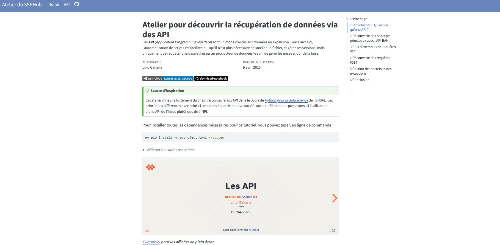

L’atelier a eu lieu le **9 avril 2025 (15h - 16h30)**, en présentiel à l’Insee et en distanciel pour les membres du réseau du SSP Hub. Environ 35 personnes ont participé de l’Insee (DG ou directions régionales), de différents services statistiques ministériels ou d’autres horizons. Merci à tous pour les échanges !

# Slides de la présentation

# Les API

**Atelier du `SSPHub` \#1**

[Lino Galiana](https://www.linogaliana.fr/)

Insee

09/04/2025

# Introduction

## Qu’est-ce qu’une API ?

  

> Une Application programming interface ou « interface de programmation d’application ») est une interface logicielle qui permet de « connecter » un logiciel ou un service à un autre logiciel ou service afin d’échanger des données et des fonctionnalités.
>
> [CNIL](https://www.cnil.fr/fr/definition/interface-de-programmation-dapplication-api)

- Définition peu informative:
  - `Python`, `scikit-learn`, `Docker`, etc. sont des APIs
  - En pratique, on signifie généralement une **API REST**

## Les APIs REST

  

- **API RESTful** : API conforme au style d’architecture [REST](https://fr.wikipedia.org/wiki/Representational_state_transfer)
  - Communication via le **protocole HTTP**

- En pratique :
  - On accède à un **endpoint** (ex : [l’API de la BAN](https://api-adresse.data.gouv.fr/search/))
  - Avec des **requêtes HTTP** (`GET`, `POST`, etc.) (ex : [rues contenant “comédie”](https://api-adresse.data.gouv.fr/search/?q=comédie&type=street))

## Analogie avec un restaurant

  

- 💬 **Vous passez commande**
  - Requête avec paramètres depuis , , votre navigateur…

- ↔︎️ **Le serveur transmet la commande en cuisine**:
  - Point d’entrée de l’API

- 🧑‍🍳 **La cuisine prépare le plat**
  - Le serveur (informatique) fait les traitements *ad hoc*

- 🍕 **Vous recevez votre plat**
  - Vous recevez une réponse au format `JSON`

## Pourquoi les API ?

- *Praticité* car permet de dissocier:
  - Le **client**: une interface web () ou un langage informatique (, , …)
  - Le **serveur**: le moteur de calcul derrière

- *Sobriété*: permet l’accès à la donnée voulue sans parcourir tout un fichier

- *Confidentialité*: on peut mettre des droits d’accès à certaines données

- *Unversalité*: pas d’*a priori* sur le mode d’accès

## Les API de données

  

## Les API de données

- Plus de fichiers enregistrés manuellement
  - **Mise à jour assurée** par le producteur
  - **Directement propagées** au consommateur de données
  - Permet l’automatisation de scripts sans stockage local

- **Contrat formel** avec un producteur de données
  - Contrairement au *webscraping*!

- Permet de récupérer des **données transformées complexes**
  - Exemple: inférences de modèles 🤖

# Concepts principaux

## Structuration d’une requête

Les requêtes prennent la forme d’**URI**:

\\ \quad \underbrace{\text{https://api-adresse.data.gouv.fr}}\_{\text{API root}}/\underbrace{\text{search}}\_{\text{API endpoint}} \\

\\ \quad /?\underbrace{\text{q=88+avenue+verdier}}\_{\text{main parameter}}\\\underbrace{\text{postcode=92120}}\_{\text{additional parameter}} \\

Auxquelles vont s’ajouter des ***headers*** (explication à venir)

> **NOTE:**

## Les requêtes HTTP

- `GET`: récupérer des données depuis un serveur web (lecture d’une base de données…)
- `POST`: envoyer des données au serveur (formulaires de mise à jour de données, etc.)
- `Python` communique avec internet via le ***package* `requests`** (`requests.get` et `requests.post`)

## Les codes HTTP

- Signification des codes HTTP
  - 1xx : Informations
  - 2xx : Succès
  - 3xx : Redirections
  - 4xx : Erreurs côté client
  - 5xx : Erreurs côté serveur

> **NOTE:**

## Les *swaggers*

- Format standardisé de documentation
  - Généralement `${URL_ROOT}/docs`
- Utilisation interactive:
  - Génère des exemples `curl` (ligne de commande)

## Comment connaître les paramètres d’une API ?

- *Swagger*

- Outils développement navigateur (CTRL+MAJ+K sur ):
  - Onglet réseau

- [`Postman`](https://www.postman.com/)

- Extension [REST Client](https://marketplace.visualstudio.com/items?itemName=humao.rest-client)

# Partie pratique

## Les requêtes `GET`

[](https://datalab.sspcloud.fr/launcher/ide/vscode-python?name=SSPHub-Atelier-API&version=2.2.7&s3=region-ec97c721&init.personalInit=«https%3A%2F%2Fraw.githubusercontent.com%2FInseeFrLab%2Fssphub-ateliers%2Frefs%2Fheads%2Fmain%2Finit%2Fapi.sh»&networking.user.enabled=true&autoLaunch=true) [](https://inseefrlab.github.io/ssphub-ateliers/sessions/api.ipynb)  

- Requête la plus commune

- Transformation en objet (`JSON` -\> `dict`) est naturelle

- Formattage dépend de chaque API (lire la doc ! 👮)

- Retravailler l’*output* peut être lourd

``` numberSource
import requests
adresse = "88 avenue verdier"
url_ban_example = (
    f"https://api-adresse.data.gouv.fr/search/"
    f"?q={adresse.replace(" ", "+")}&postcode=92120"
)
requests.get(url_ban_example).json()
```

## Les requêtes `POST`

[](https://datalab.sspcloud.fr/launcher/ide/vscode-python?name=SSPHub-Atelier-API&version=2.2.7&s3=region-ec97c721&init.personalInit=«https%3A%2F%2Fraw.githubusercontent.com%2FInseeFrLab%2Fssphub-ateliers%2Frefs%2Fheads%2Fmain%2Finit%2Fapi.sh»&networking.user.enabled=true&autoLaunch=true) [](https://inseefrlab.github.io/ssphub-ateliers/sessions/api.ipynb)  

- Envoyer des données utiles à l’API

- Plus complexe mais `Requests` est flexible

  - Transformer les objets en *input* de l’API

``` numberSource
params = {
    "columns": ["adresse", "Nom_commune"],
    "citycode": "DEPCOM",
    "result_columns": ["result_score", "latitude", "longitude"],
}

response = requests.post(
        "https://api-adresse.data.gouv.fr/search/csv/",
        data=params,
        files={"data": open(csv_file, "rb")},
    )
```

# Gestion des secrets

## Bonnes pratiques

**La doctrine générale**

*Source: [Cours de l’ENSAE de mise en production](https://ensae-reproductibilite.github.io/)*

## Bonnes pratiques pour les secrets

[](https://datalab.sspcloud.fr/launcher/ide/vscode-python?name=SSPHub-Atelier-API&version=2.2.7&s3=region-ec97c721&init.personalInit=«https%3A%2F%2Fraw.githubusercontent.com%2FInseeFrLab%2Fssphub-ateliers%2Frefs%2Fheads%2Fmain%2Finit%2Fapi.sh»&networking.user.enabled=true&autoLaunch=true) [](https://inseefrlab.github.io/ssphub-ateliers/sessions/api.ipynb)  

1.  **Boite de dialogue** via [`getpass`](https://docs.python.org/3/library/getpass.html) (application interactive uniquement)

2.  **Variables d’environnement**:
    - Dans un fichier `.env` (non committé!) lu avec [`dotenv`](https://pypi.org/project/python-dotenv/)
    - Dans les secrets de l’intégration continue (cf. [doc ](https://docs.github.com/en/actions/security-for-github-actions/security-guides/using-secrets-in-github-actions))

``` numberSource
from dotenv import load_dotenv
load_dotenv()
token = os.getenv("MON_PETIT_JETON")
```

## Conclusion

- **Pratique** pour récupérer des **données ponctuelles**:
  - Afficher un **nombre limité d’enregistrements** dans une application
  - Récupérer des données issues d’un **processus de transformation complexe**

- **Limitées** en termes de **volumétrie** ou **stabilité d’accès**

- **Code très adhérant** à une API et un langage client

## Des questions ?

**Les ateliers du `SSPHub`**

``` js
html`${slides_button}`
```

``` js
slides_button = html`<p class="text-center">
  <a class="btn btn-primary btn-lg cv-download" href="https://inseefrlab.github.io/ssphub-ateliers-slides/slides-data/api.html#/title-slide" target="_blank">
    <i class="fa-solid fa-file-arrow-down"></i>&ensp;Voir les slides
  </a>
</p>`
```

# Documentation de l’atelier & *replay*

Le matériel lié à l’atelier, y compris le replay, est disponible [ici](https://inseefrlab.github.io/ssphub-ateliers/sessions/api.html). 

# Questions / contact

Si vous avez la moindre question 🤨, n’hésitez pas à contacter 📧 *<ssphub-contact@insee.fr>*.
