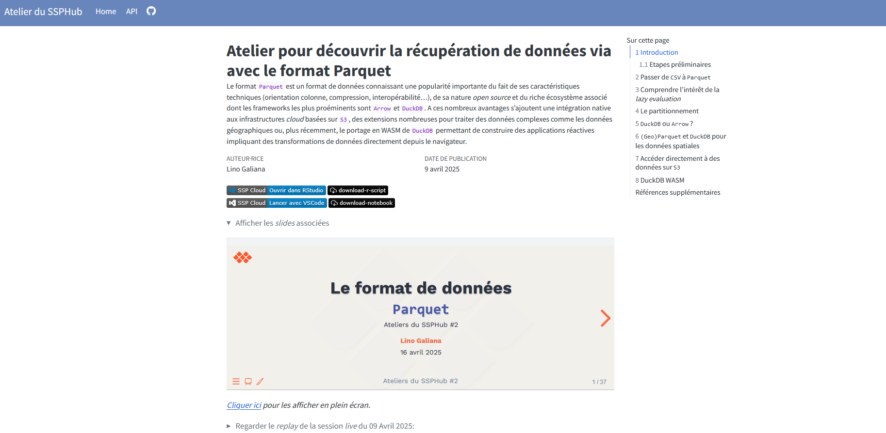

L’atelier a eu lieu le **16 avril 2025 (15h - 16h30)**, en présentiel à l’Insee et en distanciel pour les membres du réseau du SSP Hub. Environ 35 personnes ont participé de l’Insee (DG ou directions régionales), de différents services statistiques ministériels ou d’autres horizons. Merci à tous pour les échanges !

# Slides de la présentation

# Le format de données `Parquet`

Ateliers du SSPHub \#2

Lino Galiana

16 avril 2025

## “The obligatory intro slide”

Source : [motherduck.com](https://motherduck.com/blog/big-data-is-dead/)

## Enjeux

- Tendance à la **massification** des données
  - Relatif aux **capacités de stockage et de traitement**

Source : [AI with Python](https://www.packtpub.com/product/artificial-intelligence-with-python-second-edition/9781839219535)

## Pour traiter la volumétrie

- Utiliser un **format** de données adapté (`Parquet`)

- Utiliser des **outils** informatiques adaptés
  - Suffisant la plupart du temps : **calcul *larger than memory* optimisé** (`Arrow` / `DuckDB`)
  - Si volumétrie massive : **calcul distribué** (`Spark`)

- Utiliser une **infra de stockage** adaptée (`S3`)

> **NOTE:**

## “Big Data is dead” ?

- Jordan Tigani : [Big Data is dead](https://motherduck.com/blog/big-data-is-dead/)
  - *“The big data frontier keeps receding”*
  - *“Most people don’t have that much data”*
  - *“Most data is rarely queried”*

- Plaidoyer pour une **parcimonie**…
  - … qui **facilite la mise en production** !

# Pourquoi le format `Parquet` ?

## Enjeux

- Le choix d’un format de données répond à un **arbitrage** entre plusieurs critères :
  - **Public cible**
  - **Finalité** (traitement, analyse, diffusion)
  - **Volumétrie**
  - **Interopérabilité**

## Formats traditionnels

- Formats de données adhérents à un langage (**sas7bdat**, **RDS**, **fst**, etc.)
  - **Non-interopérables** -\> à éviter !

- Le format **CSV**
  - **Interopérable** et **simple** d’utilisation
  - Pas de gestion des **méta-données**
  - Peu adapté aux **données volumineuses**

## Limites du `CSV`

- Des **performances limitées**
  - **Stockage** : non-compressé -\> **espace disque élevé**
  - **Lecture** : “orienté-ligne” -\> **performances faibles**

- **Pas de typage** des données à l’écriture du fichier
  - Demande expertise et précaution à la lecture
  - Exemple: ***01*004** pour le code commune d’Ambérieu-en-Bugey

# Les avantages du format `Parquet`

## Un format léger

- **Stockage** :
  - **Compression** : entre 5 et 20 fois plus léger qu’un CSV

> **NOTE:**

## Un format efficace

- **Lecture** :
  - Jusqu’à 34x plus rapide qu’un CSV

- **“Orienté colonne”**
  - Optimisé pour les **traitements analytiques**
  - Limite la quantité de données à mettre en mémoire
  - Conçu pour être écrit une fois mais lu fréquemment

## Pour optimiser la lecture

- **Partitionner** ou **ordonner** les données

> **WARNING:**

## Un format universel et fiable

- Gestion native des **méta-données**
  - Définition automatique d’un **schéma** (noms, types)
  - Mise à disposition plus **robuste**

- **Interopérable**

- **Open-source**

- Non lisible par un humain mais de plus en plus de visualiseurs en ligne
  - Par exemple sur le [SSPCloud](https://datalab.sspcloud.fr/data-explorer)

# Du point de vue d’un producteur de données

## `Parquet`: quels avantages ?

- Format libre, *open source* et **indépendant du langage** ;
  - Les formats propriétaires imposent des outils aux consommateurs !
- **Plus de confort** pour les utilisateurs:
  - Des requêtes plus rapides et efficaces: seulement les données nécessaires sont lues
  - Des données conformes à la mise à disposition par le producteur

## `Parquet`: quels usages ?

- Format privilégié pour la mise à disposition de données internes à l’Insee:
  - Moins d’asymétries entre utilisateurs et producteurs.

> **NOTE:**

## `Parquet`: quels usages ?

*Exemples de cartes pouvant être produites simplement avec les données du recensement diffusées par l’Insee*

# Exploiter un fichier `Parquet`

## Enjeu

- `Parquet` ne résout pas tout
  - L’espace disque est optimisé
  - Les données décompressées doivent **passer en RAM**

- Le framework adapté dépend de la **volumétrie**
  - Pour la plupart des besoins : `Arrow` et `DuckDB`

## Les frameworks

- Deux *frameworks* de référence : [Arrow](https://book.utilitr.org/03_Fiches_thematiques/Fiche_arrow.html) et [DuckDB](https://book.utilitr.org/03_Fiches_thematiques/Fiche_duckdb.html)
  - Orientation **fichier** (`Arrow`) VS orientation **BDD** (`DuckDB`)

- **Traitement en-mémoire optimisé**
  - **Orientés-colonne**
  - ***Lazy evaluation*** (prochaine slide)

- Très bonne **intégration**:
  - Avec le `tidyverse` ()
  - Avec le système de stockage `S3`

## Les frameworks

## La lazy evaluation

- Les frameworks comme **Arrow** ou **DuckDB** n’exécutent pas immédiatement les opérations

- Les instructions sont **optimisées avant exécution**
  - Vous écrivez un **plan d’exécution**, réinterprété

- Avantages :
  - **Moins de données** manipulées inutilement
  - **Moins de RAM** consommée
  - **Exécution plus rapide** car optimisée

## La lazy evaluation

> **NOTE:**

## La lazy evaluation

- Voici le début du plan:

❓️ *Pourrait-il être optimisé ?*

## La lazy evaluation

- Voici le plan plus optimal:
  - **Predicate pushdown**

## `Parquet` gagne sur tous les tableaux

*Benchmarks* faits pour la formation aux bonnes pratiques de l’Insee

## Ressources complémentaires

- Les posts d’Eric Mauvière sur [icem7.fr/](https://www.icem7.fr/)

- [Webinaire du CASD](https://www.casd.eu/webinaire-casd-data-tech/) sur `Parquet` et `DuckDB`

- [La formation aux bonnes pratiques](https://inseefrlab.github.io/formation-bonnes-pratiques-git-R/) de l’Insee

- Un atelier de l’EHESS sur `Parquet` avec de nombreux exemples [ici](https://linogaliana.github.io/parquet-recensement-tutomate/)

- Le [cours de mise en production](https://ensae-reproductibilite.github.io/website/) de l’ENSAE

## Applications

## Ce n’est pas fini !

## Nouvelles opportunités avec cet écosystème

- **Intégration native avec `S3`**
  - Pour **travailler sur des serveurs à l’état de l’art**…
  - Plutôt que sur des ordinateurs aux ressources limitées

- [DuckDB WASM](https://minio.lab.sspcloud.fr/lgaliana/generative-art/ssphub/tunes_chasing.jpg) pour faire du **`DuckDB` dans le navigateur** :
  - Pour des ***dataviz* réactives**… dans des **sites statiques** !
  - Bye bye les galères de déploiement de `Shiny`, `Streamlit`…

# Fonctionnalités plus avancées

## Les extensions spatiales

- Possibilité de lire/écrire des **objets géographiques** dans `Parquet`
  - Compatible avec les standards `GeoParquet`
  - Extension `SPATIAL`

- Permet des traitements **géographiques efficaces** :
  - Jointures spatiales, calculs de distance…
  - Récupère le résultat sous `sf`

## Travailler avec `S3`

- Beaucoup plus simple qu’un *data warehouse* et des VM `postgre`

- On peut lire la donnée sur `S3` *presque comme si* elle était en local

``` numberSource
FROM 's3://bucket_name/filename.extension';
SELECT *
WHERE DEPT=='36'
```

## `DuckDB` dans le navigateur

- Grâce à `DuckDB-WASM`, on peut exécuter du SQL **dans le navigateur** 🎯
  - Embarqué par défaut sur [`Observablehq`](https://observablehq.com/) et [`Quarto`](https://quarto.org/docs/interactive/ojs/)

- Idéal pour des **applications interactives** :
  - Visualisations réactives sur des **sites statiques**
  - ⚡ **Pas besoin de serveur** ou , tout est côté client !

## Exemple

``` numberSource
html`
  <div style="display: flex; flex-direction: column; gap: 1rem;">

    <!-- Search bar at the top -->
    <div>${viewof search}</div>

    <!-- Two-column block -->
    <div style="display: grid; grid-template-columns: 1fr 1fr; gap: 1rem; backgroundColor: '#293845';">
      <div>${produce_histo(dvf)}</div>
      <div>${viewof table_dvf}</div>
    </div>


  </div>
`
```

``` numberSource
viewof search = Inputs.select(cog, {format: x => x.LIBELLE, value: cog.find(t => t.LIBELLE == "Grasse")})

cog = db.query(`SELECT * FROM read_csv_auto("https://minio.lab.sspcloud.fr/lgaliana/data/python-ENSAE/cog_2023.csv") WHERE DEP == '06'`)
dvf = db.query(query)

db = DuckDBClient.of({})

query = `
  FROM read_parquet('https://minio.lab.sspcloud.fr/projet-formation/nouvelles-sources/data/geoparquet/dvf.parquet')
  SELECT
    CAST(date_mutation AS date) AS date,
    valeur_fonciere, code_commune,
    longitude, latitude, valeur_fonciere AS valeur_fonciere_bar
  WHERE code_commune = '${search.COM}'
`
```

``` numberSource
viewof table_dvf = Inputs.table(dvf, {columns: ["date", "valeur_fonciere"], rows: 15})

produce_histo = function(dvf){
  const histo = Plot.plot({
  style: {backgroundColor: "transparent"},
  marks: [
    Plot.rectY(dvf, Plot.binX({y: "count"}, {x: "valeur_fonciere", fill: "#ff562c"})),
    Plot.ruleY([0])
  ]
})
  return histo
}
```

## Des questions ?

Ateliers du SSPHub \#2

``` js
html`${slides_button}`
```

``` js
slides_button = html`<p class="text-center">
  <a class="btn btn-primary btn-lg cv-download" href="https://inseefrlab.github.io/ssphub-ateliers-slides/slides-data/parquet#/title-slide" target="_blank">
    <i class="fa-solid fa-file-arrow-down"></i>&ensp;Voir les slides
  </a>
</p>`
```

# Documentation de l’atelier & *replay*

Le matériel lié à l’atelier, y compris le replay, est disponible [ici](https://ssphub.github.io/ssphub-ateliers-parquet/). 

# Questions / contact

Si vous avez la moindre question 🤨, n’hésitez pas à contacter 📧 *<ssphub-contact@insee.fr>*.
