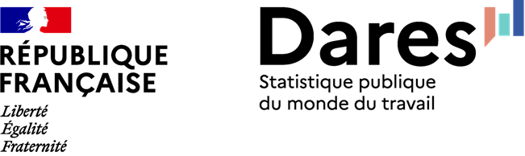
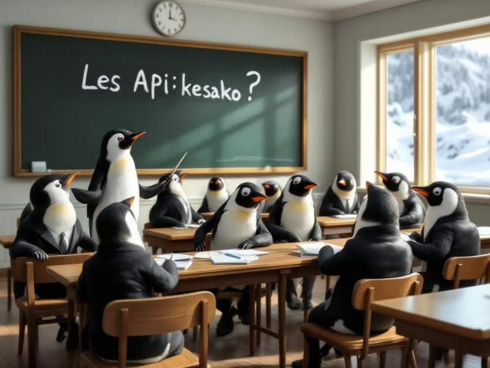
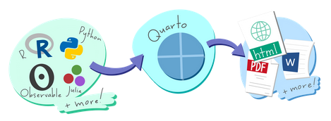
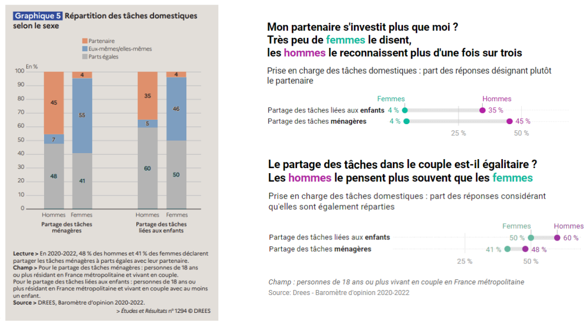
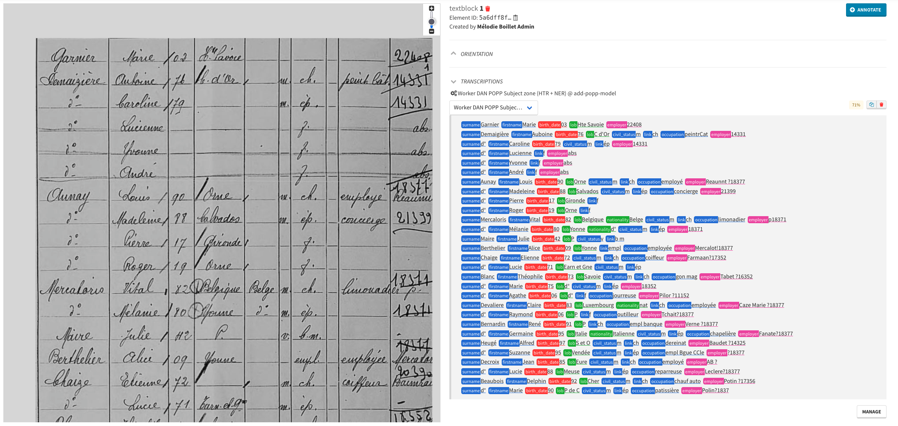
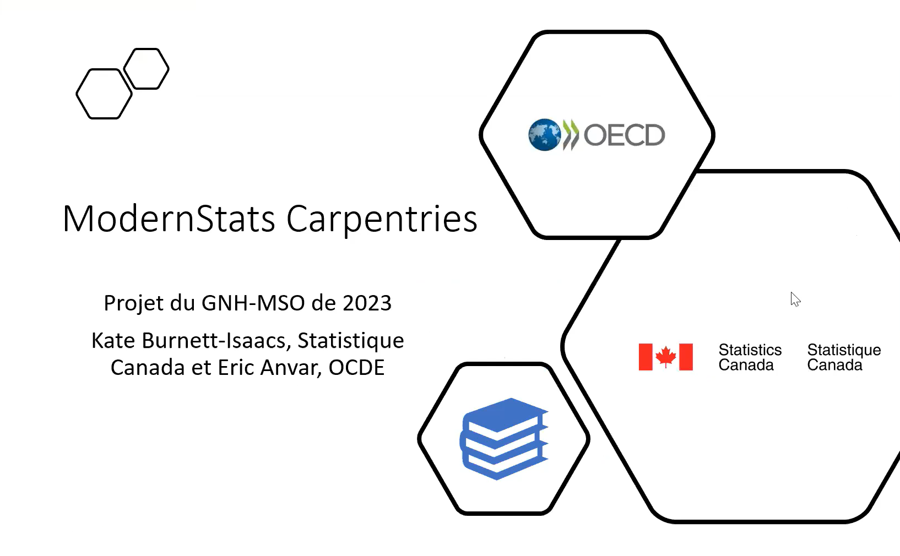
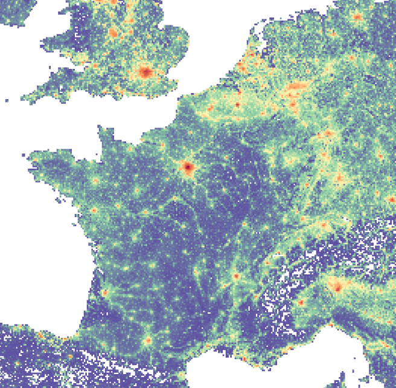

## Evénements passés

##### Journées data science & *open-source*

Programme et modalités d’inscription aux journées de contribution à l’open source en lien avec la data science

16 juin 2026

##### Génération de commentaire de graphiques : retour d’expérience sur les statistiques agricoles et pistes d’amélioration

Le **14 avril (14h00 - 14h30)**, le SSM Agriculture a présenté son travail pour générer des commentaires de graphiques automatiquement.

14 avr. 2026

##### Analyse textuelle de documents longs : cas des accords d’entreprise

Le **18 mars (14h00 - 15h30)**, la DARES a présenté leur travail sur les conventions collectives ou accords d’entreprise.

18 mars 2026

##### Françoise Bahoken et Nicolas Lambert, présentation de leur livre Cartographia

Le **13 janvier (14h30 - 15h30)**, Françoise Bahoken et Nicolas Lambert nous ont présenté leur dernier livre…

13 janv. 2026

##### Troisième journée du SSPHub

Programme et modalités d’inscription à la 3e journée du réseau

1 déc. 2025

##### Atelier - Comment récupérer des données sous format Parquet ?

Le format `Parquet` est un format de données connaissant une popularité importante du fait de ses caractéristiques techniques (orientation colonne, compression…

16 avr. 2025

##### Atelier - Comment récupérer des données par API ?

Les API **(Application Programming Interface)** sont un mode d’accès aux données en expansion. Grâce aux API, l’automatisation de scripts est facilitée puisqu’il n’est plus…

9 avr. 2025

##### Deuxième journée du SSPHub

Programme et modalités d’inscription à la 2e journée du réseau

14 oct. 2024

##### Quarto : Une évolution de R Markdown pour des travaux statistiques reproductibles

Pour fiabiliser la production de documents construits en valorisant des données (tableaux, graphiques, etc.), *RStudio* (devenu *Posit* depuis) a construit il y a quelques…

2 mai 2024

##### Eric Mauvière, “La dataviz pour donner du sens aux données et communiquer un message”

Le **29 février (15h - 16h)**, Eric Mauvière nous fera une présentation, avec de nombreux exemples issus de la statistique publique, de la manière dont une visualisation de…

29 févr. 2024

##### Première journée du SSPHub

Replay de la première journée de présentation du SSPHub

29 mars 2023

##### “OCRisation, état de l’art et projets auxquels participe Teklia” par Christopher Kermorvant

Le 29 mars de 15h à 16h nous recevons Christopher Kermorvant, chercheur spécialisé en OCRisation et fondateur de Teklia. Il nous fera un état de l’art de l’OCRisation puis…

29 mars 2023

##### Présentation du projet Meta Academy - Carpentries

Pour favoriser l’adoption des langages `R`, `Python` et `Git` dans les administrations, le programme `ModernStat` piloté par l’OCDE et Statistics Canada, a lancé un projet…

28 mars 2023

##### Présentation des packages R et Python pour accéder à l’open data de l’Insee

[L’Insee met à disposition ses données par le biais d’](talk/presentation-des-packages-r-et-python-pour-acceder-a-lopen-data-de-linsee/index.llms.md)[API](https://api.insee.fr/catalogue/) ou par son [site web](https://www.insee.fr/fr/accueil). Pour faciliter la…

13 févr. 2023

##### Présentation de gridviz par Julien Gaffuri

[Evénement de présentation de](talk/presentation-de-gridviz-par-julien-gaffuri/index.llms.md) [`gridviz`](https://eurostat.github.io/gridviz/) par [Julien Gaffuri](https://github.com/jgaffuri) (Eurostat)

20 janv. 2023

##### Présentation d’Observable par Nicolas Lambert

[observable](https://observablehq.com/) est la nouvelle plateforme de dataviz réactive. Initiée par Mike Bostock (créateur de D3.js), ce réseau social de la dataviz a pour…

16 nov. 2022
