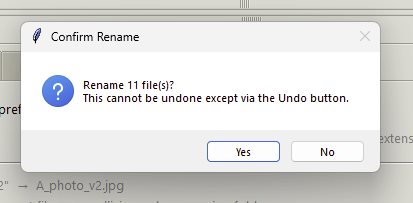
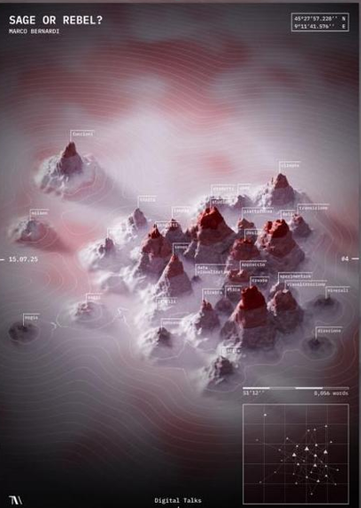

``` js
// echo: false
// output: false
inscrits = 730
```

``` js
// echo: false
badge = html`<a href="https://grist.numerique.gouv.fr/o/ssphub/forms/jSjAV3L2F8mmiRVuVEpfF7/103">
</a>
`
```

Le réseau des data scientists de la statistique publique

``` js
// echo: false
html`${badge}`
```

Le `SSPHub` centralise et vise à faire connaître le contenu créé par le réseau des *data scientists* du [Service Statistique Publique (SSP)](https://www.insee.fr/fr/information/1302192).

Une présentation du réseau est disponible sur la page [à propos](#about). Pour en savoir plus sur les objectifs du réseau, sa philosophie, et ses modes d’actions, vous pouvez découvrir le [Manifeste 📜](additional/manifeste.llms.md) écrit collectivement.

  

## Les dernières actualités du réseau


##### Journées data science & *open-source*

Programme et modalités d’inscription aux journées de contribution à l’open source en lien avec la data science

16 juin 2026



##### Des agents en folie

Infolettre du mois de **mai 2026**

15 mai 2026


##### Génération de commentaire de graphiques : retour d’expérience sur les statistiques agricoles et pistes d’amélioration

Le **14 avril (14h00 - 14h30)**, le SSM Agriculture a présenté son travail pour générer des commentaires de graphiques automatiquement.

14 avr. 2026

## Les dernières *newsletters*

Toutes les *newsletters* précédemment publiées sont disponibles sur la [page dédiée](infolettre/index.llms.md).


##### Des agents en folie

Infolettre du mois de **mai 2026**

15 mai 2026


##### LLM, fusées et lapins cartographes : bienvenue dans le tur-fu

Infolettre du mois de **mars 2026**

31 mars 2026



##### L’IA dans l’oeil du cyclone

Infolettre du mois de **février 2026**

28 févr. 2026


##### La première infographie

Infolettre du mois de **janvier 2026**

30 janv. 2026


##### Qui pour financer l’open source?

Infolettre du mois de **décembre 2025**

10 déc. 2025


##### De belles cartographies, des packages R et l’importance des données d’entraînement pour l’IA

Infolettre du mois d’**octobre 2025**

25 oct. 2025

## Les derniers billets de blog

L’ensemble des billets de blog peut être retrouvé sur la [page dédiée](blog.llms.md).


##### Guide d’utilisation des données du recensement de la population au format `Parquet`

Un post de blog pour accompagner la mise à disposition des données détaillées du recensement au format `Parquet`.

23 oct. 2023


##### Infolettre n°8

[La *data science* a beaucoup fait parler d’elle en 2022, notamment du fait des deux coups médiatiques d’](post/retrospective2022/index.llms.md)[openAI](https://openai.com/), à savoir…

31 déc. 2022


##### Infolettre n°9

Après la rétrospective de l’année 2022 de la *data science*, il est temps de se pencher sur l’année du réseau avec des visualisations interactives produites grâce à…

10 janv. 2023


##### Le plongement lexical ou comment apprendre à lire à un ordinateur

Introduction aux méthodes de traitement du langage naturel.

3 oct. 2022


##### Onyxia: l’infrastructure cloud mère des dragons

Les technologies cloud sont incontournables dans l’écosystème de la donnée. Pour ne pas se rendre dépendante de fournisseurs de services externes, l’Insee a développé un…

10 mai 2023


##### Polars, une alternative fraîche à Pandas

Polars, une alternative moderne et fluide à `Pandas`

10 févr. 2023

## Les réseaux partenaires

Quelques communautés de la data-science avec lesquels nous collaborons


##### CoP OCDE

Le groupe *Community of Practice* de l'OCDE est un réseau informel organisé autour des sujets d'innovation statistique.


##### Lab IA (Etalab)

La communauté des data scientists et acteurs de l’IA pour l’administration française


##### Onyxia

[La communauté Onyxia, à l'origine du](https://datalab.sspcloud.fr/home) [SSPCloud](https://datalab.sspcloud.fr/), a pour objectif de fournir une plateforme flexible pour expérimenter les outils modernes de la *data-science*.


##### Spyrales

Une communauté d'agents de l'Etat pour s'entraider en R et Python


##### UNECE ML Group

Le travail de recherche du Groupe ML est divisé en 5 groupes de travail visant à traiter différentes problématiques liées à l'utilisation de l'apprentissage automatique pour les statistiques officielles.


##### grrr

[`Grrr`](https://app.slack.com/client/T9ML8RLMP) (*"pour quand votre `R` fait `Grrr`"*) est un groupe [`Slack`](https://app.slack.com/client/T9ML8RLMP) (plateforme de discussion instantanée) francophone dédié aux échanges et à l’entraide autour de `R`. Il s'agit du point central de la communauté `R` francophone. Il est ouvert à tou.te.s et se veut accessible aux débutants. Vous pouvez même utiliser un pseudonyme si vous préférez.
